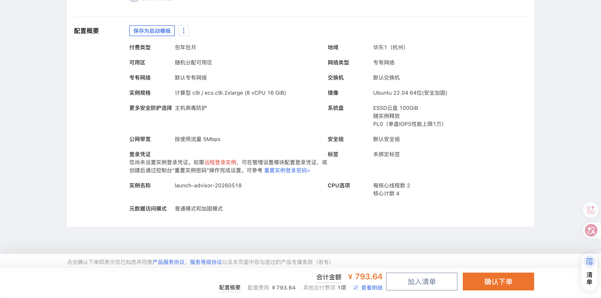
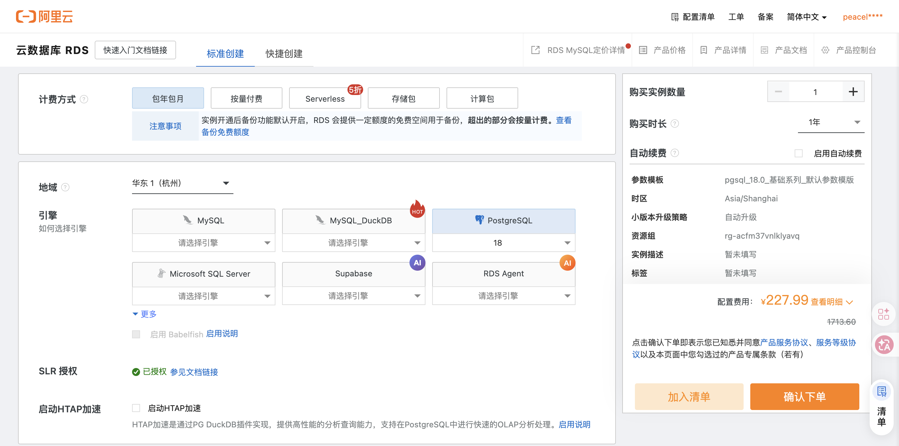
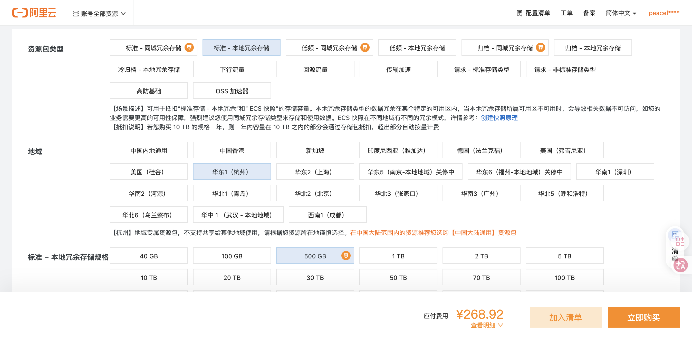

# 2026-05-18 阿里云 Phase 1 采购选型 Handoff

## 1. 目标

执行任务书：

```text
docs/handoff/2026-05-18-aliyun-phase1-procurement-selection-task.md
```

目标是把 ECS / RDS PostgreSQL / OSS 的第一阶段采购选型定清楚，供产品负责人手动下单。

本轮不下单，不付款，不提交订单，不改 DNS，不提交 ICP，不保存密钥。

## 2. 分支 / 工作区

```text
worktree: /Users/wy/Desktop/静境/静境4.0/小红书抖音矩阵获客平台
branch: main
```

注意：

```text
主仓进入本轮前已有其他未提交/未跟踪文档改动。
本轮只新增本 handoff 和对应 progress 文档。
```

## 3. 结论

推荐 Phase 1 手动下单：

| 资源 | 推荐 |
| --- | --- |
| ECS | 华东1杭州，`ecs.c9i.2xlarge`，8C16G，Ubuntu 22.04，ESSD PL0 100GiB，公网 IPv4，按流量 5Mbps，1个月 |
| RDS PostgreSQL | 华东1杭州，PostgreSQL 18.0，基础系列，`pg.n2e.2c.1m`，2C4G，100GB，高性能云盘，1个月，内网访问 |
| OSS | 华东1杭州，私有 Bucket，标准存储，本地冗余，阻止公共访问开启，先按量付费 |

价格：

```text
ECS：¥793.64 / 月 + 公网流量
RDS PostgreSQL：¥168.00 / 月
OSS：建议先按量；100GB 标准本地冗余资源包页面当前显示 ¥54.78，但提示同周期资源包限制
低阻塞固定项：约 ¥961.64 / 月 + OSS 按量 + 流量/请求
```

如果同一台 ECS 要直接用于 ICP：

```text
ECS 购买时长改为 3 个月及以上。
按当前月价估算，ECS 3个月约 ¥2380.92 + 流量。
```

## 4. 域名 / ICP 风险

账号主体：

```text
阿里云账号中心显示当前账号认证主体为星阅科技****有限公司。
```

域名：

```text
当前阿里云域名控制台未看到 ba-ba-ke.com。
RDAP 显示 ba-ba-ke.com 注册商为 Alibaba Cloud / HiChina，DNS 为 DNSPod。
公开 RDAP 的 registrant 被隐私隐藏，无法作为实名匹配证据。
```

风险判断：

```text
域名在个人账号管理不是硬阻塞。
真正阻塞项是域名实名持有者、证件类型、证件号是否与备案主体一致。
当前账号无法直接核验 ba-ba-ke.com 域名实名主体，所以 ICP 前必须让域名管理账号持有人进入域名控制台核验。
```

## 5. 手动下单前检查

产品负责人下单前确认：

```text
ECS 自动续费：不勾选
RDS 自动续费：不勾选
ECS 用于技术验证：1个月
ECS 用于 ICP：3个月及以上
RDS 不开公网
OSS Bucket 私有，阻止公共访问开启
不创建公共读 Bucket
不把 AccessKey 发到聊天或写入 Git
```

## 6. 下单后给开发的输入

下单后需要给开发/Agent 的信息：

```text
ECS 公网 IP
ECS 内网 IP
ECS 地域 / 可用区 / VPC / 交换机
RDS 内网地址、端口、数据库名、用户名
OSS bucket
OSS region = oss-cn-hangzhou
OSS endpoint = oss-cn-hangzhou.aliyuncs.com
RAM AccessKey 只放入本机/服务器 env，不发聊天
```

本地验证 env 文件：

```text
/tmp/jingjing-aliyun-oss-validation.env
```

需要包含：

```text
STORAGE_PROVIDER=aliyun_oss
ALIYUN_OSS_ACCESS_KEY_ID 由本地/服务器 env 注入，文档不记录值
ALIYUN_OSS_ACCESS_KEY_SECRET 由本地/服务器 env 注入，文档不记录值
ALIYUN_OSS_BUCKET=<bucket>
ALIYUN_OSS_REGION=oss-cn-hangzhou
ALIYUN_OSS_ENDPOINT=oss-cn-hangzhou.aliyuncs.com
ALIYUN_OSS_READ_URL_TTL_SECONDS=3600
MEDIA_UPLOAD_MAX_BYTES=1073741824
```

## 7. 是否可以开 Batch 9C

不能。

本轮只是采购选型，真实阿里云 OSS 资源尚未创建，`aliyun_oss --roundtrip` 和 signed PUT 尚未通过。

下一步：

```text
人工下单 ECS/RDS/OSS
创建 OSS Bucket + RAM 最小权限
写入本地临时 env
重跑 Batch 9B-V 真实 Aliyun OSS validation
通过后再开 Batch 9C worker storage
```

## 8. 本轮变更文件

```text
docs/progress/2026-05-18-aliyun-phase1-procurement-selection.md
docs/handoff/2026-05-18-aliyun-phase1-procurement-selection-handoff.md
```

## 9. 未做事项

```text
未下单
未支付
未加入购物车/清单作为订单
未提交 ICP
未改 DNS
未创建 RAM AccessKey
未保存密钥
未做 worker/TTS/FireRed
未 merge main
未写 completion marker
```

## 10. Chrome 购买页配置记录（2026-05-18 补充）

用户要求按 `a82428e` 的采购选型文档，在 Chrome 中把阿里云购买页配置到推荐选项，停在确认下单 / 支付前。

本轮实际执行：

```text
已打开 ECS / RDS PostgreSQL / OSS 资源包购买页
已配置到推荐规格
未点击确认下单
未点击立即购买
未点击支付
未改 DNS
未提交 ICP
未创建或展示 AccessKey
```

### 10.1 ECS 页面

截图：



页面 URL：

```text
https://ecs-buy.aliyun.com/ecs#/custom/prepay/cn-hangzhou
```

页面最终摘要：

```text
付费类型：包年包月
地域：华东1（杭州）
可用区：随机分配可用区
网络：默认专有网络 / 默认交换机
实例规格：计算型 c9i / ecs.c9i.2xlarge，8 vCPU / 16 GiB
镜像：Ubuntu 22.04 64位（安全加固）
系统盘：ESSD 云盘 100GiB，PL0，随实例释放
公网带宽：按使用流量 5Mbps
登录凭证：创建后设置
购买实例数量：1
购买时长：1 个月
配置费用：¥793.64
其他后付费项：1 项，主要是公网流量
```

人工下单前重点检查：

```text
页面摘要仍显示“更多安全防护选择 / 主机病毒防护”。
当前配置费用仍为 ¥793.64，但下单前建议人工确认是否保留该安全防护项。

安全组摘要显示“默认安全组”。
页面端口已按本轮目标调整为 SSH 22 / HTTP 80 / HTTPS 443 / ICMP，RDP 3389 已关闭；
如果必须新建安全组，请下单前再手动确认安全组页签是否为“新建安全组”。

如果这台 ECS 要直接用于 ICP，购买时长应从 1 个月改为 3 个月及以上。
```

### 10.2 RDS PostgreSQL 页面

截图：



页面 URL：

```text
https://rdsbuy.console.aliyun.com/newCreate/rds/PostgreSQL
```

页面最终摘要：

```text
计费方式：包年包月
地域：华东 1（杭州）
引擎：PostgreSQL 18.0
SLR 授权：已授权
产品系列：基础系列
存储类型：高性能云盘
网络类型：专有网络
VPC：自动创建
加入白名单：是
主可用区：杭州 可用区K
部署方案：单可用区部署
实例规格：pg.n2e.2c.1m，2核 / 4GB
存储空间：100GB
存储空间自动扩展：关闭
数据库端口：5432
参数模板：pgsql_18.0_基础系列_默认参数模版
时区：Asia/Shanghai
小版本升级策略：自动升级
购买时长：1年
配置费用：¥227.99
```

人工下单前重点检查：

```text
用户已完成 SLR 授权，页面当前显示“已授权”。

自动续费未主动勾选；下单前再确认“启用自动续费”不要勾选。
RDS 页面未打开公网访问入口，保持内网 / VPC 访问。

当前 1 年价格明显低于按月价格，若确认正式环境走阿里云杭州，可按当前 1 年配置下单。
```

### 10.3 OSS 资源包页面

截图：



页面 URL：

```text
https://common-buy.aliyun.com/?commodityCode=ossbag#/buy
```

页面最终摘要：

```text
商品类型：OSS 资源包
资源包类型：标准 - 本地冗余存储
地域：华东1（杭州）
规格：500GB
购买时长：6个月
应付费用：¥268.92
```

页面风险提示：

```text
【杭州】地域专属资源包，不支持共享给其他地域使用，请根据资源所在地谨慎选择。
```

人工下单前重点检查：

```text
本页只是 OSS 存储资源包购买页，不会创建 Bucket。
即使买资源包，仍需在 OSS 控制台创建杭州私有 Bucket。
Bucket 仍需配置：
- 私有读写
- 阻止公共访问开启
- CORS
- RAM 最小权限

如果想按低阻塞方案走，也可以不买资源包，直接创建私有 Bucket 后按量付费。
```

### 10.4 多项目共用资源判断

```text
可以在同一台 8核16G ECS 上挂多个项目，但建议只作为早期/低并发阶段方案。
方式：Nginx/Caddy 按二级域名反向代理到不同容器或进程，例如：
- aigc.ba-ba-ke.com：AIGC 平台
- api.ba-ba-ke.com：平台 API
- admin.ba-ba-ke.com：管理端
- other.ba-ba-ke.com：其他项目

PostgreSQL 可以共用同一个 RDS 实例，但必须做逻辑隔离：
- 每个项目独立 database 或 schema
- 每个项目独立数据库账号
- 最小权限授权
- 独立备份/迁移记录
- 不把无关项目的数据表混在同一个 schema

OSS 可以共用同一个阿里云账号和同一地域资源包；实际 Bucket 建议按项目隔离：
- aigc-prod-media
- aigc-prod-private
- other-prod-assets

如果为了省事共用一个 Bucket，也至少要用独立 prefix、独立 RAM policy、独立生命周期策略。
涉及用户自拍视频、声音、图片等个人信息/敏感个人信息时，不建议把多个项目素材混在同一 Bucket 根目录。

ba-ba-ke.com 可以用不同二级域名挂不同项目。
但合规上仍要按实际服务内容处理 ICP、公安备案、隐私政策、用户协议、算法备案/深度合成相关材料等事项。
主域名备案不等于所有业务天然合规，只是域名接入层面更方便。
```

## 11. 本轮新增截图文件

```text
docs/handoff/assets/2026-05-18-aliyun-phase1-ecs-final.png
docs/handoff/assets/2026-05-18-aliyun-phase1-rds-final.png
docs/handoff/assets/2026-05-18-aliyun-phase1-oss-final.png
```
