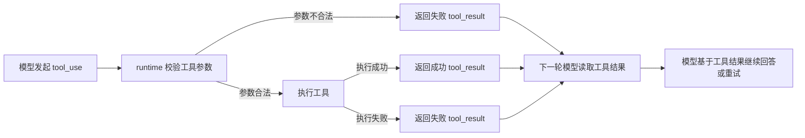

# 2026-05-26 咨询 Agent 工具结果与策略资产边界修订

> 状态：需求修订稿；`codex/consultation-claude-code-alignment` 已按本稿完成工具循环与上下文对齐实现
> 类型：产品文档 / Agent 工具协议与策略资产边界
> 来源：咨询台实测问题、Claude Code 本地 reference 对照、用户对工具协议冗余的修正
> 关联文档：
> - `docs/产品文档/V2.7-咨询Agent上下文工程瘦身PRD.md`
> - `docs/架构规范/2026-05-22-咨询Agent上下文与工具边界反思.md`
> - `references/open-source/claude-code项目/claude-code-main`

## 1. 背景

咨询台近期暴露了三类问题：

1. 删除咨询聊天记录后，历史面板反复进入重新读取状态。
2. 更新策略资产的工具调用失败，原因之一是模型把策略资产正文或语义字段误塞进工具参数。
3. AI 在回复中说“已经更新内容营销日历”，但右侧日历仍显示旧内容。

初步修复曾尝试把策略资产工具参数收敛为 `merchantId / round / stage` 三个字段，并额外拦截 AI 在自然语言里声称“已更新”的情况。该方向需要修正：这三个字段本质上都是系统上下文，不应该交给模型填写；自然语言声称是否可信，也不应该靠额外的中文文本判断器兜底。

本修订明确：工具调用是否真的成功，以工具结果为唯一事实来源；策略资产更新工具只表达“需要更新”，上下文与最新资产由系统提供。

## 2. 参考原则：Claude Code 的处理方式

Claude Code 的工具循环可以抽象为：



产品侧理解为：

1. 模型可以请求调用工具，但不拥有“宣布工具成功”的最终解释权。
2. 工具是否成功，取决于工具执行后返回的结果。
3. 失败、跳过、权限拒绝、参数错误都必须作为工具结果回到模型上下文。
4. 最终回复只能基于工具结果如实表达，不能因为模型“以为自己更新了”就告诉用户已经更新。
5. 普通工具结果不需要追加 `tools-suggestion` 这类业务外字段；权限建议、hook、调试信息应走独立侧通道，不污染业务结果。

## 3. 产品决策

### 3.1 工具结果是唯一事实来源

咨询 Agent 的写入类动作必须遵循：

- 工具结果为 `completed`，才允许对用户说“已更新”。
- 工具结果为 `failed`、`skipped` 或未返回，不能对用户说“已更新”。
- 如果工具失败，AI 应说明“这次没有更新成功”以及可理解的原因。
- UI 右侧资产、日历、任务草案必须以真实写入后的数据刷新，不能只跟随 AI 文案。

### 3.2 不用自然语言拦截器判断 AI 是否“说谎”

不新增复杂的“AI 回复文本检测器”来判断它是否声称更新成功。

正确边界是：

1. runtime 如实返回工具结果。
2. prompt 用极短规则约束：只有工具结果显示完成，才能说已更新。
3. 前端和后端状态只接受真实写入结果，不接受 AI 文案作为写入事实。

### 3.3 策略资产工具不再由模型传系统上下文

`merchantId`、`round`、`stage` 不应作为策略资产更新工具的模型入参。

原因：

- `merchantId` 是当前商家身份，系统天然知道。
- `round` 是当前咨询轮次，系统天然知道。
- `stage` 是当前咨询阶段，不是策略资产正文。
- 模型传这些字段没有业务价值，反而制造误传、漏传和校验失败。

目标形态：

```json
{}
```

也就是模型只调用“更新策略资产”这个动作。当前商家、当前轮次、当前阶段、当前最新策略资产、最近对话、已检索知识，都由系统在工具执行时注入。

### 3.4 策略资产 Editor 必须使用最新资产

策略资产 Editor 的输入来源按优先级定义：

1. 当前工具循环内的最新 `strategySnapshot`。
2. 本轮之前已成功写入的商家级策略资产。
3. 当前 session 快照。
4. 如果以上都不存在，才使用初始化默认资产。

同一轮对话中，如果第五轮刚刚成功修改策略资产，那么后续工具或回复看到的就是第五轮修改后的版本。新开第一轮对话时，也应该读取商家级最新资产，而不是退回历史旧快照。

### 3.5 工具返回内容保持干净

写入类工具结果应只表达这次动作的真实结果：

- 工具名
- 状态
- 简短摘要
- 必要的写入后资产或日历数据
- 可追踪的错误原因

不应混入：

- `tools-suggestion`
- 给模型看的下一步建议
- UI 调试说明
- prompt 修补语
- 未写入成功但希望模型照着说的内容

## 4. 策略资产结构清理方向

当前策略资产中存在“长期资产”“流程状态”“内容生产草稿”混在一起的问题。后续需要拆分。

## 4A. 咨询台上下文结构决策

本轮确认后，咨询台 Agent 的目标结构按 Claude Code 思路收敛为：

1. `system`
   - 只放 Agent 身份、工具协议和极少数硬规则。
   - 不把阶段推进、下一步追问、工具状态解释写成长期 prompt。

2. `context`
   - 只放必要事实。
   - 包括：精简后的商家资料、纯策略资产、内容日历上下文、必要的工具结果摘要。
   - RAG、知识库片段、素材 JSON 标签、对标内容等外部依据不另起一个含混的 `evidence` 概念，统一归入检索/素材上下文；有检索结果时进入上下文候选池，没有检索结果时不伪造依据。
   - 不放调试报告、流程状态、冗余上下文包说明。

3. `messages`
   - 放真实最近对话。
   - 长对话按 compact / summary 机制处理。
   - 不再额外维护一套僵硬的“咨询阶段 / 最近对话摘要 / 下一步追问”对象给模型看。

4. `tool_result`
   - 工具真实结果独立回填。
   - 写入是否成功只看工具结果，不看 AI 口头说法。

5. `user`
   - 当前用户原话作为最后一条真实用户消息。

### 4A.1 P1：商家资料上下文瘦身

当前商家资料注入项包括：商家 ID、名称、行业、服务项目、品牌摘要、区域摘要、表达风格、默认 CTA、禁用词。

该上下文已经偏冗余，列为 P1 后续修订项。

P1 修订方向：

- 不再每轮把完整商家资料整包塞给模型。
- 保留必要身份和业务事实，其他字段进入按需上下文或压缩摘要。
- 商家 ID 主要用于系统内部定位，不应作为模型理解业务的重点内容。
- 禁用词、默认 CTA、表达风格属于输出约束或风格资料，应和商家事实分层，不要混成一个大对象。

### 4A.2 conversationContext 去僵硬化

当前 runtime context 中的 `conversationContext` 包含 `round`、`stage`、`summaryText`、最近消息摘要等字段。这一层容易让模型按“流程阶段”机械回答。

修订方向：

- 移除模型可见的 `round`。
- 移除模型可见的 `stage`。
- 移除“下一步追问”类字段。
- 移除人工维护的最近对话摘要作为常规输入。
- 保留真实 message stream 作为主要对话上下文。
- 长历史通过 compact / summary 机制处理，而不是让产品定义一套固定阶段状态。

### 4A.3 内容日历作为独立上下文资产

内容日历不应继续塞在 `StrategySnapshot` 里，但它仍然是咨询台重要上下文。

修订方向：

- 内容日历作为独立 `contentCalendarContext`。
- 不写死“只有用户聊日历、选题、团队内容生成时才给模型”这种关键词判断。
- 它进入上下文候选池，由通用上下文工程、预算和压缩策略处理。
- 日历短时可以完整给；日历长时给压缩摘要和关键条目。
- 日历是否已生成团队内容、修改后是否影响下游，是内容日历自己的状态，不属于策略资产字段。

### 4.1 应保留在策略资产里的内容

策略资产应沉淀长期有效的业务判断，例如：

- 我们是谁：项目定位、能力边界、服务价值。
- 服务谁：目标客群、典型客户画像。
- 为什么选我们：核心卖点、差异化优势、证据来源。
- 适合怎么表达：核心场景、内容角度、禁忌表达、表达风格。
- 完整策略文档：可读、可沉淀、可持续补充的 Markdown 策略资产正文。

### 4.1.1 目标策略资产字段定义

目标策略资产字段先收敛为：

1. `positioning`
   - 中文含义：定位。
   - 回答“我们是谁、我们在客户心智里应该被理解成什么”。
   - 示例：不是泛泛写“房地产服务”，而是写“面向光明区高性价比商办投资者的项目营销团队”。

2. `coreSellingPoints`
   - 中文含义：核心卖点。
   - 回答“客户为什么应该选择我们、我们能提供哪些明确价值”。
   - 这里放长期可复用的选择理由，不放一次性标题、脚本句子或临时话术。

3. `targetAudiences`
   - 中文含义：目标客群。
   - 回答“优先服务谁、内容主要说给谁听”。
   - 应是清晰人群，不是泛泛的“所有客户”。

4. `keyScenes`
   - 中文含义：关键场景。
   - 回答“客户在什么场景下会需要我们、内容可以围绕哪些真实场景展开”。
   - 可以包括客户决策场景、项目展示场景、沟通转化场景、素材拍摄场景。

5. `strategyTags`
   - 中文含义：策略标签。
   - 用于给策略资产做轻量分类、检索、聚合。
   - 它不是小红书话题标签，也不是内容标题；更像内部可检索的策略索引词。

6. `strategyMarkdown`
   - 中文含义：完整策略文档。
   - 这是策略资产主文档，可以自由沉淀用户洞察、定位判断、表达方向、内容边界、待验证想法。
   - 结构化字段只做摘要和索引，不能替代完整文档。

### 4.2 不应放在策略资产里的内容

以下内容不应作为策略资产主字段：

- 当前咨询轮次。
- 当前咨询阶段。
- 本轮工具执行状态。
- 临时处理状态。
- 内容营销日历草稿。
- 内容日历生成状态。
- 图文任务草稿。
- 视频任务草稿。
- 工具执行状态。
- 只服务一次回答的临时建议。
- “下一步追问”。

这些内容应该进入各自独立对象：会话状态、内容日历、图文工作台、视频工作台、工具执行记录。

其中图文任务草稿和视频任务草稿从咨询台上下文中暂时移出。当前 `generate_article_brief` 和 `generate_video_brief` 也不应作为咨询台 Agent 可见工具使用。

### 4.3 废弃 `currentSuggestion`

`currentSuggestion` 当前含义混乱，既像长期策略建议，又像本轮聊天建议，还被部分下游生成链路当作兜底目标。

本轮产品决策：

1. 废弃 `currentSuggestion` 作为目标策略资产字段。
2. 不新增 `strategyRecommendation`。长期策略建议应写入 `strategyMarkdown`，否则会和完整策略文档重复。
3. 如果 UI 需要展示“当前策略建议”摘要，应从 `strategyMarkdown` 或结构化字段派生，而不是维护另一份长期字段。
4. 旧数据中的 `currentSuggestion` 只作为历史兼容和迁移来源，不作为新上下文设计目标。

## 5. 验收标准

### 5.1 工具协议验收

- 策略资产更新工具不要求模型传 `merchantId / round / stage`。
- 模型误传策略资产正文或额外语义字段时，不应导致系统把这些字段当作工具合同的一部分。
- 写入成功与否以工具结果为准。
- 工具失败时，最终回复不能声称右侧已更新。
- 工具结果中不新增 `tools-suggestion` 或类似业务外字段。

### 5.2 策略资产新鲜度验收

- 同一轮工具循环内，后续动作读取到的是刚刚成功写入后的策略资产。
- 跨对话时，新会话读取商家级最新策略资产。
- session 旧快照只能作为兜底，不覆盖商家级最新资产。

### 5.3 产品体验验收

- 用户看到的 AI 反馈、右侧策略资产、右侧营销日历三者状态一致。
- 如果没有真实更新，AI 必须说未完成，而不是用“我已更新”安抚用户。
- 删除咨询历史不应让历史面板反复进入完整重新加载状态。

## 6. 本分支实现记录

本分支实现范围为咨询 Agent runtime / tools / context / strategy asset editor 的协议对齐，不包含前端历史面板删除重载问题。

已落地：

1. `update_strategy_snapshot` 的模型可见参数收敛为 `{}`，并使用 `additionalProperties: false`；模型误传 `merchantId`、`round`、`stage`、策略正文或其他字段会得到失败 tool result。
2. 工具校验失败会把缺参数、多余参数、类型错误、未知工具、隐藏工具、运行时异常写入 tool result；JSON tool result 增加 `is_error`，成功判断以 `status === "completed"` 为准。
3. `update_content_calendar` 的 `calendar` 改为必填；缺失或空日历不再同步旧草稿伪装成功，而是返回失败原因。
4. 模型可见策略资产结构收敛为 `positioning`、`coreSellingPoints`、`targetAudiences`、`keyScenes`、`strategyTags`、`strategyMarkdown`；`currentSuggestion` 只保留为旧 DTO 兼容字段，不再作为策略资产 Editor、工具 schema 或 runtime context 的目标字段。
5. runtime context 移除模型可见 `round`、`stage`、`summaryText` 和人工 recent-message 摘要；真实历史继续通过 message stream 提供。
6. 内容日历从 `strategySnapshotContext` 拆到独立 `contentCalendarContext`；图文 brief、视频 brief 不进入咨询 Agent 模型可见上下文。
7. `selectedKnowledgeContext` / `evidence` 命名改为 `selectedRetrievalContext` / retrieval role，避免把 RAG、素材、对标结果混称为 evidence。
8. `generate_article_brief` 与 `generate_video_brief` 继续对咨询 Agent 隐藏。

项目特例：

- JSON tool loop 仍保留极小的 `tool_loop_state`，只包含 `availableToolNames` 和 tool result 成功判定规则，用于让 JSON loop 知道本轮还能选择哪些工具；不再暴露 `turn/maxTurns/completed/failed/skipped/writeToolsAlreadyUsed`，也不包含业务 `round/stage/下一步追问`。
- `currentSuggestion` 暂未从 `StrategySnapshotDto`、旧会话数据、数据库 JSON 兼容读取中移除；这属于后续迁移，不在本轮做 DB migration。

## 7. 非目标

本修订不处理：

- 更换模型供应商。
- 重写所有咨询 Agent prompt。
- 重做图文、视频工作台。
- 改变内容日历到生成任务的下游合同。
- 引入新的调试字段、工具建议字段或额外中间协议。
- 删除咨询历史后历史面板反复重新加载的问题。

## 8. 后续讨论入口

下一步重点讨论：策略资产结构拆分。

建议讨论顺序：

1. 策略资产到底只保留哪些长期字段。
2. 内容日历、图文草稿、视频草稿分别归属哪里。
3. 旧 `currentSuggestion` 数据如何迁移或删除。
4. 右侧策略资产 UI 是展示结构化字段，还是以完整策略文档为主、结构化字段为摘要。
5. 历史 session 如何迁移到新的商家级资产结构。
