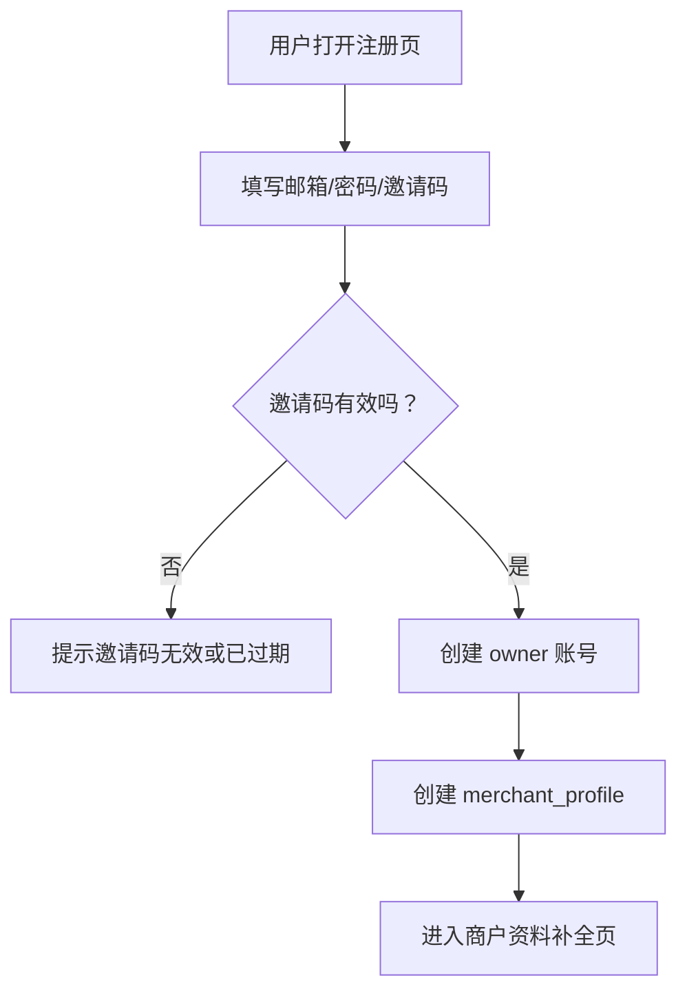

# V0.1-A 导入到改写页面流程草案

## 1. 当前版本边界

`V0.1-A` 先不追求完整发布闭环。

当前主链路是：

```text
邀请码注册
-> 创建商户资料
-> 导入对标内容
-> 查看内容与评论
-> 结合商户资料改写
-> 保存草稿
```

发布功能保留在后续阶段。

---

## 2. 页面入口建议

`V0.1-A` 可以先收成 4 个一级入口：

1. `导入`
2. `内容中心`
3. `改写工作台`
4. `商户资料`

暂时不作为一级入口：

- `账号管理`
- `发布任务`

原因：

- 发布后置
- 第一阶段重点是抓内容和写内容
- 页面越少，越容易把主链路打磨清楚

---

## 3. 注册与商户资料流程

### 3.1 注册流程



### 3.2 商户资料字段

当前只保留 5 个核心字段：

- 商户名称
- 地址
- 联系人
- 联系电话
- 服务项目

这些字段直接服务于 AI 改写。

---

## 4. 导入页

### 4.1 页面目标

让用户用最短路径把小红书 / 抖音内容导入系统。

第一版不要让用户理解 `actor`、`dataset`、`runId` 这些技术概念。

### 4.2 页面结构

```text
+------------------------------------------------------------------+
| 导入内容                                                         |
+------------------------------------------------------------------+
| [链接导入]                                                       |
| 平台：小红书 / 抖音                                              |
| 链接：[粘贴帖子链接或主页链接]                                    |
| 类型：[单条帖子] [博主主页]                                       |
| 选项：[x] 同时抓评论   评论数量：[30]                             |
|                                                                  |
|                         [开始导入]                               |
+------------------------------------------------------------------+
| 最近导入任务                                                     |
| 状态 | 平台 | 类型 | 输入 | 结果 | 创建时间 | 操作               |
+------------------------------------------------------------------+
```

### 4.3 默认值

| 项 | 默认值 |
|---|---|
| 评论数量 | `30` |
| 博主主页导入数量 | `20` |
| 同时抓评论 | 单条帖子默认开，主页导入默认关 |
| 并发 | 同一商户同一时间 1 个任务 |

---

## 5. 导入任务状态提示

### 5.1 状态文案

| 系统状态 | 用户看到 |
|---|---|
| `pending` | 等待导入 |
| `running` | 正在导入 |
| `succeeded` | 导入成功 |
| `partial` | 部分成功 |
| `failed` | 导入失败 |

### 5.2 `partial` 的使用场景

`partial` 非常重要。

例如：

- 正文抓到了，评论没抓到
- 博主帖子列表抓到了，其中部分帖子失败
- 评论抓到了，但子评论不完整

用户提示建议：

```text
内容已导入，部分评论未能抓取。你可以先进入改写，或稍后重试评论。
```

---

## 6. 内容中心

### 6.1 页面目标

把所有导入内容和草稿统一管理。

### 6.2 推荐标签

1. `导入内容`
2. `改写草稿`

### 6.3 导入内容列表字段

| 字段 | 说明 |
|---|---|
| 平台 | 小红书 / 抖音 |
| 类型 | 单条帖子 / 博主主页导入 |
| 标题 | 来源标题 |
| 作者 | 来源作者 |
| 评论数 | 已导入评论数量 |
| 导入状态 | 成功 / 部分成功 / 失败 |
| 是否已改写 | 是 / 否 |
| 操作 | 查看 / 改写 / 重试评论 |

### 6.4 内容详情抽屉

```text
+------------------------------------------------------------------+
| 内容详情                                                         |
+------------------------------------------------------------------+
| 标题                                                             |
| 作者 / 平台 / 原链接                                             |
| 正文                                                             |
| 标签 / 图片 / 视频摘要                                           |
+------------------------------------------------------------------+
| 评论洞察                                                         |
| 评论列表                                                         |
+------------------------------------------------------------------+
| [进入改写] [重试评论] [打开原链接]                                |
+------------------------------------------------------------------+
```

### 6.5 低质量导入提示

如果 `source_items` 只有 `id / url`，缺标题或正文，则提示：

```text
这条内容导入不完整。建议重新复制平台页面里的完整链接后再试。
```

小红书尤其需要这个提示。

---

## 7. 改写工作台

### 7.1 页面目标

把来源内容变成适合当前商户发布的草稿。

### 7.2 页面结构

```text
+--------------------------------------+--------------------------------------+
| 来源内容                              | 改写设置                              |
| 标题                                  | 商户资料摘要                          |
| 正文                                  | 服务项目                              |
| 评论                                  | 目标平台：小红书 / 抖音                |
|                                      | 改写方向：种草 / 活动 / 口播 / 本地化 |
+--------------------------------------+--------------------------------------+
| 生成结果                                                                     |
| 版本 A                                                                       |
| 版本 B                                                                       |
| 版本 C                                                                       |
| [保存为草稿]                                                                 |
+------------------------------------------------------------------------------+
```

### 7.3 当前先不做

- 多人审核
- 复杂审批流
- 发布排期
- 自动发布

---

## 8. API 路由草案

### 8.1 导入相关

```text
POST /api/import-jobs
GET  /api/import-jobs
GET  /api/import-jobs/:id
POST /api/import-jobs/:id/run
POST /api/import-jobs/:id/retry-comments
```

### 8.2 内容相关

```text
GET  /api/source-items
GET  /api/source-items/:id
GET  /api/source-items/:id/comments
POST /api/source-items/:id/rewrite
```

### 8.3 草稿相关

```text
GET   /api/content-drafts
GET   /api/content-drafts/:id
PATCH /api/content-drafts/:id
POST  /api/content-drafts/:id/variants
```

---

## 9. 前端路由草案

```text
/register
/merchant/onboarding
/dashboard/import
/dashboard/content
/dashboard/content/:sourceItemId
/dashboard/rewrite/:sourceItemId
/dashboard/drafts/:draftId
/dashboard/merchant-profile
```

---

## 10. 当前默认实现顺序

1. 邀请码注册 + 商户资料
2. 导入页 + ImportJob
3. ApifyProviderAdapter
4. 内容中心 + 内容详情
5. 评论列表
6. 改写工作台
7. 草稿保存

---

## 11. 仍需后续拍板的点

当前不阻塞继续推进，但后面要定：

1. 小红书评论默认抓 `30` 条是否够
2. 小红书低质量结果是否允许进入改写
3. 抖音 `creator` 是否进入 `V0.1-A`
4. 是否要在 `V0.1-A` 中展示 Apify 成本

当前建议默认：

- 评论默认 `30` 条
- 低质量结果不建议直接改写
- 抖音 `creator` 后置
- 成本只在内部日志里展示，不给商户看
