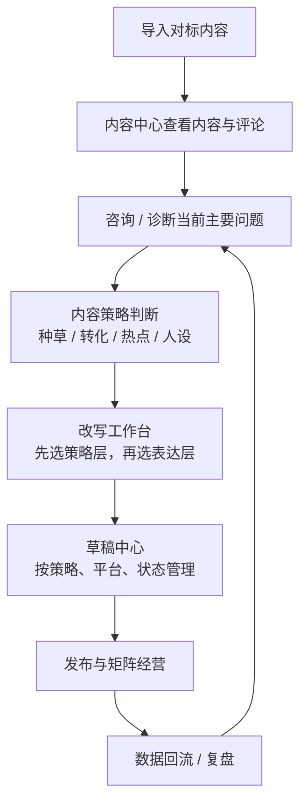

# 小红书抖音矩阵获客平台 V0.1-B 四大内容策略 PRD

## 1. 文档定位

这是一份可以单独成立的 PRD，用于定义平台中的 `四大内容策略`：

- `种草`
- `转化`
- `热点`
- `人设`

这份 PRD 不是脱离现有文档另起炉灶，而是建立在现有 `V0.1` 体系之上，对原有页面、字段、流程做一层更高的策略设计。

本稿默认继承以下文档中的既有约束：

- `V0.1-功能清单-初稿.md`
- `V0.1-页面信息架构-初稿.md`
- `V0.1-数据表草案-初稿.md`
- `V0.1-A-导入到改写页面流程草案.md`

一句话说：

`这份 PRD 不是重写 V0.1，而是给 V0.1 增加一层统一的内容策略语言。`

---

## 2. 背景与问题

当前 PRD 已经能支撑一条基础闭环：

```text
导入对标内容
-> 查看内容与评论
-> 结合商家画像改写
-> 保存草稿
-> 逐步走向发布
```

但在“内容到底为什么而写”这件事上，现有文档还缺一层统一抽象。

当前问题主要有四个：

1. `种草` 已经出现在改写方向里，但还没有被正式定义。
2. `热点` 还停留在“可选增强”，没有进入主链路。
3. `人设` 还主要被吸收在画像、风格、语气中，没有作为内容功能被定义。
4. `活动 / 口播 / 本地化` 这类表达方式，与 `种草` 这类策略目标被放在同一层，导致“为什么写”和“怎么写”混在一起。

这会带来直接问题：

- 改写工作台只能指导“写法”，不能指导“目标”
- 草稿中心只能按平台和状态管理，不能按经营作用管理
- 后续做内容日历和矩阵经营时，没有统一的策略语言

因此，需要一份单独 PRD，把四类内容正式上升为平台中的一级策略对象。

---

## 3. 产品目标

### 3.1 核心目标

为平台建立一层 `内容策略层`，贯穿以下链路：

```text
咨询诊断
-> 内容排布
-> 改写调度
-> 草稿管理
-> 矩阵经营
-> 数据回流与复盘
```

### 3.2 这份 PRD 要解决的具体问题

1. 让系统能回答“这条内容是为了解决什么问题而写”。
2. 让同一商家的内容不再都是同一种稿件，而是有经营分工。
3. 让 `改写工作台` 从“改写器”升级为“有经营意图的内容工作台”。
4. 为后续 `内容日历` 和 `矩阵经营` 提供统一基础。

### 3.3 非目标

本稿不直接覆盖这些内容：

- 不直接设计复杂 BI 看板
- 不直接实现全自动矩阵调度
- 不直接改变现有导入能力边界
- 不直接上线新的大权限体系
- 不直接扩展到更多平台渠道

---

## 4. 设计原则

### 4.1 策略先于表达

系统先判断“内容在解决什么问题”，再决定“内容如何表达”。

### 4.2 继承现有 PRD，不推翻现有结构

本稿不否定现有：

- 导入页
- 内容中心
- 商家画像
- 改写工作台
- 账号管理
- 发布任务

而是在这些模块上补一层策略设计。

### 4.3 人设是内容功能，不只是画像字段

`人设` 不等于“语气风格”，也不等于“虚拟角色设定”，而是可信表达能力。

### 4.4 热点是借势能力，不是硬蹭能力

`热点` 必须与行业、商家、场景有真实关联，否则只会制造空流量。

### 4.5 矩阵经营不是多号复制，而是角色分工

不同账号可以承担不同内容职责，不要求所有账号都混发四类内容。

---

## 5. 核心概念设计

## 5.1 两层模型

### 第一层：内容策略层

这是内容要解决的经营问题。

- `种草`
- `转化`
- `热点`
- `人设`

### 第二层：内容表达层

这是内容采用的呈现方式。

- `活动`
- `本地化`
- `口播`
- `图文`
- `短视频`
- `语气风格`
- `CTA 轻重`
- `平台版本`

### 关系说明

同一条内容策略，可以对应多种表达方式。

示例：

- `种草 + 本地化 + 图文`
- `种草 + 口播 + 短视频`
- `转化 + 活动 + 图文`
- `人设 + 主理人口播 + 短视频`
- `热点 + 同城切角 + 轻 CTA`

结论：

`种草 / 转化 / 热点 / 人设` 不能继续与 `活动 / 口播 / 本地化` 同层并列。

---

## 6. 四大内容策略定义

## 6.1 `种草`

### 定义

`种草` 是解决“先被看见、先产生兴趣”的内容。

### 目标

- 获取新增曝光
- 让用户产生“这和我有关”的感受
- 引导用户收藏、点进主页、继续了解

### 典型内容特征

- 场景切入
- 兴趣点切入
- 痛点引发
- 轻 CTA
- 对用户来说“值得继续看”

### 不应做成

- 上来就卖
- 纯广告口径
- 只有热闹没有商家关联

## 6.2 `转化`

### 定义

`转化` 是解决“缩短决策、推动咨询 / 到店 / 下单”的内容。

### 目标

- 回答顾虑
- 建立行动理由
- 推动明确下一步动作

### 典型内容特征

- 项目介绍
- 价格机制或活动机制
- 用户疑问解答
- 案例证明
- 明确 CTA

### 不应做成

- 硬广喊卖
- 只讲优惠不讲信任
- 在用户还没建立信任时直接强推

## 6.3 `热点`

### 定义

`热点` 是解决“借势获取新增曝光与话题入口”的内容。

### 目标

- 获取短期新增流量
- 参与平台热点分发窗口
- 为账号或矩阵创造新入口

### 典型内容特征

- 时效性强
- 钩子明显
- 与行业或商家场景相关
- 适合切角快、出稿快

### 核心规则

- 不硬蹭
- 不脱离行业
- 不脱离商家身份
- 不为了热点牺牲可信度

## 6.4 `人设`

### 定义

`人设` 是解决“建立可信度、让用户愿意持续看并相信你”的内容。

### 目标

- 建立信任
- 让用户记住“你是谁”
- 为后续转化内容托底

### 人设的真实构成

在本产品里，`人设` 由以下要素组成：

- 真实身份
- 可讲经历
- 稳定观点
- 专业判断
- 可验证案例
- 持续表达

### 不应做成

- 假角色包装
- 单纯语气变化
- 只有抒情没有可信素材

---

## 7. 用户角色与典型场景

## 7.1 目标用户

当前主要面向：

- 商家 owner
- 内容运营
- 代运营/顾问型操盘手

## 7.2 典型场景

### 场景 A：内容发了，但没人看

系统应判断：更缺 `种草`，必要时补 `热点`。

### 场景 B：有人看、有人收藏，但用户不相信

系统应判断：更缺 `人设`。

### 场景 C：用户有意向，但咨询后迟迟不下单

系统应判断：更缺 `转化`。

### 场景 D：平台当前有明显话题窗口

系统应判断：可以补 `热点`，但必须做相关性约束。

---

## 8. 与现有 PRD 的整合设计

## 8.1 整体链路



## 8.2 导入页

### 继承现有设计

保留现有：

- `detail 导入`
- `creator 导入`
- `search 导入`
- 导入任务状态

### 新增设计要求

导入页本身不新增复杂操作，但导入结果要支持后续进入策略判断。

导入完成后，系统应能把以下信息带入后续环节：

- 来源平台
- 作者
- 标题/正文/口播
- 评论区线索
- 是否适合进入四类策略中的某一类

结论：

`导入页` 不承担策略选择，但必须给策略判断提供输入。

## 8.3 内容中心

### 继承现有设计

保留现有双标签结构：

- `导入内容`
- `草稿中心`

### 新增设计要求

#### 导入内容标签

增加可见信息：

- 推荐策略类型
- 是否已进入某类策略改写

#### 草稿中心标签

新增筛选维度：

- `内容策略类型`
- `表达方式`
- `平台`
- `商家`
- `草稿状态`

系统要能回答：

- 最近转化稿够不够
- 某商家是否长期缺人设稿
- 哪些热点稿已经过期

## 8.4 商家画像页

### 继承现有设计

保留当前：

- 商户信息
- 服务项目
- 客群画像
- 语气风格
- CTA
- 禁用词

### 新增设计要求

要增加一组 `人设可信素材`，至少包括：

- 主理人/核心角色身份
- 可讲经历
- 核心观点
- 常见判断
- 可用案例
- 用户见证
- 不可碰话题

这部分不是可有可无，因为 `人设` 内容如果没有可信素材支撑，系统就只能做假表达。

## 8.5 改写工作台

### 继承现有设计

仍采用“来源内容 + 中间控制 + 生成结果”的核心工作台思路。

### 新设计要求

改写工作台的中间控制区要从单层改写方向，升级为双层结构：

```text
第一层：内容策略层
种草 / 转化 / 热点 / 人设

第二层：内容表达层
活动 / 本地化 / 口播 / 图文 / 短视频 / 语气风格 / CTA
```

### 页面建议结构

```text
+--------------------------------------------------------------------------------------------------+
| 改写工作台                                                                                        |
+---------------------------+----------------------------+-------------------------------------------+
| 左栏：来源内容             | 中栏：策略与表达控制        | 右栏：生成结果                             |
| 标题                       | 商家 / 客群选择             | 平台版本 V1                                |
| 正文 / 口播                | 内容策略层选择             | 平台版本 V2                                |
| 评论摘录                   | 表达层选择                 | 平台版本 V3                                |
|                           | CTA / 风格 / 补充要求       | [保存草稿] [进入发布准备]                  |
+--------------------------------------------------------------------------------------------------+
```

### 生成规则

#### 当用户选择 `种草`

系统优先：

- 强化钩子
- 强化场景
- 强化兴趣点
- 降低硬 CTA

#### 当用户选择 `转化`

系统优先：

- 回答顾虑
- 解释方案
- 给出行动路径
- 强化明确 CTA

#### 当用户选择 `热点`

系统优先：

- 检查与行业/商家是否相关
- 提供切角
- 强化时效钩子
- 避免硬套热点词

#### 当用户选择 `人设`

系统优先：

- 调用身份与经历素材
- 调用观点与案例
- 强化可信表达
- 避免只改口吻

## 8.6 账号管理

### 继承现有设计

保留当前：

- 小红书账号
- 抖音账号
- 登录状态
- 风险状态

### 新增设计要求

在后续矩阵阶段，账号应支持配置 `默认策略角色`。

示例：

- `growth`：偏种草
- `trust`：偏人设
- `conversion`：偏转化
- `trend`：偏热点

当前版本不强制上线该功能，但 PRD 需预留。

## 8.7 发布任务

### 继承现有设计

保留当前发布任务的：

- 状态
- 失败原因
- 日志
- 结果记录

### 新增设计要求

发布任务记录中，后续应能看到该内容属于哪一类策略，以便从“只看发布成功率”升级到“看经营结构是否合理”。

---

## 9. 内容排布与矩阵经营设计

## 9.1 内容日历的基本要求

虽然现有 PRD 还没有正式拆出 `内容日历` 页面，但四大内容策略一旦成立，产品就必须能表达“内容排布”。

至少要支持：

- 按周给出四类内容的建议比例
- 按阶段调整重心
- 按账号类型给默认组合

### 示例

| 经营阶段 | 推荐重心 |
|---|---|
| 冷启动期 | `种草 + 人设` |
| 稳定增长期 | `种草 + 人设 + 转化` |
| 活动冲刺期 | `转化 + 热点` |
| 主理人建设期 | `人设` 为主，`种草` 为辅 |

## 9.2 矩阵经营的角色设计

矩阵不是“多个账号重复发”，而是不同账号承担不同任务。

一个矩阵至少要回答四个问题：

1. 谁负责拿新增
2. 谁负责人设
3. 谁负责促转化
4. 谁负责吃热点

### 推荐角色模型

| 账号类型 | 默认策略组合 |
|---|---|
| 门店主号 | `人设 + 转化` |
| 主理人号 | `人设 + 种草` |
| 同城流量号 | `种草 + 热点` |
| 活动承接号 | `转化` |

这不是要求所有商家都必须这样建号，而是要求产品承认：

- 不同账号职责可以不同
- 不需要所有账号都混发四类内容
- 后续要能按角色配置默认策略

---

## 10. 数据模型与接口设计

## 10.1 `rewrite_goal`

当前 `rewrite_goal` 是自由文本，不足以承接四类策略。

建议升级为结构化字段，至少支持：

- `primary_strategy_type`
- `secondary_strategy_type`
- `expression_modes`

如果短期仍保留文本，也应约束可选枚举：

- `种草`
- `转化`
- `热点`
- `人设`

## 10.2 `ContentDraft`

建议新增：

| 字段 | 说明 |
|---|---|
| `strategy_type` | 主策略类型 |
| `strategy_reason` | 为什么选这个策略 |
| `strategy_snapshot` | 诊断结论快照 |

这让草稿不只是“被改写过”，而是“为什么这样改写”可追溯。

## 10.3 `ContentVariant`

`ContentVariant` 继续承接：

- 平台
- 输出类型
- 标题
- 正文
- 口播
- CTA
- 标签

不建议把四类策略直接下沉到 `ContentVariant` 作为主归属，因为策略首先属于一次改写任务，而不是某个平台版本本身。

## 10.4 `MerchantProfile`

在现有商家画像基础上，补充 `人设可信素材`：

- 身份
- 经历
- 观点
- 案例
- 用户见证
- 风险边界

## 10.5 `AudienceProfile`

保留现有客群画像，但应强化与四类策略的关联，例如：

- 该客群更容易被什么内容种草
- 该客群常见顾虑是什么
- 该客群更依赖什么类型的人设信任

## 10.6 `PublishingAccount`

后续矩阵阶段建议补：

- `matrix_role`
- `default_strategy_mix`

---

## 11. 业务规则

## 11.1 策略判断规则

系统至少应支持以下基本判断逻辑：

| 现象 | 推荐优先策略 |
|---|---|
| 内容发了但没人看 | `种草` / `热点` |
| 有流量但没人信 | `人设` |
| 有咨询但不成交 | `转化` |
| 平台有窗口机会 | `热点` |

## 11.2 热点使用规则

当选择 `热点` 时，系统至少要检查：

1. 是否与商家行业相关
2. 是否与商家身份相关
3. 是否能自然转进业务场景
4. 是否存在明显硬蹭风险

## 11.3 人设生成规则

当选择 `人设` 时，系统必须优先使用商家已提供的可信素材。

如果缺少素材，应提示：

```text
当前人设素材不足，建议先补充主理人身份、经历、观点或案例，否则生成结果容易只有风格变化，没有真实信任感。
```

---

## 12. 验收标准

这份 PRD 回填到主系统后，至少要满足以下验收标准：

1. 同一个商家，系统能区分“更缺种草”还是“更缺转化”。
2. 改写工作台里，四大内容策略是一级选择项，不再与 `活动 / 口播 / 本地化` 同层混排。
3. 选择 `人设` 时，生成逻辑体现“建立信任”，而不是只改语气。
4. 选择 `热点` 时，系统体现“借势”而不是“硬蹭”。
5. 草稿中心能按四类内容策略筛选草稿。
6. 商家画像里能维护支撑人设生成的可信素材。
7. 后续矩阵页或账号配置，能够承接默认策略角色。

---

## 13. 回填范围

这份单独 PRD 确认后，建议回填到以下文档：

### 回填 `V0.1-功能清单-初稿.md`

- 增加四大内容策略能力
- 增加内容排布/矩阵角色的能力定义
- 把 `热点` 从纯“可选增强”提升为正式策略对象

### 回填 `V0.1-页面信息架构-初稿.md`

- 改写工作台增加策略层与表达层
- 内容中心增加策略筛选
- 商家画像增加人设素材模块
- 后续日历/矩阵入口补位

### 回填 `V0.1-数据表草案-初稿.md`

- `rewrite_goal` 结构化
- `ContentDraft.strategy_type`
- `MerchantProfile` 人设素材
- `PublishingAccount.matrix_role`

### 回填 `V0.1-A-导入到改写页面流程草案.md`

把现有：

```text
种草 / 活动 / 口播 / 本地化
```

升级为：

```text
内容策略层：种草 / 转化 / 热点 / 人设
内容表达层：活动 / 本地化 / 口播 / 图文 / 短视频 / 风格 / CTA
```

---

## 14. 结论

从这份 PRD 开始，平台内关于内容的统一问法应变成：

```text
先问：这条内容在解决什么问题？
-> 种草 / 转化 / 热点 / 人设

再问：这条内容怎么表达？
-> 活动 / 本地化 / 口播 / 图文 / 视频 / 风格 / CTA
```

只有把这两层拆开，后续的：

- 诊断
- 改写
- 草稿中心
- 内容排布
- 矩阵经营
- 数据复盘

才能真正共用一套产品语言，而不是每个页面都在用不同口径描述同一件事。
