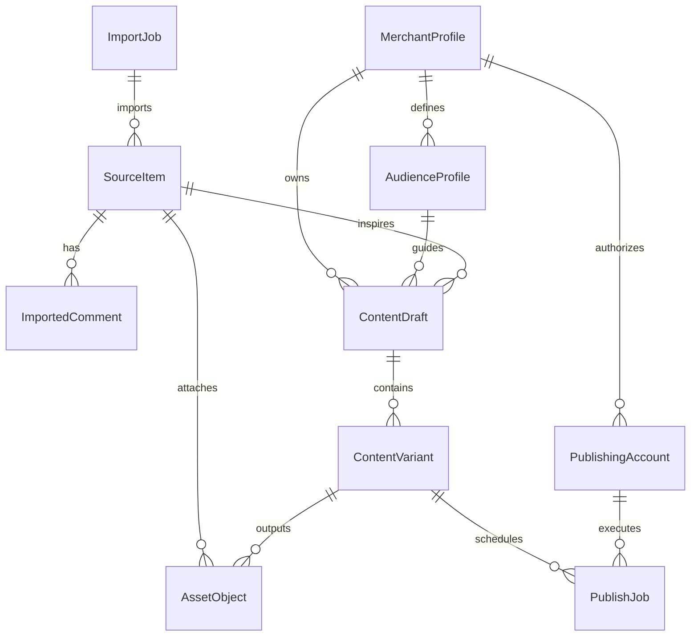

# 小红书抖音矩阵获客平台 V0.1 数据表草案

## 1. 文档目的

这份文档用于基于 `V0.1` 页面信息架构，先定出一版“够用的最小数据模型”。

当前目标不是设计一套完美的长期 SaaS 数据层，而是先支撑下面这条闭环：

```text
导入来源内容
-> 查看评论
-> 选择商家画像
-> 生成多个平台草稿
-> 选账号发布
-> 记录任务与结果
```

---

## 2. 建模原则

### 2.1 先建闭环，不先建平台帝国

`V0.1` 不提前建设以下重模型：

- 正式多租户组织体系
- 团队角色权限体系
- 套餐与计费
- 复杂经营分析
- 全平台内容分发抽象

### 2.2 核心链路必须能串起来

最重要的关系不是“字段有多全”，而是下面这条链路是否顺：

`SourceItem -> ContentDraft -> ContentVariant -> PublishJob`

### 2.3 不稳定字段允许先放 `jsonb`

第一版很多字段还没稳定，例如：

- 内容结构拆解结果
- 评论总结结果
- 平台特有发布参数
- 任务原始日志

这些不适合一开始就拆到过细，可以先放 `jsonb`。

### 2.4 账号凭据单独隔离

即使是内部版，也不建议把 cookie / session 原文直接混放在普通业务表里。

`V0.1` 至少要做到：

- 业务表只保留 `credential_ref`
- 实际敏感凭据由独立存储层或受限表托管

---

## 3. 核心实体关系



---

## 4. 核心业务表

### 4.1 `MerchantProfile`

用途：

- 承接“商户画像”的顶层主体
- 作为客群、账号、草稿的归属根节点
- 在 `V0.1-A` 中默认与一个商户工作区近似 1:1

建议字段：

| 字段 | 类型建议 | 必填 | 说明 |
|---|---|---|---|
| `id` | `uuid` | 是 | 主键 |
| `owner_user_id` | `uuid` | 否 | 当前商户 owner，对应 Supabase `auth.users` |
| `name` | `text` | 是 | 商家名称 |
| `industry` | `text` | 否 | 例如健身、瑜伽、美业，当前不作为 5 个必填资料之一 |
| `contact_name` | `text` | 否 | 联系人 |
| `contact_phone` | `text` | 否 | 联系电话 |
| `address` | `text` | 否 | 商户地址 |
| `service_items` | `jsonb` | 否 | 服务项目列表 |
| `brand_summary` | `text` | 否 | 商家简介 |
| `region_summary` | `text` | 否 | 服务区域 / 城市概述 |
| `tone_style` | `text` | 否 | 默认语气风格 |
| `default_cta` | `jsonb` | 否 | 常用 CTA 列表 |
| `forbidden_words` | `jsonb` | 否 | 禁用词列表 |
| `status` | `text` | 是 | `active` / `archived` |
| `created_at` | `timestamptz` | 是 | 创建时间 |
| `updated_at` | `timestamptz` | 是 | 更新时间 |

---

### 4.2 `InvitationCode`

用途：

- 控制注册入口
- 商户 owner 必须持邀请码才能创建商户
- 当前默认一个邀请码最多创建一个商户

建议字段：

| 字段 | 类型建议 | 必填 | 说明 |
|---|---|---|---|
| `id` | `uuid` | 是 | 主键 |
| `code` | `text` | 是 | 邀请码，唯一 |
| `purpose` | `text` | 是 | 当前仅 `merchant_signup` |
| `status` | `text` | 是 | `active` / `redeemed` / `expired` / `disabled` |
| `max_redemptions` | `int` | 是 | 当前默认 `1`，保留未来扩展 |
| `redemption_count` | `int` | 是 | 已使用次数 |
| `expires_at` | `timestamptz` | 否 | 过期时间 |
| `created_by_user_id` | `uuid` | 否 | 创建人 |
| `redeemed_by_user_id` | `uuid` | 否 | 使用人 |
| `redeemed_merchant_id` | `uuid` | 否 | 使用后创建的商户 |
| `created_at` | `timestamptz` | 是 | 创建时间 |
| `updated_at` | `timestamptz` | 是 | 更新时间 |

---

### 4.3 `AudienceProfile`

用途：

- 存储客群画像，给改写工作台直接调用
- 当前先按“商户级画像”建模

建议字段：

| 字段 | 类型建议 | 必填 | 说明 |
|---|---|---|---|
| `id` | `uuid` | 是 | 主键 |
| `merchant_id` | `uuid` | 是 | 归属商家 |
| `name` | `text` | 是 | 画像名称 |
| `persona_summary` | `text` | 是 | 人群概述 |
| `pain_points` | `jsonb` | 否 | 常见痛点 |
| `motivations` | `jsonb` | 否 | 触发动机 |
| `taboos` | `jsonb` | 否 | 反感点 / 雷区 |
| `preferred_tone` | `text` | 否 | 期望风格 |
| `created_at` | `timestamptz` | 是 | 创建时间 |
| `updated_at` | `timestamptz` | 是 | 更新时间 |

---

### 4.4 `ImportJob`

用途：

- 对应 `导入页` 的一次导入动作
- 让 detail / creator / comments / search 都能统一追踪任务状态

建议字段：

| 字段 | 类型建议 | 必填 | 说明 |
|---|---|---|---|
| `id` | `uuid` | 是 | 主键 |
| `merchant_id` | `uuid` | 否 | 归属商户，便于后续多租户隔离 |
| `platform` | `text` | 是 | `xiaohongshu` / `douyin` |
| `import_type` | `text` | 是 | `detail` / `creator` / `comments` / `search` |
| `input_payload` | `jsonb` | 是 | 原始输入，如 URL、creator ID、关键词 |
| `status` | `text` | 是 | `pending` / `running` / `succeeded` / `partial` / `failed` |
| `total_items` | `int` | 否 | 预估或已导入数量 |
| `success_items` | `int` | 否 | 成功导入数量 |
| `error_summary` | `text` | 否 | 错误摘要 |
| `log_payload` | `jsonb` | 否 | 原始日志摘要 |
| `created_at` | `timestamptz` | 是 | 创建时间 |
| `finished_at` | `timestamptz` | 否 | 完成时间 |

---

### 4.5 `SourceItem`

用途：

- 承接导入进来的单条来源内容
- 成为后续改写的输入根对象

建议字段：

| 字段 | 类型建议 | 必填 | 说明 |
|---|---|---|---|
| `id` | `uuid` | 是 | 主键 |
| `merchant_id` | `uuid` | 否 | 归属商户，便于内容池隔离 |
| `import_job_id` | `uuid` | 否 | 来源导入任务 |
| `platform` | `text` | 是 | 来源平台 |
| `source_type` | `text` | 是 | `detail` / `creator` / `search` / `manual_text` |
| `external_item_id` | `text` | 否 | 平台内容 ID |
| `source_url` | `text` | 否 | 原始链接 |
| `creator_id` | `text` | 否 | 作者 ID |
| `creator_name` | `text` | 否 | 作者名 |
| `title` | `text` | 否 | 原标题 |
| `body_text` | `text` | 否 | 原正文 / 提取文字 |
| `script_text` | `text` | 否 | 视频口播提取 |
| `structure_summary` | `jsonb` | 否 | 标题结构、段落结构、钩子点 |
| `engagement_snapshot` | `jsonb` | 否 | 点赞、收藏、评论数等 |
| `trace_payload` | `jsonb` | 否 | 来源留痕 |
| `is_selected_for_rewrite` | `boolean` | 是 | 是否已进入改写链路 |
| `created_at` | `timestamptz` | 是 | 入库时间 |

关键约束建议：

- `platform + external_item_id` 尽量唯一
- 若 `external_item_id` 为空，则以 `source_url` 做去重兜底

---

### 4.6 `ImportedComment`

用途：

- 存储来源内容评论
- 供评论查看、痛点提取、改写参考使用

建议字段：

| 字段 | 类型建议 | 必填 | 说明 |
|---|---|---|---|
| `id` | `uuid` | 是 | 主键 |
| `source_item_id` | `uuid` | 是 | 关联 `SourceItem` |
| `external_comment_id` | `text` | 否 | 平台评论 ID |
| `parent_external_comment_id` | `text` | 否 | 二级评论父 ID |
| `author_name` | `text` | 否 | 评论者 |
| `content` | `text` | 是 | 评论内容 |
| `like_count` | `int` | 否 | 点赞数 |
| `reply_count` | `int` | 否 | 回复数 |
| `published_at` | `timestamptz` | 否 | 评论时间 |
| `sort_score` | `numeric` | 否 | 排序值，可综合热度与时间 |
| `trace_payload` | `jsonb` | 否 | 评论原始包，便于后续字段补充 |
| `created_at` | `timestamptz` | 是 | 入库时间 |

---

### 4.7 `ContentDraft`

用途：

- 承接一次“基于某条来源内容，为某个商户进行改写”的工作对象
- 对应 `内容中心 / 草稿中心` 的一条主记录

建议字段：

| 字段 | 类型建议 | 必填 | 说明 |
|---|---|---|---|
| `id` | `uuid` | 是 | 主键 |
| `source_item_id` | `uuid` | 是 | 来源内容 |
| `merchant_id` | `uuid` | 是 | 目标商家 |
| `audience_profile_id` | `uuid` | 否 | 目标客群画像 |
| `working_title` | `text` | 否 | 草稿工作标题 |
| `rewrite_goal` | `text` | 否 | 改写目标，如引流、活动预热 |
| `input_snapshot` | `jsonb` | 否 | 生成时使用的画像快照 |
| `comment_insights` | `jsonb` | 否 | 评论提炼结果 |
| `status` | `text` | 是 | `drafting` / `review_pending` / `ready_to_publish` / `publishing` / `published` / `archived` |
| `selected_variant_id` | `uuid` | 否 | 当前主选版本 |
| `created_at` | `timestamptz` | 是 | 创建时间 |
| `updated_at` | `timestamptz` | 是 | 更新时间 |

---

### 4.8 `ContentVariant`

用途：

- 承接一个草稿下的具体内容版本
- 支持“小红书版”和“抖音脚本版”并存，也支持多次生成

建议字段：

| 字段 | 类型建议 | 必填 | 说明 |
|---|---|---|---|
| `id` | `uuid` | 是 | 主键 |
| `draft_id` | `uuid` | 是 | 关联 `ContentDraft` |
| `platform` | `text` | 是 | `xiaohongshu` / `douyin` |
| `variant_type` | `text` | 是 | `note` / `video_script` |
| `version_no` | `int` | 是 | 版本号 |
| `title` | `text` | 否 | 标题 |
| `body_text` | `text` | 否 | 正文 |
| `script_text` | `text` | 否 | 口播 / 字幕稿 |
| `hashtags` | `jsonb` | 否 | 标签 / 话题 |
| `cta_text` | `text` | 否 | CTA |
| `generation_mode` | `text` | 是 | `ai_generated` / `manual_edit` / `imported` |
| `review_status` | `text` | 是 | `editing` / `review_pending` / `approved` / `rejected` |
| `created_at` | `timestamptz` | 是 | 创建时间 |
| `updated_at` | `timestamptz` | 是 | 更新时间 |

关键约束建议：

- `draft_id + platform + version_no` 唯一

---

### 4.9 `PublishingAccount`

用途：

- 表示一个可用于发布的外部平台账号
- 作为发布任务执行的账号来源

建议字段：

| 字段 | 类型建议 | 必填 | 说明 |
|---|---|---|---|
| `id` | `uuid` | 是 | 主键 |
| `merchant_id` | `uuid` | 是 | 归属商家 |
| `platform` | `text` | 是 | `xiaohongshu` / `douyin` |
| `account_name` | `text` | 是 | 内部识别名称 |
| `display_name` | `text` | 否 | 平台展示名 |
| `credential_ref` | `text` | 是 | 凭据引用，不存明文 |
| `login_status` | `text` | 是 | `active` / `waiting_login` / `invalid_cookie` / `risk_warning` / `disabled` |
| `last_checked_at` | `timestamptz` | 否 | 最近检查时间 |
| `last_error` | `text` | 否 | 最近一次异常摘要 |
| `extra_config` | `jsonb` | 否 | 平台特有参数 |
| `created_at` | `timestamptz` | 是 | 创建时间 |
| `updated_at` | `timestamptz` | 是 | 更新时间 |

关键约束建议：

- `merchant_id + platform + account_name` 唯一

---

### 4.10 `PublishJob`

用途：

- 承接一次真实发布任务
- 对应 `发布任务页` 的主记录

建议字段：

| 字段 | 类型建议 | 必填 | 说明 |
|---|---|---|---|
| `id` | `uuid` | 是 | 主键 |
| `draft_id` | `uuid` | 是 | 来源草稿 |
| `content_variant_id` | `uuid` | 是 | 选定版本 |
| `publishing_account_id` | `uuid` | 是 | 发布账号 |
| `platform` | `text` | 是 | 发布平台 |
| `schedule_at` | `timestamptz` | 否 | 定时发布时间 |
| `status` | `text` | 是 | `pending` / `running` / `waiting_login` / `failed_retryable` / `failed_manual` / `published` / `cancelled` |
| `retry_count` | `int` | 是 | 重试次数 |
| `failure_reason` | `text` | 否 | 失败摘要 |
| `result_payload` | `jsonb` | 否 | 平台返回结果 |
| `log_payload` | `jsonb` | 否 | 执行日志摘要 |
| `published_post_url` | `text` | 否 | 发布成功后的帖子链接 |
| `created_at` | `timestamptz` | 是 | 创建时间 |
| `started_at` | `timestamptz` | 否 | 执行开始时间 |
| `finished_at` | `timestamptz` | 否 | 执行完成时间 |

---

## 5. 配套系统表

### 5.1 `AssetObject`

建议增加一张轻量资源表，用于统一管理：

- 导入内容带回的图片 / 视频引用
- 草稿生成后的封面或附件
- 发布时实际使用的资源

建议字段：

| 字段 | 类型建议 | 必填 | 说明 |
|---|---|---|---|
| `id` | `uuid` | 是 | 主键 |
| `owner_type` | `text` | 是 | `source_item` / `content_variant` |
| `owner_id` | `uuid` | 是 | 归属对象 ID |
| `asset_type` | `text` | 是 | `image` / `video` / `cover` |
| `storage_key` | `text` | 是 | 对象存储路径 |
| `origin_url` | `text` | 否 | 原始来源地址 |
| `mime_type` | `text` | 否 | 文件类型 |
| `sort_order` | `int` | 否 | 排序 |
| `created_at` | `timestamptz` | 是 | 创建时间 |

### 为什么建议现在就建

- 因为 `Supabase Storage` 是否适合，取决于我们是否把媒体资源单独建模
- 如果一直把图片 / 视频混在 `jsonb` 里，后面发布层会变乱

---

## 6. 推荐索引与唯一约束

`V0.1` 至少建议补下面这些约束：

| 表 | 约束 / 索引建议 |
|---|---|
| `SourceItem` | `(platform, external_item_id)` 唯一；`source_url` 普通索引 |
| `ImportedComment` | `source_item_id` 索引 |
| `ContentDraft` | `merchant_id`、`status` 组合索引 |
| `ContentVariant` | `(draft_id, platform, version_no)` 唯一 |
| `PublishingAccount` | `(merchant_id, platform, account_name)` 唯一 |
| `PublishJob` | `status`、`schedule_at`、`publishing_account_id` 索引 |
| `ImportJob` | `status`、`created_at` 索引 |

---

## 7. 当前不建议提前拆的表

为了避免 `V0.1` 过早复杂化，下面这些先不拆：

- 团队成员与角色表
- 审批流记录表
- 内容日历表
- 营销活动表
- 复杂分析指标表
- 评论标签与情绪分析表
- AI Prompt 模板中心全量模型

如果后面真的需要，再从以下方向追加：

- `ReviewTask`
- `ApprovalRecord`
- `PromptTemplate`
- `PostMetric`

---

## 8. 最小闭环是怎么落到数据层的

这版数据模型的核心，不是字段丰富，而是能稳定表达下面这个关系：

1. 一次 `ImportJob` 导入多条 `SourceItem`
2. 一条 `SourceItem` 可带多条 `ImportedComment`
3. 一条 `SourceItem` 可衍生多个 `ContentDraft`
4. 一个 `ContentDraft` 可包含多个 `ContentVariant`
5. 一个 `ContentVariant` 可被不同 `PublishingAccount` 用于不同 `PublishJob`

这就够支撑：

- 导入页
- 内容中心
- 改写工作台
- 账号管理页
- 发布任务页

同时也给后面的增强留了空间。

---

## 9. 本稿的关键收敛结论

这版数据表草案最关键的 4 个结论是：

1. `SourceItem -> ContentDraft -> ContentVariant -> PublishJob` 是主链路
2. `MerchantProfile / AudienceProfile` 组成当前版本的“商户画像”输入层
3. `ImportJob` 和 `AssetObject` 虽然不在最初的对象清单里，但第一版就值得加上
4. `V0.1-A` 先不引入 `StoreProfile`，后续出现门店级差异化运营再补
5. `PublishingAccount` 只存引用，不直接存账号敏感凭据明文

如果后续要继续推进实现，下一步最适合做的是：

- 把这份草案翻成真正的 SQL schema 草稿
- 再结合技术方案确定哪些字段放 `Supabase`，哪些交给 Worker 管理
