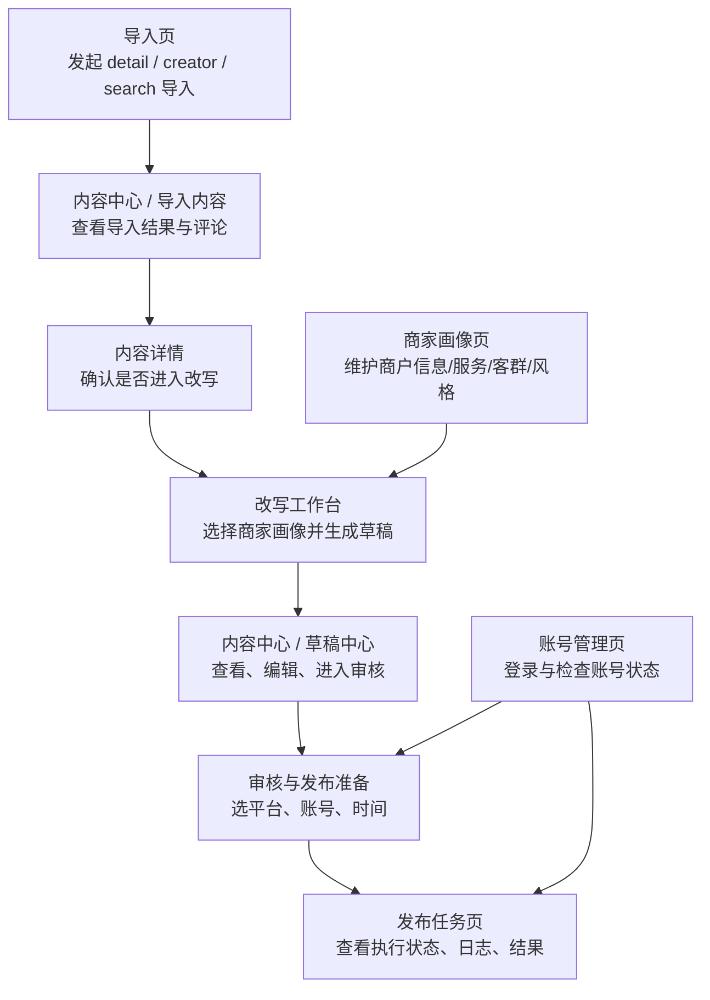

# 小红书抖音矩阵获客平台 V0.1 页面信息架构

## 1. 文档目的

这份文档用于把当前已经确定的 `V0.1` 功能清单，收敛成一版可以指导后续实现的页面结构。

本稿默认前提：

- 当前 `V0.1-A` 先按**邀请码注册 + 单商户 owner 账号**推进
- 目标先跑通“导入 -> 改写 -> 保存草稿”的闭环
- 发布、账号管理、发布任务可后置到 `V0.1-B`
- 长期方向仍是多租户 SaaS，但当前页面不预留过重协作体系
- 先不引入复杂团队权限、审批流、BI 看板

补充：

- `V0.1-A` 更细的页面流程已单独收敛到：
  - [V0.1-A-导入到改写页面流程草案.md](/Users/wy/Desktop/静境/静境4.0/小红书抖音矩阵获客平台/docs/产品文档/V0.1-A-导入到改写页面流程草案.md)

---

## 2. 信息架构原则

### 2.1 只围绕一条主路径组织页面

`V0.1` 最重要的不是“功能多”，而是让运营人员能稳定走完下面这条路径：

```text
导入对标内容
-> 查看内容与评论
-> 选择商家画像
-> 生成并编辑草稿
-> 选择账号与时间
-> 发出去
-> 查看结果
```

### 2.2 顶层导航尽量少

当前阶段不适合一上来把后台拆成十几个一级菜单。

因此本稿采用：

- 顶层只保留最关键的 6 个页面入口
- `内容详情`、`审核发布准备`、`任务日志` 采用详情页或抽屉承载

### 2.3 `草稿中心` 先并入 `内容中心`

虽然功能上必须有“内容草稿中心”，但从页面结构上，`V0.1` 更适合将其先并入 `内容中心` 的一个标签页。

这样做的原因：

- 导入结果和改写草稿天然强关联
- 运营人员会频繁在“来源内容”和“草稿内容”之间切换
- 可以减少一个顶层页面，避免后台过散

如果后续草稿量变大，再把 `草稿中心` 单独拆成一级菜单也不晚。

---

## 3. 顶层结构

### 3.1 顶层页面

`V0.1` 建议采用下面这 6 个一级页面：

1. `导入页`
2. `内容中心`
3. `商家画像`
4. `改写工作台`
5. `账号管理`
6. `发布任务`

### 3.2 全局壳结构

建议后台整体使用一个统一壳结构：

```text
+----------------------------------------------------------------------------------+
| Logo | 导入 | 内容中心 | 商家画像 | 改写工作台 | 账号管理 | 发布任务 | 商家切换 |
+----------------------------------------------------------------------------------+
| 面包屑 / 当前页面说明 / 关键操作                                                   |
+----------------------------------------------------------------------------------+
| 页面主体                                                                          |
|                                                                                  |
|                                                                                  |
+----------------------------------------------------------------------------------+
```

全局共用元素建议从第一版就保留：

- 顶部商家切换器
- 最近任务快捷入口
- 全局错误提示与成功提示
- 抽屉式详情面板

---

## 4. 核心页面流



---

## 5. 页面定义

### 5.1 导入页

### 页面目标

让用户用最短路径把“可参考内容”导入系统。

### 关键模块

- `detail 导入卡片`
- `creator 导入卡片`
- `search 导入卡片`
- 最近导入任务列表
- 最近失败任务提醒

### 主要操作

- 贴一条小红书 / 抖音链接导入
- 输入 creator 主页链接或 ID 导入一批内容
- 通过关键词发起搜索导入
- 查看导入任务状态

### V0.1 推荐布局

```text
+----------------------------------------------------------------------------------+
| 导入页                                                                           |
+----------------------------------------------------------------------------------+
| [贴链接导入]        | [Creator 导入]       | [关键词搜索导入(可选)]                |
| URL / 平台 / 导入   | 主页链接 / 数量 / 导入 | 关键词 / 平台 / 导入                 |
+----------------------------------------------------------------------------------+
| 最近导入任务                                                                     |
| 任务类型 | 平台 | 输入内容 | 状态 | 导入条数 | 创建时间 | 进入内容中心             |
+----------------------------------------------------------------------------------+
```

### 页面出口

- 导入成功后进入 `内容中心 / 导入内容`
- 导入失败时跳转任务日志抽屉

---

### 5.2 内容中心

### 页面目标

把“导入结果”和“草稿结果”统一放进一个运营中心。

### 页面结构

建议使用双标签结构：

1. `导入内容`
2. `草稿中心`

### 5.2.1 导入内容标签

#### 关键模块

- 平台筛选
- 导入来源筛选
- creator 筛选
- 评论数量 / 时间排序
- 内容列表
- 内容详情抽屉

#### 单条内容至少展示

- 平台
- 标题
- creator 名称
- 发布时间
- 评论数
- 导入来源
- 是否已进入改写

#### 关键操作

- 查看详情
- 查看评论
- 标记“进入改写”
- 直接进入改写工作台

### 5.2.2 草稿中心标签

#### 关键模块

- 草稿状态筛选
- 商户筛选
- 平台版本筛选
- 草稿列表
- 草稿详情抽屉

#### 草稿状态建议

- `drafting`
- `review_pending`
- `ready_to_publish`
- `publishing`
- `published`
- `archived`

#### 关键操作

- 打开草稿详情
- 继续编辑
- 进入审核与发布准备
- 查看已发布结果

### 内容中心推荐布局

```text
+----------------------------------------------------------------------------------+
| 内容中心   [导入内容] [草稿中心]                                                 |
+----------------------+-----------------------------------------------------------+
| 筛选区               | 列表区                                                    |
| 平台                 | 标题 | 来源/商家 | 状态 | 评论数 | 更新时间 | 操作        |
| 来源类型             |                                                           |
| 商户                 |                                                           |
| 状态                 |                                                           |
| 时间范围             |                                                           |
+----------------------+-----------------------------------------------------------+
| 右侧详情抽屉：内容详情 / 草稿详情 / 评论 / 任务摘要                               |
+----------------------------------------------------------------------------------+
```

---

### 5.3 商家画像页

### 页面目标

维护改写所需的“商户画像”底座，而不是泛泛的品牌资料页。

### 页面结构

`V0.1-A` 建议直接采用“单商户资料页 + 客群配置”的结构，不先拆门店层。

### 核心区域

- 商户名称
- 地址
- 联系人
- 联系电话
- 服务项目
- 客群画像
- 卖点
- 地域信息
- 语气风格
- 禁用词
- 常用 CTA

### 推荐标签

1. `商户信息`
2. `服务与客群`
3. `风格与规则`

### 关键操作

- 创建商户资料
- 维护服务项目
- 新建客群画像
- 维护默认改写规则
- 维护商户级卖点和禁用词

### 为什么当前先不做门店层

如果当前系统不承担：

- 多门店经营管理
- 门店级独立账号发布
- 门店级独立内容策略
- 门店级独立地址与联系人切换

那 `V0.1-A` 先不引入 `门店` 这一层会更干净。

也就是说，像“动动瑜伽”这样的对象，在当前阶段就直接作为一个商户主体来建模即可。

---

### 5.4 改写工作台

### 页面目标

把“来源内容 + 商家画像 + 平台目标”拼在一个页面里，直接产出草稿。

### 页面原则

- 这个页面应是整个产品的核心工作台
- 要让运营人员同时看到来源、评论、画像和生成结果
- 不要让用户在多个页面来回跳

### 三栏式布局建议

```text
+--------------------------------------------------------------------------------------------------+
| 改写工作台                                                                                        |
+---------------------------+----------------------------+-------------------------------------------+
| 左栏：来源内容             | 中栏：改写控制             | 右栏：生成结果                             |
| 标题                       | 商户 / 客群选择             | 小红书版 V1                                |
| 正文 / 口播                | 平台目标选择               | 抖音脚本版 V1                              |
| 评论摘录                   | 改写目标 / 风格            | 小红书版 V2                                |
| creator 信息               | CTA / 禁用词               | 人工编辑区                                 |
| 结构拆解结果               | 生成按钮 / 保存按钮         | 保存草稿 / 提交审核                         |
+---------------------------+----------------------------+-------------------------------------------+
```

### 关键模块

- 来源内容区
- 评论参考区
- 结构拆解结果区
- 商户 / 客群选择器
- 风格与 CTA 规则区
- 平台目标选择器
- 多版本生成结果区
- 人工编辑区

### 页面入口

- 从 `内容中心 / 导入内容` 进入
- 从 `内容中心 / 草稿中心` 继续编辑进入

### 页面出口

- 保存为草稿
- 提交到待审核
- 直接进入审核与发布准备

---

### 5.5 账号管理页

### 页面目标

管理可用于发布的小红书 / 抖音账号，并把“可发 / 不可发”的状态显式展示出来。

### 核心模块

- 平台切换
- 账号列表
- 新账号登录
- 账号状态检查
- 账号绑定商户

### 单账号卡片建议展示

- 平台
- 账号名称
- 绑定商户
- 当前状态
- 最近检查时间
- 最近一次异常原因

### 状态建议

- `active`
- `waiting_login`
- `invalid_cookie`
- `risk_warning`
- `disabled`

---

### 5.6 发布任务页

### 页面目标

承接所有发布结果、失败原因和重试操作，让发布链路可回看、可排障。

### 核心模块

- 任务状态筛选
- 平台筛选
- 账号筛选
- 任务表格
- 日志抽屉
- 重试入口

### 关键字段

- 任务 ID
- 内容标题
- 平台
- 账号
- 调度时间
- 当前状态
- 失败原因
- 发布时间 / 完成时间

### 状态建议

- `pending`
- `running`
- `waiting_login`
- `failed_retryable`
- `failed_manual`
- `published`
- `cancelled`

---

## 6. 关键详情页与抽屉

虽然顶层页面只有 6 个，但 `V0.1` 从第一版就建议补齐以下详情视图：

### 6.1 内容详情抽屉

用于展示：

- 原标题
- 原正文 / 口播
- creator 信息
- 评论列表
- 来源留痕

### 6.2 草稿详情抽屉

用于展示：

- 来源内容关联
- 当前版本列表
- 最近一次修改
- 审核状态
- 最近一次发布结果

### 6.3 审核与发布准备面板

建议先用抽屉或独立弹层承载，而不是新开一级页面。

包含内容：

- 选择发布平台
- 选择发布账号
- 设定立即发布 / 定时发布
- 调整标题、正文、标签、话题
- 上传或确认素材

### 6.4 任务日志抽屉

用于展示：

- 任务执行时间线
- 每次状态变更
- 平台返回的错误摘要
- 重试入口

---

## 7. 页面与功能映射

| 功能 | 落在哪个页面 |
|---|---|
| 对标内容导入 | `导入页` |
| 评论抓取与查看 | `内容中心 / 内容详情抽屉` |
| 商家画像知识库 | `商家画像页` |
| 内容拆解与改写 | `改写工作台` |
| 内容草稿中心 | `内容中心 / 草稿中心` |
| 审核与发布准备 | `草稿详情抽屉` 或 `审核发布面板` |
| 小红书 / 抖音多账号发布 | `账号管理页` + `审核发布面板` |
| 发布任务记录 | `发布任务页` |

---

## 8. 推荐实现顺序

不要按页面视觉顺序做，而是按闭环优先级做：

1. `导入页`
2. `内容中心`
3. `商家画像页`
4. `改写工作台`
5. `账号管理页`
6. `发布任务页`

这样排的原因：

- 当前第一优先级已经调整为“抓内容 -> 写内容”
- 所以 `导入页 + 内容中心 + 商家画像页 + 改写工作台` 应先打通
- `账号管理页` 和 `发布任务页` 先保留页面定义，但可以后置到第二阶段接入

---

## 9. 本稿的关键收敛结论

这版信息架构最重要的 3 个结论是：

1. `V0.1` 顶层导航先控制在 6 个页面内，不再发散
2. `草稿中心` 先并入 `内容中心`，避免信息流割裂
3. `审核与发布准备` 先做成详情面板，不单独做一级页面

如果后续草稿量、协作人数、审核复杂度明显上升，再把：

- `草稿中心`
- `审核台`
- `内容日历`

从当前结构中单独拆出来。
