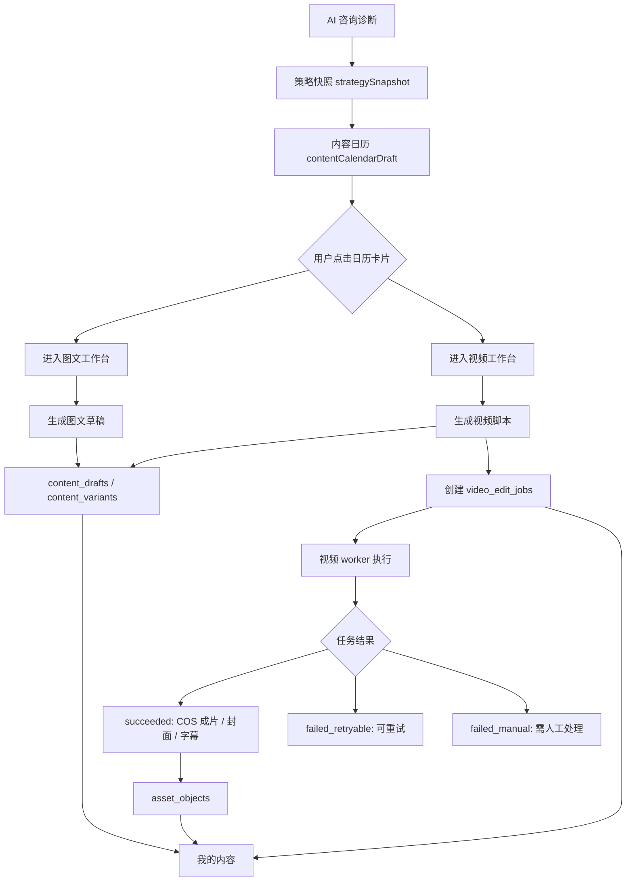

# V2.1 内容日历到图文/视频工作台协作 PRD

## 1. 文档定位

这份文档给负责视频 / worker / 工作台联调的开发同学使用，目的是把产品侧已经确认的主链路、上下文传递、保存位置、失败处理和协作边界钉住。

只把代码同步到 Gitee，开发同学可以看出现有实现，但不一定能判断哪些细节是产品已经决定、哪些只是当前临时实现。因此本文件作为协作真相源：

- 产品主线：咨询诊断生成策略和内容日历，图文 / 视频工作台承接执行。
- 数据落点：草稿、版本、视频任务、素材、成片必须能回到「我的内容」或「素材中心」对应位置。
- 失败策略：视频生成失败不能丢脚本、不能丢素材、不能让用户不知道下一步。
- 协作边界：主应用负责上下文、API、页面状态；视频 worker 负责执行任务、写回状态、上传产物。

本稿状态：`待开发对齐版`。如果开发过程中发现表结构或接口字段不足，应先补迁移和本文档，再改实现。

## 2. 当前已存在事实

当前代码和 staging 已经具备以下基础：

- 咨询诊断页可以生成 `strategySnapshot`，其中包含定位、卖点、客群、场景、内容日历、图文 brief、视频 brief。
- 内容日历当前可以跳转到图文 / 视频工作台，但现状只传 `sessionId` 和 `strategy`。
- 图文生成 API 已存在：`POST /api/content/article-drafts`。
- 视频脚本生成 API 已存在：`POST /api/content/video-scripts`。
- 视频任务 API 已存在：`GET/POST /api/video-edit-jobs`、`GET /api/video-edit-jobs/:id`、`POST /api/video-edit-jobs/:id/retry`、`POST /api/video-edit-jobs/:id/cancel`。
- 素材中心到工作台引用表已存在：`material_workbench_references`。
- 视频 worker 的 staging 链路已经打通到 Supabase `video_edit_jobs`、腾讯云 COS 和结果回写。

当前还没有完全定死的点：

- 内容日历点击进入工作台时，除了 `sessionId` 和 `strategyTag`，还应该携带哪一个日历卡片、目标平台、内容类型和生成目标。
- 视频脚本、视频任务、成片在「我的内容」中的展示规则还需要统一。
- 视频失败后的用户可见文案、重试次数、失败后是否保留任务历史，需要形成明确契约。

## 3. 协作边界

### 3.1 主应用负责

主应用包括 Next.js 前端、API route、Supabase 数据层，负责：

- 从咨询诊断页组织内容日历入口。
- 进入图文 / 视频工作台时解析上下文。
- 根据 `sessionId`、`calendarItemId`、`materialReferenceId` 等参数读取完整上下文。
- 调用图文 / 视频脚本生成 API。
- 创建 `content_drafts` 和 `content_variants`。
- 创建 `video_edit_jobs`。
- 查询视频任务状态并展示。
- 在「我的内容」展示图文草稿、视频脚本、视频任务和成片。

### 3.2 视频 worker 负责

视频 worker 负责：

- 轮询或接收 `video_edit_jobs` 中待执行任务。
- 读取 `content_variant_id` 对应的视频脚本和 `input_payload`。
- 准备运行素材、脚本、镜头表和任务目录。
- 调用视频生成 / 渲染执行链路。
- 将 `final.mp4`、封面、字幕、日志等上传到 COS。
- 写回 `video_edit_jobs.status`、`progress_pct`、`current_stage`、`result_payload`、`failure_reason`、`log_payload`。
- 将输出资产写入 `asset_objects`，并关联到 `content_variant` 或后续约定的成片 owner。

### 3.3 不要让 worker 负责

worker 不负责产品决策：

- 不决定内容日历的结构。
- 不决定图文 / 视频工作台的 UI。
- 不决定用户能不能重试。
- 不决定「我的内容」如何展示。
- 不直接读取用户浏览器态或前端 local state。

worker 只执行已经持久化的任务，不依赖前端临时状态。

## 4. 主流程



## 5. 内容日历点击上下文契约

### 5.1 当前实现

当前咨询页日历跳转大致是：

```text
/dashboard/article?sessionId=<sessionId>&strategy=<strategyTag>
/dashboard/video?sessionId=<sessionId>&strategy=<strategyTag>
```

这能支撑基础跳转，但不足以稳定复现用户点击的是哪一条内容日历。

### 5.2 目标路由参数

从内容日历进入工作台，目标应改为轻量 URL + 服务端补全上下文：

```text
/dashboard/article
  ?source=consultation_calendar
  &sessionId=<consultation_session_id>
  &calendarItemId=<content_calendar_item_id>
  &strategyTag=<strategy_tag>
  &mode=create

/dashboard/video
  ?source=consultation_calendar
  &sessionId=<consultation_session_id>
  &calendarItemId=<content_calendar_item_id>
  &strategyTag=<strategy_tag>
```

如果是从素材中心进入工作台，则继续使用：

```text
/dashboard/article?materialId=<id>&materialReferenceId=<id>&mode=rewrite
/dashboard/video?materialId=<id>&materialReferenceId=<id>
```

如果既有咨询日历，也有素材参考，则允许组合：

```text
/dashboard/video
  ?source=consultation_calendar
  &sessionId=<session_id>
  &calendarItemId=<calendar_item_id>
  &strategyTag=<strategy_tag>
  &materialId=<material_id>
  &materialReferenceId=<reference_id>
```

### 5.3 服务端生成时必须落入 input_snapshot

URL 只传索引，不传完整大对象。生成图文或视频脚本时，服务端必须把以下上下文固化到 `content_drafts.input_snapshot`：

- `source`: `consultation_calendar` 或 `material_center`。
- `consultationSessionId`: 当前咨询会话 ID。
- `calendarItemId`: 用户点击的内容日历卡片 ID。
- `selectedCalendarItem`: 日历卡片快照，至少包含标题、摘要、内容类型、策略标签。
- `strategyTag`: 当前策略标签。
- `strategySnapshot`: 当时的完整策略快照。
- `merchantProfile`: 生成时使用的商家关键资料快照。
- `materialContext`: 可选，用户带入的素材或对标引用。
- `generationMode`: `create` 或 `rewrite`。
- `extraRequirement`: 用户在工作台补充的要求。

这样做的原因是：即使后续商家资料或咨询策略发生变化，已经生成的内容仍能解释“当时为什么这么生成”。

### 5.4 内容日历字段建议

当前 `ContentCalendarItemDto` 已有：

- `id`
- `dayLabel`
- `contentType`
- `strategyTag`
- `title`
- `summary`

建议后续扩展为：

- `targetPlatform`: `xiaohongshu` 或 `douyin`。
- `contentGoal`: `种草`、`转化`、`信任建立`、`答疑`、`到店引导`。
- `calendarDate`: 可选，真实排期日期。
- `ctaHint`: 本条内容建议的转化动作。
- `sourceBriefType`: `articleBrief` 或 `videoBrief`。

本轮最低要求是先补 `calendarItemId` 的传递和 `selectedCalendarItem` 的落库。

## 6. 图文工作台规则

### 6.1 创作和改写的区别

图文工作台有两个模式：

- `创作`: 从咨询策略 / 内容日历生成新图文，不要求参考素材。
- `改写`: 基于素材中心带来的素材、对标内容或已有草稿做改写，必须显示参考素材。

产品规则：

- 创作模式下，不应该强行显示“参考素材”模块。
- 改写模式下，必须显示当前参考素材，并允许返回素材中心重新选择。
- 从内容日历进入图文工作台，默认是 `create`。
- 从素材中心进入图文工作台，默认是 `rewrite`。

### 6.2 图文保存位置

点击生成图文后：

- 必须创建 `content_drafts`。
- 每个标题 / 正文版本必须创建 `content_variants`，`variant_type = note`。
- `content_drafts.selected_variant_id` 可指向当前选中的版本。
- 生成结果必须出现在「我的内容」的图文列表。
- 咨询聊天记录不再混入「我的内容」，咨询历史放在咨询页右侧抽屉。

### 6.3 图文验收标准

- 从日历点击“进入图文”后，工作台能展示或读取该日历卡片标题、策略标签和摘要。
- 点击生成后，刷新页面不会丢失已经创建的 draft / variant。
- 「我的内容」可以看到该图文草稿。
- 如果用户带了素材引用，`input_snapshot.materialContext` 必须记录素材快照。

## 7. 视频工作台规则

### 7.1 视频工作台不是普通表单

视频工作台本质上是“AI 脚本协同 + 视频任务画布”，不是单纯填写表单后点生成。

目标体验：

- 左侧或主区域是 AI 对话 / 脚本协同区。
- 右侧是脚本画布 / 视频任务状态 / 成片预览。
- 用户可以从咨询内容日历进入，系统带入这条日历卡片的策略和内容目标。
- 用户可以先让 AI 生成脚本，再基于脚本创建视频任务。
- 创建视频任务后，页面展示任务状态，而不是只显示一个不可解释的按钮。

### 7.2 视频脚本保存位置

生成脚本后：

- 必须创建 `content_drafts`。
- 必须创建 `content_variants`，`variant_type = video_script`。
- `script_text` 存储脚本正文。
- `input_snapshot` 存储咨询、日历、素材、用户补充要求。
- 视频脚本必须出现在「我的内容」的脚本或视频列表中。

### 7.3 视频任务创建条件

创建视频任务前必须满足：

- 已存在 `contentVariantId`。
- 该 variant 的 `variant_type` 必须是 `video_script`。
- 页面必须能明确展示将要创建任务的脚本版本。

创建视频任务时，主应用调用：

```text
POST /api/video-edit-jobs
```

请求体：

```json
{
  "contentVariantId": "<video_script_variant_id>",
  "instructionText": "用户对这次视频生成的补充要求",
  "inputPayload": {
    "source": "video_workbench",
    "consultationSessionId": "<session_id>",
    "calendarItemId": "<calendar_item_id>",
    "strategyTag": "<strategy_tag>",
    "materialIds": ["<material_id>"],
    "materialReferenceIds": ["<material_reference_id>"],
    "desiredOutputs": ["final_video", "cover", "subtitles"],
    "executionMode": "staging_worker"
  }
}
```

`executionMode` 不是用户可见字段，用于 worker 和日志判断当前运行链路。后续可扩展为 `openstoryline`、`real_ai_video`、`render_only` 等。

### 7.4 视频任务状态

当前状态机已经存在：

- `pending`: 任务已创建，等待 worker。
- `queued`: worker 已领取或排队。
- `preparing`: 准备素材、脚本、临时目录。
- `running`: 正在生成或渲染。
- `succeeded`: 已完成。
- `failed_retryable`: 可重试失败。
- `failed_manual`: 需要人工处理的失败。
- `cancelled`: 用户或系统取消。

页面展示建议：

- `pending / queued`: 显示“已进入视频队列”。
- `preparing`: 显示“正在准备素材与脚本”。
- `running`: 显示进度圈、当前阶段、预计还需等待。
- `succeeded`: 展示成片、封面、字幕和“保存到我的内容”状态。
- `failed_retryable`: 展示失败原因和“重试任务”按钮。
- `failed_manual`: 展示失败原因、复制错误详情、联系人工处理入口。
- `cancelled`: 展示已取消，并允许基于原脚本重新创建任务。

### 7.5 失败和重试策略

视频生成失败时，必须遵守：

- 不删除 `content_drafts`。
- 不删除 `content_variants`。
- 不删除素材引用。
- 不删除失败的 `video_edit_jobs`。
- 失败原因必须写入 `failure_reason`。
- 详细日志写入 `log_payload`，不要直接暴露密钥、COS 签名、服务器路径中的敏感信息。

重试策略：

- 只有 `failed_retryable` 可以重试。
- 重试调用 `POST /api/video-edit-jobs/:id/retry`。
- 重试后状态回到 `pending`。
- `retry_count` 加 1。
- 建议同一个任务最多自动或手动重试 3 次。
- 超过 3 次后，worker 应写为 `failed_manual` 或主应用提示“建议复制错误详情给技术处理”。

失败分类建议：

- COS 临时网络错误、下载失败、worker 超时：`failed_retryable`。
- 脚本结构无法解析、素材格式永久不支持、任务参数缺失：`failed_manual`。
- 用户主动取消：`cancelled`。

### 7.6 视频成功后保存位置

任务成功后：

- `video_edit_jobs.status = succeeded`。
- `result_payload` 至少记录成片、封面、字幕的对象信息或 asset id。
- COS 中保存真实文件。
- `asset_objects` 中写入资产记录。
- 成片必须能在「我的内容」的视频任务或成片区域展示。

推荐资产关系：

- 视频脚本 variant：`content_variants.id`
- 任务：`video_edit_jobs.content_variant_id`
- 成片：`asset_objects.owner_type = content_variant`，`owner_id = contentVariantId`，`asset_type = video`
- 封面：`asset_type = cover`
- 字幕：`asset_type = subtitle`，当前迁移已允许该类型，是否展示可按 worker 输出能力分阶段启用

## 8. 我的内容规则

「我的内容」不是咨询聊天记录页，也不是素材中心。

它应该保存和展示：

- 图文草稿。
- 图文版本。
- 视频脚本。
- 视频任务。
- 视频成片。

不应该展示：

- 咨询诊断聊天记录。
- 素材中心原始素材列表。
- 对标搜索临时结果。

推荐筛选：

- `全部`
- `图文`
- `脚本`
- `视频任务`
- `成片`

点击记录后的去向：

- 图文草稿：进入 `/dashboard/article?draftId=<draft_id>`。
- 视频脚本：进入 `/dashboard/video?draftId=<draft_id>&variantId=<variant_id>`。
- 视频任务：进入 `/dashboard/video?jobId=<job_id>`。
- 成片：进入视频详情或视频工作台预览区。

## 9. 素材中心规则

素材中心负责素材，不负责保存成品。

当前阶段素材中心应支持：

- 上传素材。
- 搜关键词找对标。
- 给博主主页找对标。
- 选择素材并送入图文工作台。
- 选择素材并送入视频工作台。

素材送入工作台后：

- 产生 `material_workbench_references`。
- 工作台生成内容时消费或关联该 reference。
- 生成结果保存到「我的内容」，不保存回素材中心。

## 10. 接口与表结构对齐清单

### 10.1 已有表

- `consultation_sessions`
- `consultation_messages`
- `consultation_events`
- `content_drafts`
- `content_variants`
- `asset_objects`
- `video_edit_jobs`
- `material_library_items`
- `material_workbench_references`

### 10.2 本轮优先补的字段或契约

不一定都需要立即新增数据库字段，优先可以放进 JSON snapshot：

- `calendarItemId`
- `selectedCalendarItem`
- `source`
- `targetWorkbench`
- `contentGoal`
- `desiredOutputs`
- `executionMode`
- `materialReferenceIds`

如果后续需要检索和筛选，再考虑把 `calendar_item_id`、`content_goal`、`source` 从 JSON 提升为真实列。

### 10.3 API 最低要求

图文生成：

```text
POST /api/content/article-drafts
```

必须继续支持：

- `sessionId`
- `goal`
- `extraRequirement`
- `mode`
- `materialId`
- `materialReferenceId`
- `strategyTag`

建议新增：

- `calendarItemId`
- `source`

视频脚本生成：

```text
POST /api/content/video-scripts
```

建议同样新增：

- `calendarItemId`
- `source`

视频任务：

```text
POST /api/video-edit-jobs
GET  /api/video-edit-jobs/:id
POST /api/video-edit-jobs/:id/retry
POST /api/video-edit-jobs/:id/cancel
```

必须保证刷新页面后能通过 `jobId` 或最新 job 查询恢复状态。

## 11. 验收标准

### 11.1 内容日历到图文

- 用户在咨询页点击某个日历卡片的图文入口。
- 图文工作台能识别对应 `calendarItemId` 和 `strategyTag`。
- 创作模式下不强制展示参考素材。
- 生成后写入 `content_drafts / content_variants`。
- 「我的内容」能看到该图文。

### 11.2 内容日历到视频

- 用户在咨询页点击某个日历卡片的视频入口。
- 视频工作台能识别对应 `calendarItemId`、`strategyTag` 和视频 brief。
- 用户生成视频脚本后，脚本写入 `content_drafts / content_variants`。
- 用户创建视频任务后，写入 `video_edit_jobs`。
- 刷新页面后可以恢复最新任务状态。

### 11.3 视频失败

- worker 写入 `failed_retryable` 时，页面展示失败原因和重试按钮。
- 点击重试后状态回到 `pending`，`retry_count` 增加。
- worker 写入 `failed_manual` 时，页面不展示无效重试按钮。
- 脚本、草稿、素材引用都仍然存在。

### 11.4 视频成功

- worker 写入 `succeeded`。
- COS 中存在成片、封面，字幕按能力可选。
- `asset_objects` 能查到输出资产。
- 「我的内容」能看到视频任务和成片入口。

## 12. 给视频开发同学的建议开工顺序

1. 先读本文件，确认产品期望。
2. 再读 `docs/progress/2026-04-25-supabase-migration-current-state.md`，确认 Supabase 表已经应用到 staging。
3. 再读 `docs/架构规范/2026-04-25-AI视频图文数据与系统架构补充决策.md`，确认当前技术边界。
4. 先不要改咨询页大逻辑，优先补视频工作台和 worker 之间的任务状态闭环。
5. worker 不要依赖前端临时状态，所有执行输入必须来自 `video_edit_jobs.input_payload`、`content_variants`、`content_drafts`、`asset_objects`。
6. 每次新增任务状态或失败原因，都要能在页面和 progress 文档里看懂。

## 13. 待产品再确认的问题

以下问题不阻塞当前开发，但需要后续继续收敛：

- 内容日历是否需要真实日期和排期状态，还是只作为一周内容建议。
- 视频成片是否需要独立详情页，还是先复用视频工作台预览区。
- 视频脚本是否长期放在 `content_variants.script_text`，还是后续拆独立 `video_scripts` 表。
- 字幕资产是否马上进入 `asset_objects.asset_type = subtitle` 的正式展示。
- 视频 worker 最终是 OpenStoryline 为主，还是保留多 provider 可插拔。
- AI 视频失败后是否需要自动降级为“只生成脚本 + 分镜 + 素材清单”。
