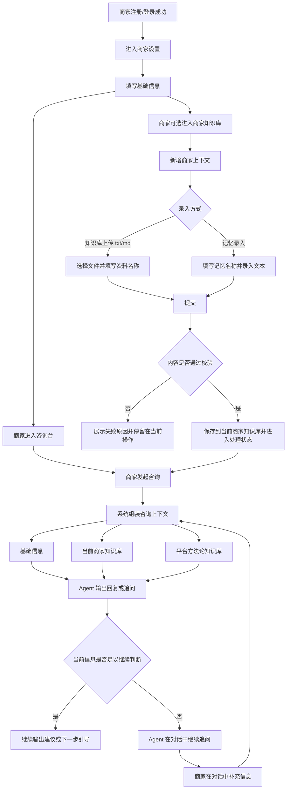
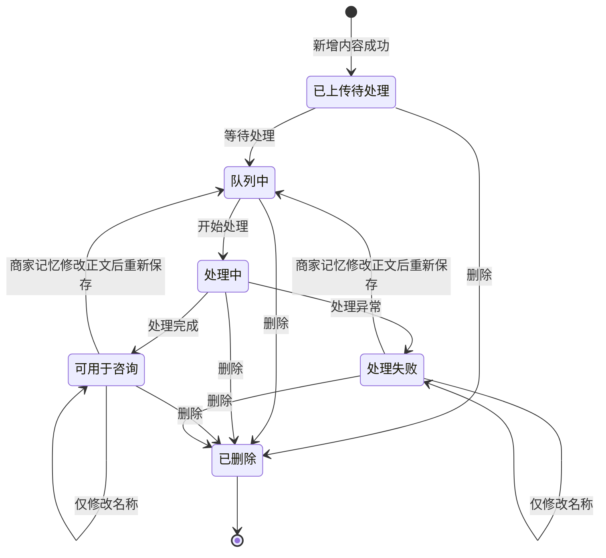

# 产品需求文档：商家知识库与咨询上下文补强 - V2.1

## 1. 综述 (Overview)
### 1.1 项目背景与核心问题
当前咨询主链路已经具备基础商家信息读取能力，也具备平台方法论知识库能力，但存在两个明显问题：

1. `知识库` 的产品概念还不够清晰，容易把“平台方法论知识”与“商家自己的业务资料”混成一层。
2. 商家如果有项目资料、FAQ、活动说明、成交案例、会议纪要等额外信息，当前缺少一个稳定、可持续补充的资料入口，只能依赖对话临时补充。

本轮需求要解决的核心问题不是建设完整的自动长期记忆系统，而是先把咨询上下文分成三层，并补齐商家私有上下文入口这一层：

- `基础信息`：商家注册登录后填写的稳定基础资料。
- `平台方法论知识库`：平台方法论库，服务于咨询 Agent 的方法论检索，不属于任何单个商家。
- `商家知识库`：当前商家自己维护的私有长期上下文，只对当前商家可见和可用；V1 内部分成 `知识库上传` 和 `记忆录入`。

本轮明确不做自动提炼 `memory`，也不做对话结束后的自动写回；但允许商家手动录入可编辑的 `商家记忆`。在 V2.1 阶段，商家知识库先承担“补充长期上下文”的作用；如果咨询过程中信息仍不充分，由咨询 Agent 在对话里继续追问，商家在对话中补充即可。

### 1.2 核心业务流程 / 用户旅程地图
1. **阶段一：基础信息建档** - 商家注册登录后填写基础信息，形成咨询台的初始业务背景。
2. **阶段二：商家知识库录入与维护** - 商家可上传 `txt/md` 商家资料，也可手动录入商家记忆，沉淀为当前商家私有的补充上下文。
3. **阶段三：咨询上下文组装** - 系统在咨询时组合基础信息、商家知识库和平台方法论知识库三类上下文。
4. **阶段四：咨询使用与对话补充** - 商家进入咨询台发起提问；如果信息不足，Agent 在对话内继续追问，商家直接在对话中补充。

### 1.3 Mermaid 图（流程/状态/时序）
> 说明：本版按用户要求不附 ASCII 线框图，后续由原型稿单独对齐页面布局。

#### 1.3.1 用户操作流（必填）


#### 1.3.2 状态机（当存在明确状态流转对象时必填）


## 2. 用户故事详述 (User Stories)

### 阶段一：基础信息建档

---

#### **US-01: 作为商家，我希望在注册登录后填写基础信息，以便咨询 Agent 在首轮对话中已经具备我的基础业务背景。**
*   **价值陈述 (Value Statement)**:
    *   **作为** 商家
    *   **我希望** 在注册登录后填写名称、行业、服务、品牌摘要、默认 CTA 等基础信息
    *   **以便于** 咨询 Agent 在首轮对话中能够先理解我的基本业务背景，而不是完全从零开始
*   **业务规则与逻辑 (Business Logic)**:
    1.  **前置条件**:
        *   商家已注册并登录成功。
        *   商家可访问商家设置页面。
    2.  **操作流程 (Happy Path)**:
        *   商家进入商家设置页面。
        *   商家填写或修改基础信息。
        *   商家保存后，系统更新当前商家的基础信息。
        *   商家进入咨询台时，咨询 Agent 会把这部分基础信息作为初始上下文读取。
    3.  **异常处理 (Error Handling)**:
        *   如果基础信息保存失败，系统提示保存失败，并保留当前输入内容，允许商家再次提交。
        *   如果基础信息填写不完整，系统不额外做“上下文是否足够”的判断，不阻断商家进入咨询台。
        *   如果基础信息不足以支持咨询判断，咨询 Agent 需要在对话中继续追问，而不是强制商家先回去补资料。
*   **验收标准 (Acceptance Criteria)**:
    *   **场景1: 商家保存基础信息成功**
        *   **GIVEN** 商家已登录并进入商家设置页面
        *   **WHEN** 商家填写并保存基础信息
        *   **THEN** 系统保存成功，并在后续咨询时将该信息作为基础上下文读取
    *   **场景2: 基础信息不完整但商家继续咨询**
        *   **GIVEN** 商家尚未填写完整基础信息
        *   **WHEN** 商家进入咨询台发起问题
        *   **THEN** 系统不阻断咨询流程，Agent 可基于已有信息回答，并在必要时继续追问

---
*   **页面布局线框图 (ASCII Wireframe)**:
    ```text
    按本轮用户要求，本文不附 ASCII 线框图；后续由原型稿单独对齐。
    ```

### 阶段二：商家知识库录入与维护

---

#### **US-02: 作为商家，我希望在商家知识库中分别完成知识库上传和记忆录入，以便把我的额外业务资料提供给咨询 Agent 参考。**
*   **价值陈述 (Value Statement)**:
    *   **作为** 商家
    *   **我希望** 通过 `知识库上传` 新增 `txt/md` 商家资料，通过 `记忆录入` 新增短文本商家记忆
    *   **以便于** 把项目资料、FAQ、活动说明、案例、经验判断等额外信息沉淀下来，供咨询 Agent 后续参考
*   **业务规则与逻辑 (Business Logic)**:
    1.  **前置条件**:
        *   商家已登录成功。
        *   商家已进入当前商家自己的商家知识库页面。
    2.  **操作流程 (Happy Path)**:
        *   商家点击 `知识库上传` 时，只能选择一份 `txt` 或 `md` 文件，并填写资料名称。
        *   商家点击 `记忆录入` 时，填写记忆名称和记忆正文。
        *   提交成功后，该内容进入当前商家的知识库列表，并显示处理状态。
    3.  **异常处理 (Error Handling)**:
        *   如果未填写资料名称或记忆名称，系统阻断提交并提示名称必填。
        *   如果上传文件格式不是 `txt` 或 `md`，系统阻断提交并提示格式不支持。
        *   如果上传文件超过 `10MB`，系统阻断提交并提示单文件大小上限。
        *   如果记忆正文为空，系统阻断提交并提示必须填写正文。
        *   如果记忆正文超过 `1000` 个可见字符，系统阻断提交并提示超出上限。
        *   如果上传或保存失败，系统提示失败原因，允许商家在当前页面继续修改并重新提交。
*   **验收标准 (Acceptance Criteria)**:
    *   **场景1: 成功上传 txt/md 文件**
        *   **GIVEN** 商家已进入商家知识库页面
        *   **WHEN** 商家选择 `txt` 或 `md` 文件，填写资料名称并提交
        *   **THEN** 系统保存该资料到当前商家的知识库，并在列表中展示该条资料及其处理状态
    *   **场景2: 成功录入商家记忆**
        *   **GIVEN** 商家已进入商家知识库页面
        *   **WHEN** 商家选择记忆录入，填写记忆名称和 `1000` 个可见字符以内正文并提交
        *   **THEN** 系统保存该商家记忆到当前商家的知识库，并在列表中展示该条记忆及其处理状态
    *   **场景3: 商家记忆正文超长**
        *   **GIVEN** 商家选择记忆录入方式
        *   **WHEN** 商家提交超过 `1000` 个可见字符的正文
        *   **THEN** 系统阻断提交，并明确提示已超出字数上限
    *   **场景4: 文件格式不支持**
        *   **GIVEN** 商家选择上传文件方式
        *   **WHEN** 商家提交非 `txt`、非 `md` 文件
        *   **THEN** 系统阻断提交，并明确提示当前格式不支持

---
*   **页面布局线框图 (ASCII Wireframe)**:
    ```text
    按本轮用户要求，本文不附 ASCII 线框图；后续由原型稿单独对齐。
    ```

---

#### **US-03: 作为商家，我希望在商家知识库里查看、编辑和删除资料，以便持续维护这些业务资料的有效性。**
*   **价值陈述 (Value Statement)**:
    *   **作为** 商家
    *   **我希望** 查看商家资料和商家记忆列表、处理状态，并根据内容类型进行编辑或删除
    *   **以便于** 持续维护商家知识库，让咨询 Agent 使用的是当前有效资料
*   **业务规则与逻辑 (Business Logic)**:
    1.  **前置条件**:
        *   商家已登录成功。
        *   当前商家知识库中已有一条或多条资料。
    2.  **操作流程 (Happy Path)**:
        *   商家在列表中查看名称、类型、处理状态、更新时间。
        *   对于文件型资料（`txt / md`）：
          - 商家可编辑资料名称。
          - 商家不可在线替换文件正文。
          - 如需修改正文，只能删除后重新上传。
        *   对于商家记忆：
          - 商家可编辑记忆名称。
          - 商家可编辑记忆正文。
          - 记忆正文修改并保存后，该记忆重新进入处理流程。
        *   商家可删除任意一条商家资料或商家记忆。
    3.  **异常处理 (Error Handling)**:
        *   如果文件型资料处理失败，商家仍可修改名称，但不能修改文件正文；如需修复内容，只能删除后重新上传。
        *   如果商家记忆处理失败，商家可编辑正文并重新保存，系统重新处理该条记忆。
        *   如果删除失败，系统提示删除失败，原内容保留在列表中。
        *   如果商家记忆编辑后超过 `1000` 个可见字符，系统阻断保存并提示超出上限。
*   **验收标准 (Acceptance Criteria)**:
    *   **场景1: 编辑商家记忆**
        *   **GIVEN** 商家列表中存在一条商家记忆
        *   **WHEN** 商家修改记忆名称或正文并保存
        *   **THEN** 系统保存修改；若正文发生变化，该记忆重新进入处理流程
    *   **场景2: 编辑文件型资料**
        *   **GIVEN** 商家列表中存在一条 `txt` 或 `md` 文件资料
        *   **WHEN** 商家进入编辑态
        *   **THEN** 系统只允许修改资料名称，不允许在线替换文件正文，并明确提示“如需修改内容，请删除后重新上传”
    *   **场景3: 删除资料**
        *   **GIVEN** 商家列表中存在一条商家资料或商家记忆
        *   **WHEN** 商家执行删除操作并确认
        *   **THEN** 系统删除该条内容，列表中不再显示
    *   **场景4: 商家记忆处理失败后的修复**
        *   **GIVEN** 一条商家记忆当前状态为“处理失败”
        *   **WHEN** 商家修改正文并再次保存
        *   **THEN** 系统重新处理该条记忆，并更新其处理状态

---
*   **页面布局线框图 (ASCII Wireframe)**:
    ```text
    按本轮用户要求，本文不附 ASCII 线框图；后续由原型稿单独对齐。
    ```

---

#### **US-04: 作为商家，我希望我的商家知识库是严格隔离的，以便我的私有资料不会被其他商家看到或用于他们的咨询。**
*   **价值陈述 (Value Statement)**:
    *   **作为** 商家
    *   **我希望** 商家知识库只属于当前商家自己
    *   **以便于** 确保项目资料、FAQ、活动信息、案例、商家记忆等私有内容不会串到其他商家
*   **业务规则与逻辑 (Business Logic)**:
    1.  **前置条件**:
        *   商家已登录成功。
    2.  **操作流程 (Happy Path)**:
        *   商家进入商家知识库时，系统只展示当前登录商家自己的商家资料和商家记忆。
        *   商家进行新增、编辑、删除操作时，系统只对当前商家自己的内容生效。
        *   咨询 Agent 在检索商家知识库时，只读取当前商家的商家资料和商家记忆，不读取其他商家的内容。
    3.  **异常处理 (Error Handling)**:
        *   如果商家尝试访问不属于自己的内容，系统阻断访问，并返回无权限或不可见结果。
        *   如果系统在查询时无法识别当前商家身份，系统阻断资料访问，避免返回任何跨商家内容。
*   **验收标准 (Acceptance Criteria)**:
    *   **场景1: 商家查看列表**
        *   **GIVEN** 两个不同商家都已存在自己的知识库内容
        *   **WHEN** 其中一个商家进入商家知识库页面
        *   **THEN** 页面只展示当前商家的内容，不展示其他商家的内容
    *   **场景2: 咨询检索隔离**
        *   **GIVEN** 两个不同商家都已存在自己的知识库内容
        *   **WHEN** 其中一个商家发起咨询
        *   **THEN** 咨询 Agent 只可读取当前商家的商家知识库，不可读取其他商家的内容

---
*   **页面布局线框图 (ASCII Wireframe)**:
    ```text
    按本轮用户要求，本文不附 ASCII 线框图；后续由原型稿单独对齐。
    ```

### 阶段三：咨询上下文组装

---

#### **US-05: 作为商家，我希望咨询 Agent 同时参考基础信息、商家知识库和平台方法论知识，以便获得更贴合我业务的咨询回复。**
*   **价值陈述 (Value Statement)**:
    *   **作为** 商家
    *   **我希望** 咨询 Agent 在回答问题时同时参考多层上下文
    *   **以便于** 得到既符合平台方法论、又贴合我自身业务背景的咨询建议
*   **业务规则与逻辑 (Business Logic)**:
    1.  **前置条件**:
        *   商家已登录并进入咨询台。
        *   系统可读取当前商家的基础信息。
        *   平台侧已存在平台方法论知识库。
    2.  **操作流程 (Happy Path)**:
        *   商家在咨询台发起问题。
        *   系统组装三层上下文：
          - 当前商家的基础信息
          - 当前商家知识库中“可用于咨询”的商家资料和商家记忆
          - 平台方法论知识库中的方法论知识
        *   咨询 Agent 基于这三层上下文生成回复或追问。
    3.  **异常处理 (Error Handling)**:
        *   如果商家没有上传商家资料，也没有录入商家记忆，咨询仍可继续；系统仅基于基础信息和平台方法论知识库回答。
        *   如果某条商家知识库内容状态仍为“已上传待处理”“队列中”“处理中”或“处理失败”，该内容不应被当作可用咨询上下文使用。
        *   如果当前信息仍不足以支持判断，咨询 Agent 应在对话中继续追问，而不是要求商家立即跳出咨询流程重新上传资料。
        *   本轮不做“自动提炼长期记忆”或“对话结束后自动写回 memory”。
*   **验收标准 (Acceptance Criteria)**:
    *   **场景1: 三层上下文共同参与咨询**
        *   **GIVEN** 商家已填写基础信息，已存在至少一条“可用于咨询”的商家知识库内容，且平台方法论知识库可用
        *   **WHEN** 商家发起咨询问题
        *   **THEN** 系统会同时参考基础信息、当前商家知识库和平台方法论知识生成回复
    *   **场景2: 没有商家知识库内容时继续咨询**
        *   **GIVEN** 商家尚未上传商家资料，也尚未录入商家记忆
        *   **WHEN** 商家发起咨询问题
        *   **THEN** 咨询流程仍可继续，系统仅基于基础信息和平台方法论知识库回答
    *   **场景3: 商家知识库内容仍未可用于咨询**
        *   **GIVEN** 商家知识库中存在一条状态为“队列中”或“处理中”的内容
        *   **WHEN** 商家立刻发起咨询
        *   **THEN** 系统不把该条未完成处理的内容作为已可用上下文使用

---
*   **页面布局线框图 (ASCII Wireframe)**:
    ```text
    按本轮用户要求，本文不附 ASCII 线框图；后续由原型稿单独对齐。
    ```

### 阶段四：咨询使用与对话补充

---

#### **US-06: 作为商家，我希望当当前资料仍不足时，咨询 Agent 直接在对话中追问我，以便我在同一轮咨询中继续补充信息。**
*   **价值陈述 (Value Statement)**:
    *   **作为** 商家
    *   **我希望** 咨询 Agent 在信息不足时直接继续追问
    *   **以便于** 我可以在当前对话中补充信息，而不是被迫跳转到别的入口重新完成一套补资料流程
*   **业务规则与逻辑 (Business Logic)**:
    1.  **前置条件**:
        *   商家已进入咨询台并发起咨询。
    2.  **操作流程 (Happy Path)**:
        *   咨询 Agent 在已有上下文基础上判断当前信息是否足以继续回答。
        *   如果足够，Agent 继续输出建议、策略或下一步引导。
        *   如果不足，Agent 直接在对话中追问最关键的补充信息。
        *   商家在当前对话中继续补充信息，Agent 基于新的输入继续判断和回复。
    3.  **异常处理 (Error Handling)**:
        *   本轮不设计“咨询过程中主动跳转商家知识库上传新资料”的特殊流程。
        *   本轮不设计“系统自动判断上下文是否完整后再决定能否进入咨询台”的前置门禁。
        *   如果商家暂时不给出完整补充信息，咨询 Agent 仍应尽量基于已有信息给出保守建议，并明确指出缺失点。
*   **验收标准 (Acceptance Criteria)**:
    *   **场景1: 信息不足时继续追问**
        *   **GIVEN** 商家已发起咨询，但已有上下文不足以支持完整判断
        *   **WHEN** 咨询 Agent 生成下一轮回复
        *   **THEN** Agent 应在当前对话中直接追问关键缺失信息，而不是要求商家先退出咨询去上传资料
    *   **场景2: 商家在对话中补充后继续咨询**
        *   **GIVEN** Agent 已在对话中追问关键信息
        *   **WHEN** 商家在当前对话中补充说明
        *   **THEN** Agent 基于新的对话内容继续回复或继续追问

---
*   **页面布局线框图 (ASCII Wireframe)**:
    ```text
    按本轮用户要求，本文不附 ASCII 线框图；后续由原型稿单独对齐。
    ```

## 3. 非目标 (Out of Scope)

- 不做自动提炼 `memory`。
- 不做对话结束后的自动长期记忆写回。
- 不做商家知识库与其他商家共享。
- 不做 `pdf`、`docx`、图片、音频等更多格式支持。
- 不做批量上传。
- 不做商家侧 `knowledge_sets` 分组或 Agent 绑定管理。
- 不做咨询过程中强制跳出当前对话、返回知识库补传资料的流程。
- 不做“进入咨询台前先判断上下文是否充足”的门禁逻辑。

## 4. 待确认事项 (Open Questions)

1. 商家知识库列表是否需要支持搜索、筛选和分页，本轮 PRD 先不强制要求。
2. 商家记忆在“处理中”期间是否允许再次编辑，产品层可在原型阶段再决定交互细节，但不影响本轮核心规则。
