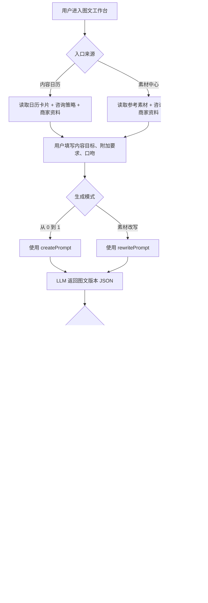

# V2.1 图文工作台提示词模板生成 PRD

状态：`已确认待实现`

日期：`2026-04-30`

关联文档：

- `docs/产品文档/V2.1-内容日历到图文视频工作台协作PRD.md`
- `docs/产品文档/V2.1-咨询驱动主链路体验补强-PRD.md`
- `docs/架构规范/2026-04-28-current-architecture.md`

## 1. 综述

### 1.1 背景与核心问题

当前图文工作台已经能够从内容日历进入，并携带 `source`、`sessionId`、`calendarItemId`、`strategyTag` 等上下文。服务端也能解析并保存 `selectedCalendarItem`、`strategySnapshot`、`merchantProfile` 等快照。

但当前图文内容本身仍偏模板化：系统只是把商家名、客群、卖点、场景等真实字段填入固定正文结构，并没有让 LLM 根据当前日历卡片和真实业务上下文生成小红书笔记。

本 PRD 的目标是先用几个可控提示词模板跑通图文生成闭环，而不是引入 CrewAI 或多 Agent 编排。

### 1.2 本轮核心决策

1. 本轮不引入 CrewAI。
2. 本轮不做多 Agent 自主规划。
3. 图文工作台先通过直接调用 LLM API 完成生成。
4. LLM 输入由稳定 `system prompt` 和若干 `user prompt template` 组成。
5. 本轮至少沉淀三类 prompt：
   - `createPrompt`：从 0 到 1 生成图文。
   - `rewritePrompt`：基于参考素材改写图文。
   - `revisePrompt`：基于已有版本和自然语言修改意见生成新版本。
6. 所有生成结果必须继续落入 `content_drafts` 和 `content_variants`，并能回到「我的内容」。
7. 所有生成必须保留输入快照，方便解释“当时为什么生成这篇内容”。

### 1.3 非目标

本轮不做：

- 不做 CrewAI、多 Agent、自动任务规划。
- 不做自动联网搜索热点。
- 不做自动筛选素材或自动抓取对标内容。
- 不做图像生成、封面生成、自动发布。
- 不做复杂 A/B 数据回收和效果学习。
- 不把参考素材中的商家事实直接当成本商家的事实。

如果后续要自动找素材、自动拆爆款、自动评分、自动多轮优化，再单独评估 Agent 编排。

## 2. 用户旅程地图

### 2.1 阶段一：从内容日历进入图文创作

用户从咨询诊断页的内容日历点击一张图文卡片，进入图文工作台。系统读取该卡片、咨询策略和商家资料，用户可补充内容目标、附加要求和口吻后生成小红书笔记。

### 2.2 阶段二：基于参考素材改写

用户从素材中心选择一条参考素材进入图文工作台。系统展示参考素材，并要求 LLM 只借鉴素材的结构、钩子、节奏和转化动作，不照搬素材句子和素材商家事实。

### 2.3 阶段三：自然语言修订

用户对已有生成版本不满意时，可以用自然语言提出修改意见，例如“更口语一点”“开头别太吓人”“强调门店环境”。系统把原上下文、当前版本和修改意见一起传给 LLM，生成一个新的版本，不覆盖旧版本。

### 2.4 核心流程图



## 3. 页面与交互要求

### 3.1 图文工作台目标布局

```text
+----------------------------------------------------------------------------------+
| 图文工作台 / 小红书笔记                                      重新生成   去历史页 |
+------------------------------+---------------------------------------------------+
| 已带入日历卡片                | 标题方案                                          |
| - 标题                        | [版本 A] [版本 B] [版本 C]                        |
| - 摘要                        |                                                   |
| - 策略标签                    | 正文与排版                                        |
|                              | ------------------------------------------------ |
| 内容目标                      | 当前选中版本正文                                  |
| [textarea]                    |                                                   |
|                              |                                                   |
| 附加要求                      | 自然语言修改                                      |
| [textarea]                    | [textarea: 例如更口语一点，少一点焦虑感...]       |
|                              | [按要求修改]                                      |
| 平台风格与口吻                |                                                   |
| [专业干货] [知心闺蜜] [痛点]  |                                                   |
|                              |                                                   |
| [开始创作 / 开始改写]         |                                                   |
+------------------------------+---------------------------------------------------+
```

### 3.2 创作模式展示规则

- 从内容日历进入时，左侧必须展示当前选中的日历卡片。
- 日历卡片至少展示标题、摘要、策略标签。
- 内容目标默认可由日历卡片摘要或 `articleBrief.angle` 填充，但用户可以编辑。
- 附加要求默认为空。
- 平台风格与口吻可以先沿用当前三个 chip：`专业干货`、`知心闺蜜`、`痛点唤醒`。

### 3.3 改写模式展示规则

- 从素材中心进入时，左侧必须展示参考素材。
- 如果没有参考素材，不应直接进入改写生成，应提示用户先选择素材或切回创作模式。
- 改写模式仍可使用咨询策略和内容目标。
- 改写模式下必须明确约束：参考素材只提供结构、钩子、节奏和 CTA 借鉴。

### 3.4 修订交互规则

- 用户可以选择一个已有版本作为当前版本。
- 用户输入自然语言修改意见后，点击「按要求修改」。
- 系统生成一个新的 `content_variant`，不覆盖旧版本。
- 新版本应自动成为当前选中版本。
- 如果用户点击「重新生成」，表示重新生成一组版本；如果点击「按要求修改」，表示基于当前版本生成单个新版本。

## 4. Prompt 模板规则

### 4.1 通用 System Prompt 目标

System Prompt 固定负责定义角色、事实边界、风险约束和输出格式。

核心要求：

- 角色：本地生活商家的小红书图文创作编辑。
- 事实边界：只能使用输入中的咨询策略、商家资料、日历卡片、参考素材和用户补充要求。
- 禁止编造：价格、疗效、收益、资质、真实案例、库存、活动承诺等未经确认信息。
- 风险控制：不要生成夸大承诺、医疗疗效、金融收益、绝对化用语。
- 输出格式：只输出 JSON，不输出思考过程，不包裹 Markdown 代码块。

### 4.2 createPrompt：从 0 到 1 生成

输入变量：

- `selectedCalendarItem`
- `strategySnapshot`
- `merchantProfile`
- `contentGoal`
- `extraRequirement`
- `toneStyle`
- `platform = xiaohongshu`

输出要求：

- 返回 2 到 3 个图文版本。
- 每个版本包含：
  - `styleLabel`
  - `title`
  - `bodyText`
  - `hashtags`
  - `ctaText`
  - `rationale`
- 标题应贴近小红书，不要像正式新闻标题。
- 正文应有清晰开头、场景展开、差异点解释和行动引导。
- 内容必须围绕当前日历卡片，而不是泛泛复述商家定位。

### 4.3 rewritePrompt：基于素材改写

输入变量：

- `selectedCalendarItem`，可为空。
- `strategySnapshot`
- `merchantProfile`
- `materialContext`
- `contentGoal`
- `extraRequirement`
- `toneStyle`
- `platform = xiaohongshu`

素材规则：

- 可以借鉴素材的开头钩子、结构、内容节奏、情绪推进和 CTA 方式。
- 不得照搬素材原句。
- 不得把素材里的商家事实、价格、地址、案例、数据当成本商家的事实。
- 如果素材和商家资料冲突，以本商家资料和咨询策略为准。
- 如果素材只有标题和摘要，也可以生成，但要降低对素材细节的依赖。

输出要求同 `createPrompt`。

### 4.4 revisePrompt：自然语言修订

输入变量：

- `originalContext`
  - `selectedCalendarItem`
  - `strategySnapshot`
  - `merchantProfile`
  - `materialContext`
- `currentVariant`
  - `title`
  - `bodyText`
  - `hashtags`
  - `ctaText`
- `revisionInstruction`

修订规则：

- 默认只生成 1 个新版本。
- 不覆盖原版本。
- 保持原事实边界，不新增未经确认事实。
- 尽量只按用户修改意见调整。
- 如果用户要求“换个方向”，允许重构标题和正文结构，但仍必须围绕原上下文。
- 如果用户要求违反风险约束，应拒绝该部分，并生成安全替代表达。

## 5. 推荐 JSON 输出结构

```json
{
  "variants": [
    {
      "styleLabel": "专业干货版",
      "title": "别只盯价格，先看这 3 个到店前信号",
      "bodyText": "正文内容",
      "hashtags": ["#本地生活", "#小红书探店"],
      "ctaText": "私信我领取到店沟通清单",
      "rationale": "这个版本围绕日历卡片中的高意向到店人群展开。"
    }
  ],
  "riskNotes": []
}
```

解析规则：

- `variants` 为空时视为生成失败。
- `title` 或 `bodyText` 缺失时视为该版本不可用。
- `hashtags` 最多保留 8 个。
- `riskNotes` 可为空，但如果模型识别到高风险要求，应写入说明。

## 6. 保存与追溯规则

### 6.1 Draft 保存

每次首次生成或素材改写后，必须创建：

- `content_drafts`
- 至少 1 条 `content_variants`

`content_drafts.input_snapshot` 应继续保存：

- `source`
- `consultationSessionId`
- `calendarItemId`
- `selectedCalendarItem`
- `strategySnapshot`
- `merchantProfile`
- `generationMode`
- `strategyTag`
- `extraRequirement`
- `materialContext`

并建议新增：

- `promptMode`: `create`、`rewrite` 或 `revise`
- `promptVersion`
- `llmTrace.mode`: `llm`、`fallback_no_key`、`fallback_error`、`fallback_parse_error`
- `llmTrace.model`

### 6.2 Variant 保存

- 首次生成和素材改写可以一次保存 2 到 3 个 `content_variants`。
- 自然语言修订默认追加 1 个 `content_variant`。
- 不覆盖旧版本。
- 新增版本的 `version_no` 应顺延。

### 6.3 降级保存

如果 LLM 不可用、未配置 API key 或返回不可解析：

- 可以使用当前模板生成作为 fallback。
- 必须记录降级原因。
- 用户可见文案建议为：`AI 生成服务暂不可用，已先生成一版可编辑草稿。`

## 7. 用户故事

### US-01：作为商家，我希望从内容日历一键生成真实图文草稿

价值陈述：

- 作为商家
- 我希望从内容日历进入图文工作台后，系统能根据该日历卡片和我的咨询策略生成笔记
- 以便于我不再只得到一篇模板感很强的通用文案

业务规则：

1. 前置条件：用户从内容日历点击图文卡片进入工作台。
2. 系统必须读取当前日历卡片、咨询策略和商家资料。
3. 用户可以编辑内容目标和附加要求。
4. 点击「开始创作」后，系统使用 `createPrompt` 生成 2 到 3 个版本。
5. 生成结果保存到「我的内容」。

验收标准：

- GIVEN 用户从内容日历进入图文工作台，WHEN 页面加载完成，THEN 左侧能看到当前日历卡片标题、摘要和策略标签。
- GIVEN 用户点击「开始创作」，WHEN LLM 返回有效 JSON，THEN 页面展示 2 到 3 个标题和正文版本。
- GIVEN 已生成草稿，WHEN 用户进入「我的内容」，THEN 能看到该图文草稿。
- GIVEN 生成结果落库，WHEN 查看 `input_snapshot`，THEN 能追溯 `selectedCalendarItem`、`strategySnapshot` 和 `merchantProfile`。

### US-02：作为商家，我希望基于参考素材改写，但不照搬素材

价值陈述：

- 作为商家
- 我希望参考素材能帮助我借鉴表达方式和结构
- 以便于我快速产出适合自己门店的原创内容

业务规则：

1. 前置条件：用户从素材中心选择素材进入图文工作台，或在图文工作台中已绑定素材。
2. 系统必须展示参考素材摘要。
3. 点击「开始改写」后，系统使用 `rewritePrompt`。
4. 模型只能借鉴结构、钩子、节奏和 CTA。
5. 模型不得照搬素材原句，不得复用素材商家事实。

验收标准：

- GIVEN 用户从素材中心进入，WHEN 页面加载完成，THEN 左侧展示参考素材标题和摘要。
- GIVEN 用户点击「开始改写」，WHEN 生成成功，THEN 正文围绕本商家的资料和咨询策略展开。
- GIVEN 参考素材包含其他商家事实，WHEN 生成结果返回，THEN 结果不应把其他商家的价格、地址、案例写成本商家事实。
- GIVEN 没有参考素材，WHEN 用户选择改写模式生成，THEN 系统提示先选择素材或切回创作模式。

### US-03：作为商家，我希望用自然语言修改已有图文版本

价值陈述：

- 作为商家
- 我希望对已有文案说一句修改要求就能得到新版本
- 以便于我不用重新填写所有信息，也不用手动大改正文

业务规则：

1. 前置条件：当前已存在至少一个图文版本。
2. 用户选择当前版本，输入修改意见。
3. 点击「按要求修改」后，系统使用 `revisePrompt`。
4. 系统生成一个新的版本，并追加保存。
5. 旧版本必须保留。

验收标准：

- GIVEN 页面已有图文版本，WHEN 用户输入“更口语一点”并点击修改，THEN 系统生成一个更口语的新版本。
- GIVEN 修订成功，WHEN 查看版本列表，THEN 新版本出现且旧版本仍保留。
- GIVEN 用户提出高风险修改要求，WHEN 系统修订，THEN 系统不生成违规承诺，并给出安全替代表达。

### US-04：作为开发和后续接手者，我希望生成过程可追溯、可降级、可回滚

价值陈述：

- 作为开发和后续接手者
- 我希望每次生成都能知道用了什么输入、什么 prompt 版本、是否走了 LLM
- 以便于排查生成质量问题和回滚风险

业务规则：

1. 每次生成应记录 `promptMode` 和 `promptVersion`。
2. LLM 成功时记录模型信息。
3. LLM 失败或未配置时走模板 fallback。
4. fallback 不能伪装成正式 AI 生成。
5. 回滚方式应能通过恢复模板生成逻辑实现。

验收标准：

- GIVEN AI key 未配置，WHEN 用户点击生成，THEN 系统仍能给出可编辑草稿，并显示可理解提示。
- GIVEN LLM 返回不可解析内容，WHEN 系统处理失败，THEN 使用 fallback 或返回可恢复错误，不产生空白页面。
- GIVEN 生成完成，WHEN 后续排查，THEN 能从快照中看到 prompt 模式、版本和降级状态。

## 8. 开发建议

### 8.1 先实现最小闭环

建议本轮先做：

1. 新增图文 prompt builder。
2. 在现有 `POST /api/content/article-drafts` 内接入 LLM。
3. 保留现有模板作为 fallback。
4. 图文工作台补充当前日历卡片展示。
5. 结果继续使用现有 `content_drafts` 和 `content_variants`。

### 8.2 后续增强

后续可以再做：

- 平台后台配置图文 prompt。
- 版本评分和选择理由展示。
- 自动素材拆解。
- 结合知识库检索补充商家长期记忆。
- 多轮优化助手或 Agent 编排。

## 9. 关键结论

本轮图文工作台的首要目标是跑通真实业务上下文生成，而不是构建复杂 Agent 系统。

最小可行方案是：

```text
UI 输入 + 咨询策略 + 日历卡片 + 商家资料 + 可选素材
-> prompt template
-> LLM API
-> JSON 版本结果
-> content_drafts / content_variants
-> 我的内容
```

自然语言修改也先通过 `revisePrompt` 完成，不需要 CrewAI。
