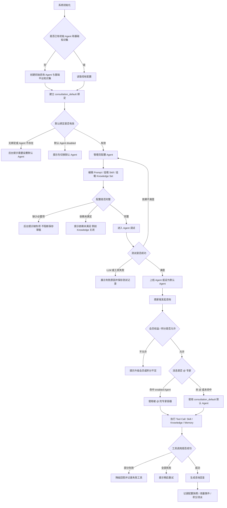
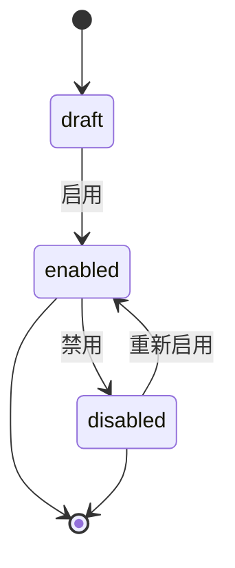
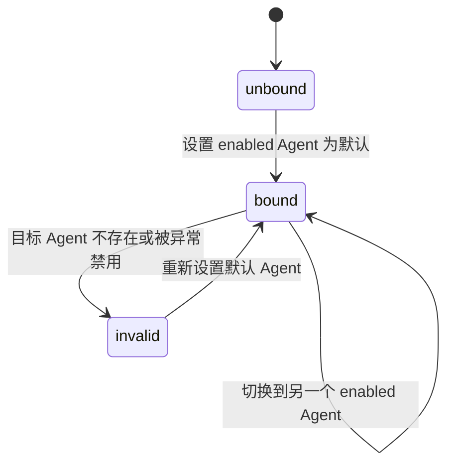
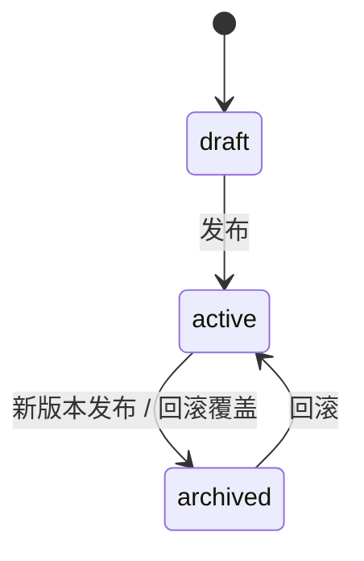
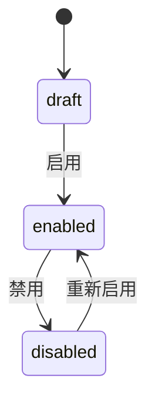

# 小红书抖音矩阵获客平台 V2.2 咨询 Agent 控制台与能力资产管理 PRD

## 1. 文档定位

这份 PRD 用于把「咨询 Agent 控制台」从探索稿收敛成一版可开发、可验收、可继续拆任务的正式需求文档。

本 PRD 的重点不是重新定义商家端咨询主链路，而是补齐平台管理端对咨询 Agent 的配置底座：

- Agent 容器配置
- System Prompt 草稿 / 发布 / 回滚
- Skill 创建、启用、禁用与挂载
- Knowledge 文档与知识集管理
- Agent 调试与测试记录
- 上线可见专家与默认 Agent 绑定
- 商家端服务维护态
- 配置快照、用量事件、会员积分底座预留

本 PRD 属于 V2.2 后台能力补强，不推翻 V2.1「咨询驱动主链路」。

## 2. 背景与核心问题

当前咨询 Agent 已经有后台可编辑的 system prompt、知识库检索、固定工具链和商家端咨询入口，但这些能力仍然混在旧的 `platform_settings.consultation_agent` 结构里。

当前主要问题：

1. `System Prompt`、`Skill`、`Knowledge` 没有统一挂在 Agent 容器下。
2. 当前后台里的 `Enabled Skills / Tools` 实际是内部 tools，容易和产品意义上的 Skill 混淆。
3. 平台知识上传后如果直接进入全局检索，会影响商家端真实咨询稳定性。
4. 管理员缺少复制已上线 Agent 做测试的安全路径。
5. 测试台需要能看清本轮用了哪些 prompt、skill、knowledge、memory 和 tools。
6. 商家侧真实使用未来会受会员与积分影响，需要现在预留统一的权益 / 积分 gate。
7. 后台当前容易把「上线可见」和「默认咨询入口」混为一谈，导致多 Agent 可见、下线、默认切换和商家端 `@ 专家` 行为不清晰。

## 3. 产品目标

V2.2 的目标是让平台管理员能安全地配置、测试、发布咨询 Agent 能力，同时不破坏当前商家端真实咨询稳定性。

核心目标：

1. 以 `Agent 容器` 为主体组织 System Prompt、Skill、Knowledge Set。
2. 管理员可以复制已上线 Agent，形成测试 Agent，再通过测试台验证。
3. 多个 `enabled` Agent 可以同时上线并出现在商家端 `@ 专家` 列表。
4. `consultation_default` 只表示唯一默认 Agent，用于处理商家未 `@` 专家的直接提问。
5. Skill 是可控 prompt 片段，不开放底层 tool 权限。
6. Knowledge 先组织为知识集，再挂载到 Agent；Agent 与 Knowledge Set 是多对多关系。
7. 真实咨询记录轻量配置快照，便于后续排查。
8. 会员与积分作为横切底座预留，不写死到 Agent 配置中。

## 4. 非目标

本 PRD 第一版不做：

- 不做多行业自动 Agent 路由，例如房地产 / 教培 / IT 自动分流。
- 不做视频 Agent、图文 Agent 的完整配置界面，只预留多 Agent 结构。
- 不开放底层 tools 给管理员自由配置权限。
- 不做 Skill 文件扫描，不读取本地 `SKILL.md`。
- 不做 Skill 冲突检测。
- 不强制 Prompt 或 Skill 发布前必须通过测试台。
- 不做商家资料库完整功能，只记录为后续「商家设置」里的长期记忆入口。
- 不做完整会员支付与扣费闭环，只预留积分账户、积分流水、用量事件和调用前 gate。

## 5. 角色与核心对象

### 5.1 用户角色

- 平台管理员：配置 Agent、Skill、Knowledge、测试台、上线可见和默认入口绑定。
- 商家用户：只使用商家端咨询入口，不感知后台配置细节。
- 后续开发者 / 运营：需要通过快照和测试记录排查 Agent 回答问题。

### 5.2 核心对象

```text
Agent            Agent 容器，承载身份、System Prompt、Skill、Knowledge Set。
System Prompt    Agent 级系统指令，有草稿、生效、归档版本。
Skill            管理员创建的能力说明 / 行为策略 / 场景方法论 prompt 片段。
Knowledge Set    平台知识文档集合，Agent 挂载后才能检索。
Tool             代码层封装的受控后端函数，不开放给管理员自由创建权限。
Memory           商家长期记忆 / 商家资料库，后续归入商家设置。
Agent Visibility Agent 是否出现在商家端 @ 专家列表，由 agent_configs.service_status 控制。
Default Binding  默认咨询入口到 Agent 的唯一绑定，例如 consultation_default -> agent_id。
Credits Gate     商家侧真实 AI 消耗前的会员 / 积分校验层。
```

## 6. 核心业务流程 / 用户旅程地图

### 阶段一：初始化基础配置

系统预置初始咨询 Agent、基础平台知识集，并建立 `consultation_default -> agent_id` 的默认入口绑定。初始 Agent 同时处于 `enabled`，可在商家端 `@ 专家` 列表中被看到。

### 阶段二：配置 Agent 容器

管理员管理 Agent 基础信息、生命周期状态、System Prompt 草稿 / 发布 / 回滚，并可复制测试 Agent。

### 阶段三：维护能力资产

管理员在「技能管理」创建 Skill，在「知识管理」维护知识文档和知识集，再到 Agent 配置中挂载 Skill / Knowledge Set。

### 阶段四：调试与上线

管理员复制已上线 Agent 为测试 Agent，在测试台验证 prompt、skill、knowledge 效果，再决定是否上线为商家可见专家，或设为默认 Agent。

### 阶段五：商家端真实运行

商家端展示所有已上线 Agent。商家 `@` 哪个专家，本轮就由哪个专家回答；如果未 `@` 专家，则走唯一默认 Agent。真实调用经过工具调用层、配置快照、会员 / 积分 gate。

### 阶段六：审计与追溯

系统记录测试台运行、真实运行配置快照、实际加载 Skill、命中的 Knowledge / Memory、用量事件和积分流水。

## 7. 主流程与异常流程

### 7.1 主流程图



### 7.2 状态机

#### 7.2.1 Agent 生命周期



说明：

- `draft`：草稿 / 测试中，只能在 Agent 调试里使用，不出现在商家端。
- `enabled`：Agent 已上线，出现在商家端 `@ 专家` 列表；多个 Agent 可以同时为 `enabled`。
- `disabled`：Agent 已下线，不出现在商家端 `@ 专家` 列表。
- `consultation_default -> agent_id` 只表示唯一默认 Agent，用于未 `@` 时的默认咨询入口。
- 默认 Agent 必须是 `enabled`；当前默认 Agent 下线前，必须先切换新的默认 Agent。
- Agent 上线前必须存在已发布的 active System Prompt；Knowledge Set / Skill 为空允许上线，但后台必须给风险提示。

#### 7.2.2 默认入口绑定状态



说明：

- `consultation_default` 保持唯一，不扩展成多个默认入口。
- 多个 Agent 上线可见不需要新增 route binding。
- 后台不允许把 `draft` / `disabled` Agent 设为默认。
- 如果历史数据导致默认 Agent 异常，后台提示修复；商家未 `@` 时提示选择专家或显示未配置，不静默运行空 Agent。

#### 7.2.3 Prompt 版本状态



#### 7.2.4 Skill / Knowledge Set 状态



## 8. 后台信息架构

```text
平台管理台
├── 总览
├── 邀请码
├── 商户
├── Agent 配置
│   ├── Agent 列表
│   ├── Agent 基础信息
│   ├── System Prompt
│   ├── 挂载 Skills
│   ├── 挂载 Knowledge Sets
│   └── 上线可见与默认入口
├── 技能管理
│   ├── 单体技能
│   └── 技能集（后置）
├── 知识管理
│   ├── 知识文档
│   └── 知识集
├── Agent 调试
│   └── 选择任意 Agent 做测试
└── 系统配置
```

## 9. 用户故事详述

### 阶段一：初始化基础配置

---

#### US-01：作为平台管理员，我希望系统初始化时有初始咨询 Agent 和基础平台知识集，以便后台不是空配置

**价值陈述**

- 作为平台管理员
- 我希望系统有一个初始咨询 Agent、一个基础平台知识集和一条默认入口绑定
- 以便商家端咨询入口可以平滑接入新 Agent 容器模型

**业务规则与逻辑**

1. 前置条件：
   - 系统已有旧版 `consultation_agent` 配置和平台知识库，或全新环境尚无 Agent 配置。
2. Happy Path：
   - 系统初始化时创建「初始咨询 Agent」。
   - 系统初始化时创建「基础平台知识集」。
   - 初始咨询 Agent 挂载基础平台知识集。
   - 初始咨询 Agent 默认为 `enabled`，出现在商家端 `@ 专家` 列表。
   - 系统建立 `consultation_default -> 初始咨询 Agent` 的默认入口绑定。
3. 分支 / 异常：
   - 如果已有有效 Agent 和默认入口绑定，不重复创建。
   - 如果基础平台知识集为空，允许存在，但后台显示「暂无知识文档」。
   - 如果默认入口绑定指向不存在的 Agent，后台提示「默认 Agent 未正确配置」。
   - 如果默认入口绑定指向 disabled Agent，后台提示必须先修复默认入口；商家未 `@` 时提示选择专家或显示未配置。

**验收标准**

- 场景 1：全新环境初始化
  - GIVEN 系统没有任何 Agent
  - WHEN 初始化完成
  - THEN 系统存在一个初始咨询 Agent、一个基础平台知识集和一条 `consultation_default` 默认入口绑定
  - AND 初始咨询 Agent 为 `enabled`，可在商家端 `@ 专家` 列表看到

- 场景 2：已有配置环境初始化
  - GIVEN 系统已有有效 Agent 和默认入口绑定
  - WHEN 初始化逻辑执行
  - THEN 不重复创建初始 Agent 和重复绑定

- 场景 3：默认入口绑定异常
  - GIVEN `consultation_default` 指向不存在的 Agent
  - WHEN 管理员进入 Agent 配置页
  - THEN 页面提示需要重新设置默认 Agent

---

### 阶段二：配置 Agent 容器

---

#### US-02：作为平台管理员，我希望管理 Agent 列表与详情，以便清楚知道每个 Agent 的状态和挂载能力

**价值陈述**

- 作为平台管理员
- 我希望看到 Agent 列表、详情、生命周期状态、挂载 Skill 和 Knowledge Set
- 以便我能区分上线可见 Agent、默认 Agent、测试 Agent 和禁用 Agent

**业务规则与逻辑**

1. 前置条件：
   - 管理员进入「Agent 配置」。
2. Happy Path：
   - 页面展示 Agent 列表。
   - Agent 详情展示基础信息、System Prompt、挂载 Skills、挂载 Knowledge Sets、服务开关、上线可见状态和默认入口状态。
   - `draft / enabled / disabled` 表示 Agent 生命周期。
   - `enabled` 表示已上线并出现在商家端 `@ 专家` 列表。
   - `consultation_default -> agent_id` 表示未 `@` 时的默认 Agent。
3. 分支 / 异常：
   - Agent 没有 active System Prompt 时，不允许上线。
   - Agent 为 `draft` / `disabled` 时，不允许设为默认 Agent。
   - 当前默认 Agent 下线前，必须先选择新的默认 Agent。
   - Agent 没有挂载任何 Knowledge Set 时，允许保存和上线，但提示「Knowledge 服务不会检索平台知识」。
   - Agent 没有挂载任何 Skill 时，允许保存和上线，但提示「该 Agent 只会使用 System Prompt 和通用工具」。

**页面布局线框图**

```text
+--------------------------------------------------------------------------------------+
| Agent 配置                       [复制 Agent] [上线/下线] [设为默认] [保存]          |
+--------------------------+-----------------------------------------------------------+
| Agent 列表               | 基础信息                                            |
|                          | Agent ID: as_xxx（不可改）                          |
| * 京津冀专家 默认/上线   | 名称: [京津冀专家                                  ] |
|   初始咨询 Agent   上线  | 角色: [本地生活商家内容咨询顾问                    ] |
|   测试 Agent B    draft  | 状态: [enabled v]                                   |
|   旧 Agent        下线   | 默认入口: [是 / 否]                                 |
|                          |                                                     |
|                          | System Prompt                                       |
|                          | [ 草稿 / 生效版本 / 历史版本 tabs ] [保存草稿] [发布] |
|                          |                                                     |
|                          | 挂载 Skills                                         |
|                          | [x] 门店定位方法  [x] 成交异议处理  [ ] 视频脚本策略 |
|                          |                                                     |
|                          | 挂载 Knowledge Sets                                 |
|                          | [x] 基础平台知识集  [x] 房地产方法论  [ ] 禁忌话术库 |
+--------------------------+-----------------------------------------------------------+
```

**验收标准**

- 场景 1：查看 Agent 详情
  - GIVEN 管理员进入 Agent 配置
  - WHEN 选择某个 Agent
  - THEN 页面展示该 Agent 基础信息、Prompt、Skills、Knowledge Sets 和状态

- 场景 2：无 active Prompt 的 Agent 上线
  - GIVEN Agent 没有已发布 active System Prompt
  - WHEN 管理员点击上线
  - THEN 系统阻止操作并提示「请先发布 System Prompt」

- 场景 3：默认 Agent 下线
  - GIVEN 当前 Agent 是 `consultation_default` 默认 Agent
  - WHEN 管理员点击下线
  - THEN 系统阻止操作并提示「请先切换默认 Agent」

- 场景 4：多个 Agent 同时上线
  - GIVEN 京津冀专家和初始咨询 Agent 均为 `enabled`
  - WHEN 商家进入咨询页
  - THEN 两个 Agent 都出现在 `@ 专家` 列表中

- 场景 5：未挂载知识集风险提示
  - GIVEN Agent 没有挂载任何 Knowledge Set
  - WHEN 管理员查看 Agent 配置
  - THEN 后台展示「Knowledge 服务不会检索平台知识」风险提示

---

#### US-03：作为平台管理员，我希望管理 System Prompt 草稿、发布和回滚，以便安全调整 Agent 行为

**价值陈述**

- 作为平台管理员
- 我希望编辑 Agent 的 System Prompt 草稿，并在确认后发布
- 以便真实咨询不会因为未确认的编辑立刻受影响

**业务规则与逻辑**

1. 前置条件：
   - 管理员已选择一个 Agent。
2. Happy Path：
   - 管理员编辑 System Prompt 草稿。
   - 保存草稿不影响当前 active 生效版本。
   - 管理员可在测试台选择该 Agent 验证草稿效果。
   - 管理员点击发布后，草稿成为 active 版本。
   - 历史 active 版本归档，可回滚。
3. 分支 / 异常：
   - Prompt 草稿为空时，允许保存草稿但不允许发布。
   - 发布失败时，保留原 active 版本。
   - 回滚失败时，不改变当前 active 版本。
   - 测试台不是强制门禁。

**页面布局线框图**

```text
+------------------------------------------------------------------------------+
| System Prompt                                    [保存草稿] [发布] [回滚]     |
+------------------------------------------------------------------------------+
| 当前状态: active v12       最近草稿: v13 draft       Agent: 初始咨询 Agent     |
|                                                                              |
| [版本选择 v13 draft v12 active v11 archived]                                  |
|                                                                              |
| +--------------------------------------------------------------------------+ |
| | 你是静境商家平台里的 AI 商业顾问...                                      | |
| |                                                                          | |
| |                                                                          | |
| +--------------------------------------------------------------------------+ |
|                                                                              |
| 变更说明: [调整咨询回答风格，增加商家经营反问能力                         ] |
|                                                                              |
| 提示: 保存草稿不会影响 active 版本，发布后才会生效。                         |
+------------------------------------------------------------------------------+
```

**验收标准**

- 场景 1：保存草稿
  - GIVEN 管理员编辑 Prompt
  - WHEN 点击保存草稿
  - THEN 系统保存 draft 版本，当前 active 版本不变

- 场景 2：发布草稿
  - GIVEN 存在非空 draft 版本
  - WHEN 管理员点击发布
  - THEN draft 成为 active，原 active 进入 archived

- 场景 3：空草稿发布
  - GIVEN Prompt 草稿为空
  - WHEN 管理员点击发布
  - THEN 系统阻止发布并提示「System Prompt 不能为空」

---

### 阶段三：维护能力资产

---

#### US-04：作为平台管理员，我希望创建、启用、禁用和挂载 Skill，以便让 Agent 按场景加载行为策略

**价值陈述**

- 作为平台管理员
- 我希望把可复用的方法论和行为策略做成 Skill
- 以便不同 Agent 可以选择性挂载这些可控 prompt 片段

**业务规则与逻辑**

1. 前置条件：
   - 管理员进入「技能管理」。
2. Happy Path：
   - 管理员创建 Skill，填写名称、description、when_to_use、body、dependencies。
   - Skill 保存为 draft。
   - 管理员将 Skill 状态改为 enabled。
   - 管理员到 Agent 配置中勾选挂载该 Skill。
   - 运行时只把 enabled 且已挂载的 Skill 元信息放入候选列表。
   - 模型判断需要时，按 Skill 名称加载完整正文。
3. 分支 / 异常：
   - Skill disabled 后，不进入任何 Agent 候选 Skill 列表。
   - Skill 被禁用不删除历史运行记录。
   - Skill 依赖 Knowledge，但 Agent 关闭 Knowledge 时，后台和测试台提示依赖未满足。
   - 第一版不做 Skill 冲突检测。
   - 第一版不允许 Skill 开启底层 tools 权限。

**页面布局线框图**

```text
+--------------------------------------------------------------------------------+
| 技能管理                                             [新建 Skill] [刷新]       |
+---------------------------+----------------------------------------------------+
| Skill 列表                | Skill 详情                                         |
| * 门店定位方法 enabled    | 名称: [门店定位方法                              ] |
|   成交异议处理 draft      | Description: [用于处理本地生活门店定位...]        |
|   小红书口吻策略 disabled | When to use: [当用户询问门店定位、客群...]        |
|                           | Dependencies: [knowledge_retrieval v]             |
|                           | 状态: [enabled v]                                  |
|                           |                                                    |
|                           | Body                                               |
|                           | +------------------------------------------------+ |
|                           | | 你需要先判断门店所在区域、目标客群...          | |
|                           | +------------------------------------------------+ |
|                           |                                                    |
|                           | 已挂载 Agent: 初始咨询 Agent, 测试 Agent B        |
+---------------------------+----------------------------------------------------+
```

**验收标准**

- 场景 1：创建 Skill
  - GIVEN 管理员填写名称、description、when_to_use 和 body
  - WHEN 点击保存
  - THEN Skill 以 draft 状态创建

- 场景 2：挂载 enabled Skill
  - GIVEN Skill 状态为 enabled
  - WHEN 管理员在 Agent 配置中勾选该 Skill
  - THEN 该 Skill 出现在该 Agent 的候选 Skill 列表

- 场景 3：Skill 依赖未满足
  - GIVEN Skill 依赖 Knowledge
  - WHEN Agent 关闭 Knowledge 服务
  - THEN 后台和测试台提示依赖未满足，但不强制阻止保存

---

#### US-05：作为平台管理员，我希望上传知识文档并组织为知识集，以便 Agent 只检索已挂载知识集

**价值陈述**

- 作为平台管理员
- 我希望先把平台知识组织成知识集，再挂载到 Agent
- 以便新知识不会直接影响所有已上线 Agent

**业务规则与逻辑**

1. 前置条件：
   - 管理员进入「知识管理」。
2. Happy Path：
   - 管理员创建 Knowledge Set。
   - 管理员上传知识文档时必须选择至少一个知识集。
   - 文档入库后进入 indexed 流程。
   - Agent 挂载一个或多个 Knowledge Set。
   - 同一个 Knowledge Set 可以被多个 Agent 同时挂载。
   - Agent 配置页必须支持对 Knowledge Set 勾选、取消勾选和保存挂载。
   - Agent Knowledge 服务启用后，在所有已挂载知识集的 indexed 文档中合并检索。
3. 分支 / 异常：
   - 上传知识未选择知识集时，不允许提交。
   - 知识文档索引中时，不参与检索。
   - 知识文档索引失败时，知识管理页显示失败原因，允许重试。
   - Knowledge Set disabled 后，即使 Agent 仍挂载，也不参与检索并提示风险。
   - 多个知识集不做优先级，不做冲突判断。
   - 检索无命中时，Agent 可继续基于 Prompt、Skill、Memory 回答。

**页面布局线框图**

```text
+--------------------------------------------------------------------------------+
| 知识管理                                 [上传知识] [新建知识集] [刷新]       |
+--------------------------+-----------------------------------------------------+
| 知识集                   | 知识文档                                            |
| * 基础平台知识集 enabled | 标题                 状态       所属知识集          |
|   新版测试知识集 draft   | 本地生活内容 SOP     indexed    基础平台知识集      |
|   禁忌话术库 disabled    | 小红书禁忌词         indexing   新版测试知识集      |
|                          | 抖音平台规则         failed     基础平台知识集      |
|                          |                                                     |
|                          | 上传知识                                             |
|                          | 文件/文本: [选择文件]                               |
|                          | 加入知识集: [基础平台知识集 v] [新版测试知识集 v]   |
+--------------------------+-----------------------------------------------------+
```

**验收标准**

- 场景 1：上传知识必须选择知识集
  - GIVEN 管理员未选择任何知识集
  - WHEN 点击上传
  - THEN 系统阻止提交并提示「请选择至少一个知识集」

- 场景 2：合并检索
  - GIVEN Agent 挂载多个 enabled 知识集
  - WHEN 商家端咨询触发 Knowledge 检索
  - THEN 系统在所有已挂载知识集的 indexed 文档中合并检索

- 场景 3：多个 Agent 复用同一个知识集
  - GIVEN 基础平台知识集为 enabled
  - WHEN 管理员把它同时勾选给京津冀专家和初始咨询 Agent
  - THEN 两个 Agent 都能保存挂载关系，系统不提示冲突

- 场景 4：取消 Agent 知识集挂载
  - GIVEN 京津冀专家已挂载房地产方法论知识集
  - WHEN 管理员取消勾选并保存
  - THEN 下一轮京津冀专家咨询不再检索该知识集

- 场景 5：索引失败
  - GIVEN 文档索引失败
  - WHEN 管理员查看知识文档列表
  - THEN 页面显示 failed 状态和失败原因，并允许重试

---

### 阶段四：调试与上线

---

#### US-06：作为平台管理员，我希望复制 Agent、上线 Agent 并切换默认入口，以便安全测试新配置

**价值陈述**

- 作为平台管理员
- 我希望复制现有 Agent 到测试 Agent
- 以便我可以测试新 Prompt、Skill 或 Knowledge Set，而不影响商家端

**业务规则与逻辑**

1. 前置条件：
   - 管理员进入 Agent 详情页。
2. Happy Path：
   - 管理员点击复制 Agent。
   - 系统弹窗要求输入新 Agent 名称。
   - 系统复制 System Prompt、Skill 绑定、Knowledge Set 绑定。
   - 系统生成新的 agent_id。
   - 新 Agent 默认 `service_status = draft`。
   - 新 Agent 不复制上线状态、默认入口绑定、测试记录和咨询记录。
   - 新 Agent 有 active System Prompt 后，管理员可将它上线为 `enabled`。
   - 测试满意后，管理员可将已上线 Agent 设置为 `consultation_default`。
3. 分支 / 异常：
   - 新 Agent 名称为空时，不允许复制。
   - 新 Agent 名称重名时，提示重名并要求修改。
   - 没有 active System Prompt 的 Agent 不允许上线。
   - draft / disabled Agent 不允许设为默认。
   - 切换默认入口前，系统提示影响商家未 `@` 时的默认咨询。
   - 当前默认 Agent 下线前，系统要求先选择新的默认 Agent。

**页面布局线框图**

```text
+----------------------------------------------------+
| 复制 Agent                                         |
+----------------------------------------------------+
| 原 Agent: 初始咨询 Agent                           |
| 新 Agent 名称: [测试 Agent B                    ]   |
|                                                    |
| 将复制:                                            |
| [x] System Prompt                                  |
| [x] 已挂载 Skills                                  |
| [x] 已挂载 Knowledge Sets                          |
|                                                    |
| 不复制: 上线状态、默认入口绑定、历史记录             |
|                                                    |
|                         [取消] [确认复制]          |
+----------------------------------------------------+
```

**验收标准**

- 场景 1：复制 Agent
  - GIVEN 管理员输入新 Agent 名称
  - WHEN 点击确认复制
  - THEN 系统创建新 Agent，复制 Prompt / Skill / Knowledge Set 绑定，状态为 draft

- 场景 2：复制名称为空
  - GIVEN 新 Agent 名称为空
  - WHEN 点击确认复制
  - THEN 系统阻止复制并提示「请输入新 Agent 名称」

- 场景 3：上线 Agent
  - GIVEN 目标 Agent 有 active System Prompt
  - WHEN 管理员点击上线
  - THEN 目标 Agent 变为 `enabled`，并出现在商家端 `@ 专家` 列表

- 场景 4：切换默认 Agent
  - GIVEN 目标 Agent 状态为 enabled
  - WHEN 管理员确认设为默认
  - THEN `consultation_default` 指向该 Agent

- 场景 5：默认 Agent 下线保护
  - GIVEN 目标 Agent 当前是默认 Agent
  - WHEN 管理员点击下线
  - THEN 系统阻止操作并提示先切换默认 Agent

---

#### US-07：作为平台管理员，我希望在 Agent 测试台验证任意 Agent，以便知道本轮回答用了哪些配置

**价值陈述**

- 作为平台管理员
- 我希望选择任意 Agent 和测试商家进行咨询测试
- 以便验证 Prompt、Skill、Knowledge 和 Memory 的实际运行效果

**业务规则与逻辑**

1. 前置条件：
   - 管理员进入「Agent 调试」。
2. Happy Path：
   - 管理员选择 Agent。
   - 管理员选择测试商家。
   - 管理员输入测试问题。
   - 系统运行 Agent。
   - 页面展示当前 Agent 状态、Prompt 版本、候选 Skills、实际加载 Skills、Knowledge 服务状态、挂载 Knowledge Sets、命中知识片段、商家 Memory 调用情况、工具摘要和最终回复。
   - 测试结果保存到 `agent_test_runs`。
3. 分支 / 异常：
   - 测试台不写入真实 `consultation_sessions`。
   - 测试台不扣商家积分。
   - 测试商家不存在时，不允许运行。
   - LLM 调用失败时，展示失败原因并保存失败测试记录。
   - 工具部分失败时，展示失败工具和降级结果。
   - Skill 依赖未满足时，测试台醒目提示。

**页面布局线框图**

```text
+--------------------------------------------------------------------------------+
| Agent 调试                                                                      |
+--------------------------------------------------------------------------------+
| Agent: [测试 Agent B v]   测试商家: [高老师门店 v]   [运行测试]                 |
| 输入问题:                                                                       |
| +----------------------------------------------------------------------------+ |
| | 我不知道这个门店的小红书账号该怎么定位                                     | |
| +----------------------------------------------------------------------------+ |
+--------------------------------------+-----------------------------------------+
| 本次配置                             | 运行结果                                 |
| Agent 状态: draft                    | 最终回复                                 |
| Prompt: v13 draft                    | +-------------------------------------+ |
| 候选 Skills: 3                       | | 你的门店先不要急着追热点...          | |
| 实际加载 Skills: 门店定位方法        | +-------------------------------------+ |
| Knowledge: enabled                   |                                         |
| Knowledge Sets: 基础平台知识集        | 命中知识片段                             |
| Memory: read_merchant_profile        | - 本地生活账号定位 SOP                   |
| Tool Summary: 3 success, 0 failed    | - 门店成交异议模板                       |
+--------------------------------------+-----------------------------------------+
```

**验收标准**

- 场景 1：测试成功
  - GIVEN 管理员选择 Agent、测试商家并输入问题
  - WHEN 点击运行测试
  - THEN 页面展示最终回复、实际加载 Skill、命中知识和工具摘要，并保存测试记录

- 场景 2：测试不扣积分
  - GIVEN 测试商家积分为 0
  - WHEN 管理员运行测试
  - THEN 测试仍可执行，不扣商家积分

- 场景 3：LLM 失败
  - GIVEN LLM 调用失败
  - WHEN 测试运行结束
  - THEN 页面展示失败原因，并保存失败测试记录

---

### 阶段五：商家端真实运行

---

#### US-08：作为商家用户，我希望在咨询页选择上线专家或使用默认专家，以便让不同问题由合适 Agent 回答

**价值陈述**

- 作为商家用户
- 我希望打开咨询诊断时能看到所有上线专家，并通过 `@ 专家` 选择本轮回答者
- 以便我可以把不同咨询问题交给不同 Agent，而后台测试中的 Agent 不会影响真实咨询体验

**业务规则与逻辑**

1. 前置条件：
   - 商家进入 `/dashboard` 咨询诊断。
2. Happy Path：
   - 系统读取所有 `service_status = enabled` 的 Agent，展示到 `@ 专家` 列表。
   - 系统读取 `consultation_default -> agent_id`，并在专家列表中标记默认 Agent。
   - 系统进行会员 / 积分 gate。
   - 如果商家消息 `@` 命中某个 enabled Agent，本轮使用被 `@` 的专家容器。
   - 如果商家没有 `@` 专家，系统使用默认 Agent。
   - 系统组装运行时上下文，提供候选 Skill、工具清单和商家基础资料摘要。
   - 模型按需调用 Skill / Knowledge / Memory 工具。
   - 系统生成回复并记录配置快照和用量事件。
3. 分支 / 异常：
   - 无任何 enabled Agent：展示「咨询服务暂未配置」。
   - 无默认 Agent 且商家未 `@`：提示「请选择一个专家开始咨询」。
   - `@` 未命中 enabled Agent：保留默认 Agent 回答，并提示可用专家。
   - Agent disabled：不出现在 `@ 专家` 列表；如果历史数据导致默认绑定指向 disabled Agent，商家未 `@` 时展示未配置或维护提示。
   - 会员权益不足或积分不足：展示升级或充值引导。
   - Knowledge 检索无命中：允许继续回答，不报错。
   - 部分工具失败：降级回答，并记录失败工具。
   - 全部工具或模型失败：提示「服务暂时不可用，请稍后重试」。

**商家端提示文案**

```text
服务维护中：
咨询服务维护中，请稍后再试。

未配置：
咨询服务暂未配置，请联系平台管理员。

未选择专家：
请选择一个专家开始咨询。

积分不足：
当前积分不足，无法继续使用该 AI 能力。请升级会员或补充积分。

临时失败：
AI 服务暂时不可用，请稍后重试。
```

**验收标准**

- 场景 1：商家 @ 指定专家
  - GIVEN 京津冀专家为 enabled，商家权益允许
  - WHEN 商家发送「@京津冀专家 我现在想做房地产账号」
  - THEN 系统使用京津冀专家的 active Prompt、Skill 和 Knowledge Set 生成回复

- 场景 2：商家未 @ 专家
  - GIVEN 默认 Agent 存在且 enabled，商家权益允许
  - WHEN 商家发送咨询消息
  - THEN 系统使用 `consultation_default` 指向的默认 Agent 生成回复，并记录配置快照和用量事件

- 场景 3：多个上线专家可见
  - GIVEN 京津冀专家和初始咨询 Agent 均为 enabled
  - WHEN 商家进入咨询诊断
  - THEN `@ 专家` 列表展示两个 Agent，并标记默认 Agent

- 场景 4：积分不足
  - GIVEN 商家积分不足
  - WHEN 商家发起需要消耗积分的咨询
  - THEN 系统阻止本次调用并展示升级或补充积分引导

---

### 阶段六：审计与追溯

---

#### US-09：作为平台开发者或运营，我希望记录配置快照、用量事件和积分流水，以便后续排查与计费扩展

**价值陈述**

- 作为平台开发者或运营
- 我希望知道某次真实咨询当时用了哪套 Agent 配置、哪些 Skill、哪些 Knowledge、哪些工具和多少积分
- 以便后续排查问题、复盘效果和扩展会员权益

**业务规则与逻辑**

1. 前置条件：
   - 商家端发生真实咨询，或管理员运行测试台。
2. Happy Path：
   - 真实咨询记录 `agent_runtime_snapshots`。
   - 快照至少记录 agent_id、prompt_version_id、candidate_skill_ids、actual_skill_ids、knowledge_set_ids、knowledge_match_ids、memory_match_ids、tool_call_summary、model、created_at。
   - 真实商家侧 AI 消耗记录 `merchant_usage_events`。
   - 如需扣积分，记录 `merchant_credit_ledger`。
   - free 初始赠送积分通过 ledger 记录 `grant / signup_bonus`。
   - plus / pro / max 付费周期积分通过 ledger 记录 `grant / subscription_period_grant`。
3. 分支 / 异常：
   - 快照写入失败不应阻断用户看到回复，但必须记录内部错误。
   - 用量事件写入失败时，不应静默丢失，需要进入失败补偿或后台告警。
   - 管理员测试台不扣商家积分，但可记录测试运行。
   - 第一版可以只做轻量拦截或埋点，但调用链必须预留 `check_entitlement / reserve_or_consume_credits / record_usage_event`。

**验收标准**

- 场景 1：真实咨询记录快照
  - GIVEN 商家端咨询成功
  - WHEN 系统返回回复
  - THEN 系统记录本次使用的 Agent、Prompt、Skills、Knowledge、Memory、Tools 和模型

- 场景 2：管理员测试不扣积分
  - GIVEN 管理员运行测试台
  - WHEN 测试完成
  - THEN 系统保存测试记录，但不写入商家积分流水

- 场景 3：积分流水发放
  - GIVEN 新 free 商家获得初始赠送积分
  - WHEN 账户初始化完成
  - THEN ledger 记录一条 `grant / signup_bonus`

---

## 10. 数据对象方向

本节用于开发拆任务时对齐对象，不等同于最终 migration。

### 10.1 Agent 相关

```text
agent_configs
agent_prompt_versions
agent_skills
agent_skill_bindings
knowledge_sets
knowledge_set_documents
agent_knowledge_set_bindings
agent_route_bindings
agent_test_runs
agent_runtime_snapshots
```

对象约束：

- `agent_configs.service_status = enabled` 表示 Agent 已上线并可被商家端 `@`，不是唯一默认入口。
- `agent_route_bindings.route_key = consultation_default` 保持唯一，只负责未 `@` 时的默认 Agent。
- `agent_knowledge_set_bindings` 是 Agent 与 Knowledge Set 的多对多关系；只限制同一 Agent 不重复挂载同一 Knowledge Set，不限制同一 Knowledge Set 被多个 Agent 复用。
- 上线前必须存在 active `agent_prompt_versions`；没有 Knowledge Set / Skill 只给风险提示，不阻断上线。

### 10.2 会员与积分相关

```text
merchant_memberships
merchant_credit_accounts
merchant_credit_ledger
merchant_usage_events
```

### 10.3 与现有实现的兼容

当前实现已有：

- `platform_settings.consultation_agent.systemPrompt`
- `platform_settings.consultation_agent.enabledTools`
- `platform_settings.knowledge_runtime`
- `merchant_profiles.plan`
- `platform_settings.membership_plans`
- `knowledge_documents`
- `knowledge_chunks`
- `knowledge_ingestion_jobs`
- 咨询 Agent bounded tool loop

迁移时需注意：

- 不要把现有 `enabledTools` 直接当成新 Skill 系统。
- 可先兼容旧配置，再迁移到 Agent 容器模型。
- 当前会员配置只覆盖 `free / plus / pro` 和 `dailyCredits`，后续需要补 `max`，并从「每日改写额度」升级为通用积分 / 权益模型。

## 11. 开发验收总清单

- 平台后台出现 `Agent 配置 / 技能管理 / 知识管理 / Agent 调试` 四个明确入口。
- 系统存在初始咨询 Agent、基础平台知识集和 `consultation_default` 绑定。
- Agent 生命周期、Prompt 版本状态、上线可见状态、默认入口绑定不混淆。
- 复制 Agent 不复制上线状态、默认入口绑定和历史记录。
- Skill 有 `description` 和 `when_to_use`，二者语义不同。
- Skill 不能开启底层 tools 权限。
- 上传知识必须选择至少一个知识集。
- Agent 多知识集合并检索，不做优先级和冲突判断。
- 同一个 Knowledge Set 可以被多个 Agent 复用。
- System Prompt 草稿可编辑；保存草稿不影响 active，发布后下一轮真实咨询生效。
- 两个 `enabled` Agent 同时出现在商家端 `@ 专家` 列表。
- 默认 Agent 可切换；当前默认 Agent 下线前必须先切换默认。
- 测试台保存记录，不写真实咨询历史，不扣商家积分。
- 无任何 enabled Agent 或默认入口异常时，商家端给出明确未配置 / 选择专家提示。
- 真实咨询记录配置快照。
- 会员与积分 gate 在调用链中预留。

## 12. 待后续版本处理

- 商家端「商家资料库」完整功能。
- 多行业 / 多商家自动 Agent 路由。
- 视频 Agent、图文 Agent 的独立配置后台。
- 完整会员支付、续费、权益包、积分过期策略。
- Skill 参数化、Skill 集、Skill 触发解释。
- 更完整的 Agent tool-call planner 与失败补偿策略。
