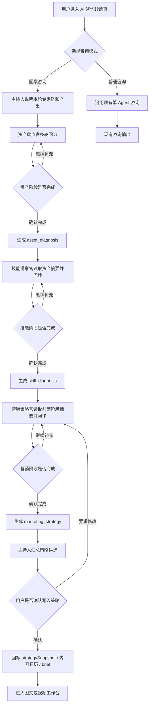
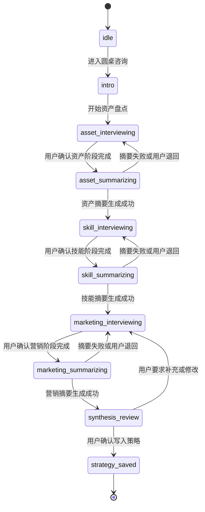
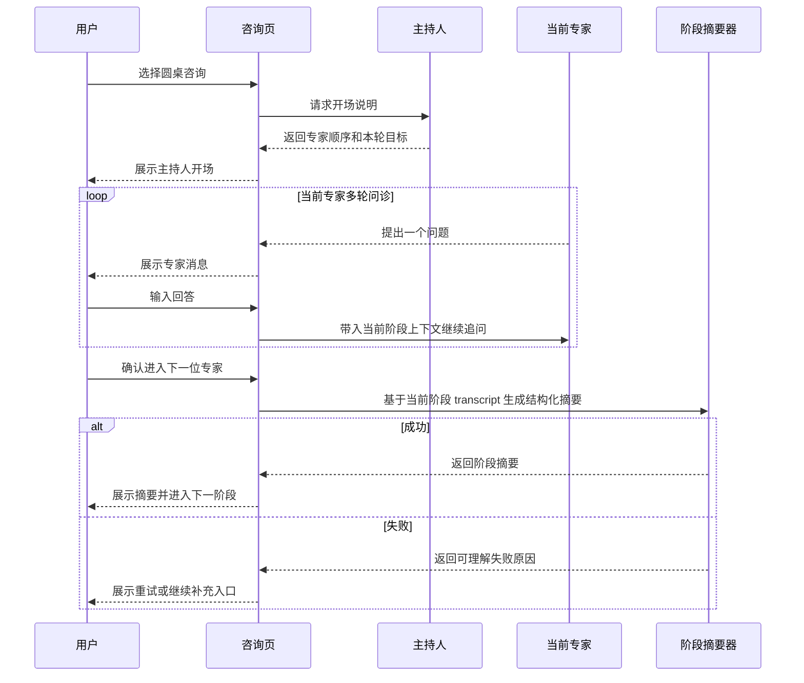

# 小红书抖音矩阵获客平台 V2.2 圆桌咨询多 Agent 访谈 PRD

状态：`评审草案`

创建日期：`2026-05-02`

相关参考：

- `docs/探索/2026-05-02-圆桌咨询多Agent开源参考借鉴清单.md`
- `references/open-source/圆桌访谈/`
- `docs/产品文档/V2.1-咨询驱动主链路体验补强-PRD.md`
- `docs/产品文档/V2.1-内容日历到图文视频工作台协作PRD.md`
- `docs/架构规范/2026-04-28-current-architecture.md`

## 1. 综述

### 1.1 项目背景与核心问题

当前商家端主链路已经确认为“咨询驱动”：

```text
商家资料
-> AI 咨询诊断
-> 策略快照 / 内容日历 / 图文 brief / 视频 brief
-> 图文工作台 / 视频工作台
-> 我的内容沉淀
```

但当前咨询体验仍然更接近“用户对一个主咨询 Agent 输入问题，Agent 统一追问和总结”。这个模式能跑通策略生成，却存在一个更深层的表达问题：

用户面对不同对象，会自然切换不同的表达姿态。

例如：

- 面对老师，会更容易说出困惑、学习经历和自我评估。
- 面对朋友，会更容易说出生活状态、限制、真实情绪和隐性资源。
- 面对更专业的营销顾问，会更容易进入业务目标、客群、转化和内容策略。

因此，一个单一主咨询 Agent 很容易把用户固定在“回答问题”的姿态里，导致信息采集不够立体。圆桌咨询的目标不是让多个 Agent 显得更热闹，而是通过不同专家身份、不同提问顺序、不同阶段产物，诱发用户说出不同层次的信息。

### 1.2 产品目标

圆桌咨询第一版目标：

1. 在现有咨询诊断页中新增“圆桌咨询”模式。
2. 支持固定顺序的多 Agent 专家链：
   - 主持人
   - 资产盘点官
   - 技能洞察官
   - 营销策略官
3. 每个专家阶段都允许多轮文字问答。
4. 每个专家阶段结束后，系统必须生成结构化阶段摘要。
5. 下一个专家只能读取必要阶段摘要和必要上下文，不默认读取全量 transcript。
6. 最终由主持人汇总圆桌结果，生成或更新现有 `strategySnapshot`、内容日历、图文 brief 和视频 brief。
7. TTS 只作为文字消息的播放/转换形式，不影响核心业务真相源。

### 1.3 非目标

第一版明确不做：

- 不做自由 swarm。
- 不做多个专家互相无限聊天。
- 不做专家之间横向随意发消息。
- 不做用户同时和多个专家并发对话。
- 不做真实多人在线圆桌。
- 不做 TTS / 语音流作为业务真相源。
- 不做长期记忆系统的完整落地。
- 不做通用 Agent 编排平台或可视化 Agent 编辑器。
- 不直接引入 LangGraph、CrewAI、OpenAI Agents SDK 等第三方运行时作为产品依赖。
- 不绕过现有咨询台和策略快照主链路。

### 1.4 核心业务流程 / 用户旅程地图

1. **阶段一：进入圆桌咨询**
   用户在 AI 咨询诊断页选择“圆桌咨询”，系统说明本轮访谈由哪些专家组成，以及最终会产出什么。

2. **阶段二：资产盘点**
   资产盘点官围绕用户生活状态、经历、资源、约束、可用素材和真实故事进行多轮问诊，产出 `asset_diagnosis`。

3. **阶段三：技能洞察**
   技能洞察官读取 `asset_diagnosis`，继续围绕用户能力、方法、可复制经验、可信证明和表达优势进行多轮问诊，产出 `skill_diagnosis`。

4. **阶段四：营销策略**
   营销策略官读取 `asset_diagnosis` 和 `skill_diagnosis`，继续围绕目标客群、内容定位、卖点、选题方向、转化动作进行问诊，产出 `marketing_strategy`。

5. **阶段五：主持人汇总**
   主持人把三个阶段的结果整合为最终策略候选，用户确认后回写现有策略快照，并生成内容日历、图文 brief、视频 brief。

6. **阶段六：进入内容生产**
   用户从圆桌结果进入图文工作台或视频工作台，沿用现有内容日历到工作台的上下文传递规则。

## 2. 用户操作流与状态机

### 2.1 用户操作流



### 2.2 圆桌会话状态机



### 2.3 关键时序



## 3. 页面与交互草图

### 3.1 咨询页入口

```text
+--------------------------------------------------------------------------------+
| AI 咨询诊断                                              [新开对话] [历史记录] |
+--------------------------------------------------------------------------------+
| 模式： [普通咨询] [圆桌咨询 Beta]                                               |
+--------------------------------------------------------------------------------+
|                                                                                |
|  ┌──────────────────────────────────────────────────────────────────────────┐  |
|  │ 圆桌咨询                                                               │  |
|  │ 让不同专家按顺序追问你：先盘点资产，再识别技能，最后沉淀营销策略。       │  |
|  │                                                                          │  |
|  │ 本轮专家：主持人 / 资产盘点官 / 技能洞察官 / 营销策略官                  │  |
|  │ 输出：个人资产摘要、技能优势摘要、营销策略、内容日历                     │  |
|  │                                                                          │  |
|  │                                      [开始圆桌咨询]                      │  |
|  └──────────────────────────────────────────────────────────────────────────┘  |
|                                                                                |
+--------------------------------------------------------------------------------+
```

### 3.2 圆桌访谈主界面

```text
+--------------------------------------------------------------------------------+
| AI 咨询诊断 / 圆桌咨询                                      阶段：资产盘点中 |
+-----------------------------+--------------------------------------------------+
| 专家链                      | 对话区                                           |
|                             |                                                  |
| ● 主持人                    | 主持人：这轮我们会先弄清楚你已经有什么，再看...  |
| ● 资产盘点官 当前           |                                                  |
| ○ 技能洞察官                | 资产盘点官：你现在最稳定能拿出来的资源是什么？   |
| ○ 营销策略官                |                                                  |
| ○ 汇总确认                  | 你：我其实有很多真实案例，只是没整理过...         |
|                             |                                                  |
| 阶段产物                    | 资产盘点官：这些案例大概来自哪三类人？            |
| ┌─────────────────────────┐ |                                                  |
| │ asset_diagnosis 待生成  │ |                                                  |
| └─────────────────────────┘ |                                                  |
|                             |                                                  |
| 参考上下文                  |                                                  |
| - 商家基础资料              |                                                  |
| - 当前咨询历史              |                                                  |
| - 商家知识库摘要            |                                                  |
+-----------------------------+--------------------------------------------------+
| 输入：说说你的真实情况...                                      [发送] [阶段完成] |
+--------------------------------------------------------------------------------+
```

### 3.3 阶段摘要确认

```text
+--------------------------------------------------------------------------------+
| 阶段完成：资产盘点官                                                            |
+--------------------------------------------------------------------------------+
| 资产诊断摘要                                                                    |
|                                                                                |
| 生活状态：                                                                      |
| - 用户当前主要时间被线下服务和客户沟通占用                                      |
|                                                                                |
| 可用资产：                                                                      |
| - 真实客户案例、线下服务过程、过往答疑经验                                      |
|                                                                                |
| 约束条件：                                                                      |
| - 不希望用焦虑型表达，不想夸大效果                                              |
|                                                                                |
| 下一阶段会带给技能洞察官的上下文：                                              |
| - 真实案例、服务经验、表达禁区                                                  |
|                                                                                |
| [返回继续补充]                                    [确认，进入技能洞察官]        |
+--------------------------------------------------------------------------------+
```

### 3.4 最终汇总确认

```text
+--------------------------------------------------------------------------------+
| 圆桌咨询汇总                                                                    |
+--------------------------------------------------------------------------------+
| 个人/商家定位                                                                   |
| - 用真实案例和稳健表达建立信任的本地服务型账号                                  |
|                                                                                |
| 核心卖点                                                                        |
| - 过程透明、经验可信、风险边界清楚                                              |
|                                                                                |
| 内容策略标签                                                                    |
| [真实案例] [避坑答疑] [过程展示] [轻转化]                                       |
|                                                                                |
| 内容日历预览                                                                    |
| ┌────────────┐ ┌────────────┐ ┌────────────┐                                  |
| │ 图文       │ │ 视频       │ │ 图文       │                                  |
| │ 案例拆解   │ │ 服务过程   │ │ 常见误区   │                                  |
| └────────────┘ └────────────┘ └────────────┘                                  |
|                                                                                |
| [返回营销策略官补充]       [保存为策略快照]       [进入图文] [进入视频]          |
+--------------------------------------------------------------------------------+
```

## 4. 开源参考与借鉴边界

本轮已下载 18 个参考仓库到：

```text
references/open-source/圆桌访谈/
```

这些仓库仅作为本地源码参考，不提交远端。

### 4.1 主要参考

| 参考项目 | 本地路径 | 借鉴内容 |
| --- | --- | --- |
| OpenAI Agents SDK JS | `references/open-source/圆桌访谈/openai__openai-agents-js/` | 借鉴 `Agents / Handoffs / Sessions / Tracing / Human in the loop` 的概念命名，重点参考 `examples/docs/agents/agentWithHandoffs.ts`、`examples/docs/handoffs/`、`examples/docs/context/localContext.ts`。 |
| OpenAI Agents SDK Python | `references/open-source/圆桌访谈/openai__openai-agents-python/` | 补充理解后端 run、session、handoff、tracing 的边界。 |
| LangGraph | `references/open-source/圆桌访谈/langchain-ai__langgraph/` | 借鉴状态图思想，把圆桌咨询设计为 `asset -> skill -> marketing -> synthesis` 的有限状态流程。 |
| LangGraph Supervisor | `references/open-source/圆桌访谈/langchain-ai__langgraph-supervisor-py/` | 借鉴主持人管理多个 specialized agents，重点参考 `langgraph_supervisor/supervisor.py` 中 `create_supervisor`、`output_mode`、handoff tool 和 message history 控制。 |
| LangGraph Swarm | `references/open-source/圆桌访谈/langchain-ai__langgraph-swarm-py/` | 借鉴 `active_agent` 和 handoff tool 的状态设计，作为后续动态专家切换参考。 |
| CrewAI | `references/open-source/圆桌访谈/crewAIInc__crewAI/` | 重点借鉴 `docs/en/learn/sequential-process.mdx` 的顺序任务、阶段产物和 `expected_output` 思路；`hierarchical-process.mdx` 作为主持人模式参考。 |
| Langroid | `references/open-source/圆桌访谈/langroid__langroid/` | 借鉴 Agent/Task 多轮消息交换，用于理解“专家与用户持续问答”建模。 |
| Mahilo | `references/open-source/圆桌访谈/wjayesh__mahilo/` | 借鉴多个 Agent 都能和人交互、共享最近上下文、`can_contact` 限制。 |
| Agency Swarm | `references/open-source/圆桌访谈/VRSEN__agency-swarm/` | 借鉴 directional `communication_flows` 和 thread persistence 思路。 |
| ChatDev | `references/open-source/圆桌访谈/OpenBMB__ChatDev/` | 借鉴 ChatChain、Phase、Role、YAML workflow 的阶段化配置。 |
| Oracle Agent Spec | `references/open-source/圆桌访谈/oracle__agent-spec/` | 借鉴声明式 Agent/Flow 配置思想。 |
| Loom Agent | `references/open-source/圆桌访谈/kongusen__loom-agent/` | 借鉴 session/run/context partitions/memory/governance 的命名和边界。 |
| Teradata Loom | `references/open-source/圆桌访谈/teradata-labs__loom/` | 借鉴 workflow pattern、shared memory、session memory、graph memory。 |
| mcp-agent | `references/open-source/圆桌访谈/lastmile-ai__mcp-agent/` | 借鉴 simple workflow patterns、router、orchestrator、human input、durable agents。 |
| Letta | `references/open-source/圆桌访谈/letta-ai__letta/` | 作为后续长期记忆层参考，不进入第一版 P0。 |
| Mem0 | `references/open-source/圆桌访谈/mem0ai__mem0/` | 作为 user/session/agent 多层记忆参考，不进入第一版 P0。 |
| Mastra | `references/open-source/圆桌访谈/mastra-ai__mastra/` | 作为 TypeScript agent app 工程组织参考。 |
| AG2 | `references/open-source/圆桌访谈/ag2ai__ag2/` | 作为 AutoGen 系对话 Agent/HITL 概念参考。 |

### 4.2 明确不借鉴

- 不照搬任何开源项目源码到正式产品代码。
- 不直接把第三方 agent runtime 作为第一版依赖。
- 不采用自由 swarm 或专家自治协商。
- 不允许专家之间横向随意互发消息。
- 不把全量历史消息无差别塞给下一个专家。
- 不把长期记忆、共享内存、图记忆作为第一版必要能力。
- 不把 TTS 音频当作业务真相源。

## 5. 用户故事详述

### 阶段一：进入圆桌咨询

#### US-01：作为商家，我希望在咨询页选择圆桌咨询模式，以便获得更立体的多专家访谈体验

**价值陈述**

- 作为商家或个人 IP 经营者
- 我希望在 AI 咨询诊断页选择“圆桌咨询”
- 以便系统不再只用一个主咨询身份追问我，而是按不同专家身份逐步挖掘我的资产、技能和营销策略

**业务规则与逻辑**

1. 前置条件：
   - 用户已登录。
   - 用户有可用商家档案。
   - 咨询页可正常创建或读取咨询会话。
2. 页面入口：
   - 在现有 AI 咨询诊断页中提供模式切换。
   - 默认仍为普通咨询。
   - 圆桌咨询入口文案需要说明“多位专家按顺序访谈，不是多人群聊”。
3. 创建规则：
   - 用户点击“开始圆桌咨询”后，系统创建或标记当前咨询会话为 `roundtable` 模式。
   - 系统初始化专家顺序：主持人、资产盘点官、技能洞察官、营销策略官、主持人汇总。
   - 系统进入 `intro` 状态，由主持人输出开场说明。
4. 异常处理：
   - 未登录时跳转登录，不显示技术错误。
   - 商家档案缺失时，引导先补充商家设置。
   - 初始化失败时保留普通咨询入口，并提示用户稍后重试。

**验收标准**

- 场景 1：入口展示
  - GIVEN 用户已登录并进入 AI 咨询诊断页
  - WHEN 页面加载完成
  - THEN 用户能看到普通咨询和圆桌咨询两个模式入口

- 场景 2：开始圆桌咨询
  - GIVEN 用户选择圆桌咨询
  - WHEN 用户点击“开始圆桌咨询”
  - THEN 页面展示主持人开场，并展示专家链进度

- 场景 3：未登录
  - GIVEN 用户登录状态失效
  - WHEN 用户点击“开始圆桌咨询”
  - THEN 系统跳转登录或展示登录引导，不显示接口异常堆栈

**页面布局线框图**

```text
+--------------------------------------------------------------------------------+
| AI 咨询诊断                                              [新开对话] [历史记录] |
+--------------------------------------------------------------------------------+
| 模式： [普通咨询] [圆桌咨询 Beta]                                               |
+--------------------------------------------------------------------------------+
|  圆桌咨询说明                                                                  |
|  ┌──────────────────────────────────────────────────────────────────────────┐  |
|  │ 先由资产盘点官了解你的生活、经历、资源和约束；                           │  |
|  │ 再由技能洞察官识别你的能力与可信优势；                                    │  |
|  │ 最后由营销策略官把这些信息转成内容定位和选题。                            │  |
|  │                                                        [开始圆桌咨询]     │  |
|  └──────────────────────────────────────────────────────────────────────────┘  |
+--------------------------------------------------------------------------------+
```

### 阶段二：资产盘点

#### US-02：作为商家，我希望先由资产盘点官连续追问我的生活、资源和经历，以便系统获得真实的内容素材

**价值陈述**

- 作为商家或个人 IP 经营者
- 我希望先和资产盘点官对话
- 以便先把已有资产、真实故事、生活约束和可用素材说清楚，而不是一上来就被要求做营销定位

**业务规则与逻辑**

1. 资产盘点官职责：
   - 询问用户当前生活状态、经营状态、时间约束、线下场景。
   - 询问过往经历、客户故事、案例、常见问题、可用素材。
   - 识别用户不愿意使用的表达方式和风险边界。
2. 阶段推进：
   - 资产盘点官每次只问 1 个主问题，必要时带 1-2 个提示。
   - 用户可以多轮回答。
   - 用户可以点击“阶段完成”。
   - 系统也可以在信息足够时提示“可以进入下一位专家”。
3. 阶段产物：
   - 进入下一阶段前必须生成 `asset_diagnosis`。
   - `asset_diagnosis` 至少包含：
     - `life_context`
     - `available_assets`
     - `real_stories`
     - `material_clues`
     - `constraints`
     - `risk_boundaries`
     - `handoff_summary`
4. 异常处理：
   - 如果用户回答太短，系统继续追问，不直接总结。
   - 如果摘要生成失败，用户可以重试生成摘要或继续补充。
   - 如果用户跳过资产阶段，系统记录 `skipped_by_user`，但后续专家必须提示上下文不足。

**验收标准**

- 场景 1：资产盘点问诊
  - GIVEN 圆桌咨询处于 `asset_interviewing`
  - WHEN 资产盘点官发言
  - THEN 问题应围绕用户资源、经历、故事、素材或约束，不应直接进入投放或营销方案

- 场景 2：阶段摘要
  - GIVEN 用户点击“阶段完成”
  - WHEN 系统生成阶段摘要
  - THEN 页面展示 `asset_diagnosis`，并允许用户确认或返回补充

- 场景 3：上下文不足
  - GIVEN 用户只输入极短回答
  - WHEN 用户点击“阶段完成”
  - THEN 系统提示信息不足，并给出建议补充的问题

**页面布局线框图**

```text
+-----------------------------+--------------------------------------------------+
| 专家链                      | 资产盘点官：你现在最稳定能拿出来的资源是什么？ |
| ● 主持人                    |                                                  |
| ● 资产盘点官 当前           | 用户：我有很多真实案例，但是没有系统整理。       |
| ○ 技能洞察官                |                                                  |
| ○ 营销策略官                | 资产盘点官：这些案例主要来自哪几类客户？         |
| ○ 汇总确认                  |                                                  |
|                             |                                                  |
| 阶段产物                    |                                                  |
| asset_diagnosis 待生成      |                                                  |
+-----------------------------+--------------------------------------------------+
| 输入回答...                                              [发送] [阶段完成]      |
+--------------------------------------------------------------------------------+
```

### 阶段三：技能洞察

#### US-03：作为商家，我希望技能洞察官读取资产摘要后继续追问我的能力和优势，以便把经历转成可信的表达资产

**价值陈述**

- 作为商家或个人 IP 经营者
- 我希望技能洞察官在理解我的生活资产和真实故事后继续追问
- 以便系统能识别我真正可复制、可表达、可被用户信任的技能优势

**业务规则与逻辑**

1. 输入上下文：
   - 技能洞察官必须读取 `asset_diagnosis.handoff_summary`。
   - 可读取商家基础资料、商家知识库摘要、当前阶段消息。
   - 默认不读取资产阶段全量 transcript，除非摘要不足或用户要求回看。
2. 技能洞察官职责：
   - 识别用户擅长解决什么问题。
   - 追问用户有哪些方法、判断标准、处理流程。
   - 识别可信证明，例如案例、反馈、资质、经验年限、复购。
   - 把“经历”转成“可表达的能力模块”。
3. 阶段产物：
   - `skill_diagnosis` 至少包含：
     - `skill_clusters`
     - `repeatable_methods`
     - `proof_points`
     - `differentiators`
     - `content_voice_clues`
     - `handoff_summary`
4. 异常处理：
   - 如果 `asset_diagnosis` 缺失，技能洞察官应先说明信息不足，并用 1-2 个问题补齐关键资产。
   - 如果用户否认摘要中的内容，系统应允许修正资产摘要。

**验收标准**

- 场景 1：读取上一阶段摘要
  - GIVEN 资产阶段已完成
  - WHEN 进入技能洞察阶段
  - THEN 技能洞察官的第一轮问题应引用资产摘要中的关键信息

- 场景 2：生成技能摘要
  - GIVEN 用户完成技能问诊
  - WHEN 用户确认进入下一位专家
  - THEN 系统生成 `skill_diagnosis`

- 场景 3：修正上阶段信息
  - GIVEN 用户认为资产摘要不准确
  - WHEN 用户选择返回修改
  - THEN 系统回到资产摘要确认态，不直接进入营销阶段

**页面布局线框图**

```text
+-----------------------------+--------------------------------------------------+
| 专家链                      | 技能洞察官：你刚才提到很多真实案例，我想进一步看 |
| ● 主持人                    | 这些案例背后可复用的方法。                       |
| ✓ 资产盘点官 已完成         |                                                  |
| ● 技能洞察官 当前           | 上阶段带入：真实案例、服务经验、表达禁区          |
| ○ 营销策略官                |                                                  |
| ○ 汇总确认                  | 用户：我通常会先判断客户是不是适合...             |
|                             |                                                  |
| 阶段产物                    |                                                  |
| asset_diagnosis 已生成      |                                                  |
| skill_diagnosis 待生成      |                                                  |
+-----------------------------+--------------------------------------------------+
| 输入回答...                                              [发送] [阶段完成]      |
+--------------------------------------------------------------------------------+
```

### 阶段四：营销策略

#### US-04：作为商家，我希望营销策略官读取前两位专家的诊断后再做营销判断，以便内容定位基于真实资产和能力

**价值陈述**

- 作为商家或个人 IP 经营者
- 我希望营销策略官不是凭空给营销建议
- 以便它能基于我的真实资产和技能优势，沉淀更可信、更可执行的内容方向

**业务规则与逻辑**

1. 输入上下文：
   - 必须读取 `asset_diagnosis.handoff_summary`。
   - 必须读取 `skill_diagnosis.handoff_summary`。
   - 可读取商家基础资料、平台方法论、商家知识库摘要。
   - 不默认读取全量 transcript。
2. 营销策略官职责：
   - 识别目标用户与高价值场景。
   - 把技能优势转成卖点、内容栏目和选题方向。
   - 明确口吻、禁区、CTA、转化动作。
   - 生成适合小红书/抖音内容生产的策略标签。
3. 阶段产物：
   - `marketing_strategy` 至少包含：
     - `positioning`
     - `target_audiences`
     - `core_selling_points`
     - `content_pillars`
     - `strategy_tags`
     - `cta_suggestions`
     - `risk_boundaries`
     - `content_calendar_seed`
4. 异常处理：
   - 如果前两阶段摘要不足，营销策略官必须先提示“策略置信度不足”。
   - 如果用户要求直接生成内容，系统可以提示先完成策略汇总，也可以允许“低置信度继续”但必须记录。

**验收标准**

- 场景 1：营销策略基于前文
  - GIVEN 资产和技能阶段均已完成
  - WHEN 营销策略官提问或总结
  - THEN 内容必须引用前两阶段摘要，不应凭空生成新事实

- 场景 2：生成营销策略
  - GIVEN 用户完成营销阶段
  - WHEN 用户点击“阶段完成”
  - THEN 系统展示 `marketing_strategy`

- 场景 3：风险边界
  - GIVEN 用户所在行业存在敏感承诺风险
  - WHEN 生成营销策略
  - THEN 策略中必须保留风险边界和禁止表达

**页面布局线框图**

```text
+-----------------------------+--------------------------------------------------+
| 专家链                      | 营销策略官：我会把前两位专家的结论转成内容定位。 |
| ✓ 主持人                    |                                                  |
| ✓ 资产盘点官 已完成         | 带入摘要：真实案例、服务经验、表达禁区            |
| ✓ 技能洞察官 已完成         | 带入摘要：判断方法、可信证明、差异化能力          |
| ● 营销策略官 当前           |                                                  |
| ○ 汇总确认                  | 营销策略官：你更想先拿信任建立，还是咨询转化？    |
+-----------------------------+--------------------------------------------------+
| 输入回答...                                              [发送] [阶段完成]      |
+--------------------------------------------------------------------------------+
```

### 阶段五：主持人汇总与策略回写

#### US-05：作为商家，我希望主持人把圆桌结果汇总成可确认的策略候选，以便我决定是否写入现有策略快照

**价值陈述**

- 作为商家或个人 IP 经营者
- 我希望圆桌咨询结束后看到一份完整策略候选
- 以便我确认后再进入图文和视频工作台，不让系统悄悄覆盖我的策略

**业务规则与逻辑**

1. 汇总内容：
   - 主持人读取三个阶段产物。
   - 主持人生成策略候选，而不是直接覆盖策略快照。
   - 策略候选包含：
     - `positioning`
     - `coreSellingPoints`
     - `targetAudiences`
     - `keyScenes`
     - `currentSuggestion`
     - `strategyTags`
     - `contentCalendarDraft`
     - `articleBrief`
     - `videoBrief`
2. 用户确认：
   - 用户可以保存为策略快照。
   - 用户可以返回营销策略官补充。
   - 用户可以暂存本次圆桌结果，不写入当前策略。
3. 写入边界：
   - 只有用户确认后，才允许回写 `merchant_strategy_assets` 或当前策略真相源。
   - 回写时必须记录来源为 `roundtable_consultation`。
   - 回写时必须保留三个阶段摘要，方便复盘。
4. 异常处理：
   - 策略生成失败时，保留阶段摘要，不丢失用户输入。
   - 回写失败时，提示“策略未保存”，允许重试。

**验收标准**

- 场景 1：展示策略候选
  - GIVEN 三个专家阶段已完成
  - WHEN 主持人汇总完成
  - THEN 页面展示策略候选、内容日历预览、图文 brief 和视频 brief

- 场景 2：确认写入
  - GIVEN 用户确认策略候选
  - WHEN 用户点击“保存为策略快照”
  - THEN 系统写入现有策略快照，并记录来源和阶段摘要

- 场景 3：回写失败
  - GIVEN 用户点击保存
  - WHEN 系统保存失败
  - THEN 页面提示保存失败，并保留本次圆桌汇总

**页面布局线框图**

```text
+--------------------------------------------------------------------------------+
| 圆桌咨询汇总                                                                    |
+--------------------------------------------------------------------------------+
| 定位：真实案例和稳健表达驱动的本地服务型账号                                    |
| 卖点：过程透明 / 判断标准清楚 / 风险边界明确                                    |
| 人群：谨慎决策型客户 / 有明确问题但缺少判断标准的人                             |
| 策略标签：[案例拆解] [服务过程] [避坑答疑] [轻转化]                             |
|                                                                                |
| 内容日历预览                                                                    |
| ┌──────────────┐ ┌──────────────┐ ┌──────────────┐                            |
| │ 图文：案例拆解 │ │ 视频：过程展示 │ │ 图文：误区答疑 │                            |
| └──────────────┘ └──────────────┘ └──────────────┘                            |
|                                                                                |
| [返回营销策略官补充]       [暂存不写入]       [保存为策略快照]                  |
+--------------------------------------------------------------------------------+
```

### 阶段六：历史恢复与文本/TTS 边界

#### US-06：作为商家，我希望圆桌咨询可以恢复历史阶段，并且文字始终是业务真相源，以便我刷新页面或使用语音播放时不丢上下文

**价值陈述**

- 作为商家或个人 IP 经营者
- 我希望圆桌咨询刷新后仍能恢复当前专家阶段和历史摘要
- 以便我不用担心长访谈中断，同时系统不会因为 TTS 或语音输入影响核心逻辑

**业务规则与逻辑**

1. 历史恢复：
   - 页面刷新后应恢复当前 `current_phase`、专家链进度、阶段消息和已生成阶段摘要。
   - 历史记录里应能识别该会话为圆桌咨询。
2. 文本真相源：
   - 用户输入的文本或语音转写文本进入 `content`。
   - TTS 生成的音频只作为 `tts_asset_id` 或播放状态，不参与策略生成。
   - 如果语音转写和用户修正文案不一致，以用户最终确认文本为准。
3. TTS 第一版边界：
   - 可提供专家消息“播放”按钮。
   - 不要求实时语音互聊。
   - 不要求保存每段音频作为长期资产。
4. 异常处理：
   - TTS 失败不影响文字消息展示和阶段推进。
   - 语音转写失败时提示重新输入或改用文字。

**验收标准**

- 场景 1：刷新恢复
  - GIVEN 用户处于技能洞察阶段
  - WHEN 刷新页面
  - THEN 页面恢复到技能洞察阶段，并展示资产摘要和当前阶段消息

- 场景 2：TTS 失败
  - GIVEN 用户点击专家消息播放
  - WHEN TTS 生成失败
  - THEN 页面提示播放失败，但文字内容仍可阅读，阶段操作不受影响

- 场景 3：语音转写
  - GIVEN 用户使用语音输入
  - WHEN 系统完成转写
  - THEN 输入框展示转写文本，用户确认发送后才进入咨询消息

**页面布局线框图**

```text
+--------------------------------------------------------------------------------+
| 历史记录                                                                        |
+--------------------------------------------------------------------------------+
| 圆桌咨询：本地服务账号定位盘点                             技能洞察中          |
| 最近摘要：已完成资产盘点，正在识别可复制方法和可信证明                         |
| [继续] [查看阶段摘要] [删除]                                                    |
+--------------------------------------------------------------------------------+
```

## 6. 数据与架构约定

### 6.1 第一版数据落点建议

第一版可以复用现有咨询相关表，降低迁移复杂度：

```text
consultation_sessions
  title
  current_stage
  strategy_snapshot
  summary_text

consultation_messages
  role
  content
  stage_label
  visible_summary

consultation_events
  event_type
  stage_label
  payload
```

建议新增或约定 `payload / visible_summary` 中的结构：

```text
roundtable:
  mode: roundtable
  current_phase: intro | asset | skill | marketing | synthesis
  current_agent_role: moderator | asset_manager | skill_mapper | marketing_strategist
  phase_outputs:
    asset_diagnosis
    skill_diagnosis
    marketing_strategy
  handoff_trace
```

### 6.2 独立表升级方向

如果第一版实现时发现现有 JSON 结构过重，建议新增独立表：

```text
roundtable_sessions
  id
  consultation_session_id
  merchant_id
  status
  current_phase
  created_at
  updated_at

roundtable_phases
  id
  roundtable_session_id
  phase_key
  agent_role
  status
  input_context
  output_summary
  started_at
  completed_at

roundtable_handoffs
  id
  roundtable_session_id
  from_phase
  to_phase
  handoff_summary
  included_context_keys
  excluded_context_reason
  created_at
```

### 6.3 阶段枚举

```text
intro
asset_interviewing
asset_summarizing
skill_interviewing
skill_summarizing
marketing_interviewing
marketing_summarizing
synthesis_review
strategy_saved
failed
archived
```

### 6.4 专家角色枚举

```text
moderator
asset_manager
skill_mapper
marketing_strategist
```

### 6.5 上下文交接规则

1. 下阶段默认读取上阶段 `handoff_summary`。
2. 下阶段可读取上阶段结构化字段，但不默认读取全量 transcript。
3. 如果摘要不足，系统可以临时检索上阶段消息，但必须记录 `included_context_keys`。
4. 专家之间默认不能横向互聊。
5. 主持人是唯一跨阶段汇总角色。
6. 最终策略回写必须经过用户确认。

## 7. 提示词与专家职责边界

### 7.1 主持人

职责：

- 解释圆桌咨询机制。
- 控制专家顺序。
- 在阶段切换时说明当前进度。
- 最终汇总三个专家的结构化产物。

不得：

- 替代专家进行深度问诊。
- 未经用户确认直接覆盖策略快照。

### 7.2 资产盘点官

职责：

- 挖掘生活状态、经历、资源、素材、约束。
- 把用户真实故事整理成可用于内容生产的资产。

不得：

- 直接给营销定位结论。
- 编造用户没有说过的经历或案例。

### 7.3 技能洞察官

职责：

- 把经历转成技能、方法、可信证明和差异化优势。

不得：

- 把未经确认的案例写成硬性成果承诺。
- 跳过资产摘要凭空判断用户优势。

### 7.4 营销策略官

职责：

- 把资产和技能转成定位、客群、卖点、选题、CTA。

不得：

- 夸大医疗、收益、效果、成功率等不可承诺内容。
- 无视用户的口吻偏好和表达禁区。

## 8. 权限、风控与合规

1. 圆桌咨询必须遵守现有咨询台事实边界：
   - 不编造商家事实。
   - 不编造用户经历。
   - 不生成不可承诺内容。
   - 不把对标素材事实当成本商家事实。
2. 敏感行业需要保留风险边界。
3. 用户可随时删除圆桌咨询历史。
4. 如果阶段摘要用于后续内容生成，必须作为 input snapshot 的一部分保留。
5. 圆桌咨询不触发真实发布，不涉及平台账号授权。

## 9. 与现有模块关系

### 9.1 咨询诊断页

圆桌咨询是咨询诊断页的新模式，不是新导航入口。

### 9.2 商家知识库

圆桌咨询可读取商家知识库摘要，但不把知识库变成必填项。

### 9.3 内容日历

主持人最终汇总后生成的内容日历继续沿用现有 `ContentCalendarItemDto`，后续可扩展：

```text
targetPlatform
contentGoal
calendarDate
ctaHint
sourceBriefType
```

### 9.4 图文 / 视频工作台

从圆桌咨询进入工作台时，仍然沿用当前 V2.1 约定：

```text
/dashboard/article?source=consultation_calendar&sessionId=...&calendarItemId=...
/dashboard/video?source=consultation_calendar&sessionId=...&calendarItemId=...
```

生成时必须把圆桌阶段摘要固化到 `input_snapshot`。

## 10. 全局验收标准

1. 用户能在咨询诊断页进入圆桌咨询。
2. 圆桌咨询必须按固定顺序推进：资产盘点官 -> 技能洞察官 -> 营销策略官 -> 主持人汇总。
3. 每个专家阶段都能进行多轮文字问答。
4. 每个专家阶段完成后必须生成结构化摘要。
5. 下一个专家能读取上一个专家摘要，并在问题中体现上下文继承。
6. 用户刷新页面后，能恢复当前专家阶段和已生成摘要。
7. 最终策略必须由用户确认后才能回写现有策略快照。
8. TTS 播放失败不影响文字咨询和策略生成。
9. 未登录、商家资料缺失、阶段摘要失败、策略保存失败都必须有用户可理解提示。
10. 圆桌咨询结果可以进入图文和视频工作台，并保留 input snapshot。

## 11. 待确认问题

以下问题不阻塞 PRD 初稿，但进入开发前需要确认：

1. 第一版是否只支持一套固定专家链：资产盘点官、技能洞察官、营销策略官、主持人。
2. 每个专家阶段结束方式是“用户点击阶段完成”为主，还是“系统判断足够后自动建议”为主。
3. 阶段摘要是否允许用户手动编辑后再交给下一位专家。
4. 圆桌汇总是否直接回写 `merchant_strategy_assets`，还是先生成 `strategy_candidate`。
5. 历史记录里圆桌咨询是显示成一条咨询会话，还是按专家阶段展开。
6. 第一版是否需要做 TTS 播放按钮，还是先只保留文字，TTS 后置。

## 12. 建议开发顺序

1. 咨询页新增圆桌咨询入口和模式状态。
2. 后端新增圆桌阶段状态和专家角色配置。
3. 实现资产盘点官阶段和 `asset_diagnosis`。
4. 实现技能洞察官阶段和 `skill_diagnosis`。
5. 实现营销策略官阶段和 `marketing_strategy`。
6. 实现主持人汇总和策略候选确认。
7. 接入现有 `strategySnapshot`、内容日历、图文 brief、视频 brief。
8. 补齐历史恢复和异常状态。
9. 再评估 TTS 播放能力。
