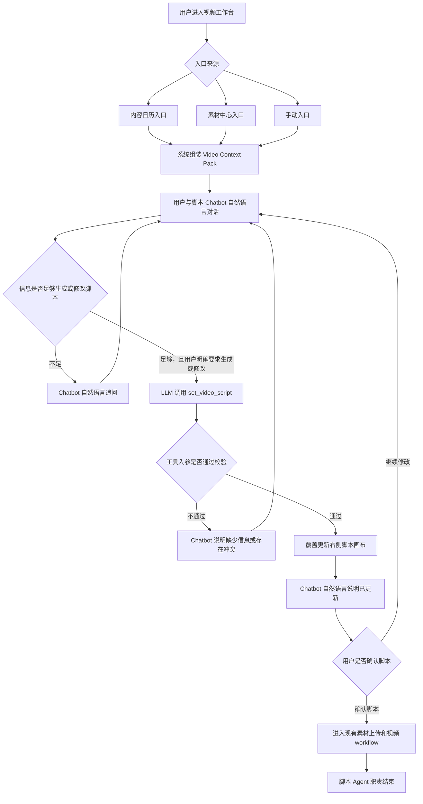
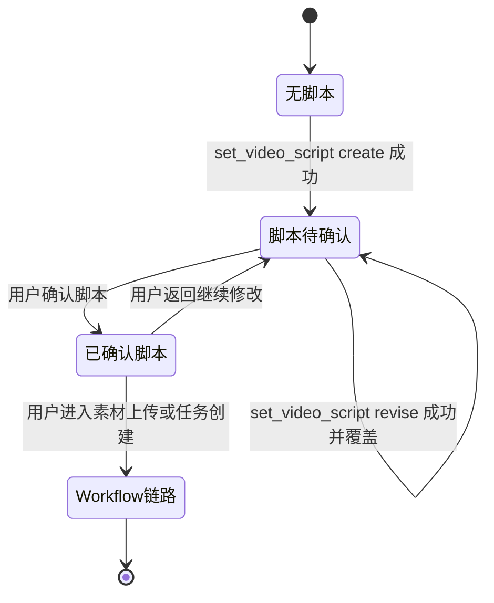

# 产品需求文档：视频工作台脚本协作 Agent 重构 - V2.2

## 1. 综述

### 1.1 文档定位

本 PRD 聚焦视频工作台中的「脚本协作 Agent / Chatbot」重构。

它不替代已有的 `V2.1 内容日历到图文/视频工作台协作 PRD`，而是在原有视频工作台和 worker 链路基础上，明确脚本 Agent 的产品边界、上下文组装方式、自然语言聊天体验、工具调用契约和脚本画布更新规则。

本 PRD 不重复定义页面布局草稿。视频工作台现有页面结构继续沿用，具体 UI 以当前实现为基础，只调整聊天、脚本生成、脚本修改和工具调用行为。

### 1.2 背景与核心问题

当前视频脚本生成链路更像一次性结构化生成接口：模型每轮被要求返回固定 JSON，并且提示词中存在 `modify_script`、`tool_failed` 等伪工具语义。但实际 runtime 没有真实工具调用循环，导致模型可能在某些用户上下文下返回 `tool_failed`，前端表现为“脚本制作 tool 调用失败”。

产品侧希望视频工作台更符合真实使用方式：

- 用户先从咨询策略、内容日历或素材中心进入视频工作台。
- 用户和脚本 Chatbot 自然语言沟通脚本诉求。
- 当信息足够且用户明确要生成或修改脚本时，模型调用一个真实工具，把脚本写入右侧脚本画布。
- 脚本确认后，再进入现有素材上传和视频成片 workflow。

因此，核心问题不是单独修复某条报错文案，而是把视频脚本 Agent 从“每轮 JSON 生成器”改成“自然语言脚本协作 Chatbot + 一个脚本写入工具”。

### 1.3 目标

1. 视频工作台 Chatbot 默认输出自然语言回复，不再每轮强制输出 JSON。
2. 当用户明确要求生成或修改脚本，且上下文足够时，模型调用唯一工具 `set_video_script`。
3. `set_video_script` 负责覆盖更新当前脚本画布，不创建视频任务，不触发视频 workflow。
4. 脚本修改默认覆盖当前脚本，不做显性版本系统。
5. 脚本 Agent 不参与成片 workflow、worker、workflow env 或视频渲染参数。
6. 底层大模型配置继续复用平台统一 LLM runtime，视频工作台只新增自己的业务 Agent runtime。

### 1.4 非目标

本 PRD 不做以下事项：

- 不重构视频成片 workflow。
- 不改 worker 执行链路。
- 不新增复杂脚本版本管理系统。
- 不实现“恢复上一版”工具能力。
- 不把 workflow env 暴露给脚本 Agent。
- 不要求修改现有视频工作台整体页面布局。
- 不让模型每轮都输出标准 JSON。

## 2. 核心用户旅程

### 2.1 阶段地图

1. **进入视频工作台**：用户从内容日历、素材中心或手动入口进入视频工作台，系统组装视频上下文。
2. **自然语言聊脚本**：用户和脚本 Chatbot 对话，补充脚本方向、风格、素材和修改诉求。
3. **生成或修改脚本**：当信息足够且用户明确要求时，LLM 调用 `set_video_script`。
4. **覆盖更新脚本画布**：工具成功后，右侧当前脚本被覆盖为最新脚本。
5. **确认脚本后移交 workflow**：用户确认脚本后，进入现有素材上传、任务创建和视频 workflow 链路。

### 2.2 用户操作流



### 2.3 脚本状态机



## 3. 用户故事

### US-01：作为商家，我希望进入视频工作台时系统自动带入相关上下文，以便脚本 Chatbot 能围绕当前内容方向协作

#### 价值陈述

作为商家，我希望从内容日历、素材中心或手动入口进入视频工作台时，系统自动带入当前策略、日历卡片、素材摘要和当前脚本状态，以便我不用重复解释背景。

#### 业务规则与逻辑

前置条件：

- 用户已登录并拥有当前商家空间访问权限。
- 如果从内容日历进入，应具备 `sessionId`、`calendarItemId`、`strategyTag` 等必要索引。
- 如果从素材中心进入，应具备 `materialId` 或 `materialReferenceId`。

入口规则：

- 内容日历入口携带咨询会话、日历卡片和策略标签。
- 素材中心入口携带素材或素材引用。
- 组合入口允许同时携带日历上下文和素材上下文。
- 手动入口至少读取当前商家和可用咨询上下文。

`Video Context Pack` 至少包含：

- `entryContext`：入口来源、内容日历卡片、策略标签。
- `confirmedStrategy`：咨询台已确认的定位、目标受众、产品或服务信息、优势、口吻、CTA、禁用表达。
- `workspaceState`：当前脚本是否为空、当前脚本文本、脚本状态。
- `materialContext`：可用素材、可拍摄场景、素材限制。

异常处理：

- 内容日历入口缺少必要参数时，页面展示入口信息不完整的提示。
- 找不到对应日历卡片时，提示用户回到咨询页重新进入。
- 没有已确认咨询策略时，Chatbot 可自然语言提示先回咨询台补齐。
- 素材缺失不阻断进入视频工作台，只影响脚本镜头和素材建议。

#### 验收标准

- **场景 1：内容日历入口成功带入上下文**
  - GIVEN 用户从内容日历点击进入视频工作台
  - WHEN 页面加载完成
  - THEN Chatbot 可读取该日历卡片标题、摘要和策略标签

- **场景 2：素材中心入口成功带入素材摘要**
  - GIVEN 用户从素材中心进入视频工作台
  - WHEN 页面加载完成
  - THEN Chatbot 可读取素材摘要，并在脚本建议中参考素材条件

- **场景 3：刷新页面后上下文不丢失**
  - GIVEN 用户已经进入视频工作台
  - WHEN 用户刷新页面
  - THEN 系统仍能恢复入口上下文和当前脚本状态

- **场景 4：入口参数缺失**
  - GIVEN 用户通过不完整内容日历链接进入
  - WHEN 系统无法解析必要上下文
  - THEN 页面展示可理解提示，不直接暴露 500 错误

### US-02：作为商家，我希望脚本 Chatbot 用自然语言和我沟通，以便我能像聊天一样确认脚本诉求

#### 价值陈述

作为商家，我希望视频工作台 Chatbot 像正常助手一样用自然语言回复，而不是每轮输出 JSON，以便我能轻松表达脚本方向、风格、素材和修改意见。

#### 业务规则与逻辑

Chatbot 默认行为：

- 使用自然语言回复用户。
- 信息不足时，只追问最关键的 1 到 2 个问题。
- 用户只是补充偏好或素材时，不急着生成脚本。
- 用户明确要求生成或修改脚本且上下文足够时，才进入工具调用。

Chatbot 边界：

- 不输出 JSON、schema 或工具参数给用户。
- 不使用 `tool_failed` 作为用户可见状态。
- 不调用视频成片 workflow。
- 不声称已经生成视频。
- 不暴露 workflow env 或 worker 参数。

咨询策略保护：

- 用户要求修改业务定位、目标用户、核心卖点、CTA、禁用表达等咨询台已确认事实时，Chatbot 不直接覆盖。
- Chatbot 应提示这些属于咨询策略，需要回咨询台确认后再继续。

#### 验收标准

- **场景 1：普通聊天自然语言回复**
  - GIVEN 用户在视频工作台输入脚本偏好
  - WHEN Chatbot 回复
  - THEN 用户看到自然语言回复，而不是 JSON

- **场景 2：信息不足时追问**
  - GIVEN 当前信息不足以生成脚本
  - WHEN 用户要求生成脚本
  - THEN Chatbot 提出最少必要问题，不调用工具

- **场景 3：用户补充素材信息**
  - GIVEN 用户告诉 Chatbot 自己有门店外景和顾问出镜素材
  - WHEN 后续生成脚本
  - THEN 脚本镜头建议能参考这些素材条件

- **场景 4：用户要求修改咨询事实**
  - GIVEN 用户要求改变已确认的定位、客群或核心卖点
  - WHEN Chatbot 判断该要求与咨询台事实冲突
  - THEN Chatbot 提示用户回咨询台确认，不直接改写脚本事实基础

### US-03：作为商家，我希望在信息足够时让 Chatbot 生成或修改脚本，以便当前脚本画布被直接更新

#### 价值陈述

作为商家，我希望当我明确说“生成脚本”或“按这个方向修改”时，Chatbot 能在幕后调用工具更新右侧脚本画布，而不是把工具 JSON 展示给我。

#### 业务规则与逻辑

唯一工具：

```text
tool name: set_video_script
```

工具作用：

- 覆盖当前视频工作台右侧脚本画布。
- 不创建视频任务。
- 不触发 workflow。
- 不负责视频成片。

工具模式：

```text
mode: create | revise
```

- `create`：当前无脚本时生成初版。
- `revise`：当前已有脚本时按用户要求修改并覆盖。

工具触发条件：

- 用户明确要求生成脚本。
- 用户明确要求修改当前脚本。
- 当前上下文具备基本策略、目标受众、产品或服务信息、CTA 或可用默认 CTA。

不触发工具的情况：

- 用户只是在聊天、犹豫或补充信息。
- 用户要求改变咨询台已确认的业务事实。
- 关键信息缺失到无法生成脚本。
- 用户要求生成成片、剪辑、字幕、BGM、画幅等 workflow 事项。

工具入参：

```json
{
  "mode": "create | revise",
  "title": "脚本标题",
  "hook": "前 3 秒钩子",
  "ctaText": "行动引导",
  "scenes": [
    {
      "timeRange": "00:00-00:05",
      "visual": "画面描述",
      "voiceover": "口播台词",
      "subtitle": "字幕",
      "materials": ["需要的素材"],
      "cameraMovement": "镜头运动",
      "purpose": "这一镜头的目的",
      "fallbackShot": "缺素材时替代画面"
    }
  ],
  "scriptText": "完整脚本文本",
  "changeSummary": "本次生成或修改摘要"
}
```

工具校验规则：

- `title`、`hook`、`ctaText`、`scenes`、`scriptText` 必填。
- `scenes` 至少 1 段。
- 每段 scene 必须具备可执行的画面、口播或字幕信息。
- `mode=create` 时允许没有当前脚本。
- `mode=revise` 时必须存在当前脚本。
- 工具入参不合法时，不覆盖当前脚本。

输出契约位置：

- 脚本结构 schema 应放在工具入参 schema 或 LLM API structured output 配置中。
- 不应把完整 JSON schema 长篇写入 system prompt。
- Chatbot 主循环不应每轮启用强制 JSON 输出。

#### 验收标准

- **场景 1：生成脚本**
  - GIVEN 当前无脚本且上下文足够
  - WHEN 用户要求生成脚本
  - THEN LLM 调用 `set_video_script`，右侧脚本画布出现新脚本

- **场景 2：修改脚本**
  - GIVEN 当前已有脚本
  - WHEN 用户要求“钩子强一点”或“更口语一点”
  - THEN LLM 调用 `set_video_script` 的 `revise` 模式，脚本画布被覆盖为修改后版本

- **场景 3：普通聊天不触发工具**
  - GIVEN 用户只是在补充偏好或讨论方向
  - WHEN Chatbot 回复
  - THEN 不调用 `set_video_script`

- **场景 4：工具入参不合法**
  - GIVEN LLM 准备调用工具但入参缺少必要字段
  - WHEN runtime 校验失败
  - THEN 当前脚本不被覆盖，Chatbot 用自然语言提示需要补充的信息

- **场景 5：不触发 workflow**
  - GIVEN `set_video_script` 成功执行
  - WHEN 脚本画布更新
  - THEN 系统不创建视频任务，不调用 worker，不进入 workflow

### US-04：作为商家，我希望脚本修改直接覆盖当前脚本，以便视频工作台保持简单清晰

#### 价值陈述

作为商家，我希望每次生成或修改后，右侧只展示当前最新脚本，以便我不用理解复杂版本列表或选择历史版本。

#### 业务规则与逻辑

首次生成：

- 当前脚本为空时，工具使用 `mode=create`。
- 脚本画布从“暂无脚本”变为完整脚本。
- 页面状态变为“脚本待确认”。

再次修改：

- 当前已有脚本时，工具使用 `mode=revise`。
- 新脚本直接覆盖当前脚本画布。
- 页面状态保持“脚本待确认”。
- 不新增显性版本列表。
- 不要求用户选择版本。

数据落点：

- 优先复用现有 `content_drafts` / `content_variants` 能力。
- 如果当前实现覆盖当前 `video_script` variant 成本低，则覆盖当前 variant。
- 如果当前代码更容易新增 variant，可以底层新增，但产品界面不展示版本系统。
- 本需求不新增复杂版本表。

上下文要求：

- 每一轮模型调用都应显式带入当前最新脚本。
- 不依赖模型记忆作为当前脚本唯一真相源。
- 工具失败时保留旧脚本。

#### 验收标准

- **场景 1：首次生成后展示脚本**
  - GIVEN 当前脚本为空
  - WHEN 工具创建脚本成功
  - THEN 右侧脚本画布展示完整脚本

- **场景 2：修改后覆盖当前脚本**
  - GIVEN 当前已有脚本
  - WHEN 工具修改脚本成功
  - THEN 右侧脚本画布展示修改后的最新脚本

- **场景 3：用户不需要选择版本**
  - GIVEN 用户连续多次修改脚本
  - WHEN 页面展示脚本
  - THEN 用户只看到当前最新脚本，不需要在版本列表中选择

- **场景 4：工具失败不覆盖**
  - GIVEN 当前已有脚本
  - WHEN 工具调用或校验失败
  - THEN 旧脚本仍然保留

- **场景 5：刷新后恢复最新脚本**
  - GIVEN 用户已经生成或修改脚本
  - WHEN 页面刷新
  - THEN 系统恢复当前最新脚本

### US-05：作为商家，我希望确认脚本后再进入视频 workflow，以便脚本协作和成片生成职责清晰分开

#### 价值陈述

作为商家，我希望先确认脚本，再进入素材上传和视频生成流程，以便脚本没确认前不会误触发成片任务。

#### 业务规则与逻辑

脚本确认规则：

- 只有当前脚本存在且非空，才允许确认脚本。
- 用户确认的是右侧画布当前最新脚本。
- 确认后，当前脚本作为后续 workflow 的输入之一。
- 用户确认后如果又想修改脚本，应回到脚本协作状态，修改后重新确认。

脚本 Agent 边界：

- 不调用视频 workflow。
- 不创建 `video_edit_jobs`。
- 不拼接 workflow env。
- 不决定剪辑、BGM、字幕、画幅、渲染参数。
- 不直接把自由文本交给 worker。

现有 workflow 继续负责：

- 素材上传或素材绑定。
- 创建 `video_edit_jobs`。
- 组装 `input_payload`。
- worker 执行。
- 状态回写。
- 成片预览。
- 失败重试。

异常处理：

- 没有脚本时，不允许确认脚本。
- 脚本为空或结构不完整时，不进入 workflow。
- workflow 失败只影响视频任务，不丢失已确认脚本。

#### 验收标准

- **场景 1：无脚本不能进入 workflow**
  - GIVEN 当前脚本为空
  - WHEN 用户尝试确认脚本或创建视频任务
  - THEN 系统提示先生成脚本

- **场景 2：确认脚本后进入现有 workflow**
  - GIVEN 当前脚本已生成
  - WHEN 用户点击确认脚本
  - THEN 页面进入现有素材上传或任务创建流程

- **场景 3：脚本 Agent 不触发 workflow**
  - GIVEN Chatbot 生成或修改脚本成功
  - WHEN 脚本画布更新
  - THEN 不创建视频任务，不调用 worker

- **场景 4：workflow 使用已确认脚本**
  - GIVEN 用户已确认脚本
  - WHEN 创建视频任务
  - THEN 任务使用当前已确认脚本作为输入

- **场景 5：workflow 失败不丢脚本**
  - GIVEN 视频任务执行失败
  - WHEN 用户回到视频工作台
  - THEN 已确认脚本仍然保留，可继续修改或重新创建任务

## 4. Agent 与 Runtime 设计约束

### 4.1 分层

底层 LLM 能力继续复用统一 `ai-runtime`：

- baseUrl
- apiKey
- model
- timeout
- tools
- structured output / JSON schema 能力

视频工作台新增自己的业务 runtime：

```text
video-workbench-agent-runtime
```

该 runtime 负责：

- 组装 `Video Context Pack`。
- 维护本轮对话 messages。
- 注册 `set_video_script` 工具。
- 识别 LLM tool call。
- 执行工具校验和脚本覆盖。
- 将 tool result 回填给 LLM。
- 返回用户可见的自然语言回复。

咨询 Agent、图文 Agent 和视频 Agent 可以共用底层 LLM 配置，但不能混用业务 runtime。

### 4.2 System Prompt 原则

System prompt 应保持短而稳定，重点说明：

- 你是视频工作台的短视频脚本协作助手。
- 你的任务是基于已确认策略、内容日历方向、当前脚本和素材摘要，与用户确认脚本需求。
- 信息不足时自然语言追问。
- 信息足够且用户要求生成或修改脚本时，调用 `set_video_script`。
- 不负责生成成片，不调用 workflow，不重新诊断商家策略。
- 不把工具参数或 JSON 展示给用户。

不应在 system prompt 中长篇描述完整 JSON schema。结构化约束应由工具 schema 或 LLM API structured output 承担。

### 4.3 Context Pack 原则

每轮调用应显式提供：

- 入口上下文。
- 咨询台已确认策略。
- 当前脚本状态和当前脚本文本。
- 素材摘要和拍摄限制。
- 用户本轮消息。

当前脚本必须由 app 或数据库作为真相源传入，不依赖模型记忆。

### 4.4 工具调用原则

- 只有一个工具：`set_video_script`。
- 工具只更新脚本画布。
- 工具只支持 `create` 和 `revise`。
- 工具不创建视频任务。
- 工具不调用 workflow。
- 工具失败不覆盖旧脚本。
- 工具参数不展示给用户。

## 5. 迁移与实现顺序建议

### 5.1 第一阶段：建立新 PRD 对齐

- 本 PRD 作为视频工作台脚本 Agent 重构的产品依据。
- 暂不要求先单独修复旧线上 `tool_failed` 问题。
- 后续实现直接按新 Agent runtime 重构，旧问题随重构消失。

### 5.2 第二阶段：扩展底层 LLM runtime

- 在统一 `ai-runtime` 中支持 tool schema / tool calls。
- 支持自然语言 assistant 回复和 tool call 同时存在。
- 支持工具结果回填下一轮消息。
- 保留平台统一 LLM 配置和视频工作台 override 能力。

### 5.3 第三阶段：新增视频工作台 Agent runtime

- 新增 `video-workbench-agent-runtime`。
- 实现 `Video Context Pack` 组装。
- 注册并执行 `set_video_script`。
- 将脚本覆盖结果返回给前端。

### 5.4 第四阶段：替换旧视频脚本生成链路

- 视频工作台聊天从“每轮 JSON 生成”切换为“自然语言 + 工具调用”。
- 去掉 `modify_script`、`tool_failed` 等伪工具提示词。
- 右侧脚本画布由 `set_video_script` 结果更新。

### 5.5 第五阶段：回归现有 workflow

- 确认脚本后继续沿用现有素材上传、`video_edit_jobs`、worker、workflow 链路。
- 验证脚本 Agent 不误触发成片流程。

## 6. 风险与待确认事项

### 6.1 风险

- 当前底层 `ai-runtime` 只支持普通 chat completion 和 `json_object`，需要扩展工具调用能力。
- 如果当前模型供应商的 OpenAI-compatible tools 支持不完整，需要在实现阶段确认兼容性。
- 旧的视频脚本接口和新 Chatbot 工具模式并存期间，需要避免前端调用混乱。
- 如果底层仍选择新增 variant 而不是覆盖 variant，产品界面必须隐藏版本复杂度。

### 6.2 已明确不做

- 不做 `restore`。
- 不做显性多版本系统。
- 不做复杂新表结构，只为恢复上一版而新增开发成本。
- 不把视频成片 workflow 纳入脚本 Agent。

## 7. 总体验收标准

- 视频工作台 Chatbot 默认自然语言回复。
- 用户看不到工具 JSON、schema 或 `tool_failed`。
- 用户明确要求生成或修改脚本时，系统通过 `set_video_script` 更新右侧脚本画布。
- 修改脚本默认覆盖当前脚本。
- 刷新页面后能恢复当前最新脚本。
- 没有脚本时不能进入视频 workflow。
- 确认脚本后才进入现有素材上传和视频 workflow。
- 脚本 Agent 不创建视频任务、不调用 worker、不读取 workflow env。
