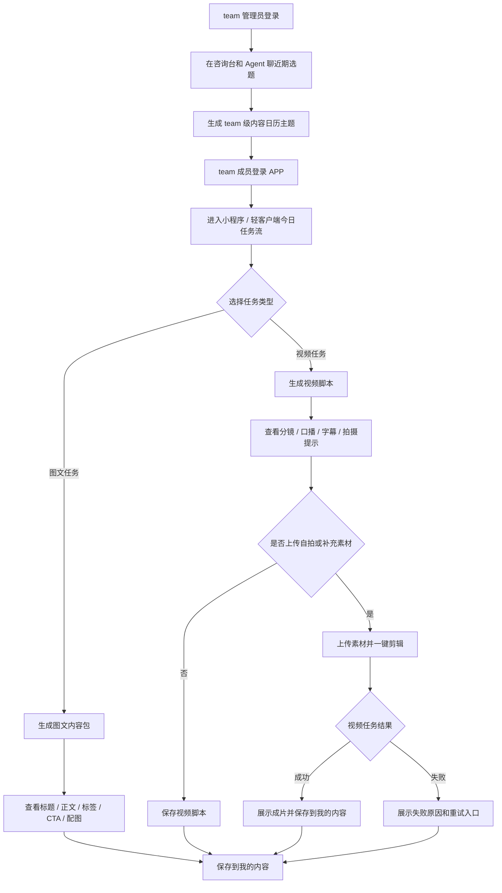
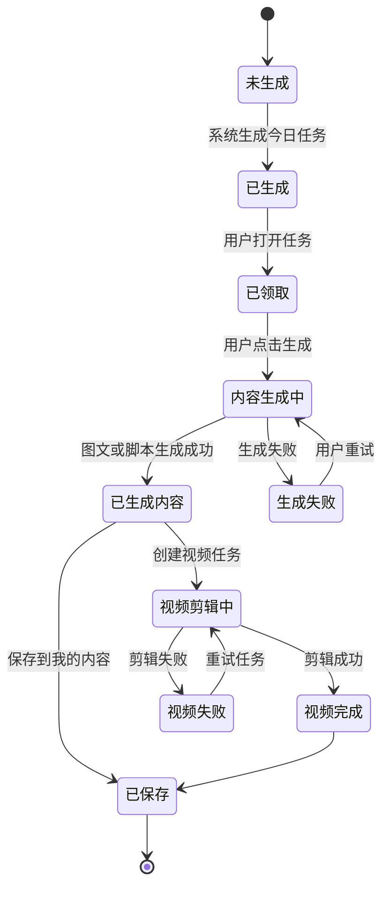

# 小红书抖音矩阵获客平台 V2.3 内容日历驱动图文视频生成 PRD

状态：`草案`
更新时间：`2026-05-10`

## 1. 综述

### 1.1 文档定位

这份 PRD 用于记录当前产品重心调整后的 V1 试点方案。

旧 V2.1 主线强调：

```text
咨询诊断
-> 策略快照 / 内容日历
-> 图文工作台 / 视频工作台
```

新 V2.3 试点主线调整为：

```text
后台沉淀项目资料 / 销售话术 / 爆款内容 / 违禁词 / 图片视频素材
-> team 管理员在咨询台和 Agent 聊近期选题 / 推广重点
-> 系统生成 team 级内容日历主题
-> 系统为 team 内成员生成个人内容日历
-> 用户每天领取今日图文或视频脚本任务
-> 用户生成图文、拍摄口播或上传素材
-> 系统辅助剪辑视频
-> 我的内容沉淀结果
```

核心逻辑没有变：系统仍然通过交互和知识检索生成内容日历，再把日历任务送入图文和视频链路。

变化在于：**咨询台从所有用户的默认创作入口，调整为 team 管理员的选题中枢**。对销售和中介用户来说，产品应该像一个可以每天打开直接用的小程序 / 轻客户端；对 team 管理员和少数核心销售来说，Web 商家端仍然保留，用来和 Agent 沟通近期推广重点、上传资料、管理素材、沉淀选题想法，并把这些共识分发成团队内容日历。

本次变更来自房地产试点客户需求的进一步澄清。前期版本更多围绕“咨询台如何生成策略和内容日历”展开；但在与客户、项目操盘方、销售负责人和渠道负责人继续沟通后，需求重心变得更明确：客户真正需要的是把线下沉淀的项目资料、销售经验、爆款内容、客户对谈和图片视频素材，转成销售和中介每天能直接使用的图文内容、视频脚本和剪辑素材。同时，咨询台仍然有价值，它可以作为团队负责人输入近期选题和运营判断的地方。因此，V2.3 不推翻“内容日历驱动生成”的底层逻辑，而是把普通成员默认入口调整为“今日任务流 / 轻客户端”，把咨询台保留为 team 管理员的内容日历策划入口。

### 1.2 背景与核心问题

房地产试点场景中，业务方已经明确了几个现实问题：

1. 销售和中介并不缺“发内容”的渠道，但缺每天该发什么、怎么说、用什么素材。
2. 传统中介自己写项目内容，常常抓不住项目卖点、客户心理和提单逻辑。
3. 项目方和优秀销售掌握大量经验，包括项目卖点、区域打法、销售话术、客户异议处理、成交判断，但这些经验没有稳定转成可复用内容资产。
4. 项目有真实图片、视频、周边配套素材，但销售不知道如何和选题、脚本、口播结合。
5. 第一阶段要先服务一个试点项目，通过大量销售/中介账号每天发不同表达的内容，激活老客户和私域流量。
6. 如果有 100 个中介参与，团队负责人需要能把“本周主推什么、最近有哪些选题想法”同步给系统，再由系统分发为每个成员的个人内容日历。

因此，本轮目标不是继续强化“所有人都从咨询诊断开始”的旧流程，而是把咨询台改造成团队选题中枢，把后台沉淀的项目资料和销售经验，转成销售每天能用的图文内容、视频脚本和剪辑素材。

### 1.3 产品目标

V2.3 的产品目标：

1. 用户登录后能直接看到“今天该发什么”。
2. 每个用户的内容日历可不同，但可以围绕同一个项目大主题展开。
3. 用户可以一键生成图文内容包，包括标题、正文、标签、CTA、配图和封面字建议。
4. 用户可以生成视频脚本，按脚本自拍口播或上传片段，再沿用现有视频剪辑链路出片。
5. 后台共享内容上下文对用户不可见，但生成时必须被系统使用。
6. 咨询台保留为 team 管理员的内容策划入口，用于输入近期选题、运营判断和团队推广重点。
7. 一个 team 下的成员共享同一套项目资料、知识库和素材，但生成结果归属到各自用户。

### 1.4 非目标

V2.3 明确不做：

- 不做账号发布。
- 不做矩阵分发。
- 不做抖音 / 小红书账号授权。
- 不做真实投放系统。
- 不做复杂多项目管理后台。
- 不做复杂组织架构、部门层级、审批流。
- 不让前台用户维护“项目库 / 知识库 / 素材库”。
- 不要求成员端使用完整 Web 商家端；成员端可以是小程序、H5 或其他轻客户端。
- 不做 MBTI 或人格测试个性化，后续可作为用户画像增强。
- 不用 AI 生图作为 V1 主方案，图文配图优先来自真实项目素材库。

### 1.5 核心业务流程 / 用户旅程地图

1. **阶段一：后台沉淀共享内容上下文**  
   项目运营人员在线下访谈销售、整理项目资料、导入爆款案例和真实素材，形成系统可检索的共享内容底座。

2. **阶段二：team 管理员在咨询台策划团队内容日历**  
   team 管理员登录后，在咨询台和 Agent 聊近期推广重点、选题想法、团队要统一发力的主题，系统生成 team 级内容日历主题。

3. **阶段三：成员进入今日任务流**  
   销售或中介用户登录 APP 后，看到今天建议发布的图文任务和视频任务，并可查看未来 7 天计划。

4. **阶段四：用户生成图文内容包**  
   用户从今日任务进入图文生成，系统自动检索共享内容上下文和素材库，生成标题、正文、标签、CTA、配图和封面字建议。

5. **阶段五：用户生成视频脚本并剪辑**  
   用户从今日任务进入视频脚本生成，系统输出分镜、口播、字幕、拍摄提示和素材建议；用户上传自拍片段或选择素材后，进入现有视频任务链路。

6. **阶段六：结果沉淀到我的内容**  
   图文草稿、视频脚本、视频任务和成片沉淀为当前用户个人内容资产，用户可回看、复用、继续编辑。

### 1.6 用户操作流



### 1.7 今日任务状态机



## 2. 用户角色

### 2.1 项目运营人员

项目运营人员不一定是前台用户。其职责是在线下收集和整理项目资料，包括：

- 项目卖点。
- 区域打法。
- 价格、面积、配套、回报率等可宣传信息。
- 销售话术。
- 客户异议和提单技巧。
- 爆款内容案例。
- 真实图片和视频素材。
- 违禁词和风险表达。

V1 不要求为该角色新增完整后台。可以先沿用现有知识库和素材中心能力，由内部人员整理后导入。

### 2.2 Team 管理员

Team 管理员是当前“商家 owner / 管理账号”的新业务解释。

V1 可以不新增复杂后台，只需要把当前 owner 账号理解为一个 team 的管理员。管理员负责：

- 在咨询台和 Agent 聊近期选题想法。
- 输入本周或近期主推方向。
- 让 Agent 基于共享知识库和项目资料生成 team 级内容日历。
- 让 team 成员的个人内容日历和 team 级主题保持关联。

Team 管理员需要感知：

- 咨询台。
- team 内容日历。
- team 成员使用的是同一套项目资料和素材。

Team 管理员暂不需要感知：

- 复杂成员权限。
- 多层组织架构。
- 审批流。
- 多项目配置后台。

### 2.3 销售 / 中介用户

这是 V1 前台核心用户。

成员端的最终载体不限定为 Web。更符合真实使用方式的是小程序、H5 或其他轻客户端，因为中介日常只需要在手机上领取任务、拍摄、上传和生成。

他们只需要感知：

- 今天发什么。
- 这一周大概要发什么。
- 点一下生成图文。
- 点一下生成视频脚本。
- 按脚本拍素材或上传素材。
- 点一下 AI 一键剪辑。
- 保存、下载或复制结果。

他们不需要理解：

- 项目资料库。
- 知识库切块。
- 素材索引。
- 咨询 session。
- worker payload。
- 完整 Web 商家后台。

销售 / 中介用户属于某一个 team。成员共享 team 的项目资料、知识库、素材和团队内容日历主题，但生成结果、我的内容、视频任务归属到成员自己的账号。

### 2.4 AI 内容系统

AI 内容系统负责：

- 根据当天主题和用户任务生成不同表达。
- 检索共享文本内容上下文。
- 匹配真实图片和视频素材。
- 生成图文内容包。
- 生成视频脚本和分镜。
- 在内容中规避违禁词和高风险承诺。
- 把 team 管理员在咨询台确认的选题，转成 team 级日历主题，并进一步分发为成员个人任务。

### 2.5 视频剪辑链路

视频剪辑链路沿用现有视频工作台和 worker：

- 用户确认视频脚本。
- 用户上传自拍或其他素材。
- 系统补充后台素材库中的项目画面和配套画面。
- 创建视频任务。
- worker 剪辑、加字幕、转场、上传成片并回写结果。

## 3. 产品规则

### 3.1 Team 与账号关系

V1 推荐采用最小 team 模型：

1. 当前商家 owner 账号默认是一个 team 管理员。
2. 后续加入的销售 / 中介账号属于该 team。
3. Team 是知识库、素材、team 内容日历的隔离边界。
4. 成员只能使用自己所属 team 的共享内容上下文。
5. 成员的图文草稿、视频脚本、视频任务和我的内容归属到成员个人。
6. V1 不做复杂权限，只区分管理员和成员两类角色。

这个设计可以最大程度复用现有商家、知识库、素材和咨询台能力：当前 `merchant` 可以先作为 team 的业务载体，后续再按需要抽象独立 `teams`。

### 3.2 共享内容上下文

共享内容上下文是后台能力，对前台用户隐藏。

V1 至少包含两类：

#### 3.1.1 文本内容

- 房地产行业违禁词和风险表达。
- 项目基础资料。
- 项目核心卖点。
- 区域和圈层打法。
- 销售与客户对谈记录。
- 成交客户关注点。
- 客户异议和提单话术。
- 爆款图文 / 视频内容样例。
- 阶段性推广主题，例如小户型、总价、配套、地铁、租金回报、成熟商业等。

#### 3.1.2 媒体素材

- 项目实拍图片。
- 项目实拍视频。
- 周边商业、交通、配套素材。
- 可作为 B-roll 的环境画面。
- 可作为图文配图的封面图、户型图、场景图。

### 3.3 Team 内容日历与用户内容日历

内容日历分为两层：

1. **Team 内容日历**：由管理员在咨询台和 Agent 沟通后生成，表达团队近期统一推广主题。
2. **用户内容日历**：面向每个销售 / 中介成员，基于 team 主题生成不同表达、标题、脚本和素材组合。

业务规则：

1. 同一天可以有 team 统一主题，例如“小户型回归”“光明成熟配套”“低总价上车”。
2. 同一个 team 主题下，不同用户拿到的标题、角度、文案、脚本和素材组合可以不同。
3. 管理员在咨询台新增或调整选题后，应影响后续生成的成员内容日历。
4. 已经生成并保存到某个用户的当天任务，刷新后不应重新随机变化。
5. 用户可查看未来 7 天计划，但主体验聚焦今天。
6. V1 暂不做复杂用户画像，差异可通过系统分配表达角度实现。
7. 未来可以接入 MBTI 或账号风格测试，但不进入 V1。

### 3.4 咨询台保留原则

咨询台不再是普通成员的默认创作入口，但仍是 team 管理员的内容策划入口。

业务规则：

1. 管理员可以在咨询台输入近期选题想法，例如“这周想主推小户型回归”“最近客户关注租金回报”“想让中介多发光明成熟配套”。
2. Agent 基于管理员输入、共享知识库、项目资料、销售话术和素材，生成 team 级内容日历。
3. Team 级内容日历不是最终发布内容，而是成员个人任务的主题来源。
4. 普通成员无需进入咨询台，也不需要理解咨询 session。
5. 如果后续需要允许成员在咨询台和 Agent 聊自己的选题，也应作为增强能力，不影响 V1 主线。

### 3.5 前台入口与客户端原则

V2.3 分成两个前台面：

1. **管理员 / 核心销售 Web 商家端**：用于团队选题、AI 对话、资料上传、素材管理、内容结果预览。
2. **成员轻客户端**：用于中介每天领取任务、生成图文、查看视频脚本、上传素材、一键剪辑和查看成片。

成员端不应看到复杂后台概念，也不要求暴露完整 Web 商家端导航。

成员轻客户端建议收敛为：

```text
今日 | 本周 | 上传素材 | 我的内容
```

其中：

- `今日` 展示当天图文 / 视频任务。
- `本周` 展示未来 7 天营销日历。
- `上传素材` 用于按脚本上传口播、现场画面或补充素材。
- `我的内容` 展示用户自己的图文、脚本、视频任务和成片。

Web 商家端建议为管理员 / 核心销售保留：

```text
团队选题 | 今日任务预览 | 图文工作台 | 视频工作台 | 素材中心 | 我的内容 | 用户信息
```

其中 `团队选题` 可以先复用现有咨询台，不需要新建复杂管理后台。`今日任务预览` 可以作为 Web 内测页面，用于验证 API 和内容生成效果，不代表最终成员端必须使用 Web。

## 4. 用户故事详述

### 阶段一：后台沉淀共享内容上下文

---

#### **US-01: 作为项目运营人员，我希望把项目资料、销售话术和真实素材沉淀为共享内容上下文，以便销售用户每天生成可用内容。**

* **价值陈述**
  * **作为** 项目运营人员
  * **我希望** 把线下访谈、项目资料、爆款案例、违禁词、图片视频素材整理进系统
  * **以便于** 前台销售用户不需要自己理解复杂项目逻辑，也能生成专业内容

* **业务规则与逻辑**
  1. **前置条件**
     - 项目运营人员已经完成线下资料收集。
     - 文本内容已经经过人工整理，避免直接把未经清洗的转写噪音作为唯一真相。
     - 媒体素材已经确认可用于项目宣传。
  2. **操作流程**
     - 运营人员导入文本资料。
     - 运营人员导入图片和视频素材。
     - 系统处理文本资料，使其可用于内容生成检索。
     - 系统记录素材标题、类型、描述和适用场景。
  3. **异常处理**
     - 如果文本资料还在处理中，生成内容时不应把它当成可用依据。
     - 如果素材缺失，图文生成可以先输出图片建议，但必须提示“暂未匹配到真实配图”。
     - 如果资料中存在违禁或高风险表达，生成结果应规避，不应直接复述。

* **验收标准**
  * **场景1: 文本资料可用于生成**
    * **GIVEN** 后台已导入项目卖点、销售话术和爆款内容
    * **WHEN** 用户生成图文或视频脚本
    * **THEN** 生成结果能体现项目卖点和销售话术，而不是泛泛房地产文案
  * **场景2: 素材可用于配图和剪辑**
    * **GIVEN** 后台已存在项目图片和视频素材
    * **WHEN** 用户生成图文或视频脚本
    * **THEN** 系统能返回匹配的图片或视频素材建议
  * **场景3: 资料不可用时降级**
    * **GIVEN** 后台资料缺失或仍在处理
    * **WHEN** 用户生成内容
    * **THEN** 系统展示可理解提示，不暴露技术错误

---

### 阶段二：team 管理员在咨询台策划团队内容日历

---

#### **US-02: 作为 team 管理员，我希望在咨询台和 Agent 聊近期选题，以便生成团队本周内容日历。**

* **价值陈述**
  * **作为** team 管理员
  * **我希望** 在咨询台输入近期推广重点、选题想法和阶段打法
  * **以便于** 系统把这些共识转成 team 成员本周会使用的内容日历主题

* **业务规则与逻辑**
  1. **前置条件**
     - 管理员已登录。
     - 管理员属于某个 team，且该 team 已有共享内容上下文。
     - 咨询台已有 Agent 能读取商家资料、知识库、历史内容和策略快照。
  2. **操作流程**
     - 管理员进入咨询台或团队选题入口。
     - 管理员输入近期想法，例如“这周主推小户型”“最近客户很关心租金回报”“让中介多发光明成熟配套”。
     - Agent 结合管理员输入、共享知识库、项目资料、销售话术和素材，生成 team 级内容日历主题。
     - 管理员确认后，系统保存 team 内容日历。
     - team 成员后续生成个人今日任务时，会优先参考已确认的 team 日历主题。
  3. **异常处理**
     - 如果管理员没有确认 team 日历，成员仍可基于共享内容上下文生成默认今日任务。
     - 如果管理员后续调整选题，只影响尚未生成的成员任务；已经保存到成员个人的当天任务不自动覆盖。
     - 如果知识库检索失败，咨询台应提示“知识库暂时不可用，可先基于输入生成草案”，并标记该日历为待复核。

* **页面布局线框图**

```text
+--------------------------------------------------------------------------------+
| 团队选题 / 咨询台                                           [今日任务] [用户]  |
+--------------------------------------------------------------------------------+
| Agent：这周你想让团队重点发什么？                                               |
|                                                                                |
| 管理员：这周想主推小户型回归，重点讲低总价上车、光明成熟配套和租金回报。        |
+--------------------------------------------------------------------------------+
| Agent 生成的团队内容日历草案                                                    |
| 周一：久违小户型回归                                                            |
| 周二：为什么先打光明本地客                                                      |
| 周三：成熟商业和地铁配套                                                        |
| 周四：低总价上车逻辑                                                            |
| 周五：租金回报和长期持有                                                        |
|                                                        [确认并分发给团队]        |
+--------------------------------------------------------------------------------+
| 说明：确认后，团队成员会围绕这些主题拿到不同标题、文案、视频脚本和素材组合。     |
+--------------------------------------------------------------------------------+
```

* **验收标准**
  * **场景1: 管理员生成 team 内容日历**
    * **GIVEN** 管理员已登录并进入团队选题入口
    * **WHEN** 管理员输入本周选题想法并请求 Agent 生成日历
    * **THEN** 系统展示 team 级内容日历草案
  * **场景2: 管理员确认后影响成员任务**
    * **GIVEN** 管理员已确认 team 内容日历
    * **WHEN** team 成员进入今日任务流
    * **THEN** 成员任务与 team 日历主题相关，但表达角度和内容不完全相同
  * **场景3: 管理员调整后不覆盖已保存任务**
    * **GIVEN** 某成员已经生成并保存今日任务
    * **WHEN** 管理员调整 team 内容日历
    * **THEN** 该成员已保存任务不被自动覆盖

---

### 阶段三：用户进入今日任务流

---

#### **US-03: 作为销售用户，我希望登录后直接看到今天该发什么，以便不用自己想选题。**

* **价值陈述**
  * **作为** 销售或中介用户
  * **我希望** 登录后看到今日图文任务和视频任务
  * **以便于** 每天打开 APP 就知道该发什么、怎么开始

* **业务规则与逻辑**
  1. **前置条件**
     - 用户已登录。
     - 用户属于某个 team。
     - 系统已有共享内容上下文。
     - 如果管理员已确认 team 内容日历，用户任务优先基于 team 日历生成。
  2. **操作流程**
     - 用户进入默认首页。
     - 页面优先展示今日任务。
     - 页面展示今日任务来自哪个团队主题。
     - 今日至少包含一条图文任务和一条视频任务。
     - 用户可以查看未来 7 天任务预览。
     - 用户点击任务后进入对应生成页。
  3. **异常处理**
     - 如果今日任务未生成，系统自动生成或展示“正在准备今日任务”。
     - 如果共享资料不足，页面提示“项目内容素材正在补充中，可先输入你的发布目标生成”。
     - 如果用户未登录，展示登录或注册引导。

* **页面布局线框图**

```text
+--------------------------------------------------------------------------------+
| 今日                                                         [本周] [我的内容] |
+--------------------------------------------------------------------------------+
| 今天建议主推：小户型回归 / 低总价上车 / 光明成熟配套                          |
| 来源：团队本周选题「小户型回归」                                                |
| 说明：今天给你准备了 1 条图文内容和 1 条视频脚本，可以直接生成后使用。           |
+--------------------------------------------------------------------------------+
| [图文任务]                                                                      |
| 标题方向：光明久违小户型终于来了                                                |
| 适合发布：小红书 / 朋友圈                                                       |
| 匹配素材：项目实景图、商业配套图                                                |
|                                      [生成图文]                                  |
+--------------------------------------------------------------------------------+
| [视频任务]                                                                      |
| 脚本方向：站在客户视角讲低总价上车逻辑                                          |
| 拍摄建议：前 10 秒真人口播，后 20 秒项目与配套画面                              |
|                                      [看脚本并上传素材]                          |
+--------------------------------------------------------------------------------+
| 未来 7 天                                                                       |
| 周一 小户型回归 | 周二 为什么先看光明本地客 | 周三 配套成熟度 | 周四 租金回报   |
+--------------------------------------------------------------------------------+
```

* **验收标准**
  * **场景1: 用户看到今日任务**
    * **GIVEN** 用户已登录、属于某个 team，且共享内容上下文可用
    * **WHEN** 用户进入首页
    * **THEN** 页面展示今日图文任务、视频任务、关联团队主题和未来 7 天预览
  * **场景2: 成员任务和团队主题相关**
    * **GIVEN** 管理员已确认 team 内容日历
    * **WHEN** 成员进入今日任务流
    * **THEN** 成员今日任务围绕 team 主题生成，但标题、文案、脚本和素材组合可不同
  * **场景3: 刷新后任务不变化**
    * **GIVEN** 用户当天已经生成今日任务
    * **WHEN** 用户刷新页面
    * **THEN** 今日任务内容保持一致
  * **场景4: 资料不足**
    * **GIVEN** 系统缺少可用共享内容上下文
    * **WHEN** 用户进入今日任务流
    * **THEN** 页面提示资料不足，并允许用户输入补充目标继续生成

---

### 阶段四：用户生成图文内容包

---

#### **US-04: 作为销售用户，我希望从今日任务一键生成图文内容包，以便直接复制或发布。**

* **价值陈述**
  * **作为** 销售或中介用户
  * **我希望** 基于今日任务生成完整图文内容
  * **以便于** 不用自己写标题、正文、标签和配图建议

* **业务规则与逻辑**
  1. **前置条件**
     - 用户已领取图文任务。
     - 系统已有可用文本资料。
     - 系统优先使用真实项目图片作为配图。
  2. **操作流程**
     - 用户进入图文生成页。
     - 用户可以直接生成，也可以输入补充要求。
     - 系统检索共享内容上下文。
     - 系统生成标题、正文、标签、CTA、封面字建议。
     - 系统从素材库匹配图片。
     - 用户保存结果到我的内容。
  3. **异常处理**
     - 如果没有匹配图片，系统保留文案结果，并提示需要人工补图。
     - 如果生成内容命中违禁词，系统应自动改写或提示重新生成。
     - 如果 AI 生成失败，用户输入不丢失，并允许重试。

* **页面布局线框图**

```text
+--------------------------------------------------------------------------------+
| 生成图文                                           [返回今日任务] [我的内容]    |
+--------------------------------------------------------------------------------+
| 今日任务：光明久违小户型终于来了                                                |
| 可选补充要求：                                                                  |
| +------------------------------------------------------------------------------+ |
| | 比如：口吻更像本地中介、标题更抓人、CTA 轻一点                                | |
| +------------------------------------------------------------------------------+ |
|                                                        [生成图文内容包]          |
+--------------------------------------------------------------------------------+
| 生成结果                                                                        |
| +----------------------+  标题：                                                |
| | 匹配图片预览 1       |  光明等了很久的小户型，终于又有新选择了                |
| | 匹配图片预览 2       |                                                        |
| +----------------------+  正文：                                                |
|                           ...                                                   |
| 标签：#光明买房 #深圳公寓 #小户型                                               |
| CTA：想看户型和价格，可以先私信我                                                |
| 封面字：光明小户型回归                                                          |
|                                      [保存到我的内容] [重新生成] [AI 修改]       |
+--------------------------------------------------------------------------------+
```

* **验收标准**
  * **场景1: 生成完整图文内容包**
    * **GIVEN** 用户已领取图文任务
    * **WHEN** 用户点击生成图文
    * **THEN** 系统返回标题、正文、标签、CTA、封面字建议和匹配图片
  * **场景2: 图片来自真实素材**
    * **GIVEN** 后台存在项目图片素材
    * **WHEN** 图文生成完成
    * **THEN** 结果中展示匹配图片，而不是 AI 生图
  * **场景3: 保存结果**
    * **GIVEN** 图文内容包已生成
    * **WHEN** 用户点击保存到我的内容
    * **THEN** 我的内容中能看到该图文草稿

---

### 阶段五：用户生成视频脚本并进入剪辑链路

---

#### **US-05: 作为销售用户，我希望从今日任务生成视频脚本，以便按脚本拍摄并剪辑成视频。**

* **价值陈述**
  * **作为** 销售或中介用户
  * **我希望** 系统生成可拍摄的视频脚本和分镜
  * **以便于** 我只需要按提示自拍或上传素材，系统辅助完成剪辑

* **业务规则与逻辑**
  1. **前置条件**
     - 用户已领取视频任务。
     - 系统已有项目资料和可选视频素材。
  2. **操作流程**
     - 用户进入视频生成页。
     - 用户点击生成视频脚本。
     - 系统输出分镜、口播、字幕、拍摄提示和所需素材。
     - 用户可上传自拍片段或其他素材。
     - 系统可从后台视频素材库补充项目画面和配套画面。
     - 用户创建视频剪辑任务。
     - 视频任务成功后，成片保存到我的内容。
  3. **异常处理**
     - 如果用户不上传素材，系统可先保存脚本，但不应强行创建真实剪辑任务。
     - 如果后台视频素材不足，脚本仍可生成，但剪辑前提示需要补充素材。
     - 如果剪辑失败，展示失败原因和重试入口。

* **页面布局线框图**

```text
+--------------------------------------------------------------------------------+
| 生成视频                                           [返回今日任务] [我的内容]    |
+--------------------------------------------------------------------------------+
| 今日视频任务：站在客户视角讲低总价上车逻辑                                      |
| 目标：生成一条 30-45 秒真人口播 + 项目画面视频                                  |
+--------------------------------------+-----------------------------------------+
| AI 脚本协同                          | 脚本画布 / 剪辑任务                     |
| +----------------------------------+ | 场景 1：前 10 秒真人口播                 |
| | 你可以补充：我想更强调租金回报    | | 口播：你是不是也发现光明小户型越来越少... |
| +----------------------------------+ | 拍摄：手机竖屏，站在项目或门店附近        |
| [生成视频脚本]                       |                                         |
|                                      | 场景 2：项目外立面 / 商业配套画面        |
|                                      | 字幕：低总价、成熟配套、上车门槛          |
|                                      |                                         |
|                                      | [上传自拍片段] [选择素材] [创建剪辑任务] |
+--------------------------------------+-----------------------------------------+
| 任务状态：未创建 / 剪辑中 / 成功 / 失败                                         |
+--------------------------------------------------------------------------------+
```

* **验收标准**
  * **场景1: 生成视频脚本**
    * **GIVEN** 用户已领取视频任务
    * **WHEN** 用户点击生成视频脚本
    * **THEN** 系统返回分镜、口播、字幕、拍摄提示和所需素材
  * **场景2: 上传素材后创建剪辑任务**
    * **GIVEN** 用户已有视频脚本并上传至少一段可用素材
    * **WHEN** 用户点击创建剪辑任务
    * **THEN** 系统进入现有视频任务链路并展示任务状态
  * **场景3: 不上传素材**
    * **GIVEN** 用户只生成了视频脚本
    * **WHEN** 用户离开页面
    * **THEN** 脚本保存到我的内容，但不自动创建剪辑任务
  * **场景4: 剪辑失败**
    * **GIVEN** 视频任务执行失败
    * **WHEN** 用户查看任务状态
    * **THEN** 页面展示用户可理解的失败原因和重试入口

---

### 阶段六：结果沉淀到我的内容

---

#### **US-06: 作为销售用户，我希望所有生成结果都保存到我的内容，以便后续复用和继续编辑。**

* **价值陈述**
  * **作为** 销售或中介用户
  * **我希望** 图文、视频脚本和成片都能在我的内容里找到
  * **以便于** 我可以复用、修改和追踪自己的内容资产

* **业务规则与逻辑**
  1. **前置条件**
     - 用户已经生成过图文、视频脚本或视频任务。
  2. **操作流程**
     - 用户进入我的内容。
     - 页面展示图文草稿、视频脚本、视频任务和成片。
     - 用户可以返回图文或视频生成页继续编辑。
  3. **异常处理**
     - 如果内容为空，展示清晰空状态，引导回今日任务。
     - 如果视频任务仍在执行，展示当前状态。
     - 如果视频任务失败，展示失败原因和重试入口。

* **验收标准**
  * **场景1: 查看图文草稿**
    * **GIVEN** 用户已保存图文内容包
    * **WHEN** 用户进入我的内容
    * **THEN** 页面展示该图文草稿
  * **场景2: 查看视频脚本**
    * **GIVEN** 用户已生成视频脚本但未剪辑
    * **WHEN** 用户进入我的内容
    * **THEN** 页面展示该视频脚本，并允许返回视频生成页
  * **场景3: 查看成片**
    * **GIVEN** 视频任务已成功
    * **WHEN** 用户进入我的内容
    * **THEN** 页面展示成片、封面或结果摘要

---

## 5. 数据落点与兼容原则

### 5.1 Team / 成员关系

V1 的最小实现不要求立即建设完整组织系统，但需要有 team 隔离概念。

最低要求：

- 每个用户属于一个 team。
- 当前商家 owner 账号可以先视为 team 管理员。
- 后续加入的销售 / 中介账号是 team 成员。
- Team 作为共享知识库、素材和 team 内容日历的隔离边界。
- 成员生成的图文、视频脚本、视频任务仍归属到成员个人。

兼容建议：

- 如果短期不新增独立 `teams` 表，可以先用当前 `merchant_profiles` 作为 team 载体。
- 如果需要支持一个管理员邀请多个成员，则至少需要成员与 merchant/team 的绑定关系。
- 不应把多个试点项目的知识库和素材混在同一个 team 中。

### 5.2 Team 内容日历

Team 内容日历来自管理员咨询台。

至少需要保存：

- Team ID。
- 管理员用户 ID。
- 来源咨询 session。
- 周期，例如本周或未来 7 天。
- 主题列表。
- 每天主推方向。
- 管理员确认状态。
- 生成时使用的知识来源摘要。
- 创建时间和更新时间。

如果暂时不新增独立 team calendar 表，也可以先复用咨询 session 的 strategy/content calendar 快照，但必须能被成员今日任务读取。

### 5.3 用户内容日历 / 今日任务

V1 需要一个可以按用户和日期持久化的任务结果。

至少需要保存：

- Team ID。
- 用户 ID。
- 日期。
- 关联的 team 内容日历 ID 或快照。
- 主题。
- 图文任务标题方向。
- 视频任务脚本方向。
- 使用过的知识来源摘要。
- 使用过的素材引用。
- 状态。
- 创建时间和更新时间。

如果暂时不新增独立表，也可以先把今日任务快照保存在生成草稿的输入快照中，但必须满足刷新后不变化的体验要求。

### 5.4 图文草稿

图文结果继续沉淀到：

- `content_drafts`
- `content_variants`

输入快照必须记录：

- 来源为今日任务或共享内容上下文。
- Team ID。
- 关联的 team 内容日历摘要。
- 关联的用户今日任务摘要。
- 今日任务标题和主题。
- 生成时使用的知识来源摘要。
- 匹配到的图片素材。
- 用户补充要求。

### 5.5 视频脚本和视频任务

视频脚本继续沉淀到：

- `content_drafts`
- `content_variants`

视频剪辑继续沿用：

- `video_edit_jobs`
- `asset_objects`
- COS 媒体资产
- video-worker

视频任务创建前仍然必须满足：

- 已有视频脚本。
- 用户确认脚本或明确创建剪辑任务。
- 已上传可用素材，或系统确认可使用后台素材补足。

### 5.6 共享内容上下文

V1 可以先沿用现有能力承载：

- 文本资料：用户知识库 / 平台知识库。
- 图片视频：素材中心 / COS 资产。

后续如果试点跑通，再考虑抽象成正式的“项目内容包”或“项目作战包”。

## 6. 页面与导航调整

### 6.1 管理员与成员入口

V1 可以用角色决定默认入口：

- Team 管理员：默认可进入团队选题 / 咨询台，也可以切到今日任务流预览成员体验。
- Team 成员：默认进入小程序 / H5 / 轻客户端今日任务流。

如果短期先在 Web 内测，也可以统一默认进入今日任务流，并在导航中为管理员保留“团队选题”入口。但实现优先级应放在 API 和数据链路，不能把完整 Web dashboard 当作成员端最终形态。

### 6.2 咨询台

咨询台继续保留，但产品语义调整为：

```text
团队选题 / 内容日历策划入口
```

它负责把管理员的近期选题想法，转成 team 内容日历主题。它不再要求每一个销售 / 中介成员都先完成咨询。

### 6.3 图文工作台

图文工作台需要支持无咨询 session 的生成模式。

新的默认来源：

```text
今日任务 / 共享内容上下文
```

旧来源仍可兼容：

```text
team 内容日历 / 咨询内容日历 / 素材中心 / 手动输入
```

### 6.4 视频工作台

视频工作台需要支持无咨询 session 的视频脚本生成。

新的默认来源：

```text
今日任务 / 共享内容上下文
```

旧的脚本确认、素材上传、视频任务、worker 回写继续保留。

### 6.5 成员轻客户端

成员轻客户端可以由小程序、H5 或其他移动端承载。

V1 需要提供的能力边界：

- 查看今日任务。
- 查看本周内容营销日历。
- 查看图文内容包。
- 查看视频脚本、拍摄提示和所需素材。
- 上传口播、现场画面或补充素材。
- 点击 AI 一键剪辑。
- 查看视频任务状态和成片。

轻客户端应通过 API 使用现有 team、今日任务、素材上传、视频任务能力，不需要复制 Web 商家端的咨询台、素材中心、用户知识库等复杂页面。

## 7. 验收清单

### 7.1 Team 和团队选题

- 当前 owner 账号可作为 team 管理员。
- 管理员可以通过咨询台生成或确认 team 内容日历主题。
- Team 成员生成个人任务时，能继承 team 内容日历主题。
- 已保存到成员个人的任务不被管理员后续调整自动覆盖。
- 不同 team 之间知识库、素材和内容日历隔离。

### 7.2 今日任务流

- 用户登录后默认进入今日任务流。
- 成员可通过小程序 / H5 / 轻客户端查看今日任务。
- 今日至少有图文任务和视频任务。
- 今日任务展示关联的 team 主题。
- 用户可看到未来 7 天预览。
- 刷新后当天任务不变化。
- 资料不足时有清晰提示。

### 7.3 图文生成

- 无咨询 session 也能生成图文。
- 图文结果包含标题、正文、标签、CTA、封面字建议。
- 图文结果包含真实项目图片引用或明确的缺图提示。
- 生成结果保存到我的内容。
- AI 修改入口继续可用。

### 7.4 视频生成

- 无咨询 session 也能生成视频脚本。
- 脚本包含分镜、口播、字幕、拍摄提示和所需素材。
- 用户在轻客户端上传素材后可以创建视频剪辑任务。
- 用户可以点击 AI 一键剪辑，并看到任务进入处理中。
- 视频任务状态可刷新恢复。
- 成片或失败原因能在我的内容中查看。

### 7.5 风险与降级

- 共享资料缺失时不暴露技术错误。
- 素材缺失时不阻断文案和脚本生成。
- 违禁词或高风险表达必须被规避或提示修订。
- 用户输入在生成失败时不丢失。

## 8. 待确认事项

1. 试点项目名称在文档和产品中是否统一为“华鼎 / 华底 / 华帝”，需要业务方最终确认。
2. 今日任务默认生成周期先做 7 天，还是支持用户手动生成 14 / 30 天。
3. V1 是否只区分管理员 / 成员两类角色，暂不做更多权限层级。
4. 成员加入 team 的方式先用邀请码、管理员创建账号，还是后台导入。
5. 用户是否需要填写最小资料，例如是否愿意出镜、主要客户来源、账号平台。
6. 后台共享资料是否继续沿用现有用户知识库和素材中心，还是新增内部“项目内容包”管理入口。
7. 视频剪辑在无用户上传素材时，是否允许只用后台素材生成弱真人感视频，还是必须用户上传口播片段后才能创建任务。
