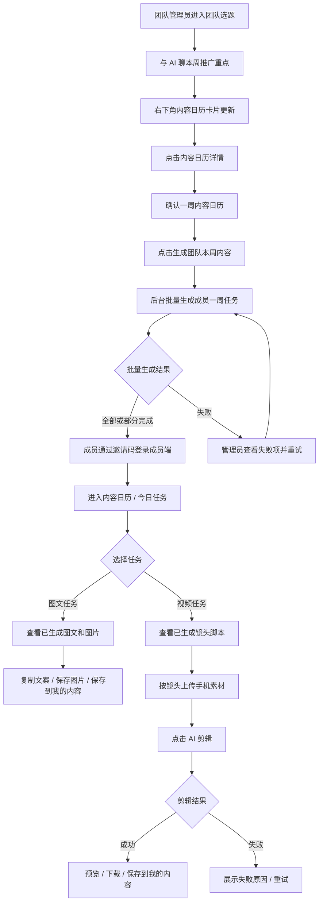
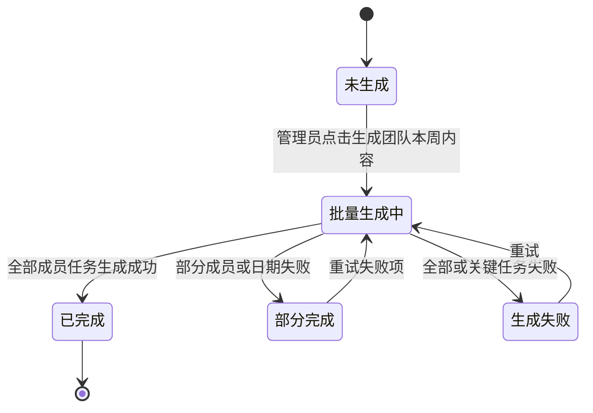
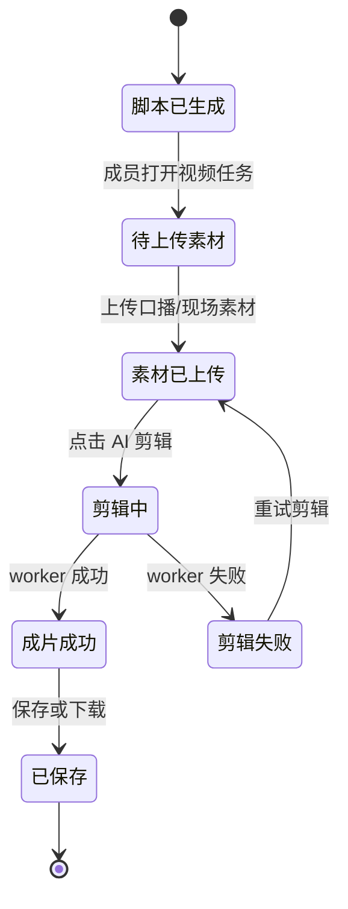

# 小红书抖音矩阵获客平台 V2.3.1 中介成员端任务执行与自动成片 PRD

状态：`草案`
更新时间：`2026-05-11`

## 1. 综述

### 1.1 文档定位

这份 PRD 是 `V2.3-内容日历驱动图文视频生成PRD.md` 的成员端补充文档，专门定义销售 / 中介成员每天如何消费团队后台生成的内容任务。

V2.3 已经确定主线：

```text
团队选题
-> team 内容日历
-> 成员今日任务
-> 图文 / 视频生成
-> 我的内容沉淀
```

V2.3.1 进一步收敛成员端体验：

```text
团队管理员通过后台维护项目资料、素材和团队选题
-> 成员通过邀请码加入团队成员端
团队管理员在团队选题页确认一周内容日历
-> 点击「生成团队本周内容」
-> 系统在后台批量生成每个成员的一周图文和视频任务
-> 成员每天打开今日任务
-> 图文：直接看到已生成图文内容包，复制文字、保存图片，自行发布
-> 视频：直接看到已生成镜头脚本，上传手机素材，点击 AI 剪辑，预览和下载成片
```

核心变化是：成员端不再承担“和 AI 聊、自己生成图文、自己生成脚本”的创作决策过程。成员端只做执行：看任务、复制图文、按镜头拍摄、上传素材、触发剪辑、下载成片。

### 1.2 背景与核心问题

房地产试点场景中，普通中介用户更接近移动端执行者，而不是后台运营人员。他们真正需要的是：

1. 每天打开手机就知道今天发什么、拍什么。
2. 图文内容已经准备好，可以直接复制到小红书、朋友圈等平台。
3. 视频脚本已经准备好，可以照着镜头脚本拍关键素材。
4. 拍完后上传素材，点击 AI 剪辑，等待成片。
5. 不需要看到咨询台、知识库、素材中心、worker、任务 payload 等后台概念。

因此，团队后台和成员端必须拆清楚：

- 团队后台负责选题、内容日历、批量生成、生成状态、失败重试。
- 成员端负责每日任务执行、手机素材上传、成片预览和下载。

### 1.3 产品目标

1. 团队管理员可以在团队选题页确认一周内容日历后，一键批量生成团队成员本周内容。
2. 批量生成过程可见，不让管理员误以为系统卡住。
3. 管理员后台不再把 `今日任务` 作为主入口；今日任务移动到成员端。
4. 图文任务在成员打开前已经生成好文案和匹配图片。
5. 视频任务在成员打开前已经生成好故事大纲、镜头脚本和拍摄要求。
6. 成员端不限定具体载体，可以是 H5/PWA、小程序或安卓 APK，但必须手机优先。
7. 成员端通过邀请码加入团队，首版以邀请链接或邀请码为主要进入方式。
8. 成员端所有能力以 API 为边界，不依赖某个 Web 页面临时状态。
9. 视频成片不在后台批量阶段生成，必须等成员上传素材后再触发 AI 剪辑。

### 1.4 非目标

V2.3.1 明确不做：

- 不做账号发布。
- 不做小红书 / 抖音账号授权。
- 不做矩阵分发。
- 不做复杂审批流。
- 不做成员端 AI 对话。
- 不让成员端维护知识库、素材中心或团队选题。
- 不在批量阶段提前生成视频成片。
- P0 不实现复杂素材不足判断与自动降级，只保留后续产品原则。
- P0 不强绑定小程序、H5、PWA 或 APK 的最终形态，先以 API 和 H5/PWA 验证为主。
- P0 不实现片头片尾模板库、声纹克隆、成员个人口播库和一键批量套片。
- P0 不要求视频生成实时完成，允许进入队列后等待数分钟或隔夜完成。

### 1.5 核心业务流程 / 用户旅程地图

1. **阶段一：团队管理员确认内容日历**  
   管理员在团队选题页和 AI 聊完本周方向，右下角内容日历卡片展示一周主题；点击详情后确认日历。

2. **阶段二：后台批量生成团队本周内容**  
   管理员在内容日历详情里点击「生成团队本周内容」，系统为当前 team 下 active 成员批量生成 7 天图文任务和视频任务。

3. **阶段三：成员通过邀请码进入成员端**  
   成员通过邀请链接或邀请码登录 / 加入团队，默认进入当前项目的成员端，不进入商家后台。

4. **阶段四：成员进入内容日历 / 今日任务**  
   成员登录手机端后只看到内容日历、今日任务和我的内容，不进入咨询台或完整后台。

5. **阶段五：成员查看图文内容包**  
   成员点击图文任务后，直接看到已生成标题、正文、标签、CTA、封面字和匹配图片，自行复制和保存。

6. **阶段六：成员查看视频镜头脚本并上传素材**  
   成员点击视频任务后，直接看到已生成故事大纲、镜头脚本、拍摄提示和素材上传槽位。

7. **阶段七：成员触发 AI 剪辑并下载成片**  
   成员上传关键素材后点击 AI 剪辑，系统进入视频任务链路，成功后展示预览和下载入口。

8. **阶段八：结果沉淀到我的内容**  
   图文内容、视频脚本、视频任务和成片归属到成员个人，可在我的内容查看。

### 1.6 用户操作流



### 1.7 批量生成状态机



### 1.8 成员视频任务状态机



### 1.9 成员端页面地图

成员端首版不是完整 Web dashboard，而是手机执行端。一级入口建议保留：

```text
项目介绍 | 内容日历 | 我的内容
```

其中 `项目介绍` 是默认首页，先用纯文字说明项目，不引入 chatbot；`内容日历` 承载今日任务和本周预览，任务详情作为二级页面打开。

成员端页面建议：

1. **成员登录 / 邀请码加入**：输入邀请码或打开邀请链接，完成登录并绑定 team。
2. **项目介绍首页**：成员进入后默认先看到当前项目的文字介绍、核心卖点、户型和使用说明。
3. **内容日历 / 今日任务**：展示今日图文任务、视频任务和本周预览。
4. **图文任务详情**：展示已生成图文和图片，提供复制、保存图片、保存到我的内容。
5. **视频任务详情**：展示已生成镜头脚本，提供按镜头上传素材和 AI 剪辑。
6. **剪辑进度 / 成片预览**：展示队列中、剪辑中、成功、失败、下载。
7. **我的内容**：查看自己的图文、脚本、剪辑任务和成片。

## 2. 产品规则

### 2.1 团队选题页与内容日历详情

团队选题页主区域继续保留给 AI 对话。内容日历不应占用 AI 对话主区域。

页面规则：

1. 内容日历卡片默认位于页面右下角或右侧策略资产区域。
2. 卡片只展示摘要，例如本周主题数量、是否已确认、是否已生成团队内容。
3. 管理员点击 `查看详情` 后，才进入内容日历详情面板、抽屉或详情页。
4. `生成团队本周内容` 按钮放在内容日历详情中，不放在 AI 对话输入区。
5. 批量生成状态、失败项和重试入口也放在内容日历详情中。

### 2.2 批量生成范围

批量生成的默认范围：

1. 当前 team 下所有 `active` 成员。
2. 默认未来 7 天。
3. 每个成员每天至少 1 条图文任务和 1 条视频任务。
4. 图文任务产物包括：标题、正文、标签、CTA、封面字、匹配图片。
5. 视频任务产物包括：故事大纲、镜头脚本、拍摄要求、素材上传建议、预计视频时长。
6. 视频成片不在此阶段生成。

### 2.3 管理员后台导航边界

管理员后台服务团队选题、内容生产和素材准备，不再把 `今日任务` 作为普通主导航入口。

调整规则：

1. 当前 Web 后台里的 `今日任务` 应从管理员主导航中移除，或改成仅供内测的 `成员端预览`。
2. 管理员主入口应围绕 `团队选题`、`生成图文`、`生成视频`、`素材中心`、`我的内容`、`用户信息` 等后台能力组织。
3. 成员的 `今日任务`、`内容日历` 和 `我的内容` 应进入独立成员端。
4. 如果管理员需要查看成员端效果，可以通过 `成员端预览` 或测试账号进入，不应让正式成员看到后台导航。

### 2.4 成员端载体

成员端不限定最终载体，可以是：

- H5 页面。
- PWA / 添加到桌面后的类 App 网页。
- 微信小程序。
- 安卓 APK。
- 其他手机轻客户端。

P0 推荐先用 H5/PWA 验证，因为最快、最容易给试点中介发链接测试。小程序和 APK 可以复用同一套业务 API。

成员端必须手机优先：

- 支持手机拍摄后的素材上传。
- 支持移动端预览视频。
- 支持复制图文文案。
- 支持保存图片和下载视频。
- 不依赖桌面 Web dashboard 临时状态。

### 2.5 成员登录与邀请码

成员端首版推荐使用邀请码或邀请链接作为进入方式。

业务规则：

1. 团队管理员或平台运营为当前项目 / team 生成成员邀请码。
2. 成员打开邀请链接，或在成员登录页输入邀请码。
3. 邀请码校验通过后，成员账号绑定到对应 team 和项目。
4. 成员首次进入后默认看到当前项目，不需要自己选择项目。
5. 如果成员还没有账号，登录页应支持最小注册流程，例如手机号 / 验证码 / 昵称。
6. 如果成员已有账号，输入邀请码后加入对应 team。
7. 邀请码失效、错误或已停用时，提示联系团队负责人。

首版不要求复杂组织架构，只需要支持：

- 一个成员加入一个 team。
- 一个邀请码绑定一个 team / 项目。
- 管理员能识别哪些成员处于 active 状态。

### 2.6 项目介绍首页

成员进入项目后，默认首页就是项目介绍，避免中介完全不知道项目是什么。

P0 先做纯文字版本，不做 chatbot，不做复杂项目学习系统，也不把项目介绍塞成内容日历页顶部小卡片。

项目介绍至少包含：

- 项目名称。
- 核心卖点。
- 主推户型。
- 价格 / 总价 / 区域 / 配套等可公开信息。
- 本周主推方向。
- 简短使用说明：每天看任务、复制图文、按脚本拍视频、等待剪辑。

后续增强可以做成完整“熟盘训练”或项目知识学习，但首版只需要文字介绍页。

### 2.7 API 优先原则

成员端能力必须由稳定 API 承载：

- 邀请码校验和加入 team。
- 获取今日任务。
- 获取本周任务预览。
- 获取图文任务详情。
- 获取视频任务详情。
- 上传视频素材。
- 创建 AI 剪辑任务。
- 查询视频任务状态。
- 获取成片预览和下载地址。
- 获取我的内容。

前端形态可以变，但 API、权限、任务状态、素材上传、视频任务恢复和成片资产回写必须稳定。

### 2.8 视频队列与半自动中央厨房原则

视频生成首版不承诺实时完成，必须按队列处理。

业务原则：

1. 成员点击 AI 剪辑后，任务进入队列。
2. 页面应展示队列中 / 剪辑中 / 已完成 / 失败。
3. 生成耗时可以是数分钟，必要时允许隔夜完成。
4. 服务器压力控制优先于并发即时生成，避免多个任务同时挤爆视频服务器。
5. P0 可以接受“中央厨房半自动”方式：后台人工或半自动提前准备项目中段素材、标注素材、筛选片段，只要成员端体验保持为自动化任务流。

### 2.9 暂不实现但保留的原则

以下能力暂不进入 P0，但 PRD 先保留方向：

1. 素材不足时自动判断缺哪些镜头。
2. 后台自动从项目素材库补齐所有缺失镜头。
3. 根据成员账号风格自动差异化文案。
4. 管理员调整日历后精细选择“重新生成未完成任务 / 重新生成全部任务”。
5. 成员端直接发布到小红书或抖音。
6. 成员首次上传 3-4 条片头 / 片尾后，后续只下载自动套片成片。
7. 从成员片头片尾中提取声纹，并用 TTS 生成中段讲解。
8. 中央厨房预先生成“熟肉”中段视频，再批量组合成员片头片尾。

## 3. 用户故事详述

### 阶段一：团队管理员确认日历并批量生成内容

---

#### **US-01: 作为团队管理员，我希望确认一周内容日历后，一键生成团队成员的一周内容任务，以便中介每天打开就能直接执行。**

* **价值陈述**
  * **作为** 团队管理员
  * **我希望** 在团队选题页确认一周内容日历后，点击「生成团队本周内容」
  * **以便于** 系统为团队成员批量准备未来 7 天的图文和视频任务

* **业务规则与逻辑**
  1. **前置条件**
     - 管理员已登录。
     - 当前账号是 team 管理员或具备团队内容生成权限。
     - 团队选题页已有一周内容日历。
     - team 下至少存在 1 个 active 成员。
  2. **操作流程**
     - 管理员在团队选题页和 AI 聊完本周方向。
     - 内容日历卡片在右下角或策略资产区展示摘要。
     - 管理员点击内容日历详情。
     - 管理员确认一周主题。
     - 管理员点击 `生成团队本周内容`。
     - 系统开始批量生成成员任务。
     - 详情面板展示生成状态、总任务数、已完成数、失败数。
     - 生成完成后，成员端今日任务可直接读取对应内容。
  3. **生成内容**
     - 图文任务：标题、正文、标签、CTA、封面字、匹配图片。
     - 视频任务：故事大纲、镜头脚本、每个镜头的拍摄要求、建议上传素材类型、预计视频时长。
  4. **异常处理**
     - 没有 active 成员时，提示管理员先添加成员。
     - 内容日历未确认时，不允许生成团队本周内容。
     - 部分成员或日期生成失败时，标记为 `部分完成`，允许查看失败项和重试。
     - 已生成的成员任务不被后续日历调整自动覆盖。

* **页面布局线框图**

团队选题页默认态：

```text
+--------------------------------------------------------------------------------+
| 团队选题 / AI 对话                                           [新开对话] [历史] |
+--------------------------------------------------------------------------------+
|                                                                                |
| AI 对话主区域                                                                   |
| 管理员：这周主推小户型回归，重点讲低总价上车、成熟配套和租金回报。             |
| AI：已为你整理成本周内容日历草案。                                               |
|                                                                                |
|                                                                    +----------+ |
|                                                                    | 本周日历 | |
|                                                                    | 7 个主题 | |
|                                                                    | 待确认   | |
|                                                                    | [详情]   | |
|                                                                    +----------+ |
+--------------------------------------------------------------------------------+
```

内容日历详情面板：

```text
+--------------------------------------------------------------------------------+
| 本周内容日历详情                                             [关闭]             |
+--------------------------------------+-----------------------------------------+
| 本周内容日历                         | 团队内容生成状态                         |
| 周一：小户型回归                     | 当前状态：未生成                          |
| 周二：成熟配套                       | 成员数量：100 人                          |
| 周三：租金回报                       | 生成范围：未来 7 天                       |
| 周四：低总价上车                     | 预计任务：700 条图文 + 700 条视频          |
| 周五：本地客成交逻辑                 |                                         |
| 周六：样板间看点                     | [生成团队本周内容]                         |
| 周日：到访 CTA                       |                                         |
+--------------------------------------+-----------------------------------------+
| 生成后：                                                                         |
| 进度：36 / 1400  生成中...                                                       |
| 结果：已完成 1320，失败 80                                                       |
| [查看失败项] [重试失败项]                                                         |
+--------------------------------------------------------------------------------+
```

* **验收标准**
  * **场景1: 管理员触发批量生成**
    * **GIVEN** 管理员已确认一周内容日历
    * **WHEN** 点击 `生成团队本周内容`
    * **THEN** 系统开始为 team 下所有 active 成员生成未来 7 天图文和视频任务
  * **场景2: 批量生成进度可见**
    * **GIVEN** 批量生成仍在执行
    * **WHEN** 管理员查看内容日历详情
    * **THEN** 页面展示生成中状态和进度
  * **场景3: 部分失败可重试**
    * **GIVEN** 部分成员任务生成失败
    * **WHEN** 批量任务结束
    * **THEN** 页面展示部分完成，并允许查看失败项和重试失败项
  * **场景4: 成员端读取生成结果**
    * **GIVEN** 某成员的 2026-05-11 图文任务已生成完成
    * **WHEN** 该成员打开今日任务
    * **THEN** 图文任务详情中直接展示已生成好的文案和图片

---

### 阶段二：成员通过邀请码登录并了解项目

---

#### **US-02: 作为中介成员，我希望通过邀请码进入成员端，并默认绑定到当前项目，以便不用理解后台账号体系就能开始执行任务。**

* **价值陈述**
  * **作为** 中介 / 销售成员
  * **我希望** 通过邀请链接或邀请码登录成员端
  * **以便于** 我进入后直接看到当前项目和任务，不需要自己选择后台空间

* **业务规则与逻辑**
  1. **前置条件**
     - 团队管理员或平台运营已为当前 team / 项目创建邀请码。
     - 邀请码处于有效状态。
  2. **操作流程**
     - 成员打开邀请链接，或进入成员端登录页输入邀请码。
     - 系统校验邀请码。
     - 新成员完成最小注册或登录。
     - 系统将成员绑定到邀请码对应 team。
     - 成员进入当前项目的项目介绍首页。
     - 成员可从项目介绍进入内容日历 / 今日任务。
  3. **页面规则**
     - 成员登录页不展示管理员后台入口。
     - 成员无需选择商家、项目或 team。
     - 项目介绍首页展示项目名称、主推卖点、户型 / 配套 / 总价等摘要。
     - 项目介绍首版只做文字内容，不提供 chatbot。
  4. **异常处理**
     - 邀请码错误时提示重新输入。
     - 邀请码失效时提示联系团队负责人。
     - 当前 team 没有可用项目资料时，仍允许进入，但提示项目资料正在补充。

* **页面布局线框图**

```text
+--------------------------------------+
| 内容日历工作台                       |
+--------------------------------------+
| 邀请码                               |
| +----------------------------------+ |
| | 输入团队邀请码                    | |
| +----------------------------------+ |
| [进入成员端]                         |
|                                      |
| 说明：邀请码由项目团队或负责人提供。 |
+--------------------------------------+
```

进入项目后默认首页：

```text
+--------------------------------------+
| 项目介绍                  [内容日历] |
+--------------------------------------+
| 项目：通州某项目                     |
|                                      |
| 核心卖点                             |
| 1. 低总价上车                        |
| 2. 成熟配套                          |
| 3. 小户型稀缺                        |
|                                      |
| 主推户型：xx 平 / xx 平              |
| 本周方向：小户型回归                 |
|                                      |
| 使用说明：                           |
| 看内容日历 -> 复制图文 -> 按脚本拍摄 |
| -> 等待 AI 剪辑 -> 下载成片          |
+--------------------------------------+
| [进入内容日历]                       |
+--------------------------------------+
```

* **验收标准**
  * **场景1: 邀请码加入成功**
    * **GIVEN** 成员拿到有效邀请码
    * **WHEN** 在成员端输入邀请码并完成登录
    * **THEN** 系统将成员绑定到对应 team，并进入项目介绍首页
  * **场景2: 默认进入项目介绍**
    * **GIVEN** 成员第一次进入项目
    * **WHEN** 成员端加载完成
    * **THEN** 页面默认展示项目介绍首页，不展示 chatbot
  * **场景3: 邀请码失效**
    * **GIVEN** 成员输入失效邀请码
    * **WHEN** 提交登录
    * **THEN** 页面提示联系团队负责人，不暴露技术错误

---

### 阶段三：成员进入内容日历 / 今日任务首页

---

#### **US-03: 作为中介成员，我希望登录后只看到内容日历和今日任务，以便不用进入团队后台，也不用和 AI 聊，就知道今天该发什么、拍什么。**

* **价值陈述**
  * **作为** 中介 / 销售成员
  * **我希望** 登录手机端后直接看到内容日历、今天的图文任务和视频任务
  * **以便于** 我每天打开就能执行，不需要理解后台流程

* **业务规则与逻辑**
  1. **前置条件**
     - 成员已登录。
     - 成员属于某个 team。
     - 团队后台已经生成或正在生成成员任务。
  2. **页面规则**
     - 成员从项目介绍进入后，看到 `内容日历 / 今日任务`。
     - 成员端不展示团队选题、AI 咨询对话、素材中心、知识库和用户后台配置。
     - 今日至少展示 1 个图文任务和 1 个视频任务。
     - 页面可以展示未来 7 天预览，但主体验聚焦今天。
  3. **状态规则**
     - `准备中`：后台还没有生成到该成员当天任务。
     - `已生成`：图文内容包或视频镜头脚本已可查看。
     - `待拍摄`：视频脚本已生成，等待成员上传素材。
     - `剪辑中`：成员已提交 AI 剪辑。
     - `已完成`：图文已保存或视频成片已生成。
     - `失败`：后台生成失败或视频剪辑失败。
  4. **异常处理**
     - 今日任务不存在时，提示“团队内容正在准备中”。
     - 后台批量生成中时，展示 `生成中`，不要求成员手动生成。
     - 权限异常时，提示联系团队负责人。

* **页面布局线框图**

```text
+--------------------------------------+
| 内容日历                  [我的内容] |
+--------------------------------------+
| 2026年5月11日 周一                  |
| 今日主题：小户型回归 / 低总价上车   |
| 来源：团队本周内容日历               |
+--------------------------------------+
| 图文任务                             |
| 标题方向：光明久违小户型终于来了     |
| 状态：已生成                         |
| 配图：2 张项目图片已匹配             |
|                         [查看图文]   |
+--------------------------------------+
| 视频任务                             |
| 脚本方向：站在客户视角讲上车逻辑     |
| 状态：镜头脚本已生成                 |
| 需要拍摄：开头口播 / 结尾 CTA        |
|                         [查看脚本]   |
+--------------------------------------+
| 本周预览                             |
| 周二 成熟配套 | 周三 租金回报        |
+--------------------------------------+
```

* **验收标准**
  * **场景1: 成员看到今日任务**
    * **GIVEN** 成员已登录且今日任务已生成
    * **WHEN** 进入成员端首页
    * **THEN** 页面直接展示今日图文任务和视频任务
  * **场景2: 图文任务进入详情**
    * **GIVEN** 图文任务已生成完成
    * **WHEN** 成员点击 `查看图文`
    * **THEN** 进入图文详情页，直接看到已生成好的文案和图片
  * **场景3: 视频任务进入详情**
    * **GIVEN** 视频任务镜头脚本已生成完成
    * **WHEN** 成员点击 `查看脚本`
    * **THEN** 进入视频任务详情页，直接看到镜头脚本和上传素材入口
  * **场景4: 后台仍在生成**
    * **GIVEN** 后台正在批量生成团队内容
    * **WHEN** 成员进入今日任务
    * **THEN** 页面展示生成中，而不是让成员自己点击生成

---

### 阶段四：成员查看图文内容包

---

#### **US-04: 作为中介成员，我希望点击图文任务后直接看到已生成图文和图片，以便复制到小红书、朋友圈等平台发布。**

* **价值陈述**
  * **作为** 中介 / 销售成员
  * **我希望** 图文任务详情中直接展示已经生成好的内容包
  * **以便于** 我不用自己点生成，也不用和 AI 沟通，就能复制发布

* **业务规则与逻辑**
  1. **前置条件**
     - 图文任务已由团队后台批量生成。
     - 图文任务归属当前成员。
  2. **展示内容**
     - 标题。
     - 正文。
     - 标签。
     - CTA。
     - 封面字。
     - 已匹配图片。
     - 图片保存入口。
     - 文案复制入口。
  3. **操作流程**
     - 成员从今日任务点击 `查看图文`。
     - 页面直接展示内容包。
     - 成员复制文案。
     - 成员保存图片。
     - 成员自行前往小红书、朋友圈或其他平台发布。
     - 成员可点击 `保存到我的内容`，或系统自动记录已查看 / 已复制行为。
  4. **异常处理**
     - 图文仍在生成时，展示生成中。
     - 图片未匹配完成时，可以先展示文案和图片准备中状态。
     - 生成失败时，提示联系团队负责人或等待后台重试。

* **页面布局线框图**

```text
+--------------------------------------+
| 图文任务详情              [返回今日] |
+--------------------------------------+
| 今日主题：小户型回归                 |
| 标题：光明等了很久的小户型终于来了   |
+--------------------------------------+
| 配图                                 |
| +----------------+ +----------------+ |
| | 项目图片 1     | | 项目图片 2     | |
| +----------------+ +----------------+ |
|                         [保存图片]   |
+--------------------------------------+
| 正文                                 |
| 光明最近重新被很多刚需客户提起，     |
| 不是因为噱头，而是小户型选择真的少... |
|                                      |
| CTA：想看户型和价格，可以先私信我    |
| 标签：#光明买房 #小户型 #深圳置业    |
+--------------------------------------+
| [复制正文] [复制标题+正文+标签]       |
| [保存到我的内容]                     |
+--------------------------------------+
```

* **验收标准**
  * **场景1: 查看已生成图文**
    * **GIVEN** 成员图文任务已生成完成
    * **WHEN** 成员进入图文任务详情
    * **THEN** 页面展示标题、正文、标签、CTA、封面字和图片
  * **场景2: 复制发布内容**
    * **GIVEN** 图文内容包已展示
    * **WHEN** 成员点击复制
    * **THEN** 系统复制可直接发布的文字内容
  * **场景3: 保存图片**
    * **GIVEN** 图文任务已有匹配图片
    * **WHEN** 成员点击保存图片
    * **THEN** 图片可保存到手机或打开下载链接

---

### 阶段五：成员查看视频镜头脚本并上传素材

---

#### **US-05: 作为中介成员，我希望点击视频任务后直接看到已生成镜头脚本，以便按要求拍摄并上传素材。**

* **价值陈述**
  * **作为** 中介 / 销售成员
  * **我希望** 视频任务详情中直接展示故事大纲和镜头脚本
  * **以便于** 我知道每个镜头拍什么、怎么说、需要上传哪些素材

* **业务规则与逻辑**
  1. **前置条件**
     - 视频任务已由团队后台批量生成。
     - 视频任务归属当前成员。
  2. **展示内容**
     - 今日主题。
     - 故事大纲。
     - 预计时长。
     - 镜头脚本。
     - 每个镜头的口播、字幕、拍摄要求。
     - 需要成员上传的镜头槽位。
  3. **上传规则**
     - 成员使用手机拍摄后上传素材。
     - 上传素材应绑定到具体镜头槽位。
     - 第一版重点支持真人口播 / 现场画面上传。
     - 系统可以展示后台可补充素材说明，但 P0 不实现复杂素材不足判断。
  4. **异常处理**
     - 脚本还在生成时，展示生成中。
     - 上传失败时，保留脚本和已上传素材状态。
     - 格式不支持时，提示当前支持的视频格式。

* **页面布局线框图**

```text
+--------------------------------------+
| 视频任务详情              [返回今日] |
+--------------------------------------+
| 今日主题：低总价上车逻辑             |
| 预计成片：30-45 秒                   |
| 故事大纲：                           |
| 用客户视角解释为什么这类小户型重新   |
| 值得关注，最后引导私信看户型。       |
+--------------------------------------+
| 镜头 1：开头真人口播                 |
| 时间：0-8 秒                         |
| 口播：你是不是也发现，光明小户型     |
|      最近越来越少了？                |
| 拍摄：手机竖屏，站在项目或门店附近   |
|                         [上传素材]   |
+--------------------------------------+
| 镜头 2：项目 / 周边画面              |
| 时间：8-25 秒                        |
| 字幕：低总价、成熟配套、上车门槛     |
| 素材：系统可使用后台项目素材          |
+--------------------------------------+
| 镜头 3：结尾真人 CTA                 |
| 时间：25-35 秒                       |
| 口播：想看具体户型和价格，可以私信我 |
|                         [上传素材]   |
+--------------------------------------+
| [AI 剪辑]                            |
+--------------------------------------+
```

* **验收标准**
  * **场景1: 查看镜头脚本**
    * **GIVEN** 成员视频任务镜头脚本已生成
    * **WHEN** 成员进入视频任务详情
    * **THEN** 页面展示故事大纲、镜头脚本、口播、字幕和拍摄要求
  * **场景2: 按镜头上传素材**
    * **GIVEN** 视频任务详情展示了镜头槽位
    * **WHEN** 成员上传素材
    * **THEN** 素材绑定到对应镜头或当前视频任务
  * **场景3: 上传失败**
    * **GIVEN** 成员正在上传手机素材
    * **WHEN** 上传失败
    * **THEN** 页面提示失败原因，并保留已生成脚本

---

### 阶段六：成员触发 AI 剪辑、预览和下载

---

#### **US-06: 作为中介成员，我希望上传素材后点击 AI 剪辑，以便系统自动生成可预览和下载的视频。**

* **价值陈述**
  * **作为** 中介 / 销售成员
  * **我希望** 上传关键素材后点击 AI 剪辑
  * **以便于** 系统根据镜头脚本和素材生成成片，我只需要等待、预览和下载

* **业务规则与逻辑**
  1. **前置条件**
     - 当前视频任务已有镜头脚本。
     - 成员已上传至少一段可用视频素材，或系统允许基于后台素材创建任务。
  2. **操作流程**
     - 成员点击 `AI 剪辑`。
     - 系统创建视频剪辑任务。
     - 页面展示剪辑状态。
     - 成功后展示视频预览、封面、下载入口。
     - 失败后展示失败原因和重试入口。
  3. **状态展示**
     - `待上传素材`。
     - `素材已上传`。
     - `剪辑中`。
     - `成片成功`。
     - `剪辑失败`。
  4. **异常处理**
     - worker 失败时，不删除脚本和已上传素材。
     - 成片时长过短、无 voiceover、素材不足等质量问题先作为后续优化项，不阻断 P0。
     - 下载地址失效时，允许刷新重新获取。

* **页面布局线框图**

```text
+--------------------------------------+
| AI 剪辑                  [返回脚本] |
+--------------------------------------+
| 当前状态：剪辑中                     |
| 进度：正在准备素材和字幕             |
|                                      |
| [=====               ] 35%           |
+--------------------------------------+
| 成功后                               |
| +----------------------------------+ |
| | 视频预览                         | |
| +----------------------------------+ |
| [下载视频] [保存到我的内容]          |
+--------------------------------------+
| 失败后                               |
| 剪辑失败：视频引擎暂时不可用         |
| [重试剪辑] [返回检查素材]            |
+--------------------------------------+
```

* **验收标准**
  * **场景1: 创建剪辑任务**
    * **GIVEN** 成员已上传素材
    * **WHEN** 点击 `AI 剪辑`
    * **THEN** 系统创建视频剪辑任务并展示剪辑中状态
  * **场景2: 成片成功**
    * **GIVEN** 视频任务执行成功
    * **WHEN** 成员查看任务结果
    * **THEN** 页面展示视频预览和下载入口
  * **场景3: 成片失败**
    * **GIVEN** 视频任务执行失败
    * **WHEN** 成员查看任务结果
    * **THEN** 页面展示用户可理解的失败原因和重试入口

---

### 阶段七：成员查看我的内容

---

#### **US-07: 作为中介成员，我希望图文、脚本和成片都沉淀到我的内容，以便后续查看、复用和下载。**

* **价值陈述**
  * **作为** 中介 / 销售成员
  * **我希望** 自己执行过的图文任务、视频脚本和成片都能在我的内容里找到
  * **以便于** 我后续继续复制、下载或复用

* **业务规则与逻辑**
  1. **前置条件**
     - 成员已查看、保存或生成过内容。
  2. **展示范围**
     - 只展示当前成员自己的内容。
     - 不展示同 team 其他成员内容。
     - 可展示图文、视频脚本、剪辑任务、成片。
  3. **操作流程**
     - 成员进入我的内容。
     - 查看图文内容包。
     - 查看视频脚本和剪辑状态。
     - 对成功成片进行预览和下载。
  4. **异常处理**
     - 空状态时，引导回今日任务。
     - 剪辑中任务展示当前状态。
     - 失败任务展示失败原因和重试入口。

* **验收标准**
  * **场景1: 查看图文**
    * **GIVEN** 成员已保存图文内容包
    * **WHEN** 进入我的内容
    * **THEN** 页面展示该图文内容
  * **场景2: 查看视频脚本**
    * **GIVEN** 成员已打开视频任务但未剪辑成功
    * **WHEN** 进入我的内容
    * **THEN** 页面展示视频脚本和任务状态
  * **场景3: 查看成片**
    * **GIVEN** 成员视频任务已成功生成
    * **WHEN** 进入我的内容
    * **THEN** 页面展示成片预览和下载入口

---

## 4. 数据与接口原则

### 4.1 任务数据

成员任务必须持久化，不能依赖前端临时状态。

建议至少保留：

- team id。
- member user id。
- task date。
- 来源 team calendar。
- 图文任务状态。
- 图文内容包快照。
- 图片素材引用。
- 视频任务状态。
- 视频故事大纲和镜头脚本。
- 上传素材引用。
- video job id。
- 成片资产引用。

### 4.2 批量生成作业

团队后台批量生成应有独立作业记录，便于展示状态和重试。

建议记录：

- team id。
- calendar id 或 calendar snapshot。
- 生成范围。
- 成员数。
- 总任务数。
- completed count。
- failed count。
- status。
- failure summary。
- started at / finished at。

### 4.3 成员端 API

成员端建议抽象以下 API 能力：

```text
POST /member/invitations/accept
GET  /member/tasks/today
GET  /member/tasks/week
GET  /member/tasks/:taskId
GET  /member/article-tasks/:taskId
GET  /member/video-tasks/:taskId
POST /member/video-tasks/:taskId/assets
POST /member/video-tasks/:taskId/edit-jobs
GET  /member/video-edit-jobs/:jobId
GET  /member/history
```

具体路径可按现有代码风格调整，但产品语义必须稳定。

### 4.4 权限原则

1. 成员只能读取自己归属的任务。
2. 成员只能上传到自己的视频任务。
3. 成员只能查看自己的图文、脚本、视频任务和成片。
4. 管理员可以查看团队批量生成状态，但不默认进入每个成员的私人内容详情。
5. 不同 team 之间任务、素材和内容隔离。

## 5. 验收清单

### 5.1 团队后台

- 团队选题页右下角或策略资产区展示内容日历摘要。
- 内容日历详情中可以看到一周主题。
- 内容日历详情中有 `生成团队本周内容` 按钮。
- 点击后批量生成状态可见。
- 部分失败可查看和重试。
- 管理员后台主导航不再向正式成员暴露 `今日任务`。
- 如果保留 Web 今日任务，只能作为管理员内测的成员端预览。

### 5.2 成员登录与加入

- 成员端有独立登录 / 邀请码加入入口。
- 有效邀请码可以把成员绑定到对应 team / 项目。
- 邀请码失效、错误或停用时，提示联系团队负责人。
- 成员首次进入后默认看到当前项目，不需要选择后台空间。
- 成员登录后默认进入项目介绍首页，项目介绍用纯文字展示，不提供 chatbot。

### 5.3 成员内容日历 / 今日任务

- 成员从项目介绍页进入内容日历 / 今日任务。
- 今日任务展示图文任务和视频任务。
- 后台生成中时成员端显示生成中。
- 今日无任务时显示团队内容准备中。
- 成员端不展示团队选题、咨询台、素材中心、知识库等后台入口。

### 5.4 图文任务

- 图文详情直接展示已生成内容包。
- 内容包包含标题、正文、标签、CTA、封面字和图片。
- 支持复制文案。
- 支持保存图片或打开图片下载链接。
- 图文内容可保存到我的内容。

### 5.5 视频任务

- 视频详情直接展示故事大纲和镜头脚本。
- 镜头脚本包含口播、字幕、拍摄要求。
- 支持按任务或镜头上传手机视频素材。
- 上传后可点击 AI 剪辑。
- 剪辑状态可刷新恢复。
- 成功后展示预览和下载。
- 失败后展示原因和重试入口。

### 5.6 API 与多端

- H5/PWA、小程序、安卓 APK 均可基于同一套 API 实现成员端。
- 首版可以用 H5/PWA 验证，但不得把业务状态绑定在 H5 本地状态里。
- 素材上传、任务状态、成片资产均以服务端记录为准。

## 6. 待确认问题

以下问题不阻塞本 PRD 草案进入实现拆解，但进入开发排期前需要确认：

1. 成员端首版是否确定按 H5/PWA 验证，后续再接小程序。
2. 邀请码首版是否只支持“一码加入一个 team / 项目”，是否需要有效期和使用次数。
3. `生成团队本周内容` 首版是否只生成未来 7 天，是否允许管理员选择 3 / 7 / 14 天。
4. 批量生成是否覆盖所有 active 成员，还是允许管理员选择部分成员。
5. 每个成员每天是否固定 1 条图文 + 1 条视频，还是允许只生成图文或只生成视频。
6. 图文图片是否必须全部来自真实项目图片，还是允许临时使用封面 brief / 人工配图提示。
7. 视频任务是否要求至少上传一段真人口播后才能 AI 剪辑。
8. 成片下载是否直接给文件下载，还是先只提供预览和复制链接。
9. 管理员是否需要查看成员执行进度，例如谁已查看、谁已复制、谁已上传素材、谁已生成成片。
10. 项目介绍页首版由谁维护，是团队后台手填，还是从项目知识库摘要生成。

## 7. 当前结论

V2.3.1 的产品重点不是新增一个复杂成员工作台，而是把成员端收敛成手机上的执行流。

最小成立标准：

```text
团队管理员确认一周内容日历
-> 后台批量生成成员一周图文和视频任务
-> 成员打开今日任务
-> 图文直接复制发布
-> 视频照镜头脚本拍摄上传
-> AI 剪辑后预览和下载
```

成员端具体是 H5、小程序还是 APK，可以在后续交付形态中选择；当前更重要的是先把接口、权限、任务状态、素材上传、视频任务恢复和成片资产回写钉住。

当前规划补充：

- 管理员后台的 `今日任务` 应迁移到成员端，不再作为正式后台主入口。
- 成员端首版优先按 H5/PWA 思路验证，通过邀请码进入。
- 成员端一级结构先收敛为 `项目介绍`、`内容日历` 和 `我的内容`。
- 成员登录后默认首页是纯文字项目介绍，不做 chatbot。
- 视频生成按队列处理，P0 不承诺实时出片。
