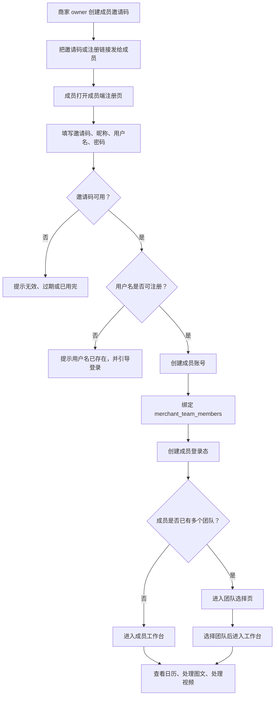
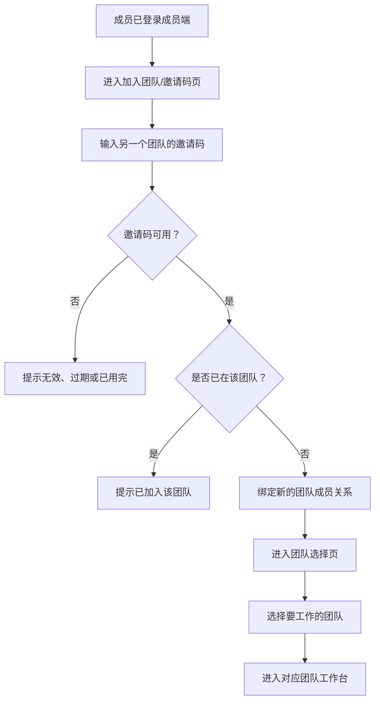

# V2.3.2 成员端独立登录与邀请码注册 PRD

> 状态：产品方案稿
> 日期：2026-05-20
> 范围：成员端独立登录、邀请码注册、成员端访问保护

## 1. 文档定位

本 PRD 用来补齐“成员端应当有自己的登录和注册入口”这一产品链路。

当前成员端已经有视频、图文、日历、历史等工作台页面，但入口仍偏向“用户端/商家端已登录后跳转”。这会导致真实成员没有自然的注册、登录、找回入口，也不利于后续把成员端做成移动端 Web App / PWA。

本次先形成产品文档，后续再进入代码实现。

## 2. 背景与当前问题

### 2.1 当前已有能力

1. 用户端/商家端已经可以创建成员邀请码。
2. 成员端已有主要页面：
   - `/member`
   - `/member/calendar`
   - `/member/article/[taskId]`
   - `/member/video/[taskId]`
   - `/member/history`
3. 成员端已有邀请码页面 `/member/invite`，但它更接近“已登录账号接受邀请码”。
4. 后端已有成员团队关系表和成员工作区读取能力。

### 2.2 当前主要问题

1. 成员没有独立登录页。
2. 成员没有独立注册页。
3. `/member/invite` 当前需要已有登录态，不能承担“新成员输入邀请码注册”的完整流程。
4. 当前通用登录页偏商家 owner 身份，登录成功后会校验商家 owner 工作区，不适合成员登录。
5. 未登录访问成员端工作台时，页面层缺少明确的成员登录重定向，容易变成接口报错。
6. 用户端跳成员端的路径可以用于 owner 预览，但不能替代成员自己的入口。

## 3. 产品目标

本次目标是让成员端成为一个独立可进入、可注册、可登录、可持续使用的工作区。

1. 成员拿到商家发的邀请码后，可以在成员端注册。
2. 成员注册时填写邀请码、昵称、用户名、密码。
3. 用户名可以由成员自己填写邮箱或手机号，但本阶段不做验证码校验。
4. 注册成功后，系统自动绑定到对应商家团队，并进入成员工作台。
5. 已注册成员可以从成员端登录页直接登录。
6. 已注册成员可以继续输入其他团队的邀请码，加入另一个团队。
7. 成员登录后可以进入选题日历、图文工作台、视频工作台、历史记录。
8. 成员不能进入商家 owner 后台。
9. 商家 owner 现有登录、注册、邀请码创建流程不被破坏。

## 4. 非目标

本次不解决以下问题：

1. 不重做商家 owner 注册链路。
2. 不重做平台管理端登录。
3. 不新增发布平台账号授权能力。
4. 不调整 Dify、AI 剪辑、OpenStoryline、视频 worker 主流程。
5. 不接入手机号验证码。
6. 不接入邮箱验证码。
7. 不做系统自动发送邀请码短信或邮件，邀请码仍由商家 owner 自行复制分享。
8. 不做复杂的多团队切换器。
9. 不做完整密码找回，密码找回可放入后续版本。
10. 不把成员端改造成原生 App，本阶段仍是 Web/PWA 方向。

## 5. 角色与对象

### 5.1 商家 owner

商家 owner 在用户端/商家端创建成员邀请码，并把邀请码或注册链接发给员工、兼职剪辑、运营同学。

### 5.2 成员

成员通过邀请码注册成员账号，后续使用自己的用户名和密码登录成员端，完成图文、视频、内容执行等任务。

用户名本阶段只作为登录标识，可以填写邮箱或手机号，但系统不发送验证码、不验证邮箱或手机号归属。

### 5.3 系统

系统负责校验邀请码、创建成员账号、绑定团队关系、生成登录态，并按成员身份限制访问范围。

## 6. 主流程

### 6.1 新成员注册加入团队



### 6.2 已有成员加入其他团队



## 7. 页面需求

### 7.1 成员登录页

建议路径：`/member/login`

用于已注册成员登录。

页面元素：

1. 成员端品牌标题。
2. 用户名输入框。
3. 密码输入框。
4. 登录按钮。
5. “使用邀请码注册”入口。
6. 错误提示区域。

行为规则：

1. 未登录访问 `/member`、`/member/calendar`、`/member/article/*`、`/member/video/*`、`/member/history` 时，跳转到 `/member/login?next=原路径`。
2. 登录成功后，如果有安全的 `next`，回到 `next`。
3. 没有 `next` 时，单团队成员默认进入 `/member/calendar` 或 `/member`。
4. 没有 `next` 且成员属于多个团队时，先进入团队选择页。
5. 已登录成员访问 `/member/login` 时，自动跳转成员工作台或团队选择页。
6. 商家 owner 仍使用 `/login`，不强行迁移到成员登录页。

简化线框：

```text
+----------------------------------+
| 静境成员端                        |
|                                  |
| 用户名                           |
| [ 邮箱或手机号                ]   |
|                                  |
| 密码                             |
| [ password                   ]   |
|                                  |
| [ 登录成员端 ]                   |
|                                  |
| 没有账号？使用邀请码注册          |
+----------------------------------+
```

### 7.2 成员邀请码注册页

建议路径：`/member/register`

用于新成员注册。

页面元素：

1. 邀请码输入框。
2. 昵称/展示名输入框。
3. 用户名输入框。
4. 密码输入框。
5. 确认密码输入框。
6. 注册并进入成员端按钮。
7. “已有账号，去登录”入口。

行为规则：

1. 支持 `/member/register?code=xxxx` 预填邀请码。
2. 邀请码不可用时，不创建账号。
3. 用户名已存在时，引导成员登录。
4. 注册成功后自动登录，并进入成员工作台。
5. 已登录成员访问注册页时，自动进入成员工作台。
6. 本阶段用户名只做登录标识，不发送验证码。

简化线框：

```text
+----------------------------------+
| 加入团队                         |
|                                  |
| 邀请码                           |
| [ code                       ]   |
|                                  |
| 昵称                             |
| [ display name               ]   |
|                                  |
| 用户名                           |
| [ 邮箱或手机号                ]   |
|                                  |
| 密码                             |
| [ password                   ]   |
|                                  |
| 确认密码                         |
| [ password again             ]   |
|                                  |
| [ 注册并进入成员端 ]              |
|                                  |
| 已有账号？去登录                  |
+----------------------------------+
```

### 7.3 现有 `/member/invite`

保留现有能力，但重新定位：

1. 未登录访问 `/member/invite` 时，跳转到 `/member/register`。
2. 如果 URL 带 `code`，跳转时保留 code。
3. 已登录成员访问 `/member/invite` 时，作为“加入其他团队/接受邀请码”的页面。
4. 成员输入其他团队邀请码后，可加入另一个团队。
5. 加入成功后，如果成员名下有多个团队，进入团队选择页。
6. 后续如果多团队切换成型，再决定是否把 `/member/invite` 改成更正式的“加入新团队”页。

### 7.4 团队选择页

建议路径：`/member/teams`

P0 采用轻量方案：只有成员名下超过一个团队时才出现团队选择页；单团队成员无感跳过。

页面元素：

1. 团队列表。
2. 团队名称。
3. 团队状态。
4. 进入按钮。
5. 加入其他团队入口。

行为规则：

1. 成员登录后如果有多个团队，进入 `/member/teams`。
2. 成员选择团队后，进入该团队的成员工作台。
3. 成员在某个团队工作台内的任务、日历、图文、视频数据，都以当前选中团队为准。
4. P0 不做复杂的全局团队切换器；如需切换，可先回到 `/member/teams`。

简化线框：

```text
+----------------------------------+
| 选择团队                         |
|                                  |
| [ 门店 A / 团队 A        进入 ]  |
| [ 门店 B / 团队 B        进入 ]  |
|                                  |
| + 输入邀请码加入其他团队          |
+----------------------------------+
```

## 8. API 与数据需求

### 8.1 成员登录 API

建议新增：

`POST /api/auth/member-login`

请求字段：

```json
{
  "username": "member@example.com",
  "password": "password",
  "next": "/member/calendar"
}
```

核心规则：

1. 校验用户名和密码。
2. 校验该用户存在可用的成员工作区，或可访问成员端的团队关系。
3. 创建登录 session。
4. 返回安全跳转地址。
5. 不要求该用户是商家 owner。
6. 不允许跳转到 `/platform-admin` 或其他管理端敏感路径。
7. 用户名可以是邮箱格式或手机号格式，但本阶段不触发验证码。

### 8.2 成员邀请码注册 API

建议新增：

`POST /api/auth/member-register-with-invite`

请求字段：

```json
{
  "inviteCode": "ABCD1234",
  "displayName": "小王",
  "username": "member@example.com",
  "password": "password"
}
```

核心规则：

1. 校验邀请码是否存在、启用、未过期、未超过使用次数。
2. 校验用户名是否可注册。
3. 创建成员用户，角色为 `merchant_member`。
4. 绑定 `merchant_team_members`。
5. 邀请码使用次数加一。
6. 创建登录 session。
7. 返回成员工作区摘要、团队数量和跳转地址。
8. 单团队成员返回成员工作台地址，多团队成员返回团队选择页地址。

### 8.3 现有邀请码接受 API

现有：

`POST /api/member/invitations/accept`

建议保留，但定位为：

1. 已登录成员账号接受邀请码。
2. 支持已有成员账号加入新团队。
3. 成员可以通过该接口加入其他团队。
4. 不作为新成员注册主入口。

### 8.4 团队列表与选择 API

建议新增或补齐：

`GET /api/member/workspaces`

用于返回当前成员可进入的团队列表。

建议新增或补齐：

`POST /api/member/workspaces/select`

请求字段：

```json
{
  "merchantId": "merchant-id"
}
```

核心规则：

1. 只允许选择当前成员已加入且状态可用的团队。
2. 选择成功后，成员端后续任务、日历、图文、视频接口都使用当前团队上下文。
3. P0 可以用 session、cookie 或服务端 current workspace 字段实现，具体实现以当前代码成本最低的方式为准。

### 8.5 成员端访问保护

需要补齐成员端保护逻辑：

1. `/member/login`、`/member/register` 是公开页面。
2. `/member/teams` 需要登录态。
3. `/member/*` 其他工作台页面需要登录态和当前团队上下文。
4. 登录态用户必须能拿到成员工作区或被允许预览成员工作台。
5. 未登录时跳转 `/member/login?next=...`。
6. 已登录但没有选择团队时，跳转 `/member/teams`。
7. 无成员权限时展示清晰错误，不进入空白工作台。

## 9. 状态与错误提示

### 9.1 注册错误

1. 邀请码不存在。
2. 邀请码已停用。
3. 邀请码已过期。
4. 邀请码使用次数已满。
5. 用户名已存在。
6. 密码不符合要求。
7. 团队已不可用。
8. 绑定团队失败。

### 9.2 登录错误

1. 用户名或密码错误。
2. 账号没有成员工作区。
3. 账号已停用。
4. 团队已停用。
5. 登录态创建失败。

### 9.3 文案原则

1. 不暴露过多安全细节。
2. 对成员给出下一步动作。
3. 对 owner 和成员身份混用的情况，提示去正确入口。
4. 用户名虽然可填写邮箱或手机号，但错误文案不承诺验证码能力。

## 10. 验收标准

### 10.1 新成员注册

1. 商家 owner 创建一个成员邀请码。
2. 新成员打开 `/member/register?code=邀请码`。
3. 填写昵称、用户名、密码后注册成功。
4. 系统创建成员用户。
5. 系统绑定该成员到对应商家团队。
6. 注册后自动进入成员工作台。
7. 成员可以进入日历、图文、视频、历史页面。

### 10.2 已有成员登录

1. 成员打开 `/member/login`。
2. 输入用户名和密码。
3. 登录成功后进入 `/member/calendar` 或原始 `next`。
4. 刷新页面后仍保持登录态。
5. 退出登录后再次访问成员工作台会回到成员登录页。

### 10.3 已有成员加入其他团队

1. 已登录成员进入 `/member/invite`。
2. 输入另一个团队的邀请码。
3. 邀请码校验通过后，系统新增该成员与新团队的关系。
4. 成员名下超过一个团队时，进入 `/member/teams`。
5. 成员选择团队后，进入对应团队的成员工作台。
6. 不同团队的日历、图文、视频任务不能串数据。

### 10.4 权限隔离

1. 成员不能进入商家 owner 后台。
2. 成员不能进入平台管理端。
3. 商家 owner 原有 `/login` 登录链路不受影响。
4. 平台管理端登录不受影响。

### 10.5 邀请码异常

1. 无效邀请码不能注册。
2. 过期邀请码不能注册。
3. 超过使用次数的邀请码不能注册。
4. 已存在用户名注册时提示去登录。

## 11. 分期建议

### P0：国内化主链路先跑通

优先支持当前国内化部署环境：

1. 新增成员登录页。
2. 新增成员注册页。
3. 登录标识统一叫“用户名”，允许填写邮箱或手机号文本。
4. 不接入短信验证码和邮箱验证码。
5. 新增成员登录 API。
6. 新增成员邀请码注册 API。
7. 支持已登录成员输入其他团队邀请码。
8. 补齐轻量团队选择页。
9. 补齐成员端访问保护。
10. 保留现有 owner 登录和注册。
11. 做最小端到端验证。

### P1：兼容与增强

1. 补齐 Supabase 兼容路径。
2. 增加密码找回。
3. 增加成员账号停用、重置密码。
4. 增加更完整的团队切换器。
5. 增加成员加入团队后的通知和审计记录。

### P2：PWA 与移动端体验

1. 成员端加安装提示。
2. 优化移动端登录和注册表单。
3. 增加任务提醒入口。
4. 优化视频/图文处理移动端工作流。

## 12. 实现影响与风险

### 12.1 影响范围

预计涉及：

1. 成员端公开页面。
2. 成员端 layout 或 middleware 访问保护。
3. auth API routes。
4. auth contract/schema。
5. 国内化 Postgres 用户创建与 session 创建。
6. 邀请码绑定事务。
7. 登录跳转安全规则。
8. 成员多团队列表与当前团队上下文。

### 12.2 主要风险

1. 不要把成员登录误接到 owner 登录校验上。
2. 不要让成员账号进入 `/dashboard`。
3. 注册创建用户和绑定团队需要尽量保持事务一致。
4. 如果绑定团队失败，需要避免留下不可用账号或给出可恢复路径。
5. 登录 session 可能与 owner 共用 cookie，需要明确不同入口的重定向规则。
6. 错误提示要避免泄露账号是否存在等过多信息。
7. 多团队场景必须明确当前团队上下文，避免读取或提交到错误团队。
8. 用户名可填写手机号或邮箱，但没有验证码，不应在文案上暗示“已验证”。

## 13. 回滚策略

如上线后发现问题，可按以下顺序回滚：

1. 下线 `/member/register` 新入口。
2. 下线 `/api/auth/member-register-with-invite`。
3. 下线 `/member/teams` 多团队选择入口。
4. 保留原 `/member/invite` 已登录接受邀请码能力。
5. 成员端工作台页面不回滚。
6. owner 登录、平台管理登录不应受影响。

## 14. 产品决策

1. 成员登录方式：用户名 + 密码。
2. 用户名可以填写邮箱或手机号文本。
3. 本阶段不做手机号验证码。
4. 本阶段不做邮箱验证码。
5. 本阶段不做系统自动发送邀请码短信或邮件。
6. 已有成员允许输入其他团队邀请码，加入另一个团队。
7. 单团队成员登录后默认进入 `/member/calendar`。
8. 多团队成员登录后先进入 `/member/teams`。
9. 邀请链接统一使用 `/member/register?code=xxx`。
10. 密码找回放到 P1。
11. 商家 owner 仍使用 `/login`，成员仍使用 `/member/login`。
12. owner 是否加入其他商家团队不作为 P0 目标，先按成员账号处理多团队。

## 15. 当前建议结论

建议 P0 先按“成员端独立注册 + 独立登录 + 国内化环境跑通”推进。

推荐入口：

1. 成员登录：`/member/login`
2. 成员注册：`/member/register`
3. 邀请链接：`/member/register?code=邀请码`
4. 加入其他团队：`/member/invite`
5. 团队选择：`/member/teams`
6. 单团队注册后默认落点：`/member/calendar`
7. 多团队登录或加入团队后默认落点：`/member/teams`

这样最贴合当前成员端承担的真实任务：拿到选题日历，然后进入图文或视频工作台执行。
