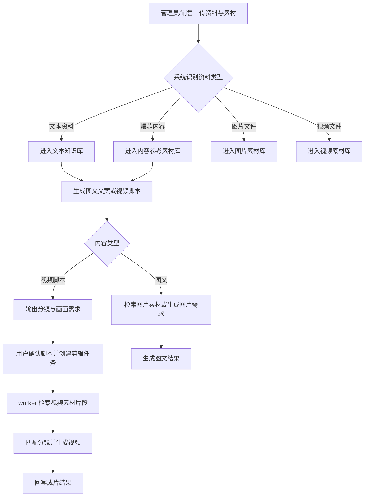
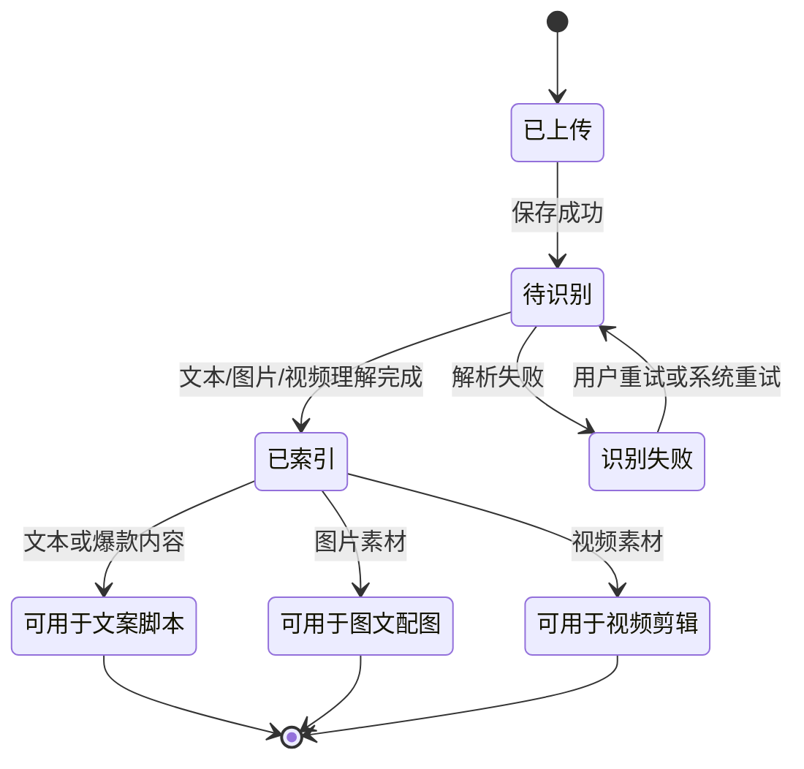
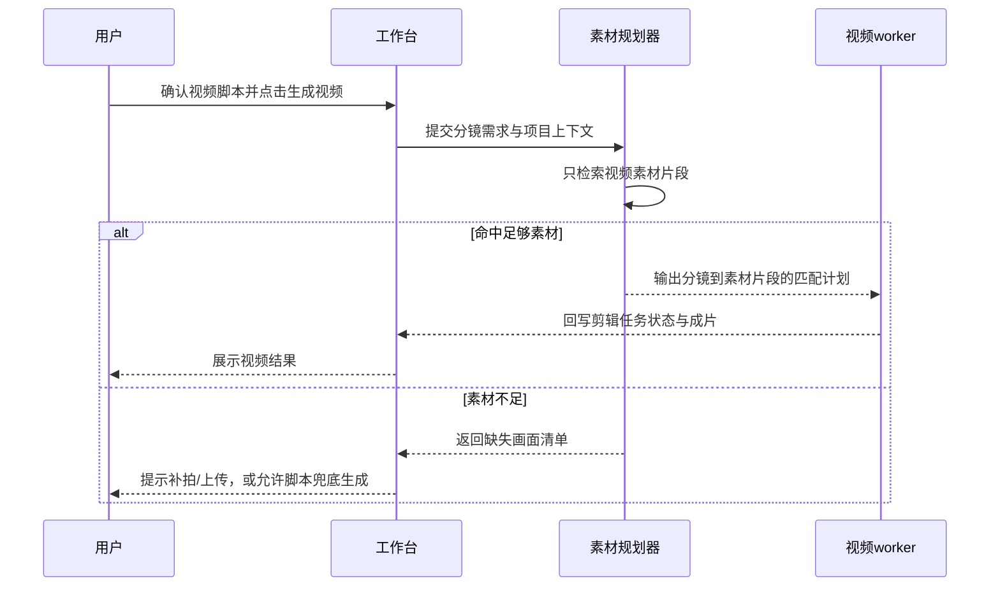

# 产品需求文档：内容检索与媒体素材分层路由 - V2.4

## 1. 综述 (Overview)

### 1.1 项目背景与核心问题

在 V2.3 内容日历驱动图文/视频生成链路中，系统已经从“咨询台主入口”转向“团队选题 + 用户每日任务 + 图文/视频工作台”的内容生产方式。客户进一步沟通后明确：接下来要优化的重点不是继续扩展用户信息字段，而是把内容生成前后的检索链路理顺。

当前系统中“知识库”“素材库”“媒体素材”三个概念容易混用：

1. 文本类知识库主要服务图文文案和视频脚本生成，例如销售沟通转写、项目卖点、客户异议、区域打法、违禁词和合规表达。
2. 爆款内容通过外部 API 抓取，本质上也是文案/脚本参考素材，用于学习标题、结构、hook、节奏和表达方式。
3. 图片素材可以服务图文配图，也可以在后续生图链路中作为参考，但不是 AI 剪辑 worker 的核心输入。
4. 视频素材是 AI 剪辑 worker 的核心输入，需要被多模态理解、切片、标注、检索，再按脚本分镜分配到时间轴。

因此，V2.4 的核心问题是：系统需要建立“按用途分层检索”的规则。不同内容生成场景只能检索自己能消费的上下文和素材，避免图文拿到视频素材、worker 拿到爆款文案、脚本生成阶段过早绑定具体视频文件。

### 1.2 核心业务流程 / 用户旅程地图

1. **资料与素材入库** - 团队管理员或销售上传文本资料、爆款内容链接、图片素材和视频素材，系统按用途标记。
2. **文本与爆款内容检索** - 图文文案和视频脚本生成时，系统检索文本知识库与爆款内容，形成写作/脚本依据。
3. **图文配图检索或生图准备** - 图文生成时，系统只检索图片素材或生成图片 brief/prompt，不检索视频素材。
4. **视频脚本生成画面需求** - 视频脚本生成时，系统输出分镜、口播、字幕、所需画面，不强行决定最终剪辑素材片段。
5. **AI 剪辑视频素材检索** - 创建剪辑任务时，worker 或素材规划器只检索视频素材，根据分镜需求匹配片段并组装成片。
6. **缺失与降级处理** - 当文本、图片或视频素材缺失时，系统给出用户可理解提示，并提供可继续生成的降级路径。

### 1.3 Mermaid 图（流程/状态/时序）

#### 1.3.1 核心用户操作流



#### 1.3.2 素材处理状态机



#### 1.3.3 AI 剪辑素材匹配时序



## 2. 用户故事详述 (User Stories)

### 阶段一：资料与素材入库

---

#### **US-01: 作为团队管理员，我希望上传的资料能被系统按用途分类，以便后续生成链路只检索合适内容**

* **价值陈述 (Value Statement)**:
  * **作为** 团队管理员或销售负责人
  * **我希望** 文本资料、爆款内容、图片素材、视频素材被系统自动区分
  * **以便于** 图文、视频脚本、AI 剪辑分别调用正确素材，减少混用和错误推荐

* **业务规则与逻辑 (Business Logic)**:
  1. **前置条件**:
     * 用户已登录商家端。
     * 当前团队已有可用项目空间。
  2. **资料类型定义**:
     * `text_knowledge`: 文本资料，包括 txt/md、销售沟通转写、客户问答、项目卖点、区域打法、违禁词、合规表达。
     * `viral_reference`: 爆款内容，包括外部 API 抓取的小红书/抖音高互动内容、标题、正文、脚本、互动数据和拆解。
     * `image_asset`: 图片素材，包括项目图、户型图、样板间、配套图片、可作为图文配图或生图参考的图片。
     * `video_asset`: 视频素材，包括项目实拍、样板间、周边配套、转场 B-roll、销售口播片段等可用于剪辑的视频。
  3. **操作流程 (Happy Path)**:
     * 用户上传或抓取内容。
     * 系统根据入口、文件类型、用户选择和解析结果标记素材用途。
     * 系统将文本/爆款内容送入文案脚本检索池。
     * 系统将图片素材送入图文配图/生图参考检索池。
     * 系统将视频素材送入 AI 剪辑素材检索池。
  4. **异常处理 (Error Handling)**:
     * 文件类型不支持时，提示用户当前支持的文件类型。
     * 视频素材未完成识别时，不进入 worker 可用池，但仍在素材列表显示“处理中”。
     * 爆款内容 API 抓取失败时，保留用户提交记录并提示稍后重试。

* **验收标准 (Acceptance Criteria)**:
  * **场景1: 上传销售沟通转写稿**
    * **GIVEN** 用户上传 txt/md 文档
    * **WHEN** 文档处理成功
    * **THEN** 该文档进入文本知识检索池，可被图文文案和视频脚本生成调用
  * **场景2: 上传视频素材**
    * **GIVEN** 用户上传 mp4/mov 等视频文件
    * **WHEN** 视频识别完成
    * **THEN** 该素材只进入视频剪辑素材检索池，不进入图文配图池
  * **场景3: 抓取爆款内容**
    * **GIVEN** 用户通过素材中心抓取爆款内容
    * **WHEN** 内容入库成功
    * **THEN** 该内容可用于图文文案和视频脚本生成，不作为 worker 输入视频素材

* **页面布局线框图 (ASCII Wireframe)**:

```text
+--------------------------------------------------------------+
| 用户知识库 / 素材入库                                         |
+-------------------+-------------------+----------------------+
| 文本资料上传       | 爆款内容抓取       | 图片/视频素材上传      |
| txt / md           | 小红书 / 抖音链接  | image / video         |
| 销售转写 / 话术    | 标题 / 正文 / hook | 项目图 / B-roll       |
| [上传资料]         | [抓取内容]         | [上传素材]             |
+-------------------+-------------------+----------------------+
| 入库列表                                                     |
| 类型        名称          状态       可用于                   |
| 文本        客户异议       已索引     文案/脚本                |
| 爆款        高赞笔记       已索引     文案/脚本                |
| 图片        样板间客厅     已索引     图文配图/生图参考         |
| 视频        周边商圈       识别中     AI剪辑                  |
+--------------------------------------------------------------+
```

---

### 阶段二：图文文案与视频脚本文本检索

---

#### **US-02: 作为内容生产者，我希望图文文案和视频脚本优先检索文本知识与爆款内容，以便生成更贴近项目和平台风格的内容**

* **价值陈述 (Value Statement)**:
  * **作为** 房地产中介或内容运营人员
  * **我希望** 生成图文文案和视频脚本时，系统能自动参考项目知识、销售话术和爆款结构
  * **以便于** 输出内容既符合项目真实信息，又更接近小红书/抖音平台的有效表达方式

* **业务规则与逻辑 (Business Logic)**:
  1. **前置条件**:
     * 用户从今日任务、图文工作台或视频工作台触发生成。
     * 团队已上传文本资料或抓取爆款内容；若没有，也允许降级生成。
  2. **检索来源**:
     * 文本知识库：项目卖点、区域打法、客户异议、销售沟通转写、违禁词和合规表达。
     * 爆款内容素材库：高互动标题、正文结构、脚本 hook、评论洞察、表达节奏。
  3. **图文文案检索目标**:
     * 标题角度。
     * 正文结构。
     * 小红书风格表达。
     * 标签、CTA、封面字建议。
     * 风险词和替代表达。
  4. **视频脚本检索目标**:
     * 开头 hook。
     * 口播逻辑。
     * 分镜节奏。
     * 客户痛点和转化话术。
     * 画面需求描述。
  5. **禁止行为**:
     * 生成文案或脚本时，不把视频素材文件本身当成文案依据，除非该视频已完成文字/画面摘要。
     * 爆款内容不直接交给 worker 当作视频输入资产。

* **验收标准 (Acceptance Criteria)**:
  * **场景1: 图文生成**
    * **GIVEN** 文本知识库和爆款内容均有可用数据
    * **WHEN** 用户生成图文
    * **THEN** 生成结果的标题、正文、标签、CTA 参考文本知识和爆款结构，并记录引用来源
  * **场景2: 视频脚本生成**
    * **GIVEN** 用户从今日视频任务进入视频工作台
    * **WHEN** 用户点击生成视频脚本
    * **THEN** 脚本输出包含 hook、分镜、口播、字幕、拍摄提示和所需画面
  * **场景3: 文本资料缺失**
    * **GIVEN** 团队没有上传文本资料
    * **WHEN** 用户触发生成
    * **THEN** 系统使用团队内容日历和基础项目信息降级生成，并提示可上传销售资料提升质量

---

### 阶段三：图文图片检索与生图准备

---

#### **US-03: 作为内容生产者，我希望图文生成时只检索图片素材或生成图片需求，以便图文配图不混入视频素材**

* **价值陈述 (Value Statement)**:
  * **作为** 发布图文的中介或运营人员
  * **我希望** 图文生成时系统能匹配项目图片，或生成可用于生图的图片需求
  * **以便于** 图文内容从文案到配图都围绕同一个项目主题表达

* **业务规则与逻辑 (Business Logic)**:
  1. **前置条件**:
     * 用户正在生成图文内容。
     * 系统已得到本次图文主题、标题方向、文案草稿或内容日历任务。
  2. **图片来源优先级**:
     * 优先使用已上传的项目图片素材。
     * 若图片素材不足，则生成图片 brief/prompt，交给后续生图链路。
     * 后续可通过 LangGraph/LangChain 类编排链路完成图片生成和地址回写。
  3. **检索规则**:
     * 只检索 `image_asset`。
     * 不检索 `video_asset`。
     * 爆款内容只影响配图策略和封面字建议，不作为图片文件。
  4. **输出结果**:
     * 自动匹配的项目图片引用。
     * 图片用途建议，例如封面、内页、对比图、配套图。
     * 封面字建议。
     * 若无图片，则输出生图 brief/prompt。

* **验收标准 (Acceptance Criteria)**:
  * **场景1: 有图片素材**
    * **GIVEN** 团队已上传项目图片
    * **WHEN** 用户生成图文
    * **THEN** 系统只返回图片素材引用，不返回视频素材
  * **场景2: 没有图片素材**
    * **GIVEN** 团队没有可用图片素材
    * **WHEN** 用户生成图文
    * **THEN** 系统返回图片 brief/prompt，并提示后续可上传图片素材提升匹配准确度
  * **场景3: 爆款内容参与图文**
    * **GIVEN** 素材库有爆款图文内容
    * **WHEN** 用户生成图文
    * **THEN** 爆款内容只影响标题、正文结构和封面字，不被误认为项目图片

* **页面布局线框图 (ASCII Wireframe)**:

```text
+--------------------------------------------------------------+
| 图文生成结果                                                  |
+--------------------------------------------------------------+
| 标题：xxx                                                     |
| 正文：xxx                                                     |
| 标签：#区域 #刚需 #样板间                                      |
| CTA：私信领取项目资料                                          |
+--------------------------------------------------------------+
| 配图建议                                                     |
| [封面图] 项目外立面.jpg      封面字：xxx                      |
| [内页图] 样板间客厅.jpg      用途：讲空间感                   |
| [内页图] 周边配套.jpg        用途：讲生活便利                 |
| 若无图片：展示生图 brief/prompt                               |
+--------------------------------------------------------------+
```

---

### 阶段四：视频脚本画面需求与 AI 剪辑素材匹配

---

#### **US-04: 作为视频创作者，我希望视频脚本先描述每个分镜需要什么画面，以便 worker 后续自动匹配视频素材**

* **价值陈述 (Value Statement)**:
  * **作为** 房地产中介或拍摄人员
  * **我希望** 视频脚本清楚告诉我每个时间段需要什么画面
  * **以便于** 我可以拍摄补充素材，系统也可以从已有视频素材中自动匹配可剪辑片段

* **业务规则与逻辑 (Business Logic)**:
  1. **前置条件**:
     * 用户正在生成或修改视频脚本。
     * 系统可以检索文本知识和爆款内容，但不在脚本阶段强制绑定具体视频片段。
  2. **脚本输出要求**:
     * 每个分镜包含时间范围、画面目的、口播、字幕、所需画面、拍摄提示、替代画面。
     * `所需画面` 必须是可检索的视频素材需求，例如“项目外立面远景”“样板间客厅横移”“周边商圈人流”“售楼处接待区”。
     * 每个分镜可附带 `assetQuery` 或等价描述，供 worker 检索。
  3. **禁止行为**:
     * 脚本 agent 不声称已经完成剪辑。
     * 脚本 agent 不直接承诺具体视频素材片段一定可用。
     * 脚本 agent 不把图片素材当成可剪辑视频片段。

* **验收标准 (Acceptance Criteria)**:
  * **场景1: 生成视频脚本**
    * **GIVEN** 用户选择今日视频任务
    * **WHEN** 用户生成视频脚本
    * **THEN** 每个分镜都有清晰的画面需求和拍摄提示
  * **场景2: 缺少视频素材**
    * **GIVEN** 团队没有上传视频素材
    * **WHEN** 用户生成脚本
    * **THEN** 系统仍生成脚本，但提示哪些画面需要补拍或上传
  * **场景3: 爆款内容参与脚本**
    * **GIVEN** 素材库有爆款视频脚本拆解
    * **WHEN** 用户生成视频脚本
    * **THEN** 系统参考爆款 hook 和节奏，但不把爆款视频当成本项目剪辑素材

---

#### **US-05: 作为使用 AI 剪辑的人，我希望创建视频任务时 worker 只检索视频素材，以便剪辑结果不会混入图片或文案素材**

* **价值陈述 (Value Statement)**:
  * **作为** 点击 AI 一键剪辑的用户
  * **我希望** 系统根据脚本分镜自动找到对应的视频素材
  * **以便于** 减少手动选择素材和剪辑成本

* **业务规则与逻辑 (Business Logic)**:
  1. **前置条件**:
     * 用户已确认视频脚本。
     * 用户点击创建视频任务。
     * 系统已有用户上传片段或团队视频素材库。
  2. **视频素材检索来源**:
     * 当前视频草稿上传的用户素材。
     * 团队共享视频素材库。
     * 后续经多模态识别后的素材片段索引。
  3. **素材识别要求**:
     * 视频素材需要经过画面理解、ASR、OCR、场景标签和可用片段切分。
     * worker 可根据脚本中的画面需求检索片段。
     * 当存在用户手动上传片段时，优先使用用户片段；不足时补充团队共享视频素材。
  4. **worker 输入规则**:
     * worker 输入只包含视频素材或可剪辑视频片段。
     * 图片素材不进入视频 worker 的主剪辑素材池。
     * 爆款内容不进入 worker 的 `input_assets`。
     * 文本知识只作为脚本依据，不作为剪辑素材文件。
  5. **异常处理**:
     * 某个分镜没有匹配素材时，worker 返回缺失画面清单。
     * 素材不足时，允许用户上传补充素材后重试。
     * 如果允许兜底模式，系统必须明确告知“部分画面使用脚本兜底或通用转场”。

* **验收标准 (Acceptance Criteria)**:
  * **场景1: 视频素材充足**
    * **GIVEN** 团队已有可用视频素材片段
    * **WHEN** 用户创建 AI 剪辑任务
    * **THEN** worker 输入只包含视频素材，并按分镜需求生成匹配计划
  * **场景2: 用户上传片段优先**
    * **GIVEN** 当前草稿已有用户上传视频片段
    * **WHEN** 创建剪辑任务
    * **THEN** 系统优先使用当前草稿素材，再补充团队共享视频素材
  * **场景3: 素材不足**
    * **GIVEN** 某些分镜没有可用视频素材
    * **WHEN** 创建剪辑任务
    * **THEN** 系统返回缺失画面列表，并提示用户补拍/上传或选择兜底生成

---

### 阶段五：缺失与降级处理

---

#### **US-06: 作为用户，我希望素材缺失时系统给出可理解提示，以便我知道该上传什么或是否可以继续生成**

* **价值陈述 (Value Statement)**:
  * **作为** 销售或中介成员
  * **我希望** 当系统缺少文本、图片或视频素材时，不显示技术错误
  * **以便于** 我知道下一步应该上传资料、补拍素材，还是先继续生成草稿

* **业务规则与逻辑 (Business Logic)**:
  1. **文本资料缺失**:
     * 图文/视频脚本仍可基于今日任务和基础项目上下文生成。
     * 系统提示“上传销售沟通转写、项目卖点或客户问答后，内容会更贴近实际成交话术”。
  2. **爆款内容缺失**:
     * 系统使用内置内容结构模板生成。
     * 提示“添加对标内容后，可提升标题和结构参考质量”。
  3. **图片素材缺失**:
     * 图文生成返回图片 brief/prompt。
     * 不阻塞文案生成。
  4. **视频素材缺失**:
     * 视频脚本生成不阻塞。
     * AI 剪辑任务需要提示缺失画面清单，允许补充素材后重试。
  5. **识别失败**:
     * 不暴露底层错误。
     * 展示“素材识别失败，可重试或重新上传”。

* **验收标准 (Acceptance Criteria)**:
  * **场景1: 文本缺失**
    * **GIVEN** 没有用户知识库文本
    * **WHEN** 用户生成图文或视频脚本
    * **THEN** 系统可以降级生成，并提示补充资料的价值
  * **场景2: 图片缺失**
    * **GIVEN** 没有图片素材
    * **WHEN** 用户生成图文
    * **THEN** 系统生成图片 brief/prompt，而不是报错
  * **场景3: 视频缺失**
    * **GIVEN** 没有视频素材
    * **WHEN** 用户创建剪辑任务
    * **THEN** 系统提示缺失画面，并提供补传或兜底路径

## 3. 检索分层规则

### 3.1 检索目标

| 检索目标 | 输入场景 | 允许来源 | 禁止来源 | 输出 |
| --- | --- | --- | --- | --- |
| 文案生成上下文 | 图文文案 | 文本知识库、爆款内容 | 视频文件、未摘要图片 | 标题、正文、标签、CTA、风险提示 |
| 脚本生成上下文 | 视频脚本 | 文本知识库、爆款内容、已摘要视频素材 | 原始未识别视频文件 | hook、口播、分镜、画面需求 |
| 图文配图素材 | 图文配图 | 图片素材、生图 brief/prompt | 视频素材 | 图片引用、用途、封面字建议 |
| 视频剪辑素材 | AI 剪辑 worker | 视频素材、视频片段索引、当前草稿上传片段 | 文本知识、爆款内容、图片素材 | worker input assets、分镜匹配计划 |

### 3.2 素材优先级

1. 当前用户在本次草稿中上传的素材。
2. 团队共享项目素材。
3. 近期上传且已识别完成的素材。
4. 与当前任务主题、分镜需求、项目关键词匹配度更高的素材。
5. 爆款内容只能作为表达参考，不能提升为剪辑素材。

### 3.3 输出留痕

每次生成或剪辑任务需要保留以下用户可解释信息：

1. 本次使用了哪些文本资料或爆款内容。
2. 图文配图命中了哪些图片素材，或生成了哪些图片 brief/prompt。
3. 视频剪辑命中了哪些视频素材片段。
4. 哪些分镜缺少素材。
5. 是否使用了降级路径。

## 4. 非目标 (Non-goals)

V2.4 不做以下内容：

1. 不做真实账号发布和平台授权。
2. 不要求一次性完成完整多模态视频理解 worker，但需要为其预留状态和检索目标。
3. 不把图片生成链路作为本 PRD 的核心交付，只定义图文生图 brief/prompt 的接口边界。
4. 不让成员端看到复杂素材库管理概念，成员只看到今日任务、上传素材、生成内容和生成视频。
5. 不把爆款内容当作可直接剪辑的项目视频素材。

## 5. 关键约束与风险

1. **素材类型混用风险**: 如果仍使用统一 `materialRefs`，图文、脚本、worker 会继续混用素材。需要在数据结构或检索结果中明确用途。
2. **视频素材未识别风险**: 上传视频后如果没有画面理解和切片，worker 只能拿到文件，无法准确匹配分镜。
3. **爆款内容版权和合规风险**: 爆款内容只能作为结构和表达参考，不能直接复制正文或脚本。
4. **文本知识污染风险**: 销售转写稿可能包含错误承诺、敏感词或未确认事实，需要合规/违禁词检查。
5. **用户体验风险**: 如果素材缺失时只报技术错误，用户不知道该补什么资料。必须给出可操作提示。

## 6. 后续实现建议

建议后续实现按以下顺序拆分：

1. 新增统一的检索目标类型，例如 `copy_context`、`script_context`、`article_image_asset`、`video_edit_asset`。
2. 把当前混合的 `materialRefs` 拆成按用途过滤的引用，例如图文图片素材引用和视频素材引用。
3. 图文/视频脚本生成先接入文本知识库 + 爆款内容检索。
4. 视频剪辑任务创建时，只检索视频素材并追加到 worker 输入。
5. 后续增加视频素材理解、ASR/OCR、片段切分和分镜匹配计划。

## 7. 待确认问题

1. 图片生成链路后续使用 LangGraph/LangChain 还是先做简单 prompt 生成，需要在实现前再定。
2. 视频素材识别由现有 worker 承担，还是单独新增 asset analyzer，需要在技术方案阶段确认。
3. 成员端是否允许看到“缺失画面清单”，还是只给管理员/销售负责人看到，需要确认。
4. 爆款内容是否需要单独区分“小红书图文爆款”和“抖音视频爆款”，建议后续做平台维度过滤。
