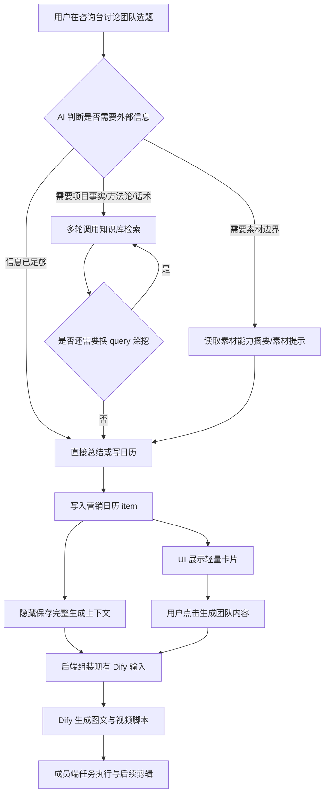
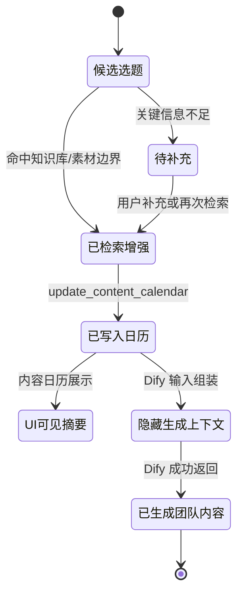

# 产品需求文档：团队选题 Agentic RAG 与日历上下文沉淀 - V2.5

状态：已进入 worktree 实现
日期：2026-05-20
适用范围：咨询台团队选题、营销日历生成/更新、内容日历“生成团队内容”前的 Dify 输入组装

## 1. 综述

### 1.1 项目背景与核心问题

当前项目已经跑通了“内容日历生成团队内容 -> Dify 产出图文和视频脚本 -> 成员端执行 -> video-worker 剪辑”的主链路。下一阶段的关键问题不是再增加 Dify 输入字段，而是提升上游团队选题和日历上下文质量。

用户在咨询台和 AI 讨论“这周选题怎么做”时，AI 应该能像一个内容策划助手一样，按需要检索用户知识库、项目事实、方法论、话术和素材能力边界，而不是只靠当前对话临场发挥。生成营销日历后，日历 item 也不能只是标题和摘要，还要沉淀后续 Dify 生成图文和视频脚本所需的完整上下文。

同时，UI 层不能把所有上下文字段都展示出来。内容日历卡片应保持轻量、可读、可执行；但系统传给 Dify 的输入需要包含完整上下文，保证生成质量。

本次优化的核心目标：

1. 允许读类工具在 Agent loop 中多轮调用，让模型可以换 query 深挖知识库。
2. 把 RAG 从“查几个 chunk”升级为“围绕选题和素材边界的检索策略”。
3. 让日历 item 成为上下文资产，隐藏字段可不展示，但生成团队内容时完整传给 Dify。

### 1.2 当前 Dify 输入约束

本阶段不新增 Dify YAML Start 节点输入。当前 V3.1 workflow 的稳定输入字段为：

1. `calendar_task_json`
2. `viral_references_json`
3. `image_assets_json`
4. `fallback_knowledge_text`
5. `extra_requirement`

后端可以在现有字段内部组织更丰富的数据。例如：

- `calendar_task_json` 承载日历任务、知识引用、素材边界、隐藏指导字段。
- `viral_references_json` 承载知识库片段、话术、方法论、对标素材摘要。
- `image_assets_json` 承载图文可用图片素材。
- `fallback_knowledge_text` 承载压缩后的人类可读事实、话术、边界说明。
- `extra_requirement` 只承载用户本次临时额外要求。

### 1.3 非目标

本 PRD 暂不做：

1. 不新增 Dify YAML 输入字段。
2. 不重写 Dify workflow 节点。
3. 不把所有隐藏上下文字段展示到内容日历 UI。
4. 不恢复自动 `request_user_clarification` 阻断型门禁。
5. 不把“命中知识库后必须按固定模板回答”做成硬规则。
6. 不在视频脚本中强行绑定 OSS 具体素材链接。

## 2. 用户旅程地图

1. **团队选题讨论** - 用户在咨询台询问本周选题、图文方向、视频方向或项目优势。
2. **Agentic RAG 检索** - AI 根据需要多轮检索知识库、方法论、话术和素材能力边界。
3. **营销日历写入** - AI 写入日历 item，同时沉淀用户可见摘要和隐藏生成上下文。
4. **内容日历展示** - UI 展示轻量日历卡片，只显示用户决策和执行需要的信息。
5. **生成团队内容** - 用户点击生成团队内容，后端把完整日历上下文组装进现有 Dify 输入。
6. **成员端执行** - Dify 生成图文和视频脚本，成员端看到可执行任务，video-worker 后续基于脚本和真实素材剪辑。

### 2.1 核心流程图



### 2.2 日历 item 上下文状态



## 3. 用户故事

### 阶段一：团队选题讨论中的多轮检索

#### US-01: 作为团队负责人，我希望 AI 能在讨论选题时多轮检索知识库，以便选题不是泛泛而谈

**价值陈述**

- 作为团队负责人
- 我希望 AI 在讨论“这周选题怎么做”“项目优势怎么盘点”“干货内容怎么讲”时，能按需要多次查询知识库
- 以便生成的选题和日历能真实引用项目事实、方法论和销售话术

**业务规则与逻辑**

1. 当用户明确要求读知识库、盘点资料、总结项目优势时，首轮应优先调用知识库检索。
2. 当用户提出团队选题、内容日历、种草方向、转化话术、视频脚本方向时，AI 可以自主判断是否调用知识库检索。
3. 读类工具允许多轮调用，例如先查“项目优势”，再查“如何选好一套房”，再查“客户异议话术”。
4. 写类工具仍应严格控制。例如 `update_content_calendar` 不应因为读类工具可重复而被无限重复调用。
5. 每轮检索结果都应回到 LLM 上下文，由模型判断继续检索、追问用户、总结，或写入日历。

**验收标准**

- GIVEN 用户询问“这周围绕项目优势和买房干货做哪些选题”
- WHEN 知识库中存在项目事实和方法论资料
- THEN AI 可以连续发起不同 query 的知识库检索，并基于结果组织选题建议

- GIVEN AI 已调用过一次 `retrieve_knowledge_base`
- WHEN 当前对话仍需要另一类资料
- THEN runtime 不应因为该工具已调用过一次而把它从可用工具列表移除

- GIVEN AI 已完成日历写入
- WHEN 后续轮次没有用户明确要求更新
- THEN 系统不应自动重复写入相同日历

### 阶段二：从 chunk 检索升级为选题检索策略

#### US-02: 作为内容策划者，我希望 AI 检索的不只是相似片段，而是围绕选题目标组织资料

**价值陈述**

- 作为内容策划者
- 我希望 AI 能区分项目事实、干货方法论、销售话术和素材边界
- 以便图文和视频脚本的质量更稳定，且不会出现素材无法支撑的画面描述

**业务规则与逻辑**

1. 检索策略至少覆盖四类信息：
   - 项目事实：区位、户型、配套、价格边界、客户画像、真实优势。
   - 干货方法论：如何选房、如何判断房子是否适合、买房避坑、客户决策逻辑。
   - 销售/种草话术：如何把事实包装成小红书种草、抖音口播或转化表达。
   - 素材能力边界：团队真实可用的画面类型、可拍场景、不可假设的画面。
2. 知识库检索结果要返回正文片段和引用信息，而不是只返回 chunk id。
3. 多文档命中时应避免只返回同一文档连续片段。
4. 对明确关键词、业务词、人名、区域词、楼盘词，应保留 keyword grep-like 命中能力，避免纯向量召回漏掉精确词。
5. 对视频脚本方向，AI 应特别注意素材能力边界：不能写“航拍城市天际线”等素材库或成员自拍永远无法支撑的画面。

**验收标准**

- GIVEN 用户知识库中有“如何选好一套房”的方法论文档
- WHEN 用户询问“本周做点买房干货选题”
- THEN AI 的选题建议应能引用该类方法论，而不是只输出通用标题

- GIVEN 用户知识库中有项目事实文档
- WHEN 用户询问“为什么这个房子值得种草”
- THEN AI 应把事实包装成用户可理解的种草角度，同时避免编造未出现的确定性承诺

- GIVEN 团队素材主要是房子、窗外景色、样板间和口播
- WHEN 后续生成视频脚本上下文
- THEN 日历隐藏上下文应限制画面描述，避免生成无法由现有素材支撑的高空航拍、大型活动、人群采访等内容

### 阶段三：日历 item 成为上下文资产

#### US-03: 作为团队负责人，我希望内容日历卡片简洁，但系统能在后台保留完整生成上下文

**价值陈述**

- 作为团队负责人
- 我希望 UI 上看到的是清晰的日历任务，而不是一堆技术字段和知识片段
- 以便团队能快速判断今天做什么，同时 Dify 生成时仍能拿到完整上下文

**业务规则与逻辑**

1. 日历 item 分为两层：
   - UI 可见层：日期、内容类型、标题、摘要、策略标签、执行提示、状态。
   - 隐藏上下文层：知识引用、必须使用事实、内容角度、合规边界、素材提示、镜头约束、检索来源摘要。
2. UI 默认不展示完整 `knowledgeRefs`、chunk 正文、素材检索 trace、Dify 输入中间字段。
3. UI 可以用轻量标识提示“已参考知识库”“含素材边界”“适合图文/视频”，但不展开所有细节。
4. 生成团队内容时，后端必须使用完整日历上下文，而不是只使用 UI 可见标题和摘要。
5. 如果隐藏上下文为空，系统仍可降级生成，但应优先补充基础项目信息和日历摘要。

**建议字段分层**

UI 可见层：

```text
id
dayLabel / taskDate
contentType
title
summary
strategyTag
contentGoal
suggestedPlatform
materialHints
generationStatus
```

隐藏上下文层：

```text
guidance.summary
guidance.mustUseFacts
guidance.sellingPointHints
guidance.audienceHints
guidance.contentAngles
guidance.complianceNotes
guidance.materialHints
guidance.knowledgeRefs
guidance.shotConstraints
guidance.assetCapabilityHints
guidance.retrievalTrace
```

其中 `shotConstraints` 和 `assetCapabilityHints` 属于建议新增的上下文字段，可以存在于日历 item 的隐藏结构中；UI 不要求默认展示。

**验收标准**

- GIVEN 日历 item 已沉淀知识库引用和素材边界
- WHEN 用户打开内容日历
- THEN 卡片默认只展示标题、摘要、策略标签、类型和状态，不展示完整 chunk 正文

- GIVEN 用户点击“生成团队内容”
- WHEN 后端组装 Dify 输入
- THEN `calendar_task_json` 和 `fallback_knowledge_text` 应包含隐藏上下文中的关键事实、内容角度、合规边界和素材限制

- GIVEN 日历 item 含有多条知识引用
- WHEN UI 渲染日历卡片
- THEN UI 可以显示“已参考知识库”之类的轻量提示，但不应把所有引用全文铺开

**页面布局线框图**

```text
+------------------------------------------------------------+
| 团队内容日历                                                |
+------------------------------------------------------------+
| 本周主题：光明区改善客户转化                                  |
| [生成团队内容] [刷新]                                      |
+------------------------------------------------------------+
| 周一 · 图文                         状态：待生成             |
| 标题：买房别只问价格，先看这 3 个判断点                      |
| 摘要：围绕预算、通勤、配套做一条干货种草内容                   |
| 标签：买房干货 / 种草 / 小红书                               |
| 提示：已参考知识库 · 有素材建议                               |
+------------------------------------------------------------+
| 周二 · 视频                         状态：待生成             |
| 标题：为什么这套房适合刚需上车                                |
| 摘要：用口播 + 样板间/窗外素材讲清客户决策逻辑                 |
| 标签：项目优势 / 转化 / 抖音                                  |
| 提示：已参考知识库 · 含镜头边界                               |
+------------------------------------------------------------+
| 注：完整 knowledgeRefs、素材边界、Dify 输入上下文后台保存，     |
|     默认不在卡片中展开。                                      |
+------------------------------------------------------------+
```

### 阶段四：生成团队内容时复用现有 Dify 输入

#### US-04: 作为系统，我希望不新增 Dify 输入字段也能传递完整上下文，以便先降低改造风险

**价值陈述**

- 作为系统
- 我希望继续使用现有 Dify V3.1 输入字段
- 以便在不重写 YAML 的情况下，先提升图文和视频脚本生成质量

**业务规则与逻辑**

1. `calendar_task_json` 必须包含完整日历任务结构，包括隐藏上下文。
2. `viral_references_json` 可以承载知识库片段、话术、方法论和对标素材摘要。
3. `image_assets_json` 继续只承载图文可用图片素材，不混入视频剪辑素材链接。
4. `fallback_knowledge_text` 应压缩成人类可读文本，便于 Dify LLM 节点在 JSON 解析失败或知识库节点弱命中时仍能使用。
5. `extra_requirement` 保持轻量，只放用户本次临时补充，不长期承载结构化上下文。

**验收标准**

- GIVEN Dify YAML Start 节点仍只有现有输入
- WHEN 用户点击生成团队内容
- THEN 系统不需要新增输入字段即可把日历隐藏上下文传入 Dify

- GIVEN 日历 item 有素材边界
- WHEN Dify 生成视频脚本
- THEN 脚本画面描述应优先落在可用素材或可补拍素材范围内

- GIVEN 日历 item 无知识库引用
- WHEN Dify 生成内容
- THEN 系统仍能基于 `fallback_knowledge_text` 中的项目概况和任务摘要降级生成

## 4. UI 展示原则

1. 内容日历 UI 只展示用户决策和执行需要的信息。
2. 隐藏上下文字段默认不展开，不占用日历卡片主要空间。
3. 可以增加轻量提示，例如：
   - 已参考知识库
   - 含素材建议
   - 含镜头边界
   - 需补充素材
4. 如果后续需要调试，可在管理端或 debug 抽屉查看完整上下文，不进入普通成员端默认 UI。
5. UI 文案不要暴露内部字段名、chunk id、Dify 节点名或 workflow 细节。

## 5. 实现边界建议

### 5.1 Agent loop

1. 将工具按能力分为读类和写类。
2. 读类工具允许同一轮 native loop 多次调用，但需要限制总轮数和总 token。
3. 写类工具维持更严格策略，避免重复写入或覆盖用户已确认内容。
4. 工具结果需要保留足够正文和引用信息，供 LLM 下一轮判断。

### 5.2 RAG 质量

1. 支持 explicit document scan。
2. 支持 keyword grep-like scan。
3. 支持 vector semantic search。
4. 支持多文档交错返回。
5. 支持将命中片段转成日历 guidance。

### 5.3 日历上下文

1. 日历 item 的隐藏上下文应作为生成资产保存，不依赖聊天记录。
2. 知识引用和素材边界需要能一路进入 daily task 和 Dify 输入。
3. Dify 输入组装时使用完整上下文，UI 只使用展示子集。

## 6. 待确认事项

1. `shotConstraints` 和 `assetCapabilityHints` 是否作为正式字段进入 `ContentCalendarGuidanceDto`，还是先放在扩展 metadata 中。
2. 是否需要在内容日历卡片上显示“含镜头边界”提示。
3. 素材能力边界第一版是只从 `materialHints/materialRefs` 派生，还是要新增专门的素材能力摘要生成逻辑。
4. 是否需要给用户提供“展开依据”入口查看本条日历参考了哪些知识库资料。

### 6.1 本轮实现选择

1. `shotConstraints`、`assetCapabilityHints`、`retrievalTrace` 作为 `ContentCalendarGuidanceDto` 的可选隐藏字段进入结构化日历上下文。
2. 本轮不改 UI 展示，只保证字段保存、汇总、传输；后续再决定是否加“含镜头边界”等轻量提示。
3. 视频素材能力第一版在 Dify 输入组装阶段从素材库 `video_edit_asset` 检索，转成 `videoAssetCapabilities` 放入 `calendar_task_json` 和 `fallback_knowledge_text`，不传 OSS/COS 具体链接。
4. Dify YAML Start 输入保持不变。

## 7. 验收清单

1. 咨询台团队选题讨论中，知识库读类工具可多轮调用。
2. AI 能基于不同 query 分别检索项目事实、干货方法论和话术。
3. 营销日历 item 写入后包含 UI 可见摘要和隐藏生成上下文。
4. 内容日历 UI 不被隐藏字段撑爆。
5. 点击生成团队内容时，现有 Dify 输入字段中能拿到完整上下文。
6. Dify 生成的视频脚本不再明显出现当前素材能力无法支撑的画面描述。
7. 不新增 Dify YAML Start 输入字段。
