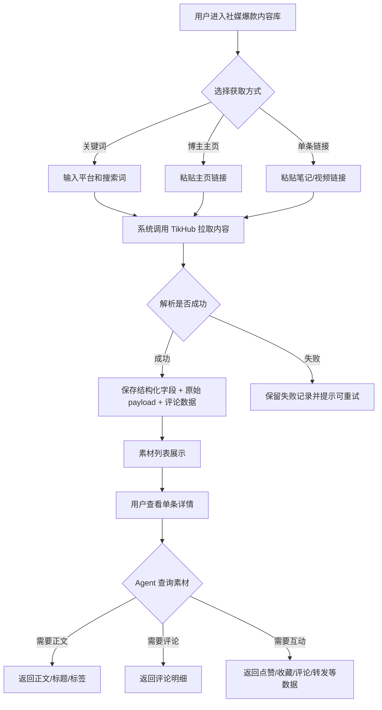
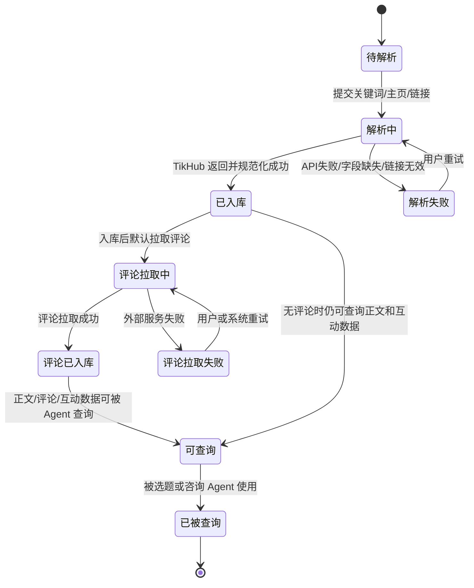
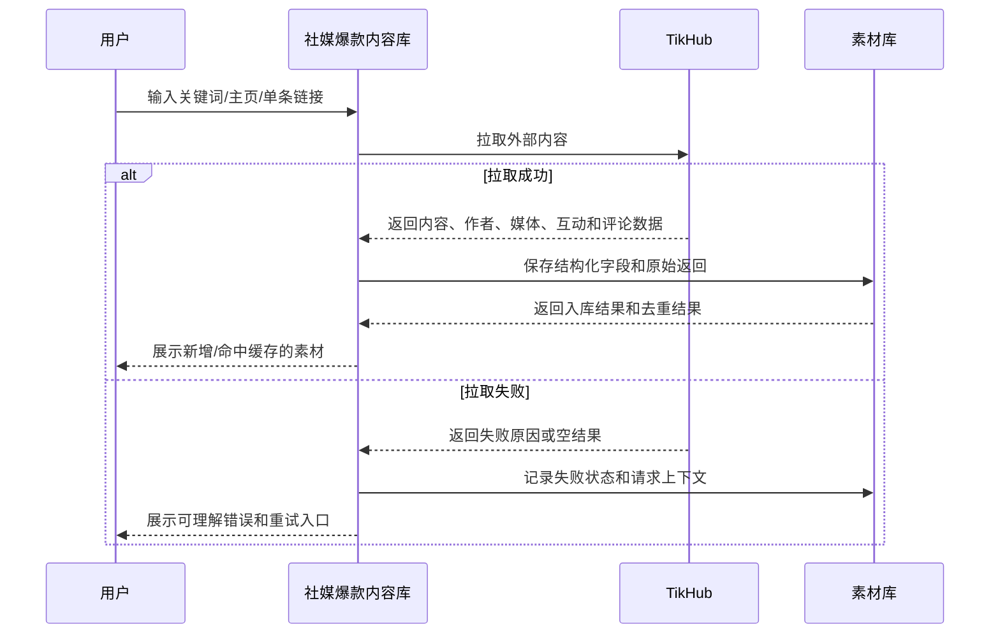

# 产品需求文档：社媒爆款内容库 - V2.6

## 1. 综述 (Overview)

### 1.1 项目背景与核心问题

当前商家端已有“素材中心”页面，但页面语义容易和“图片素材库”“视频素材库”混在一起。用户进一步明确：该入口应改名为“社媒爆款内容库”，它不是放项目图片、项目视频、用户上传素材的媒体库，而是放短视频平台上的爆款内容、自媒体内容、对标内容。

这些内容主要来自 TikHub 等第三方解析 API，包括小红书笔记、抖音视频、博主主页内容、关键词搜索结果、单条链接解析结果等。系统要保存一条内容的文本、标签、图片/视频类型、互动数据、作者信息、评论区、API 原始返回和 TikHub 可提供的解析结果，让它成为选题 Agent 和咨询 Agent 的“社媒爆款查询工具”。

核心问题：

1. “社媒爆款内容库”要和“图片素材库”“视频素材库”明确分层。
2. TikHub 返回的数据只要对后续分析、复用、追溯有价值，就应尽量保存，不能只保存页面上当前显示的少数字段。
3. 页面要能让 owner 看清一条爆款内容的类型、文案、标签、互动数据、评论和 TikHub 解析结果。
4. 选题 Agent 和咨询 Agent 可把社媒爆款内容库当作查询工具：需要正文就返回正文，需要评论就返回评论；查询层不额外做强限制。
5. 社媒爆款内容库不能和项目图片素材库、项目视频素材库混用。即使爆款内容本身是视频，也不能直接当作 video worker 可剪辑素材。

### 1.2 核心业务流程 / 用户旅程地图

1. **找内容** - 用户通过关键词、博主主页或单条链接从 TikHub 拉取爆款内容。
2. **入库与去重** - 系统解析 TikHub 返回结果，按平台、外部内容 ID、链接和缓存 key 去重，保存结构化字段和原始 payload。
3. **浏览与筛选** - 用户在社媒爆款内容库按平台、内容形态、来源、互动表现、标签、作者和关键词筛选内容。
4. **查看详情** - 用户查看单条内容的文案、标签、媒体类型、互动数据、评论区和 TikHub 解析结果。
5. **Agent 查询使用** - 选题 Agent 或咨询 Agent 按用户问题查询社媒爆款内容库，并按需读取正文、评论、互动数据和 TikHub 解析结果。
6. **P2 复用与追溯** - 后续再记录社媒爆款内容被哪些 Agent 会话引用、引用次数和引用时间；首期不强制实现复盘指标。

### 1.3 概念边界

| 名称 | 存放内容 | 回答的问题 | 可被谁使用 | 不能做什么 |
| --- | --- | --- | --- | --- |
| 社媒爆款内容库 | TikHub 解析来的小红书/抖音/自媒体内容、文案、标签、互动数据、评论、TikHub 解析结果 | 这件事在社媒上怎么表达、用户怎么评论和互动 | 选题 Agent、咨询 Agent、owner 查看 | 不能当项目事实，不能当 worker 剪辑素材，不开放给成员端销售 |
| 图片素材库 | 用户上传或团队沉淀的项目真实图片 | 图文用什么画面表达 | 图文配图、生图参考、项目资料展示 | 不作为短视频爆款参考，不作为 worker 主输入 |
| 视频素材库 | 用户上传或团队沉淀的项目视频片段 | 剪辑时间线用什么片段表达 | 视频 worker、视频素材检索、成片剪辑 | 不作为爆款文案参考，不直接决定内容结构 |

一句话：页面入口统一命名为“社媒爆款内容库”，不是项目图片/视频素材库。

导航与可见性规则：

1. 将当前 owner 工作台里的“素材中心”改名为“社媒爆款内容库”。
2. 成员端销售不展示该入口，不允许进入该库。
3. 图片素材库、视频素材库继续放在现有资料/知识库/用户信息相关位置，不迁入社媒爆款内容库。
4. 对用户来说，正文、媒体信息、互动数据和评论都属于同一条社媒爆款内容详情；评论不单独做成另一个用户可见库。

### 1.4 Mermaid 图（流程/状态/时序）

#### 1.4.1 用户操作流



#### 1.4.2 爆款内容素材状态机



#### 1.4.3 TikHub 入库时序



## 2. 用户故事详述 (User Stories)

### 阶段一：找内容

---

#### **US-01: 作为 owner，我希望通过关键词、博主主页或单条链接获取爆款内容，以便快速建立社媒爆款内容库**

* **价值陈述 (Value Statement)**:
  * **作为** 商家 owner 或有管理权限的运营负责人
  * **我希望** 在社媒爆款内容库通过关键词、博主主页、单条链接获取小红书/抖音爆款内容
  * **以便于** 团队有稳定的外部内容参考，而不是每次生成内容都临时搜索

* **业务规则与逻辑 (Business Logic)**:
  1. **前置条件**:
     * 用户已登录商家端。
     * 当前用户是 owner 或具备社媒爆款内容库管理权限；成员端销售不开放该入口。
     * 服务端已配置 TikHub 相关能力；如未配置，页面需要展示明确失败态。
  2. **支持入口**:
     * 关键词搜索：选择平台，输入关键词，选择拉取数量。
     * 博主主页：选择平台，粘贴博主主页链接，拉取该博主近期内容。
     * 单条链接：选择平台，粘贴一条笔记或短视频链接，解析单条详情。
     * 不支持人工手动录入标题、正文、评论；用户“人工”操作仅限粘贴链接或输入关键词/主页，后续内容由 TikHub 返回。
  3. **支持平台**:
     * 小红书。
     * 抖音。
     * 本期只支持小红书和抖音。后续平台扩展进入后续版本，不影响本期验收。
  4. **操作流程 (Happy Path)**:
     * 用户点击“找对标”或“上传解析素材”。
     * 系统展示获取方式、平台、输入框、数量选择和提交按钮。
     * 用户提交后，系统进入解析中状态。
     * TikHub 返回内容后，系统展示本次新增数量、缓存命中数量和失败数量。
     * 内容入库后默认继续拉取评论；评论拉取失败不影响主内容保存。
  5. **异常处理 (Error Handling)**:
     * 链接格式无法识别：提示“未识别到有效的小红书/抖音内容链接，请检查后重试”。
     * TikHub 未配置：提示“内容解析服务未配置，请联系管理员配置服务端密钥”。
     * TikHub 超时或限流：提示“外部内容服务暂时不可用，可稍后重试”，保留请求记录。
     * 返回为空：提示“没有找到符合条件的内容，可以换关键词或主页链接”。

* **验收标准 (Acceptance Criteria)**:
  * **场景1: 关键词搜索成功**
    * **GIVEN** 用户选择小红书并输入关键词
    * **WHEN** 用户点击开始找寻
    * **THEN** 系统拉取并入库匹配内容，页面展示新增/缓存命中的素材数量
  * **场景2: 博主主页成功**
    * **GIVEN** 用户粘贴抖音或小红书博主主页
    * **WHEN** 用户提交解析
    * **THEN** 系统拉取该博主内容，并记录作者信息、外部内容 ID 和来源链接
  * **场景3: 服务未配置**
    * **GIVEN** TikHub 服务端密钥缺失
    * **WHEN** 用户提交搜索或链接解析
    * **THEN** 系统展示未配置提示，不伪造成功素材

* **页面布局线框图 (ASCII Wireframe)**:

```text
+--------------------------------------------------------------+
| 社媒爆款内容库                                  [找对标]   |
+--------------------------------------------------------------+
| 弹窗：找对标                                                   |
| ------------------------------------------------------------ |
| 获取方式  [关键词搜索] [博主主页] [单条链接]                   |
| 平台      [小红书] [抖音]                                      |
| 输入      [ 普拉提 产后修复 / 主页链接 / 单条链接          ]   |
| 数量      [5] [10] [20]                                       |
|                                                            |
|                                      [取消] [开始解析]        |
+--------------------------------------------------------------+
```

---

### 阶段二：入库与去重

---

#### **US-02: 作为系统，我希望完整保存 TikHub 返回的有用数据，以便后续检索和查询不丢信息**

* **价值陈述 (Value Statement)**:
  * **作为** 系统
  * **我希望** 将 TikHub 返回内容拆成结构化字段、评论明细和原始 payload 保存
  * **以便于** 后续页面展示和 Agent 检索都可以使用同一份可信数据

* **业务规则与逻辑 (Business Logic)**:
  1. **前置条件**:
     * TikHub 返回至少包含一个可识别内容项。
     * 内容项可通过外部内容 ID、链接或标题形成去重依据。
  2. **结构化字段**:
     * 平台：小红书、抖音。
     * 内容形态：图文、视频。
     * 来源方式：关键词、博主主页、单条链接。
     * 外部内容 ID、来源链接、作者 ID、作者昵称。
     * 标题、正文/文案、脚本文本、话题标签。
     * 封面图、媒体 URL、视频时长、发布时间。
     * 点赞、收藏、评论、转发、播放等互动数据。
     * 评论明细：TikHub 返回什么就尽量保存什么，包括但不限于评论 ID、父评论 ID、作者、评论内容、点赞数、回复数、发布时间、排序分和原始评论 payload。
  3. **原始数据保存规则**:
     * TikHub 原始返回需要完整保存在原始 payload 中。
     * 当前页面暂不展示但后续可能有用的字段，不应在入库时丢弃。
     * 用户可见页面只展示已规范化字段，不直接暴露过长 raw JSON；平台管理员本期也不需要 raw JSON 调试入口。
  4. **去重规则**:
     * 同一商家下，同平台、同外部内容 ID 的内容只保留一条。
     * 外部内容 ID 缺失时，同平台、同来源链接只保留一条。
     * 命中缓存时，不重复插入，只更新最新互动数据和最近拉取时间。
     * 跨商家缓存复用是理想方案；若实现成本高，可放入 P2，本期至少保证商家内不重复。
  5. **异常处理 (Error Handling)**:
     * TikHub 返回字段缺失时，尽量保存可用字段，并标记“字段不完整”。
     * 评论默认在入库时拉取；评论拉取失败不影响主内容入库，状态显示为“评论拉取失败/可重试”。
     * 单条内容写入失败不影响同批次其他内容入库，批次结果显示部分成功。

* **验收标准 (Acceptance Criteria)**:
  * **场景1: 完整入库**
    * **GIVEN** TikHub 返回一条抖音视频
    * **WHEN** 系统规范化并保存
    * **THEN** 素材记录包含平台、视频类型、作者、文案、互动数据、媒体信息和原始 payload
  * **场景2: 评论独立入库**
    * **GIVEN** TikHub 返回评论列表
    * **WHEN** 主内容保存成功
    * **THEN** 评论以明细形式保存，并能在详情页按热度或时间展示
  * **场景3: 重复内容**
    * **GIVEN** 同一商家再次拉取同一条内容
    * **WHEN** 外部内容 ID 或链接命中已有记录
    * **THEN** 系统不重复创建素材，只更新互动快照和原始 payload

---

### 阶段三：浏览与筛选

---

#### **US-03: 作为内容运营，我希望按平台、内容形态、互动表现和标签筛选爆款内容，以便快速找到可参考的素材**

* **价值陈述 (Value Statement)**:
  * **作为** owner 或有管理权限的运营负责人
  * **我希望** 社媒爆款内容库能按平台、图文/视频、关键词、标签、互动数据和作者筛选
  * **以便于** 我在给选题 Agent 或咨询 Agent 准备参考内容时快速找到相关爆款样本

* **业务规则与逻辑 (Business Logic)**:
  1. **前置条件**:
     * 社媒爆款内容库已有入库内容。
  2. **列表展示字段**:
     * 标题或文案首句。
     * 平台。
     * 内容形态：图文或视频。
     * 来源方式：关键词、主页、单条链接。
     * 互动摘要：赞、藏、评、转、播。
     * 作者昵称。
     * 入库时间或发布时间。
  3. **筛选项**:
     * 平台：全部、小红书、抖音。
     * 内容形态：全部、图文、视频。
     * 来源方式：关键词、博主主页、单条链接。
     * 标签/关键词：支持搜索标题、正文、标签、作者。
     * 互动表现：按点赞、评论、收藏、转发、播放排序。
     * 评论状态：有评论、无评论、评论待补。
  4. **空状态**:
     * 没有任何素材时，提示用户用关键词、主页或链接建立爆款内容库。
     * 筛选无结果时，提示用户调整条件或新增对标内容。

* **验收标准 (Acceptance Criteria)**:
  * **场景1: 按视频筛选**
    * **GIVEN** 社媒爆款内容库同时有小红书图文和抖音视频
    * **WHEN** 用户选择“内容形态=视频”
    * **THEN** 列表只展示短视频类爆款内容
  * **场景2: 按互动排序**
    * **GIVEN** 多条素材都有点赞/收藏/评论数据
    * **WHEN** 用户选择按点赞降序
    * **THEN** 列表按点赞数从高到低排列
  * **场景3: 搜索标签**
    * **GIVEN** 某条内容正文或标签包含“产后修复”
    * **WHEN** 用户搜索“产后修复”
    * **THEN** 该素材出现在搜索结果中

* **页面布局线框图 (ASCII Wireframe)**:

```text
+----------------------------------------------------------------------------------+
| 社媒爆款内容库                                      [单条解析] [找对标]          |
| 保存小红书/抖音爆款内容、评论和互动数据，不是项目图片/视频素材库                  |
+----------------------------------------------------------------------------------+
| 搜索 [ 关键词 / 标签 / 作者 / 文案                                      ] [筛选]  |
+-------------------------------+--------------------------------------------------+
| 筛选                           | 素材列表                                          |
| 平台 [全部 v]                  | ------------------------------------------------ |
| 形态 [全部 v]                  | [视频] 抖音  赞 12.3w 评 881 转 320              |
| 来源 [全部 v]                  | 标题/文案首句...                                  |
| 评论 [全部 v]                  | #标签1 #标签2 作者 入库时间                      |
| 排序 [点赞降序 v]              | ------------------------------------------------ |
|                                | [图文] 小红书 赞 1.8w 藏 4200 评 312             |
|                                | 标题/文案首句...                                  |
+-------------------------------+--------------------------------------------------+
```

---

### 阶段四：查看详情

---

#### **US-04: 作为 owner，我希望查看单条爆款内容的正文、评论、互动数据和 TikHub 解析结果，以便判断它是否值得给 Agent 参考**

* **价值陈述 (Value Statement)**:
  * **作为** owner 或有管理权限的运营负责人
  * **我希望** 打开一条素材后能看到文案、标签、媒体类型、互动数据、评论区和 TikHub 返回/解析数据
  * **以便于** 判断这条内容是否适合被选题 Agent 或咨询 Agent 查询参考

* **业务规则与逻辑 (Business Logic)**:
  1. **前置条件**:
     * 用户从素材列表选择一条内容。
  2. **详情页信息区**:
     * 基础信息：平台、图文/视频、作者、发布时间、来源链接。
     * 内容正文：标题、正文/文案、标签、脚本或字幕摘要。
     * 媒体信息：封面、图片数量、视频时长、是否有可预览媒体。
     * 互动数据：点赞、收藏、评论、转发、播放，以及最近更新时间。
     * 评论区：TikHub 返回的评论明细，默认入库时拉取；页面可展示热门评论或按返回顺序展示。
     * TikHub 解析结果：仅展示 TikHub 返回或已有 provider 规范化出的解析数据；本期不额外自研标题套路、hook、情绪点、CTA、评论洞察等拆解。
     * 使用记录：P2 再做，首期详情页不要求展示引用次数或引用链路。
  3. **展示原则**:
     * 页面优先展示对用户决策有用的摘要和结构化字段。
     * 原始 payload 全量保存，但不在普通用户视图或平台管理员视图中展开。
     * 页面不做“不得复制正文”的强限制；是否引用正文由 Agent 和上层业务策略决定。
     * 页面需要明确区分：这是社媒爆款内容，不是当前商家项目事实，也不是可剪辑视频素材。
  4. **异常处理 (Error Handling)**:
     * 评论拉取失败时，评论区显示失败状态，提供重试入口。
     * 媒体预览不可用时，仍展示文本、互动和链接。
     * TikHub 未返回解析数据时，不额外展示自研拆解模块，不影响查看原文、互动和评论。

* **验收标准 (Acceptance Criteria)**:
  * **场景1: 查看视频爆款详情**
    * **GIVEN** 用户选择一条抖音视频素材
    * **WHEN** 详情面板打开
    * **THEN** 页面展示视频类型、文案、作者、互动数据、评论和 TikHub 解析结果
  * **场景2: 评论拉取失败**
    * **GIVEN** 主内容已入库但评论拉取失败
    * **WHEN** 用户打开详情
    * **THEN** 评论区显示失败状态，并允许用户稍后重试
  * **场景3: 禁止误用**
    * **GIVEN** 用户查看一条爆款内容
    * **WHEN** 页面展示详情
    * **THEN** 页面明确说明该内容不是项目事实或可剪辑视频素材

* **页面布局线框图 (ASCII Wireframe)**:

```text
+----------------------------------------------------------------------------------+
| < 返回列表                                                                         |
| 标题/文案首句                                                        [打开原链接] |
| [抖音] [视频] [主页导入] 作者：xxx 发布时间：05/20                                  |
+----------------------------------------------------------------------------------+
| 左侧：内容与媒体                         | 右侧：数据与 TikHub 解析                  |
| ---------------------------------------- | ---------------------------------------- |
| 封面/预览                                | 互动数据                                  |
| 标题                                     | 赞 12.3w  藏 1.1w  评 881  转 320  播放  |
| 正文/口播文案                            | 更新时间 05/21 06:27                      |
| #标签1 #标签2 #标签3                     | ---------------------------------------- |
|                                          | TikHub 解析结果                           |
|                                          | provider 返回的结构化字段                 |
|                                          | provider 返回的作者/媒体/互动信息         |
|                                          | 本期不额外自研 hook/CTA/情绪点拆解        |
+------------------------------------------+------------------------------------------+
| 评论区                                                                            |
| 热门评论 1：内容... 赞 128                                                        |
| 热门评论 2：内容... 赞 96                                                         |
| TikHub 返回什么评论字段就尽量保存并展示摘要                                         |
+----------------------------------------------------------------------------------+
| 使用边界：这是社媒爆款内容，不是项目事实，也不是可剪辑视频素材。                    |
+----------------------------------------------------------------------------------+
```

---

### 阶段五：Agent 查询使用

---

#### **US-05: 作为选题 Agent 或咨询 Agent，我希望把社媒爆款内容库作为查询工具，以便按需读取正文、评论和互动数据**

* **价值陈述 (Value Statement)**:
  * **作为** 选题 Agent 或咨询 Agent
  * **我希望** 能按用户问题查询社媒爆款内容库
  * **以便于** 在选题规划或咨询回答中读取真实社媒内容、评论和互动数据

* **业务规则与逻辑 (Business Logic)**:
  1. **前置条件**:
     * 素材已入库，且至少有标题、文案或评论数据。
     * 当前用户或 Agent 所属商家有权访问该社媒爆款内容库。
  2. **查询目标**:
     * 选题 Agent：按行业、平台、关键词、作者、互动表现查询社媒爆款内容。
     * 咨询 Agent：当用户明确询问对标、竞品、爆款、评论反馈、社媒表达时查询。
  3. **返回规则**:
     * Agent 需要正文时，工具直接返回标题、正文/文案、标签、作者、来源链接等字段。
     * Agent 需要评论时，工具直接返回评论明细或评论摘要。
     * Agent 需要互动表现时，工具返回点赞、收藏、评论、转发、播放等数据。
     * 本期不直接接图文生成和视频脚本生成链路，不做“送入图文工作台/送入视频脚本工作台”的入口。
  4. **与视频素材库的边界**:
     * 即使爆款内容本身是视频，也只是“爆款视频内容参考”。
     * 不能将它直接当作视频 worker 可剪辑素材。
     * 若未来要下载并合法使用该视频文件，必须走单独版权、授权和视频素材库入库流程。
  5. **异常处理 (Error Handling)**:
     * 素材字段不足时，允许返回已有字段，并标记“参考信息不完整”。
     * 评论不存在或拉取失败时，明确返回评论不可用，不影响正文查询。
     * 若查询命中内容过多，系统需要控制返回数量，避免 Agent 上下文过长。

* **验收标准 (Acceptance Criteria)**:
  * **场景1: 选题 Agent 查询正文**
    * **GIVEN** 社媒爆款内容库中有小红书图文内容
    * **WHEN** 选题 Agent 按关键词查询
    * **THEN** 工具返回匹配内容的标题、正文、标签、互动数据和来源
  * **场景2: 咨询 Agent 查询评论**
    * **GIVEN** 社媒爆款内容库中有已保存评论的抖音视频内容
    * **WHEN** 咨询 Agent 查询该内容评论
    * **THEN** 工具返回评论明细或评论摘要
  * **场景3: Agent 自动检索**
    * **GIVEN** 用户在咨询台明确要求看对标、竞品或爆款
    * **WHEN** Agent 调用爆款内容检索
    * **THEN** 新检索内容沉淀进社媒爆款内容库，并可在回答中引用查询结果

---

### 阶段六：P2 复用与追溯

---

#### **US-06: 作为团队负责人，我希望后续能看到爆款内容被哪些 Agent 查询引用，以便复盘哪些参考有效**

* **价值陈述 (Value Statement)**:
  * **作为** 团队负责人或运营负责人
  * **我希望** 后续每条爆款内容能记录被哪个 Agent 会话查询、什么时候查询、查询了正文还是评论
  * **以便于** 后续判断哪些平台内容、作者和评论数据真正被团队使用

* **业务规则与逻辑 (Business Logic)**:
  1. **前置条件**:
     * 爆款内容被选题 Agent 或咨询 Agent 查询。
  2. **追溯信息**:
     * 引用对象：咨询会话、选题任务、Agent 查询记录。
     * 引用方式：正文查询、评论查询、互动数据查询。
     * 使用人、使用时间、Agent 会话 ID。
  3. **复盘指标**:
     * 被引用次数。
     * 最近引用时间。
     * P2 可选：引用后是否进入内容日历或后续生产链路。
  4. **异常处理 (Error Handling)**:
     * 引用记录写入失败不阻断 Agent 回答，但需要进入可排查日志。
     * 删除爆款内容时，历史引用不硬删除，只隐藏当前素材主体或标记已归档。

* **验收标准 (Acceptance Criteria)**:
  * **场景1: 引用记录**
    * **GIVEN** 咨询 Agent 查询了一条社媒爆款内容
    * **WHEN** 查询成功
    * **THEN** 素材详情页显示该会话查询过该素材
  * **场景2: 复盘排序**
    * **GIVEN** 多条素材被不同次数引用
    * **WHEN** 用户按引用次数排序
    * **THEN** 列表展示最常被使用的爆款内容
  * **场景3: 删除或归档**
    * **GIVEN** 一条素材已有历史引用
    * **WHEN** 用户归档该素材
    * **THEN** 历史 Agent 查询记录仍能看到引用记录，不因归档丢失追溯

## 3. 数据保存要求

### 3.1 必须结构化保存的字段

1. **身份字段**:
   * 平台、外部内容 ID、来源链接、来源方式、provider、provider cache key。
2. **内容字段**:
   * 标题、正文/文案、脚本/字幕、标签、内容形态、封面、媒体摘要、发布时间。
3. **作者字段**:
   * 作者 ID、作者昵称、主页链接、头像、粉丝数等 TikHub 可返回信息。
4. **互动字段**:
   * 点赞、收藏、评论、转发、播放、分享、弹幕等 TikHub 可返回指标。
5. **评论字段**:
   * 评论 ID、父评论 ID、作者、内容、点赞、回复、发布时间、排序分、原始评论 payload。
6. **TikHub 解析字段**:
   * TikHub 或 provider 已返回/已规范化的解析数据；本期不额外自研 hook、CTA、情绪点、评论洞察等拆解。
7. **P2 追溯字段**:
   * 后续可记录被哪些选题任务或咨询 Agent 会话查询，查询正文/评论/互动数据的时间和方式。

### 3.2 原始 payload 保存原则

TikHub 返回内容存在平台差异和字段变化，系统应采取“结构化常用字段 + 原始 payload 全量保留”的策略：

1. 页面和下游生成优先读取规范化字段。
2. TikHub 原始 item、原始 response、请求参数、endpoint、返回时间需要保留。
3. 不因当前 UI 未展示就丢弃字段。
4. 原始 payload 只用于排查、补解析和后续字段升级，普通用户和平台管理员本期都不提供 raw JSON 查看入口。

## 4. 非目标

1. 本期不把社媒爆款内容库改造成项目图片素材库。
2. 本期不把社媒爆款内容库改造成项目视频素材库。
3. 本期不处理外部爆款视频的版权下载和二次剪辑授权。
4. 本期不要求真实发布后的平台数据回流。
5. 本期不要求所有 TikHub 平台能力一次性全覆盖，小红书和抖音优先。
6. 本期不直接接图文生成和视频脚本生成链路；社媒爆款内容库先作为选题 Agent 和咨询 Agent 的查询工具。
7. 本期不支持人工手动录入标题、正文、评论；“人工”只指用户粘贴链接后调用 TikHub 解析。

## 5. P2 / 后续事项

1. 跨商家缓存复用：理想状态是能复用，降低 TikHub 调用成本；如果实现成本高，可以放到 P2，本期至少保证商家内去重。
2. 引用追溯和复盘指标：引用次数、引用时间、引用后是否进入内容日历或后续生产链路，统一放到 P2。
3. 素材归档、删除和跨商家缓存复用的权限边界，如实现时发现复杂，可以单独拆一个小 PRD。
