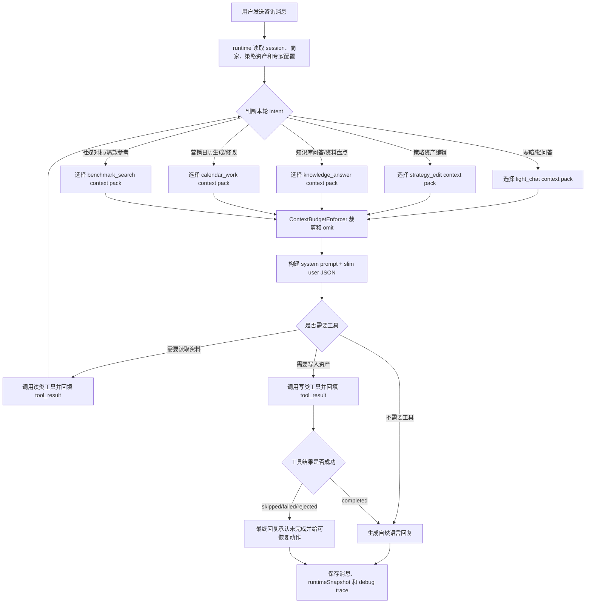
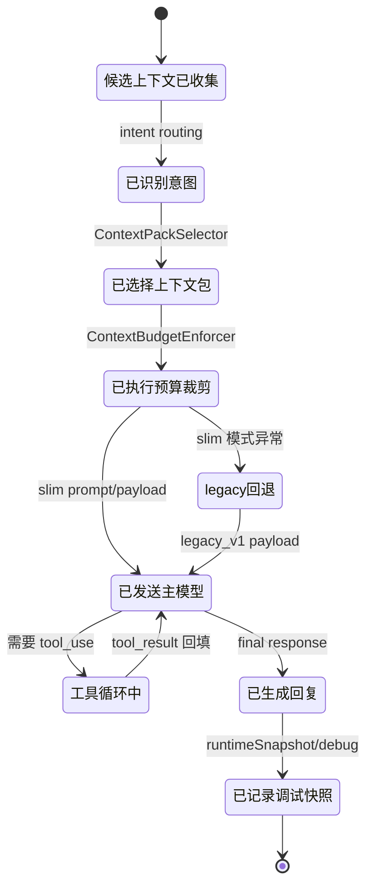
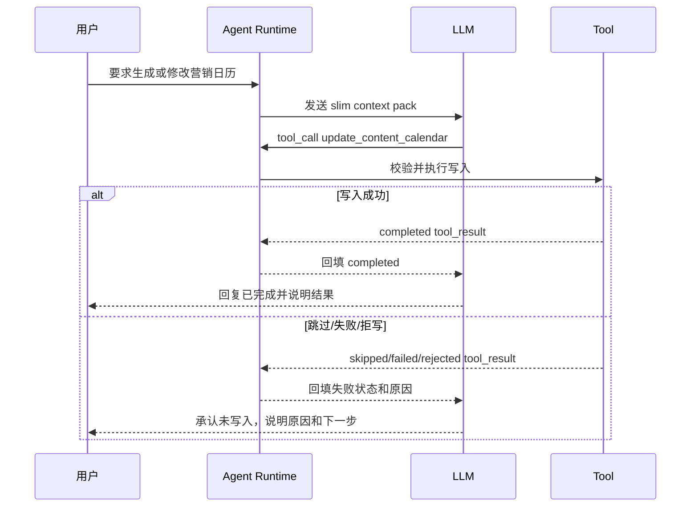

# 产品需求文档：咨询 Agent 上下文工程瘦身 - V2.7

> 状态：优化稿，待评审
> 创建时间：2026-05-21
> 最近更新：2026-05-21
> 来源：咨询 Agent 上下文工程对照评审、Claude Code reference 对照、当前代码事实核对、V2.5 Agentic RAG PRD、V2.6 社媒爆款内容库 PRD
> 关联页面：`docs/架构规范/咨询Agent上下文工程对照评审.html`
> 关联架构规范：`docs/架构规范/2026-05-20-Agent架构易错点.md`

## 0. 本次优化补齐了什么

原稿已经判断出核心问题：咨询 Agent 不是“不会调工具”，而是主模型看到的上下文过重、重复、夹杂调试信息和流程化规则，导致回复像流程日志。

本次优化补齐 8 个工程可执行缺口：

1. **用户旅程主线**：从“诊断上下文污染”到“上线瘦身模式”的完整阶段地图。
2. **字段权威来源矩阵**：明确每类信息由谁负责，避免 `strategySnapshot`、`toolResults`、`knowledgeMatches` 多处重复。
3. **ContextPackSelector 规则**：不只是说“瘦身”，而是按 intent 选择上下文包。
4. **RAG current/history 分层**：区分本轮 selected evidence、历史命中和 debug 全量记录。
5. **工具结果诚实性协议**：失败、跳过、拒写的工具结果必须影响最终回复，不能被重复摘要误导。
6. **debug 与主模型隔离**：`skillDisclosure`、budget、expertTraffic、完整历史命中保留给调试，不进入主模型。
7. **硬预算和 omit 报告**：budget 从“统计报告”升级为裁剪和省略策略。
8. **灰度、回滚和验收夹具**：实现时必须保留 legacy 回滚路径，并用固定用例验证聊天体验没有倒退。

## 1. 综述 (Overview)

### 1.1 项目背景与核心问题

当前咨询 Agent 的 native tool calling 链路已经基本打通。模型可以调用知识库检索、更新策略资产、写入营销日历，也可以把工具结果回填到后续对话。

但真实聊天体验仍有“怪”的感觉：

1. 回复容易解释内部机制，而不是像顾问一样自然回应用户。
2. 简单问题也会被大量策略资产、RAG 历史、工具摘要和日历规则牵引。
3. 模型在多个权威来源之间自行判断，例如顶层 `strategySnapshot`、`contextInjection.sessionContext.strategySnapshot`、`strategyMarkdown` 同时存在。
4. 工具结果既通过 tool message 回填，又在 user JSON 中重复出现，增加了状态不一致风险。
5. budget、skillDisclosure、expertTraffic 这类开发调试信息对主模型没有直接业务价值，却会污染回复风格。

本轮 V2.7 的目标不是换模型，也不是重写全部 Agent runtime，而是把“给主 LLM 看的上下文”和“给开发调试看的 runtime trace”分层。主模型只看完成本轮用户目标所需的最小事实、规则和 evidence；调试面板仍保留完整链路，方便排查。

### 1.2 当前代码事实

当前 native tool calling 和 JSON tool loop 路径中，system prompt 会拼入：

1. agent prompt
2. soul
3. 专家容器
4. skill catalog
5. active skills
6. skill references
7. business tools
8. ContextInjector 说明
9. native tool loop / JSON tool loop 规则
10. 日历规则
11. RAG 规则
12. guardrail / 工具结果规则

当前 user JSON 会包含：

1. `merchant`
2. `userMessage`
3. `round`
4. `contextInjection`
5. `strategySnapshot`
6. `knowledgeMatches`
7. `toolResults` 或 `priorToolResults`
8. `skillDisclosure`

其中 `contextInjection.sessionContext` 内部又重复携带 `strategySnapshot`、`strategyMarkdown`、`toolResults`、`knowledgeMatchCount` 等信息。

当前 RAG 默认配置：

1. consultation agent `retrievalTopK = 5`
2. knowledge runtime `retrievalTopK = 5`
3. 检索过程会用 `topK * 2` 做 keyword/vector/direct scan，再 merge 成最多 `topK` 个结果。
4. 多轮检索会累积 `knowledgeMatches`，当前最多保留 24 个 unique chunk。

结论：如果不区分“本轮 selected evidence”和“历史累计命中”，模型容易把旧依据误当成本轮依据。

### 1.3 核心业务流程 / 用户旅程地图

1. **阶段一：诊断上下文污染** - 产品和开发先确认哪些内部信息不该进入主模型，以及哪些回复表现算体验倒退。
2. **阶段二：选择本轮上下文包** - runtime 根据用户意图选择最小上下文，而不是把 `contextInjection` 整包塞给 LLM。
3. **阶段三：统一权威来源** - 策略资产、工具结果、RAG evidence、专家路由、debug trace 各自只有一个权威入口。
4. **阶段四：执行工具与 evidence 回填** - 读类工具允许多轮深挖，写类工具保持幂等保护，工具结果通过 loop 协议回填。
5. **阶段五：隔离 debug 与预算控制** - debug 面板保留全量 trace，主模型只看到被选择、被裁剪后的上下文。
6. **阶段六：灰度验收和回滚** - 通过结构验收、聊天体验验收和工具诚实性验收后，逐步默认启用 slim 模式。

### 1.4 非目标

本 PRD 不做：

1. 不更换模型 provider。
2. 不重写所有 skill 内容。
3. 不改变 Dify、video-worker、内容生成链路的数据合同。
4. 不删除 runtimeSnapshot、debug 面板或事件日志中的调试信息。
5. 不把多 Agent 圆桌方案重做成并发专家系统。
6. 不把内容创意判断、选题策略判断、镜头表达判断写死在代码 helper 里。

### 1.5 字段权威来源矩阵

| 信息类型 | 主模型权威入口 | debug / runtime 权威入口 | V2.7 处理 |
| --- | --- | --- | --- |
| 商家轻量信息 | `merchant` | merchant profile / runtimeSnapshot | 保留轻量摘要 |
| 用户本轮输入 | `userMessage` | session messages | 保留 |
| 当前轮次 | `round` | session state | 保留 |
| 专家身份与知识边界 | `expertRouting` + system prompt | expertTraffic / ExpertTurnNote | 主模型只看 routing，完整交接留 debug |
| 策略资产 | 顶层 `strategySnapshot` | strategy asset state / snapshot history | 只保留一处 |
| 策略 Markdown | 按 intent 选择性注入 | runtimeSnapshot | 默认不进主模型 |
| RAG evidence | `currentKnowledgeMatches` 或 `selectedKnowledgeMatches` | `allKnowledgeMatches` / retrieval trace | 主模型只看 selected |
| 工具结果 | native `role: "tool"` / JSON loop `tool_result` | full toolResults summaries | 不在初始 user JSON 重复注入 |
| skill 命中明细 | 不进入主模型 | `skillDisclosure` | 移到 debug |
| budget | 不进入主模型 | context budget report / omit report | 改为硬预算和 debug |
| expertTraffic | 不进入主模型主链路 | expertTraffic / ExpertTurnNote | 仅圆桌或专家交接 debug 使用 |
| 上下文选择决策 | 不直接暴露给用户 | selectedContext decision trace | debug 展示 |

### 1.6 Mermaid 图（流程/状态/时序）

#### 1.6.1 上下文瘦身主流程



#### 1.6.2 Context Pack 状态机



#### 1.6.3 工具结果诚实时序



## 2. 用户故事详述 (User Stories)

### 阶段一：诊断上下文污染

---

#### **US-01: 作为产品负责人，我希望先定义咨询 Agent 的上下文污染问题，以便优化目标不是泛泛地“变聪明”**

* **价值陈述 (Value Statement)**:
  * **作为** 产品负责人
  * **我希望** 明确哪些上下文会让咨询 Agent 的回复变怪
  * **以便于** 后续验收可以判断“瘦身是否成功”，而不是只看工具有没有调用

* **业务规则与逻辑 (Business Logic)**:
  1. **前置条件**:
     * 当前咨询 Agent 已支持 native tool calling 或 JSON tool loop。
     * 当前 runtime 能记录 prompt/payload、tool results、knowledge matches 和 runtimeSnapshot。
  2. **问题定义**:
     * 如果用户只是轻问答、寒暄或问流程，模型不应暴露 `contextInjection`、budget、skill、tool、RAG 等内部词。
     * 如果用户要求修改明确资产，模型不应因为 prompt 规则过重而反复讲流程。
     * 如果工具失败、跳过或被 guardrail 拒写，模型不应声称已完成。
     * 如果历史 RAG 命中和本轮问题无关，模型不应把历史依据当成本轮依据。
  3. **体验目标**:
     * 回复像顾问对话，而不是调试日志。
     * 简单问题更短、更自然。
     * 写入动作更诚实：成功就是成功，失败就是失败。
     * 模型仍能在需要时主动查知识库、查社媒爆款内容库、写策略资产或写日历。
  4. **异常处理**:
     * 如果瘦身后工具调用明显减少，但用户明确要求的写入动作无法完成，应视为回归。
     * 如果瘦身后 debug 面板失去排查信息，应视为实现不完整，而不是产品可接受取舍。

* **验收标准 (Acceptance Criteria)**:
  * **场景1: 简单轻问答**
    * **GIVEN** 用户只问“你现在能帮我做什么”
    * **WHEN** Agent 回复
    * **THEN** 回复不出现 `contextInjection`、`skillDisclosure`、budget、tool payload 等内部词
  * **场景2: 工具失败**
    * **GIVEN** 写入工具返回 failed 或 rejected
    * **WHEN** Agent 生成最终回复
    * **THEN** Agent 必须承认本轮未写入，不能说“已经更新”
  * **场景3: 历史 RAG 干扰**
    * **GIVEN** 上一轮命中过房产资料，本轮用户只问按钮在哪里
    * **WHEN** 构建本轮主模型上下文
    * **THEN** 房产资料不应默认进入本轮 selected evidence

---

### 阶段二：选择本轮上下文包

---

#### **US-02: 作为 Agent Runtime，我希望按用户意图选择上下文包，以便主模型只看到本轮必要信息**

* **价值陈述 (Value Statement)**:
  * **作为** Agent Runtime
  * **我希望** 用 `ContextPackSelector` 替代给主模型看的 `contextInjection` 大对象
  * **以便于** 减少重复上下文和调试信息对主模型的干扰

* **业务规则与逻辑 (Business Logic)**:
  1. **前置条件**:
     * runtime 已经能读取 session、merchant、strategySnapshot、knowledgeMatches、toolResults、skillDisclosure、expertTraffic。
     * runtime 能判断或记录本轮 intent。第一版可以用规则判断，后续可引入轻量模型。
  2. **ContextPackSelector 职责**:
     * 负责从候选上下文中选择进入主 LLM 的字段。
     * 负责记录 `selectedContextDecision` 到 debug。
     * 不负责替模型做内容创意判断。
     * 不把自身的工作报告塞给主模型。
  3. **建议 context pack**:
     * `light_chat`：寒暄、流程说明、轻问答。只给 merchant 摘要、userMessage、round、expertRouting。
     * `strategy_edit`：用户要求补充或修改策略资产。给 strategySnapshot 和必要工具协议。
     * `knowledge_answer`：用户要求读取、总结、盘点资料。给 selected knowledge evidence。
     * `calendar_work`：用户要求生成、修改营销日历或团队选题。给 strategySnapshot、selected evidence、contentCalendarGeneration 状态和日历写入原则。
     * `benchmark_search`：用户要求找对标、爆款、博主、社媒参考。给社媒爆款内容库工具说明，不把历史 benchmark 结果默认注入。
     * `history_reference`：用户说“刚才、上次、前面”。按需读取历史，而不是默认把全部 session 历史塞入。
  4. **目标 user JSON 形态**:

```json
{
  "merchant": {
    "name": "...",
    "industry": "...",
    "serviceItems": [],
    "defaultCta": []
  },
  "userMessage": "...",
  "round": 3,
  "expertRouting": {
    "activeAgentKey": "...",
    "activeDisplayName": "...",
    "roleDescription": "...",
    "knowledgeSetIds": ["..."],
    "knowledgeDocumentIds": ["..."],
    "rawMention": "@营销专家"
  },
  "strategySnapshot": {},
  "currentKnowledgeMatches": []
}
```

  5. **主模型 user JSON 应移除**:
     * `contextInjection`
     * `toolResults`
     * `priorToolResults` 的重复累计摘要，JSON loop 协议所需的 tool_result 回填除外
     * `skillDisclosure`
     * `budget`
     * `expertTraffic`
  6. **异常处理**:
     * 如果 selector 无法判断 intent，默认走 `light_chat + safe_strategy_summary`，不要回退到整包 `contextInjection`。
     * 如果用户明确要求写入资产，但必要上下文被 omit，应在 debug 记录 omit 原因，并允许工具阶段补查或追问。

* **验收标准 (Acceptance Criteria)**:
  * **场景1: slim user JSON**
    * **GIVEN** slim context mode 已启用
    * **WHEN** 构建主模型 user JSON
    * **THEN** JSON 不包含 `contextInjection`、`toolResults`、`skillDisclosure`、`budget`、`expertTraffic`
  * **场景2: 轻问答上下文包**
    * **GIVEN** 用户问“怎么使用这个咨询台”
    * **WHEN** selector 判断为 `light_chat`
    * **THEN** 不默认注入完整 `strategySnapshot.contentCalendarDraft`、历史 RAG chunks 和工具结果摘要
  * **场景3: 日历工作上下文包**
    * **GIVEN** 用户要求“帮我生成下周营销日历”
    * **WHEN** selector 判断为 `calendar_work`
    * **THEN** 主模型可看到轻量 `strategySnapshot`、必要 selected evidence、日历写入原则和团队内容生成状态

---

### 阶段三：统一权威来源

---

#### **US-03: 作为开发负责人，我希望每类上下文只有一个权威入口，以便模型和测试都不再依赖重复字段**

* **价值陈述 (Value Statement)**:
  * **作为** 开发负责人
  * **我希望** 明确策略资产、工具结果、RAG evidence 和专家路由各自的权威来源
  * **以便于** 改 runtime 时不会出现多个字段互相打架

* **业务规则与逻辑 (Business Logic)**:
  1. **策略资产**:
     * `strategySnapshot` 是主模型读取当前策略资产的唯一权威入口。
     * `contextInjection.sessionContext.strategySnapshot` 不再进入主模型。
     * `strategyMarkdown` 默认不进入主模型，只在用户明确要求改策略文档、导出策略文案或需要全文引用时按需注入。
  2. **工具结果**:
     * native tool calling 中，工具结果以 `role: "tool"` message 为权威来源。
     * JSON tool loop 中，工具结果以 loop 协议的 `tool_result` 或最小 tool observation 为权威来源。
     * 初始 user JSON 不重复携带累计 `toolResults`。
  3. **专家路由**:
     * 主链路只保留 `expertRouting`。
     * `expertTraffic`、`sharedConsultationState`、`ExpertTurnNote` 留在 debug 或圆桌多 Agent 场景。
     * 切换专家时，主模型需要知道当前专家身份、知识边界和 raw mention，不需要看到完整共享白板。
  4. **skill 信息**:
     * `skill catalog` 可以继续以短说明保留在 system prompt。
     * `active skills` 只在高置信命中时注入正文。
     * `skillDisclosure` 是命中记录和调试信息，不进入主模型。
  5. **异常处理**:
     * 如果旧 prompt 测试依赖 `contextInjection` 字符串，应更新测试目标，验证 slim payload 结构和行为结果，而不是固化旧字段。
     * 如果某个下游函数仍读取旧字段，应通过 compatibility adapter 读取 debug snapshot，不让旧字段重新进入主模型。

* **验收标准 (Acceptance Criteria)**:
  * **场景1: 策略资产不重复**
    * **GIVEN** 本轮有 strategySnapshot
    * **WHEN** 构建主模型 payload
    * **THEN** 主模型只在顶层 `strategySnapshot` 看到策略资产，不再在 `contextInjection.sessionContext` 看到重复版本
  * **场景2: 工具结果不重复**
    * **GIVEN** native tool calling 已执行一个工具
    * **WHEN** 下一轮发送给模型
    * **THEN** 工具结果通过 tool message 回填，不在 user JSON 顶层重复出现
  * **场景3: debug 不丢**
    * **GIVEN** 主模型 payload 已移除 `skillDisclosure`
    * **WHEN** 平台管理端查看调试结果
    * **THEN** debug 面板仍可看到 active skills、候选 skills 和命中原因

---

### 阶段四：RAG selected/current evidence 分层

---

#### **US-04: 作为咨询 Agent，我希望只看到本轮相关 evidence，以便不会被历史知识命中牵引**

* **价值陈述 (Value Statement)**:
  * **作为** 咨询 Agent
  * **我希望** 主模型只接收与本轮用户问题相关的 selected evidence
  * **以便于** 回答更贴近当前问题，同时 debug 仍能追溯完整检索历史

* **业务规则与逻辑 (Business Logic)**:
  1. **命名规则**:
     * `knowledgeMatches` 在主模型 payload 中改为 `currentKnowledgeMatches` 或 `selectedKnowledgeMatches`。
     * runtime 内部可以继续保留全量 `knowledgeMatches`，但不能默认全部进入主模型。
  2. **selected chunk 最小字段**:

```json
{
  "documentTitle": "...",
  "chunkId": "...",
  "scope": "merchant_knowledge",
  "score": 0.82,
  "content": "...",
  "query": "...",
  "toolCallId": "...",
  "turn": 3,
  "freshness": "current_turn",
  "evidenceRole": "project_fact"
}
```

  3. **选择规则**:
     * 单次 retrieve 默认最多 5 个 selected chunks 进入主模型。
     * 多轮 retrieve 可以累积历史命中，但每轮发送给主模型前必须重新选择。
     * 历史 chunks 不默认进入主模型，除非本轮 intent 明确需要“刚才/上次/前面”的历史依据。
     * 同一文档连续片段过多时，应优先保留多来源证据，而不是让一个文档占满全部 selected slots。
     * 对明确关键词、人名、区域词、楼盘词、平台词，应保留 keyword/direct 命中，不只依赖向量相似度。
  4. **evidenceRole 建议枚举**:
     * `project_fact`：项目事实。
     * `methodology`：方法论。
     * `sales_talk`：销售或转化话术。
     * `material_capability`：素材能力边界。
     * `benchmark_content`：社媒爆款或对标内容。
     * `merchant_memory`：商家记忆。
     * `conversation_history`：历史对话。
  5. **异常处理**:
     * 如果 selected evidence 为空，但用户明确要求读知识库，应先调用 retrieve 工具，而不是回答“看不到资料”。
     * 如果 selected evidence 被预算裁剪，应在 debug 的 omit report 中记录被裁掉的 chunk id 和原因。

* **验收标准 (Acceptance Criteria)**:
  * **场景1: 当前 evidence 限量**
    * **GIVEN** 本轮多轮检索累计命中 18 个 chunks
    * **WHEN** 构建主模型上下文
    * **THEN** 默认最多 5 个 selected chunks 进入 `currentKnowledgeMatches`
  * **场景2: 历史 evidence 不默认进入**
    * **GIVEN** 上一轮命中过“选房方法论”
    * **WHEN** 本轮用户要求“把周五标题改短一点”
    * **THEN** “选房方法论”不默认进入本轮 `currentKnowledgeMatches`
  * **场景3: debug 可追溯**
    * **GIVEN** 多轮检索产生 18 个历史 chunks
    * **WHEN** 开发查看 debug 面板
    * **THEN** 可以看到 allKnowledgeMatches、selectedKnowledgeMatches、query、toolCallId、turn 和 omit 原因

---

### 阶段五：工具结果诚实性

---

#### **US-05: 作为用户，我希望 Agent 如实反馈工具执行结果，以便我不会误以为资产已经被写入**

* **价值陈述 (Value Statement)**:
  * **作为** 用户
  * **我希望** 当 Agent 修改策略、写入日历或查询资料失败时，它能如实告诉我
  * **以便于** 我知道下一步该重试、补信息，还是调整请求

* **业务规则与逻辑 (Business Logic)**:
  1. **工具结果权威来源**:
     * completed、skipped、failed、rejected 都必须作为 tool result 回填给模型。
     * 主模型最终回复必须基于 tool result 状态判断是否完成。
     * 不依赖 user JSON 中重复的 `toolResults` 摘要来判断成功。
  2. **回复规则**:
     * `completed`：可以说明已完成，并简述用户可见结果。
     * `skipped`：说明本轮未执行，解释跳过原因。
     * `failed`：说明执行失败，给用户可理解原因和恢复动作。
     * `rejected`：说明因规则或状态限制未写入，不得假装已完成。
  3. **日历修改特殊规则**:
     * 如果 `strategySnapshot.contentCalendarGeneration.status = generated`，且已有团队内容生成记录，修改日历前必须提醒用户：后续团队内容可能需要重新生成，并确认是否继续。
     * 这条是强产品契约，可以放在 system prompt 判断原则中；代码可在写工具层做状态保护，但不要替模型生成业务话术。
  4. **异常处理**:
     * 如果 LLM 在工具失败后仍声称成功，应作为验收失败。
     * 如果工具结果丢失，runtime 应返回可理解错误，不应生成“已完成”的自然语言兜底。

* **验收标准 (Acceptance Criteria)**:
  * **场景1: 写入成功**
    * **GIVEN** `update_content_calendar` 返回 completed
    * **WHEN** Agent 最终回复
    * **THEN** 可以说明日历已更新，并概括更新了哪些条目
  * **场景2: guardrail 拒写**
    * **GIVEN** `update_content_calendar` 返回 rejected
    * **WHEN** Agent 最终回复
    * **THEN** 必须说明本轮未写入，并给出需要用户确认或修正的事项
  * **场景3: 已生成团队内容后的日历修改**
    * **GIVEN** 当前日历已经生成过团队内容
    * **WHEN** 用户要求修改某条日历
    * **THEN** Agent 先提醒后续团队内容可能需要重新生成，并询问是否继续

---

### 阶段六：debug 隔离与硬预算

---

#### **US-06: 作为开发负责人，我希望保留完整调试信息但不污染主模型，以便既能排查问题又能改善聊天体验**

* **价值陈述 (Value Statement)**:
  * **作为** 开发负责人
  * **我希望** runtimeSnapshot 和调试面板保留全量上下文选择、预算和工具 trace
  * **以便于** 主模型瘦身后仍然能定位问题、复现问题和回滚

* **业务规则与逻辑 (Business Logic)**:
  1. **主模型不接收**:
     * full context budget report
     * skillDisclosure
     * allKnowledgeMatches
     * full toolResults summaries
     * expertTraffic / ExpertTurnNote
     * omittedContext report
     * selectedContext decision trace
  2. **debug / runtimeSnapshot 必须保留**:
     * `contextPackMode`
     * `selectedContextPack`
     * `selectedContextDecision`
     * `budgetBuckets`
     * `omittedContext`
     * `selectedKnowledgeMatches`
     * `allKnowledgeMatches`
     * `toolResults`
     * `skillDisclosure`
     * `expertTraffic`
     * prompt size by bucket
  3. **ContextBudgetEnforcer 职责**:
     * 按 bucket 计算字符或 token 估算。
     * 超出预算时执行 clip、summarize 或 omit。
     * 对每个 omit 记录原因：`not_relevant_to_intent`、`over_budget`、`debug_only`、`duplicate_authority`、`legacy_field_removed`。
     * budget 不再只是报告，也不进入主模型。
  4. **debug 面板建议布局**:

```text
+------------------------------------------------------------+
| Agent 调试结果                                             |
+------------------------------------------------------------+
| Context Pack: calendar_work        Mode: slim_v2            |
| Prompt chars: 12,430              Omitted: 7 fields         |
+------------------------------------------------------------+
| Selected Evidence                                           |
| - chunkId / title / query / turn / evidenceRole             |
| - chunkId / title / query / turn / evidenceRole             |
+------------------------------------------------------------+
| Omitted Context                                             |
| - skillDisclosure        reason: debug_only                 |
| - expertTraffic          reason: debug_only                 |
| - strategyMarkdown       reason: over_budget                |
+------------------------------------------------------------+
| Tool Results                                                |
| - retrieve_knowledge_base completed                         |
| - update_content_calendar rejected                          |
+------------------------------------------------------------+
```

  5. **异常处理**:
     * 如果 debug 面板读取旧字段，应提供 adapter 或兼容字段，不让旧字段重新进入主模型。
     * 如果预算裁剪导致关键字段缺失，debug 必须能看见缺失原因。

* **验收标准 (Acceptance Criteria)**:
  * **场景1: budget 不进模型**
    * **GIVEN** slim mode 已启用
    * **WHEN** 构建主模型 payload
    * **THEN** payload 不包含 budget report
  * **场景2: debug 可见**
    * **GIVEN** budget 裁剪了 strategyMarkdown
    * **WHEN** 开发查看 debug 面板
    * **THEN** 可以看到 strategyMarkdown 被 omit 的原因和原始 bucket 大小
  * **场景3: omit 可追踪**
    * **GIVEN** `skillDisclosure` 被移出主模型
    * **WHEN** runtimeSnapshot 生成
    * **THEN** `omittedContext` 记录字段名、原因和是否可在 debug 查看

---

### 阶段七：日历规则自然化

---

#### **US-07: 作为商家 owner，我希望咨询 Agent 像顾问一样判断何时写日历，以便对话不再被流程规则打断**

* **价值陈述 (Value Statement)**:
  * **作为** 商家 owner
  * **我希望** Agent 在信息足够时自然提醒我可以写营销日历，并在我明确要求时直接执行
  * **以便于** 咨询体验更像真实顾问，而不是填表流程

* **业务规则与逻辑 (Business Logic)**:
  1. **自然判断原则**:
     * 当模型判断已经足够理解用户、项目、素材能力和内容目标时，可以告诉用户：现在信息足够，可以开始写营销日历。
     * 当用户明确要求生成、重新生成、规划、修改日历时，模型应按用户意图调用写入工具。
     * 信息不足时，模型最多追问一个关键问题，不要长篇解释流程。
  2. **必须保留的强规则**:
     * 如果当前日历已经生成过团队内容，修改前必须提醒用户后续团队内容可能需要重新生成，并确认是否继续。
  3. **不再长期携带的流程说明**:
     * 不长期携带过细的“什么时候写日历 / 什么时候改标题 / 什么时候补资料”的多条硬规则。
     * 轻问答、寒暄、使用说明不注入完整日历规则。
  4. **异常处理**:
     * 如果用户只是问“周五标题能不能短一点”，模型不应先解释完整日历生成链路。
     * 如果用户要求生成团队内容而缺少必要事实，模型应检索或追问，不应编造项目事实。

* **验收标准 (Acceptance Criteria)**:
  * **场景1: 明确生成日历**
    * **GIVEN** 用户说“帮我生成下周营销日历”
    * **WHEN** 信息足够或可通过工具检索补齐
    * **THEN** Agent 应调用 `update_content_calendar`，不能只在自然语言中承诺
  * **场景2: 明确修改标题**
    * **GIVEN** 用户说“把周五标题改短一点”
    * **WHEN** 日历未生成团队内容
    * **THEN** Agent 应直接写入修改，不输出冗长流程说明
  * **场景3: 已生成团队内容后的修改**
    * **GIVEN** 日历已经生成过团队内容
    * **WHEN** 用户要求修改标题
    * **THEN** Agent 先提醒影响并等待用户确认

---

### 阶段八：灰度上线与回滚

---

#### **US-08: 作为项目集成人，我希望上下文瘦身可以灰度和回滚，以便出现体验倒退时能快速恢复**

* **价值陈述 (Value Statement)**:
  * **作为** 项目集成人
  * **我希望** V2.7 上线时有明确 feature flag、回滚策略和验收夹具
  * **以便于** 可以安全验证 slim payload，而不是一次性替换所有 Agent 路径

* **业务规则与逻辑 (Business Logic)**:
  1. **模式开关**:
     * 新增或复用 `contextPackMode = slim_v2 | legacy_v1`。
     * 默认先在开发 / staging 启用 `slim_v2`，生产可按商家或会话灰度。
     * 出现明显回退时可切回 `legacy_v1`。
  2. **实现分阶段**:
     * P0：移除主模型 user JSON 中明显重复字段：`contextInjection`、`toolResults`、`skillDisclosure`、budget、expertTraffic。
     * P1：实现 `ContextPackSelector` 和 `ContextBudgetEnforcer`。
     * P2：实现 RAG selected/current/history 分层。
     * P3：重写日历规则和工具结果诚实性 prompt。
     * P4：更新 debug 面板、测试和验收夹具。
  3. **回归夹具**:
     * 轻问答用例。
     * 知识库读取用例。
     * 多轮 RAG 深挖用例。
     * 日历生成用例。
     * 日历已生成团队内容后的修改用例。
     * 工具 rejected/failed 用例。
     * 社媒爆款内容库查询用例。
  4. **异常处理**:
     * 如果 slim mode 生成 payload 失败，应记录错误并回退 legacy，而不是中断用户对话。
     * 如果 legacy 回退发生，debug 必须记录回退原因。

* **验收标准 (Acceptance Criteria)**:
  * **场景1: feature flag 回退**
    * **GIVEN** `slim_v2` 构建 payload 失败
    * **WHEN** legacy fallback 可用
    * **THEN** runtime 回退 `legacy_v1`，并在 debug 记录 fallback reason
  * **场景2: 固定夹具通过**
    * **GIVEN** 上述 7 类回归夹具
    * **WHEN** slim mode 执行测试
    * **THEN** 结构验收、工具诚实性验收和体验验收均通过
  * **场景3: 生产不误切**
    * **GIVEN** 生产环境未显式开启 slim 默认模式
    * **WHEN** 部署包含 V2.7 代码
    * **THEN** 不应无记录地改变所有商家的咨询 Agent payload 模式

---

## 3. 目标 Prompt / Payload 形态

### 3.1 System prompt 保留层

system prompt 保留：

1. agent prompt
2. soul
3. 专家容器
4. skill catalog 短说明
5. active skills 正文，高置信时才注入
6. skill references，作为检索提示，不替代 RAG
7. business tools 简述
8. native tool loop / JSON tool loop 协议
9. 工具结果诚实性规则
10. 按 intent 选择性注入的日历、RAG、社媒爆款内容库原则

system prompt 移除或改写：

1. `ContextInjector` 作为“共享事实层”的主模型说明。
2. 长篇 `expertTraffic` 交接规则，除非进入圆桌多 Agent 场景。
3. 过细的日历流程硬规则。
4. 调试字段解释。

### 3.2 User JSON 目标形态

```json
{
  "merchant": {
    "name": "东洲项目",
    "industry": "房地产",
    "serviceItems": [],
    "defaultCta": []
  },
  "userMessage": "把周五标题改短一点",
  "round": 5,
  "expertRouting": {
    "activeAgentKey": "initial_consultation_agent",
    "activeDisplayName": "Initial Consultation Agent",
    "knowledgeDocumentIds": []
  },
  "strategySnapshot": {
    "positioning": "...",
    "coreSellingPoints": [],
    "targetAudiences": [],
    "keyScenes": [],
    "currentSuggestion": "...",
    "contentCalendarDraft": [],
    "contentCalendarGeneration": {
      "status": "generated",
      "generatedBatchId": "...",
      "generatedJobCount": 6
    }
  },
  "currentKnowledgeMatches": []
}
```

### 3.3 runtimeSnapshot / debug 保留形态

```json
{
  "contextPackMode": "slim_v2",
  "selectedContextPack": "calendar_work",
  "selectedContextDecision": {
    "intent": "calendar_revision",
    "included": ["merchant", "userMessage", "expertRouting", "strategySnapshot"],
    "omitted": [
      {
        "field": "skillDisclosure",
        "reason": "debug_only"
      },
      {
        "field": "strategyMarkdown",
        "reason": "not_relevant_to_intent"
      }
    ]
  },
  "budgetBuckets": [],
  "selectedKnowledgeMatches": [],
  "allKnowledgeMatches": [],
  "toolResults": [],
  "skillDisclosure": {},
  "expertTraffic": {}
}
```

## 4. 上下文保留 / 移除清单

| 项目 | 位置 | 结论 | 说明 |
| --- | --- | --- | --- |
| agent prompt | system | 保留 | 稳定身份和基础目标 |
| soul | system | 保留 | 保留语气与互动节奏，限制长度 |
| 专家容器 | system | 保留 | 保留专家身份和知识边界 |
| skill catalog | system | 保留但可瘦身 | 后续可按 top candidates 注入 |
| active skills | system | 保留但按置信度 | 只在高置信命中时注入正文 |
| skill references | system | 保留 | 作为检索提示，不替代 RAG |
| business tools | system/tools | 保留 | 工具目录必要，但避免重复长描述 |
| native tool loop 规则 | system | 保留 | 工具调用协议必要 |
| ContextInjector | system/user JSON | 重写 | 改为内部 ContextPackSelector |
| 日历规则 | system | 重写 | 改成判断原则，保留已生成团队内容提醒 |
| RAG 规则 | system/user JSON | 重写 | 按任务注入，标清 selected/current/history |
| guardrail 规则 | system | 重写 | 改名为工具结果诚实性规则 |
| merchant | user JSON | 保留 | 轻量商家摘要 |
| userMessage / round | user JSON | 保留 | 本轮核心输入 |
| expertRouting | user JSON | 新增/保留 | 只保留当前专家路由 |
| contextInjection | user JSON | 移除 | 不再整包注入 |
| strategySnapshot | user JSON | 保留一处 | 顶层作为策略资产权威入口 |
| strategyMarkdown | user JSON | 默认移除 | 特定 intent 按需注入 |
| knowledgeMatches | user JSON | 重写 | 改为 current/selected knowledge matches |
| toolResults | user JSON | 移除 | tool message / tool_result 是权威来源 |
| skillDisclosure | user JSON | 移除 | 移到 debug/runtimeSnapshot |
| budget | user JSON | 移除 | 改为内部硬预算和 debug |
| expertTraffic | user JSON | 移除 | 主链路只保留 expertRouting |
| 模型/provider | runtime | 暂不更换 | 瘦身后再 A/B |

## 5. 实施建议

### 5.1 P0：移除明显重复 user JSON

优先从主模型 payload 中移除：

1. `contextInjection`
2. `toolResults`
3. `skillDisclosure`
4. `budget`
5. `expertTraffic`

保留：

1. `merchant`
2. `userMessage`
3. `round`
4. `expertRouting`
5. `strategySnapshot`
6. `currentKnowledgeMatches`

### 5.2 P1：新增内部选择器

建议新增或重命名内部模块：

1. `ContextCandidateAssembler`：收集所有候选上下文。
2. `ContextPackSelector`：按 intent 选择上下文包。
3. `ContextBudgetEnforcer`：执行硬预算、裁剪和 omit。
4. `ContextDebugSnapshotBuilder`：输出 debug/runtimeSnapshot。

### 5.3 P2：RAG current/history 分层

实现要求：

1. retrieve tool result 记录 query、toolCallId、turn、freshness。
2. state 内部保留 allKnowledgeMatches。
3. 主模型 payload 只输出 selected/current。
4. debug 面板展示 all + selected + omitted。

### 5.4 P3：日历规则瘦身

把 system prompt 中多条日历硬规则合并为：

1. 信息足够时可以写日历的判断原则。
2. 用户明确修改时按意图修改。
3. 已生成团队内容时必须提醒并确认。
4. 工具 skipped/failed/rejected 时必须诚实回复。

### 5.5 P4：测试与回归

至少补这些测试：

1. slim payload 不含 `contextInjection`、`toolResults`、`skillDisclosure`、budget、expertTraffic。
2. `strategySnapshot` 只出现一次。
3. native tool result failed/rejected 时最终回复不声称成功。
4. 多轮 RAG 后主模型只看到 selected chunks。
5. debug snapshot 仍保留 allKnowledgeMatches、skillDisclosure、toolResults 和 omittedContext。
6. 日历已生成团队内容时，修改前出现影响提醒和确认。
7. 轻问答回复不出现内部机制词。

## 6. 风险与回滚

### 6.1 风险

1. 移除 `contextInjection` 后，依赖旧字段的 prompt snapshot 或单元测试会失败。
2. RAG selected/current 分层过严，可能让模型引用不到必要历史依据。
3. 日历规则瘦身后，模型在少数情况下可能少调用写入工具。
4. debug 面板如果没有同步适配，会让开发误以为信息丢失。
5. intent selector 如果过度规则化，可能把复杂请求误判成轻问答。

### 6.2 回滚策略

1. 保留 `contextPackMode = slim_v2 | legacy_v1`。
2. slim payload 构建异常时自动回退 legacy，并记录 fallback reason。
3. staging 先跑固定夹具，确认后再扩大到生产。
4. 生产灰度期保留按商家、按会话关闭 slim mode 的能力。

## 7. 待确认问题

1. `strategyMarkdown` 是否完全退出主模型，还是在用户明确要求改策略文档、导出策略文案时按需注入？
2. `expertTraffic / ExpertTurnNote` 是否只在圆桌多 Agent 场景保留？
3. `skill catalog` 是否在本期继续全量短说明，还是顺手做 top candidates？
4. `selectedKnowledgeMatches` 的筛选第一版用规则，还是引入轻量模型 / LLM 做 evidence selection？
5. 前端调试面板是否本期必须展示 `omittedContext` 和 prompt budget，还是先只落 runtimeSnapshot？
6. legacy 回退开关放平台设置、环境变量，还是每次会话的 runtime option？

## 8. 最终验收清单

### 8.1 结构验收

- 主模型 user JSON 不再包含 `contextInjection`。
- 主模型 user JSON 不再包含 `toolResults` / `priorToolResults` 的累计重复摘要。
- 主模型 user JSON 不再包含 `skillDisclosure`。
- 主模型 user JSON 不再包含 budget report。
- 主模型 user JSON 不再包含 `expertTraffic`。
- 主模型保留 `strategySnapshot` 作为唯一策略资产入口。
- 专家切换信息以 `expertRouting` 形式保留。

### 8.2 工具结果验收

- native tool calling 下，completed、skipped、failed、rejected tool result 都能回到模型消息流。
- JSON tool loop 下，tool_result 或最小 tool observation 能让模型判断工具是否成功。
- 当工具 skipped、failed、rejected 时，最终回复不能声称已经执行成功。
- 不依赖 user JSON 的重复 `toolResults` 也能完成最终回复。

### 8.3 RAG 验收

- 单次 retrieve 默认最多进入 5 个 selected chunks。
- 多轮检索后，主模型只看到 current/selected chunks，不默认看到全部历史 chunks。
- 每条 selected chunk 带 query、toolCallId、turn、freshness。
- 调试面板或 runtimeSnapshot 仍能看到完整历史命中。

### 8.4 日历行为验收

- 用户明确要求生成日历时，模型可在信息足够后调用 `update_content_calendar`。
- 用户明确要求改标题时，模型直接修改对应日历项，不需要额外流程解释。
- 如果日历已经生成团队内容，修改前必须提醒影响并询问确认。
- 轻问答不应长期携带完整日历规则。

### 8.5 体验验收

- 简单聊天不再出现明显内部机制说明。
- 模型不再向用户暴露 `skillDisclosure`、budget、`contextInjection` 等内部词。
- 回复更像顾问对话，而不是流程日志。
- 工具失败、拒写或跳过时，回复诚实并给出可恢复动作。

### 8.6 debug 验收

- runtimeSnapshot 记录 contextPackMode、selectedContextPack、budgetBuckets、omittedContext。
- debug 面板仍可查看 skillDisclosure、allKnowledgeMatches、toolResults、expertTraffic。
- 每个被 omit 的字段都有 reason。
- legacy fallback 发生时能看到 fallback reason。
