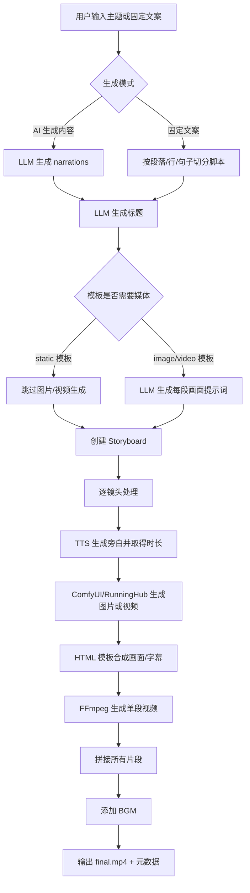
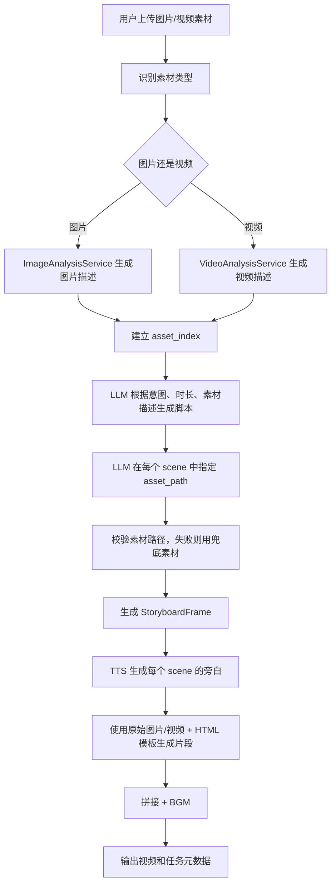
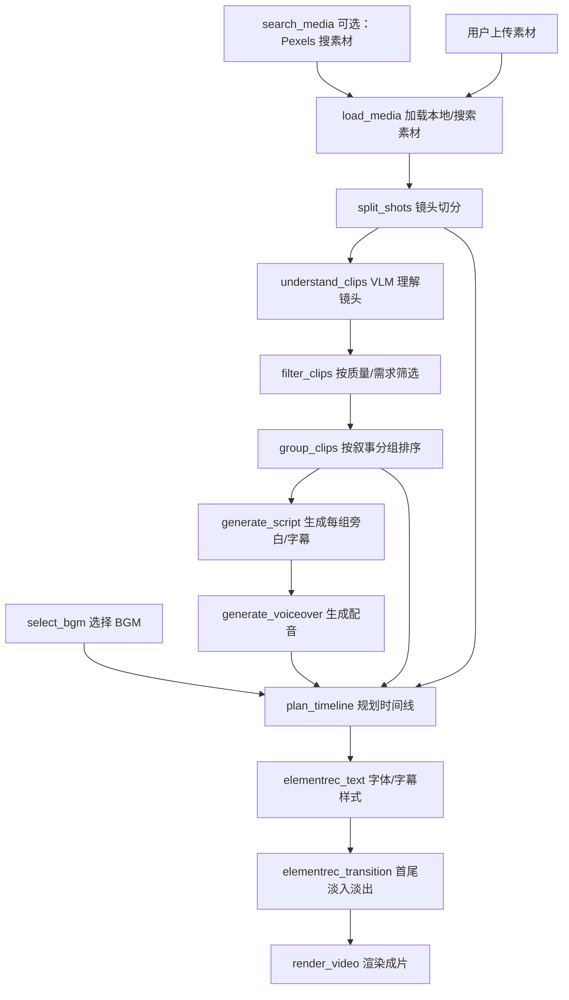
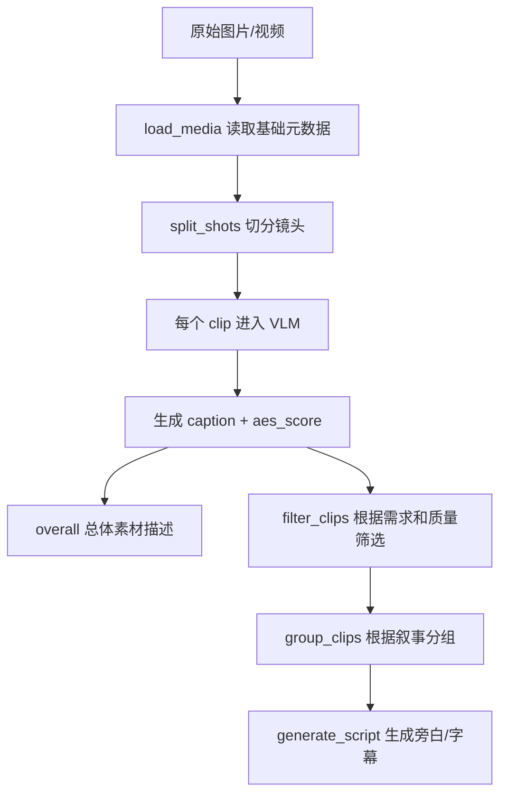
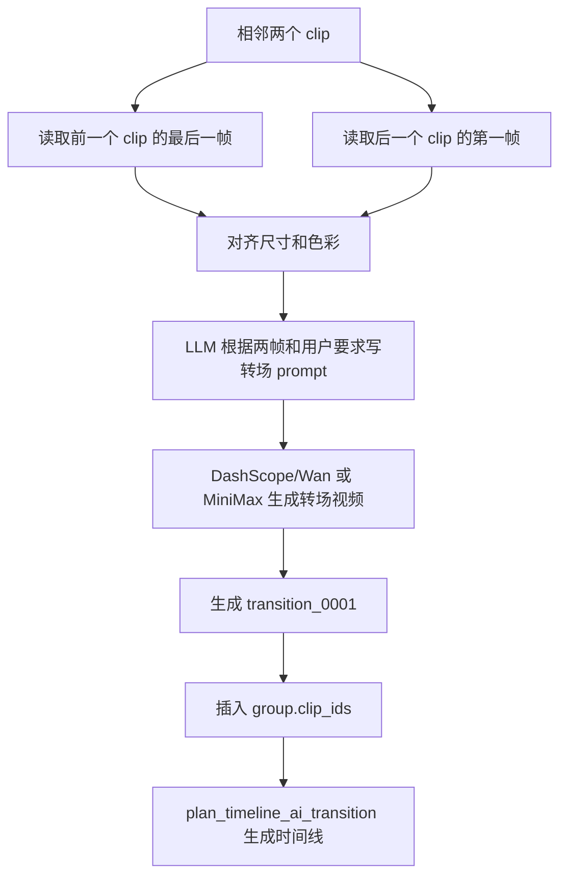
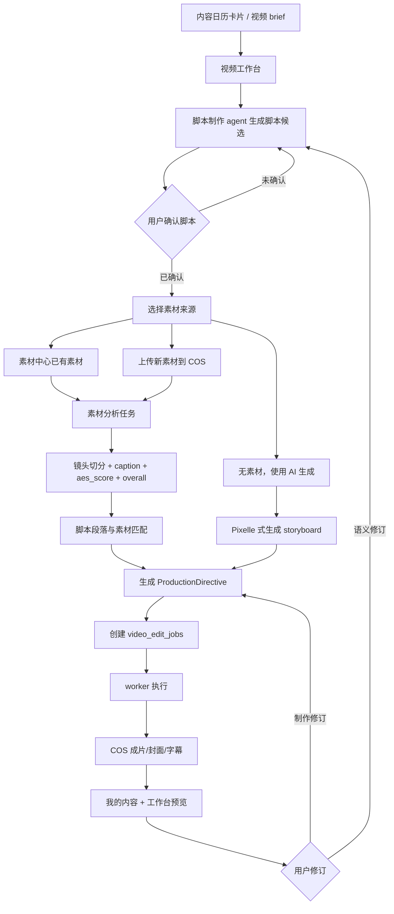

# 两项目视频剪辑 knowhow 深度调研报告

记录日期：2026-05-11

调研对象：

- `references/open-source/Pixelle-Video`
- `references/open-source/小红书AI剪辑视频`

面向读者：产品经理、负责视频工作台/worker 的开发同学、后续接手的 AI Agent。

## 1. 给产品经理的总览

这两个项目不是同一类东西，适合吸收的 knowhow 也不同。

| 项目 | 一句话定位 | 更像哪种产品能力 | 最值得借鉴的地方 | 不适合直接照搬的地方 |
| --- | --- | --- | --- | --- |
| Pixelle-Video | 输入主题或固定文案，自动生成一条新视频 | “从 0 到 1 生成内容”的视频工厂 | LLM 写文案、TTS 定时长、ComfyUI/RunningHub 生成图/视频、HTML 模板包装画面、FFmpeg 拼接 | 对真实素材的检索、筛选、镜头级理解和复杂剪辑较弱 |
| 小红书AI剪辑视频 | 上传/搜索素材，用 Agent 调工具理解素材并剪成片 | “有素材后自动剪辑”的视频剪辑 Agent | 素材加载、镜头切分、VLM 理解、筛选分组、脚本、配音、BGM、时间线、渲染节点化 | 对业务策略和产品合同没有边界，依赖本地资源和多种密钥，不宜让它直接进入主应用 |

最核心结论：

- Pixelle-Video 的 knowhow 是“生成型流水线”：适合做主题快创、脚本转视频、模板化营销视频。
- 小红书AI剪辑视频的 knowhow 是“剪辑型流水线”：适合做素材理解、镜头选择、剪辑时间线、字幕配音、BGM 和转场。
- 如果要融合进本项目，不能简单把两个仓库代码堆一起。更稳的方式是：主应用负责业务语义和任务合同，worker 负责执行，底层引擎可以分成 `quick_generation` 和 `asset_editing` 两类能力。

产品经理可以这样理解：

```text
我们的产品负责回答：为什么要做这条内容、给谁看、要表达什么、哪些素材可用、用户确认了什么。

Pixelle-Video 适合回答：没有真实素材时，如何快速生成一条完整视频。

OpenStoryline 适合回答：有真实素材时，如何看懂素材、挑片段、排时间线并剪出来。
```

## 2. Pixelle-Video 深度拆解

### 2.1 项目定位和运行入口

Pixelle-Video 是一个 AI 全自动短视频引擎。README 描述的主目标是：输入一个主题，自动完成文案、配图/视频、语音、背景音乐和视频合成。

本地路径：

`references/open-source/Pixelle-Video`

主要运行方式：

| 入口 | 运行方式 | 产品含义 |
| --- | --- | --- |
| Streamlit Web | `uv run streamlit run web/app.py` 或 `./start_web.sh` | 给普通用户使用的可视化生成界面 |
| FastAPI | `uv run python api/app.py --host 0.0.0.0 --port 8000` | 给系统集成使用的 API 服务 |
| Docker Compose | `docker-compose.yml` 中包含 `api` 和 `web` 两个服务 | 可部署成 Web + API 双服务 |
| Python SDK | `PixelleVideoCore` 初始化后调用 pipeline | 给代码内部集成或二次开发使用 |

关键配置：

- `config.example.yaml` 定义 LLM、ComfyUI、RunningHub、TTS、图片/视频工作流和默认模板。
- `pyproject.toml` 显示依赖包括 `streamlit`、`fastapi`、`edge-tts`、`comfykit`、`ffmpeg-python`、`moviepy`、`playwright` 等。
- 本地运行需要 Python 3.11+、`uv`、FFmpeg，以及至少一个 LLM 配置。生成图片/视频通常还需要本地 ComfyUI 或 RunningHub API Key。

### 2.2 产品入口：多个生成 Tab

Pixelle 的 Web 首页用 Streamlit 组织成多个 pipeline tab：

- `quick_create`：快速创作，主题或固定文案生成视频。
- `custom_media`：上传图片/视频素材，根据素材生成营销视频。
- `digital_human`：数字人口播。
- `image_to_video`：图生视频。
- `action_transfer`：动作迁移。

对本项目最相关的是前两个：

- `quick_create` 对应“没有素材，先生成一条视频”。
- `custom_media` 对应“用户有素材，基于素材生成视频”。

### 2.3 核心架构：Core + Service + Pipeline

Pixelle 的中心是 `PixelleVideoCore`：

```text
PixelleVideoCore
├─ LLMService              生成标题、文案、分镜提示词
├─ TTSService              生成旁白音频
├─ MediaService            调 ComfyUI/RunningHub 生成图片或视频
├─ ImageAnalysisService    用视觉工作流分析图片
├─ VideoAnalysisService    用视觉工作流分析视频
├─ FrameProcessor          单镜头处理：音频、画面、模板、视频片段
├─ VideoService            FFmpeg 拼接、混音、叠加
├─ PersistenceService      保存任务元数据和 storyboard
└─ Pipelines
   ├─ standard
   ├─ custom
   └─ asset_based
```

产品语言翻译：

- `pipeline` 是一条完整的视频生产方法。
- `storyboard` 是视频的分镜表。
- `frame` 是一个镜头/段落。
- `media workflow` 是生成图片或视频的 AI 能力插件。
- `frame template` 是每个镜头最终长什么样的 HTML 版式。

### 2.4 标准流水线：主题或脚本生成视频

标准流程在 `pixelle_video/pipelines/standard.py` 和 `pixelle_video/pipelines/linear.py`。



它的关键 knowhow：

1. **TTS 是时间基准。**  
   每个镜头先生成旁白，旁白音频时长决定该镜头需要持续多久。视频工作流会把这个 duration 传给视频生成能力，让画面长度尽量和旁白对齐。

2. **HTML 模板是视觉包装层。**  
   Pixelle 不是直接在 FFmpeg 里写复杂字幕版式，而是先用 HTML 模板渲染每个镜头画面，再把图片/视频和旁白合成视频片段。

3. **ComfyUI/RunningHub 是可替换的原子能力层。**  
   生图、生视频、TTS、图像理解、视频理解都被包装成 workflow。换模型时，理论上换 workflow 文件和配置即可。

4. **最终剪辑比较线性。**  
   标准流水线主要是“按分镜顺序拼接”。它没有复杂的镜头筛选、跳剪节奏、段落重排和中间转场规划。

### 2.5 自定义素材流水线：上传素材后生成视频

`pixelle_video/pipelines/asset_based.py` 是 Pixelle 里最接近“商家素材库”的部分。



它对素材的“理解”方式：

- 图片调用 `ImageAnalysisService`，底层通过 `analyse_image.json` 工作流，返回一段文字描述。
- 视频调用 `VideoAnalysisService`，底层通过 `analyse_video.json` 或 RunningHub 的视频理解工作流，返回一段文字描述。
- 这些描述会传给 LLM，LLM 决定每个场景用哪一个素材。

它没有做的事：

- 没有把素材切成镜头级片段。
- 没有 embedding 向量检索。
- 没有素材质量分、多维标签库或版权判断。
- 没有稳定的“素材中心”概念，上传素材先存在临时目录。
- 没有复杂转场，它仍然以片段拼接为主。

### 2.6 素材链路

Pixelle 的素材来源分三类：

| 素材类型 | 来源 | 存储/复用方式 | 产品含义 |
| --- | --- | --- | --- |
| AI 图片/视频 | ComfyUI 或 RunningHub 工作流生成 | 下载到 `output/<task>/frames` | 适合没有真实素材的快创 |
| 用户上传素材 | Web `custom_media` tab 上传到 `temp/assets_*` | 当前任务使用，之后随任务元数据保存 | 适合商家素材，但还不是成熟素材库 |
| BGM | `bgm/` 目录内置或自定义音乐 | 用户选择路径，FFmpeg 循环或一次播放 | BGM 是手动选择，不是语义推荐 |

和本项目的素材中心相比，Pixelle 更像“临时上传后生成”，还没形成可运营的商家资产库。

### 2.7 语义识别和理解能力

Pixelle 里有两层“语义”：

第一层是对用户主题/脚本的理解：

- LLM 根据主题生成 narrations。
- LLM 根据 narrations 生成 image prompts。
- 这类理解服务的是“生成内容”，不是理解已有素材。

第二层是对上传素材的理解：

- 图片/视频通过 ComfyUI/RunningHub 视觉工作流变成文本描述。
- LLM 读取这些描述，再安排素材和场景。

可产品化的结论：

- Pixelle 可以作为“素材描述生成器”的参考，但它不擅长长视频切镜头。
- 如果我们想做商家素材中心，需要把 Pixelle 的 `image_analysis/video_analysis` 结果持久化到我们的素材资产表，而不是只在一个任务里临时用。

### 2.8 转场、字幕、配音、BGM、渲染

| 环节 | Pixelle 怎么做 | 能力边界 |
| --- | --- | --- |
| 转场 | 主要靠片段直接拼接；模板和 prompt 里可描述画面动态，但时间线层没有复杂转场节点 | 不适合直接承担“智能转场剪辑器” |
| 字幕/文案上屏 | HTML 模板渲染时把 narration 放到画面里 | 字幕是镜头级文案，不是逐字时间轴字幕 |
| 配音 | Edge-TTS、本地 TTS 或 ComfyUI TTS workflow | 配音时长驱动镜头时长 |
| BGM | `VideoService.concat_videos` 后添加，支持 loop/once 和音量 | 没有按情绪/节奏自动推荐 |
| 渲染 | FFmpeg 拼接、混音、图片转视频、视频叠加 | 稳定、简单，适合模板化批量视频 |

## 3. 小红书AI剪辑视频 深度拆解

### 3.1 项目定位和运行入口

这个项目本地 README 标题是 `FireRed-OpenStoryline`，本地目录名是 `小红书AI剪辑视频`。它是一个整理过的公开仓库镜像，保留了 OpenStoryline 的核心剪辑能力。

本地路径：

`references/open-source/小红书AI剪辑视频`

远端：

`git@gitee.com:jingjing_2025/agent-video-generation.git`

主要运行方式：

| 入口 | 运行方式 | 产品含义 |
| --- | --- | --- |
| MCP Server | `PYTHONPATH=src python -m open_storyline.mcp.server` | 把剪辑节点注册成 Agent 可调用工具 |
| Web 服务 | `python -m uvicorn agent_fastapi:app --host 127.0.0.1 --port 8005` | 本地聊天式剪辑工作台 |
| 一键脚本 | `./run.sh` 同时启动 MCP 和 Web | 用于 HuggingFace/Docker 风格部署 |
| CLI | `python cli.py` | 命令行里和智能剪辑 Agent 对话 |

关键配置：

- `config.toml` 包含 LLM、VLM、Pexels、TTS、AI transition、BGM、字体、时间线参数。
- `requirements.txt` 包含 `langchain`、`mcp`、`moviepy`、`transnetv2_pytorch`、`funasr`、`librosa`、`sentence-transformers`、`faiss-cpu` 等。
- README 明确说明当前公开版不包含部分大资源，例如默认 BGM 和某些字体，需要补齐或替换。

### 3.2 产品形态：聊天式剪辑 Agent

它的 Web 不是表单式生成器，而是“上传素材 + 自然语言指令 + Agent 调工具”的形态。

```text
用户上传图片/视频
-> 输入剪辑目标，例如“剪成 1 分钟小红书风格短视频”
-> WebSocket 把消息发给 LangChain Agent
-> Agent 调用 MCP 节点工具
-> 每个节点写 artifact
-> 最终渲染视频并返回预览
```

前端能力：

- 有会话历史。
- 有 LLM/VLM 配置区。
- 有 Pexels、TTS、AI 转场配置区。
- 支持图片/视频上传，前端明确过滤音频上传。
- 支持 pending media，用户一轮对话可以带素材。

后端能力：

- `agent_fastapi.py` 管理 session、上传、媒体目录、WebSocket 聊天和 Agent 执行。
- `open_storyline.agent.build_agent` 创建 LangChain Agent，并接入 MCP tools。
- `register_tools.py` 把每个剪辑节点注册成 MCP tool。
- `ArtifactStore` 保存节点执行结果，方便后续节点读历史。

### 3.3 核心节点流程

OpenStoryline 的 knowhow 是把剪辑拆成可组合节点：



还有两条重要支线：

- `local_asr` + `speech_rough_cut`：对有语音的视频做 ASR，再让 LLM 判断哪些句子要保留，切掉冗余语音段。
- `generate_ai_transition` + `plan_timeline_ai_transition`：在两个片段之间取前后帧，生成 AI 转场视频，再插回片段序列。

### 3.4 素材链路

它的素材来源更接近“剪辑工作台”：

| 素材来源 | 具体机制 | 产品含义 |
| --- | --- | --- |
| 用户上传 | Web API `/api/sessions/{session_id}/media`，保存到 session media_dir | 用户给真实门店/产品素材 |
| Pexels 搜索 | `SearchMediaNode` 按关键词、数量、横竖屏、时长搜索并下载图片/视频 | 可补充通用氛围素材 |
| 本地资源 | `resource/bgms`、`resource/fonts`、`resource/script_templates` | 支撑音乐、字体、文案风格 |
| 节点中间产物 | `.storyline/.server_cache/<session>/<artifact>` | 存切分片段、TTS、渲染输出 |

素材入库后第一步是 `load_media`：

- 图片读取宽高。
- 视频读取时长、宽高、fps、是否有音频、音频采样率。
- 每个素材被分配 `media_0001` 这样的稳定 ID。

### 3.5 素材语义理解

这个项目在“理解素材”上比 Pixelle 更完整。



关键点：

1. **镜头切分。**  
   `split_shots` 使用 TransNetV2 做场景边界检测，再用 FFmpeg 按切点切出 clip。它还会强制最短/最长镜头时长，避免切得太碎或太长。

2. **画面理解。**  
   `understand_clips` 把图片或视频片段交给 VLM，要求输出 100 字内描述和 `aes_score` 美学分。描述维度包括主体、动作、表情、场景、视角、情绪、画质、光影、构图、稳定性等。

3. **筛选策略。**  
   `filter_clips` 会根据用户要求、caption、美学分和时长筛选素材。它的 prompt 里有一个硬规则：素材数少于等于 5 个就不删，多于 5 个时保留数量必须大于 80%，避免过度删除。

4. **叙事分组。**  
   `group_clips` 根据选中 clip 的描述，把素材组织成 group，并生成每组 summary 和 clip_ids。后续脚本和时间线都是围绕 group 走。

5. **总体理解。**  
   `understand_clips` 会把所有 clip caption 汇总成 overall summary，帮助后续文案生成理解“这些素材大概讲什么故事”。

6. **语音理解。**  
   `local_asr` 用 FunASR 识别视频语音；`speech_rough_cut` 再让 LLM 判断句子是否保留，并根据句子时间戳切视频。这对采访、口播、课堂、探店素材很有价值。

它没有做成成熟产品的地方：

- 理解结果目前主要存在节点产物里，没有被设计成商家资产长期画像。
- 美学分只在 prompt/输出里出现，后续节点没有形成强约束策略库。
- Pexels 素材有通用版权协议风险，需要产品层显式提示和控制。

### 3.6 脚本、分镜和时间线

OpenStoryline 的剪辑对象不是 Pixelle 的 storyboard，而是更接近专业剪辑的 tracks：

```text
tracks
├─ video      画面片段轨道
├─ subtitles  字幕轨道
├─ voiceover  配音轨道
└─ bgm        背景音乐轨道
```

时间线规划做了几件事：

- 根据 group 的 clip_ids 决定画面顺序。
- 如果有 TTS，配音时长成为每组目标时长。
- 如果没有 TTS，则按文本长度估算时长。
- 如果启用 BGM beats，则把镜头时长贴近鼓点。
- 视频片段可截取 source_window，放入 timeline_window。
- 如果目标时长长于原视频片段，可放慢或冻结尾帧；如果短于原片段，可随机截取一个窗口。
- 图片默认给固定时长。
- 字幕会根据文本长度切分成 subtitle_units，再分配到时间窗口里。

产品翻译：

- `group` 是一个内容段落。
- `clip` 是候选镜头。
- `script` 是每个段落要说什么。
- `voiceover` 是配音文件和它的真实时长。
- `timeline_window` 是这个素材在成片里出现的时间。
- `source_window` 是从原始素材里截哪一段。

### 3.7 转场、字幕、配音、BGM、渲染

| 环节 | OpenStoryline 怎么做 | 产品理解 |
| --- | --- | --- |
| 转场 | `elementrec_transition` 支持首尾 fade in/out；`generate_ai_transition` 可在两个 clip 间生成 AI 转场视频 | 有基础转场和 AI 转场两种层级 |
| 字幕 | `generate_script` 生成 `subtitle_units`，`render_video` 用 Pillow 绘制字幕层 | 字幕是时间线轨道的一部分 |
| 配音 | `generate_voiceover` 支持 ByteDance、BigTTS、MiniMax、302 等 provider | 配音是分组生成，时长回填时间线 |
| BGM | `select_bgm` 用向量召回、标签过滤、LLM 选择，再用 librosa 计算 BPM/鼓点 | 可以按情绪、场景和节奏选音乐 |
| 渲染 | `render_video` 用 MoviePy 拼接画面、叠字幕、混音、输出 mp4 | 更像真实剪辑器，而不是模板合成器 |

AI 转场的具体机制：



### 3.8 真实运行的约束

这个仓库是公开整理版，实际跑完整流程需要补齐：

- LLM API。
- VLM API。
- Pexels API Key，如果要搜索素材。
- TTS provider 密钥。
- AI transition provider 密钥。
- TransNetV2 模型权重。
- 部分 BGM 和字体资源。
- FFmpeg。

所以本轮调研没有把“能本地完整出片”作为已验证事实。这里的结论来自代码和文档静态分析。

## 4. 两个项目的能力对比

| 维度 | Pixelle-Video | 小红书AI剪辑视频 / OpenStoryline | 对本项目的启发 |
| --- | --- | --- | --- |
| 用户入口 | Streamlit 多 Tab，偏配置式 | Web 聊天 + 上传素材，偏 Agent 式 | 我们的视频工作台应是“脚本协同 + 任务画布”，可吸收聊天式操作 |
| 主要输入 | 主题、固定文案、上传素材 | 上传素材、Pexels 搜索、自然语言剪辑目标 | 本项目应支持“内容日历 brief + 素材中心素材 + 用户补充要求” |
| 素材来源 | AI 生成、用户上传、BGM 文件夹 | 用户上传、Pexels、BGM/字体/脚本模板资源库 | 素材中心应成为长期资产库，外部素材只做补充 |
| 素材理解 | asset_based 中用图片/视频理解工作流生成描述 | load metadata、镜头切分、VLM caption、美学分、overall summary、ASR | OpenStoryline 更适合做素材理解层 |
| 脚本生成 | LLM 从主题生成 narrations；或根据素材描述生成 scenes | LLM 根据 group、caption、overall 和用户需求生成段落旁白 | 我们应先让脚本制作 agent 产出可确认脚本，再交给 worker |
| 时间线 | storyboard frame 顺序线性拼接 | video/subtitle/voiceover/bgm 多轨时间线 | OpenStoryline 时间线模型更适合制作修订 |
| 字幕 | HTML 模板把 narration 画进镜头 | subtitle track + Pillow 渲染 | 如果要开放字幕编辑，OpenStoryline 更合适 |
| 配音 | Edge-TTS 或 ComfyUI TTS；TTS 决定镜头时长 | 多 provider，按 group 生成，时长回填 timeline | 两者都值得吸收，TTS 时长应成为生产合同字段 |
| BGM | 用户选择，拼接后 loop/once | 向量召回、标签过滤、LLM 选择、librosa 分析 BPM/鼓点 | OpenStoryline BGM 选择和 beat 对齐值得产品化 |
| 转场 | 主要拼接，无完整转场规划 | 首尾 fade，另有 AI 转场生成节点 | AI 转场可作为增强版能力，不宜 MVP 上来就强依赖 |
| 渲染 | FFmpeg，适合模板化片段拼接 | MoviePy，适合多轨合成 | worker 可按 executionMode 选择不同 renderer |
| 持久化 | output 目录 + task metadata/storyboard | session artifact + local cache | 都要改造为 Supabase + COS 合同 |
| 产品边界 | 生成器自己做决策 | Agent 自由调工具做决策 | 本项目必须由 app 合同化，避免 worker/Agent 直接决定业务 |

## 5. 可吸收的 knowhow

### 5.1 从 Pixelle-Video 吸收

1. **快速生成模式。**  
   当商家没有可用素材，只给了主题、卖点、目标人群时，可以用 Pixelle 式流程生成“模板化视频初稿”。

2. **TTS 驱动镜头时长。**  
   先生成旁白，再用旁白长度决定镜头长度，比拍脑袋设置每段 3 秒更稳定。

3. **HTML 模板系统。**  
   用 HTML 表达画面版式、标题、字幕、品牌元素，比把所有视觉规则写进 FFmpeg 更适合产品迭代。

4. **Comfy workflow 原子能力。**  
   生图、生视频、图像理解、视频理解都可以变成可替换 workflow。我们的 worker 可把这些作为可选 provider，而不是写死某个模型。

5. **任务历史元数据。**  
   每次生成都保存 input、result、config、storyboard，方便复盘“为什么生成成这样”。

### 5.2 从小红书AI剪辑视频吸收

1. **素材先理解，再剪辑。**  
   商家素材不能只按文件名排序。应先切镜头、生成 caption、美学分和 overall，再进入脚本和时间线。

2. **节点化执行。**  
   `load_media -> split_shots -> understand_clips -> filter_clips -> group_clips -> generate_script -> plan_timeline -> render_video` 是很清晰的 knowhow，可以映射成 worker stages。

3. **多轨时间线。**  
   真正可修订的视频任务需要 tracks，而不是只保存最终 mp4。至少要能保存 video、subtitle、voiceover、bgm 的计划。

4. **BGM 语义选择和节拍对齐。**  
   用标签、向量召回、LLM 选择和 librosa 分析，可以把“选音乐”从手动上传变成半自动推荐。

5. **AI 转场作为增强能力。**  
   用前后帧生成转场视频，适合做高级效果，但成本和稳定性较高，建议放到增强版。

6. **ASR 粗剪。**  
   对访谈、培训、探店口播类素材，ASR + LLM 决定保留句子非常有价值。

### 5.3 融合时必须加上的产品边界

两个项目都没有天然适配我们当前架构里的这些边界：

- 咨询台语义确认。
- 内容日历上下文。
- 商家素材中心。
- COS 长期资产。
- `video_edit_jobs.input_payload` 合同。
- 成片回写到「我的内容」。
- 语义修订和制作修订分流。

所以融合不是“代码合并”，而是把它们的 knowhow 重新装进我们的产品合同里。

## 6. 融合到本项目的改造建议

当前项目架构真相源已经定义：

```text
咨询台
-> 脚本制作 agent
-> app 合同化 video_edit_jobs.input_payload
-> video-worker
-> openstoryline-engine / FireRed
-> COS + Supabase 回写
-> app 预览审核和修订分流
```

建议把两个项目融合成两种 execution mode：

| executionMode | 适用场景 | 借鉴来源 | 核心输入 | 核心输出 |
| --- | --- | --- | --- | --- |
| `quick_generation` | 用户没有真实素材，需要快速生成一条视频 | Pixelle-Video | 已确认脚本、风格、模板、TTS、生成模型 | final.mp4、storyboard、生成素材 |
| `asset_editing` | 用户有门店/产品/探店素材，需要自动剪辑 | OpenStoryline | 已确认脚本、input_assets、剪辑要求、平台比例 | final.mp4、timeline tracks、字幕、BGM、日志 |
| `hybrid_generation` | 真实素材不够，部分用 AI 补画面 | 两者结合 | input_assets + AI 生成补充镜头 | final.mp4、素材缺口说明、补充镜头 |

### 6.1 推荐产品流程



### 6.2 视频工作台 UI 建议

视频工作台不应只是一个“生成按钮”，而应分成四个可理解区域：

| 区域 | 用户看到什么 | 系统背后做什么 |
| --- | --- | --- |
| 策略与脚本区 | 内容日历目标、脚本候选、口吻和 CTA | 脚本制作 agent 生成/修订，保存 `content_variants` |
| 素材区 | 素材列表、镜头卡片、AI 理解标签、美学分 | 素材来自 COS，worker 或分析任务生成 caption/segments |
| 制作计划区 | 分镜、每段使用哪个素材、字幕、配音、BGM、比例 | 生成 timeline / storyboard / ProductionDirective |
| 任务状态区 | 排队、准备、生成中、上传中、成功/失败、日志摘要 | 对应 `video_edit_jobs.status/current_stage/progress_pct` |

### 6.3 数据结构建议

不建议让开源项目的本地 JSON 直接成为真相源。建议抽象成我们的业务数据：

| 数据 | 建议落点 | 说明 |
| --- | --- | --- |
| 原始素材 | `asset_objects` + COS | 已有方向，必须保留 |
| 素材分析结果 | 新增 `asset_analysis` 或放入 `asset_objects.metadata` | caption、aes_score、width/height/duration、shot_count |
| 镜头切分结果 | 新增 `asset_segments` | clip_id、source_asset_id、start/end、caption、aes_score |
| 视频脚本 | `content_variants.variant_type = video_script` | 已有方向 |
| 生产合同 | `video_edit_jobs.input_payload.productionDirective` | app 和 worker 的唯一稳定连接 |
| 时间线计划 | `video_edit_jobs.result_payload.timeline` 或单独版本表 | 便于制作修订 |
| 输出视频/字幕/封面 | `asset_objects` owner 指向 content_variant/job | 已有方向 |

### 6.4 Worker 改造建议

worker 可以吸收 OpenStoryline 的节点思路，但不要把 Agent 自由决策直接搬进生产：

```text
worker stage
├─ validate_payload
├─ download_input_assets_from_COS
├─ analyze_assets            可借鉴 OpenStoryline load/split/understand
├─ build_production_plan     app 已锁脚本，worker 只做素材匹配和制作计划
├─ render_video              可选择 Pixelle/Storyline renderer
├─ upload_outputs_to_COS
└─ writeback_job_result
```

关键边界：

- worker 不重写卖点、客群、CTA。
- worker 可以决定制作层：镜头顺序、字幕排布、BGM、转场。
- 如果用户要改“表达什么”，回到脚本制作 agent。
- 如果用户要改“怎么剪”，创建制作修订 job。

### 6.5 两个项目最合理的组合方式

推荐组合：

```text
Pixelle-Video = AI 生成补充能力 + 模板化快创 renderer
OpenStoryline = 素材理解 + 剪辑计划 + 多轨渲染 knowhow
本项目 app/worker = 业务合同 + 权限 + 数据回写 + 用户验收
```

不推荐组合：

```text
直接把 Pixelle 的 Streamlit 页面嵌进我们商家端
直接让 OpenStoryline Agent 读用户聊天后自由创建最终视频
直接把本地 outputs 当成长期成片库
直接把 Pexels 搜到的素材当成商家资产
```

## 7. MVP、增强版、长期版路线

### 7.1 MVP：先把“有素材可剪”跑顺

目标：让商家上传/选择素材后，能生成一条可预览的视频初稿。

范围：

- 继续使用本项目已有 `video_edit_jobs`、COS、worker。
- 输入必须是已确认脚本 + 已绑定 COS 素材。
- worker 先做基础素材校验和简单排序。
- 吸收 OpenStoryline 的 `load_media`、`render_video`、基础字幕/配音/BGM 思路。
- 不做 AI 转场。
- 不做 Pexels 自动搜素材。
- 不做复杂镜头切分，或只对视频做保守切分。

验收：

- 用户能从视频工作台创建 job。
- job 失败不丢脚本和素材。
- 成片、封面、字幕或日志能回写到 COS/Supabase。

### 7.2 增强版：加入素材理解和剪辑计划

目标：让系统真正“看懂素材再剪”。

范围：

- 引入镜头切分。
- 为每个素材/镜头生成 caption、aes_score、overall。
- 在工作台展示“AI 看懂了什么”。
- 脚本段落和素材片段做自动匹配。
- 生成可解释的 timeline tracks。
- BGM 支持标签/情绪推荐和节拍对齐。
- 支持制作修订：字幕、BGM、镜头顺序、节奏。

验收：

- 用户能看到每个素材的理解结果。
- 每个脚本段落能解释“为什么用了这个素材”。
- 修改制作要求后能生成新 job，不重写业务脚本。

### 7.3 长期版：混合生成和高级效果

目标：做成可持续升级的视频生产系统。

范围：

- Pixelle 式 AI 生成补充镜头。
- OpenStoryline 式 AI 转场。
- ASR 粗剪口播/访谈素材。
- 多平台比例自动适配。
- 商家品牌模板、字体、封面规则。
- 素材资产复利：每次分析结果回流素材中心。
- 版本化 timeline，支持更细的人工编辑。

验收：

- 同一条脚本可生成小红书版、抖音版、横版培训版。
- 同一批素材可被多次复用，并且越用越了解。
- 产品侧能解释每条视频从策略、脚本、素材、时间线到成片的全过程。

## 8. 证据索引

Pixelle-Video 关键证据：

- `references/open-source/Pixelle-Video/README.md`：项目定位、功能、运行方式、Web 使用说明。
- `references/open-source/Pixelle-Video/config.example.yaml`：LLM、ComfyUI、RunningHub、TTS、模板配置。
- `references/open-source/Pixelle-Video/web/app.py`：Streamlit 多页入口。
- `references/open-source/Pixelle-Video/web/pipelines/standard.py`：快速生成 UI。
- `references/open-source/Pixelle-Video/web/pipelines/asset_based.py`：自定义素材 UI。
- `references/open-source/Pixelle-Video/pixelle_video/service.py`：Core service 和 pipelines 注册。
- `references/open-source/Pixelle-Video/pixelle_video/pipelines/linear.py`：线性 pipeline 生命周期。
- `references/open-source/Pixelle-Video/pixelle_video/pipelines/standard.py`：标准视频生成流程。
- `references/open-source/Pixelle-Video/pixelle_video/pipelines/asset_based.py`：上传素材分析、脚本生成、素材匹配。
- `references/open-source/Pixelle-Video/pixelle_video/services/frame_processor.py`：单镜头 TTS、媒体、HTML 合成、片段生成。
- `references/open-source/Pixelle-Video/pixelle_video/services/image_analysis.py`：图片理解工作流。
- `references/open-source/Pixelle-Video/pixelle_video/services/video_analysis.py`：视频理解工作流。
- `references/open-source/Pixelle-Video/pixelle_video/services/video.py`：FFmpeg 拼接、混音、图片转视频、视频叠加。
- `references/open-source/Pixelle-Video/templates/`：HTML 画面模板。
- `references/open-source/Pixelle-Video/workflows/`：ComfyUI/RunningHub 工作流。

小红书AI剪辑视频关键证据：

- `references/open-source/小红书AI剪辑视频/README.md`：公开镜像说明、运行方式、能力概述。
- `references/open-source/小红书AI剪辑视频/OPENSTORYLINE_AGENT_GUIDE.md`：Agent 使用、配置、启动、已知状态。
- `references/open-source/小红书AI剪辑视频/config.toml`：LLM/VLM、Pexels、TTS、AI transition、BGM、时间线配置。
- `references/open-source/小红书AI剪辑视频/agent_fastapi.py`：Web、session、上传、WebSocket、Agent 后端。
- `references/open-source/小红书AI剪辑视频/cli.py`：命令行 Agent 入口。
- `references/open-source/小红书AI剪辑视频/src/open_storyline/agent.py`：LangChain Agent + MCP tools 组合。
- `references/open-source/小红书AI剪辑视频/src/open_storyline/mcp/register_tools.py`：节点注册为 MCP 工具。
- `references/open-source/小红书AI剪辑视频/web/node_map/workflow.json`：节点工作流说明。
- `references/open-source/小红书AI剪辑视频/src/open_storyline/nodes/core_nodes/load_media.py`：素材加载和元数据。
- `references/open-source/小红书AI剪辑视频/src/open_storyline/nodes/core_nodes/search_media.py`：Pexels 素材搜索。
- `references/open-source/小红书AI剪辑视频/src/open_storyline/nodes/core_nodes/split_shots.py`：TransNetV2 镜头切分。
- `references/open-source/小红书AI剪辑视频/src/open_storyline/nodes/core_nodes/understand_clips.py`：VLM 画面理解。
- `references/open-source/小红书AI剪辑视频/src/open_storyline/nodes/core_nodes/filter_clips.py`：素材筛选。
- `references/open-source/小红书AI剪辑视频/src/open_storyline/nodes/core_nodes/group_clips.py`：素材分组。
- `references/open-source/小红书AI剪辑视频/src/open_storyline/nodes/core_nodes/generate_script.py`：旁白/字幕脚本生成。
- `references/open-source/小红书AI剪辑视频/src/open_storyline/nodes/core_nodes/generate_voiceover.py`：TTS 配音生成。
- `references/open-source/小红书AI剪辑视频/src/open_storyline/nodes/core_nodes/select_bgm.py`：BGM 检索、选择、BPM/鼓点分析。
- `references/open-source/小红书AI剪辑视频/src/open_storyline/nodes/core_nodes/generate_ai_transition.py`：AI 转场生成。
- `references/open-source/小红书AI剪辑视频/src/open_storyline/nodes/core_nodes/plan_timeline.py`：基础多轨时间线。
- `references/open-source/小红书AI剪辑视频/src/open_storyline/nodes/core_nodes/plan_timeline_ai_transition.py`：AI 转场时间线。
- `references/open-source/小红书AI剪辑视频/src/open_storyline/nodes/core_nodes/render_video.py`：MoviePy 渲染。
- `references/open-source/小红书AI剪辑视频/prompts/tasks/`：素材理解、筛选、分组、脚本、BGM、转场等 prompt。

本项目融合参考：

- `docs/产品文档/V2.1-内容日历到图文视频工作台协作PRD.md`
- `docs/架构规范/2026-04-28-current-architecture.md`

## 9. 验证与边界说明

本轮完成的是静态深度调研和产品化拆解，没有启动两个项目完整生成视频。原因：

- Pixelle-Video 要完整生成视频，需要配置 LLM、ComfyUI 或 RunningHub，以及 TTS/工作流环境。
- 小红书AI剪辑视频要完整跑通，需要 LLM、VLM、Pexels/TTS/AI transition provider，以及部分模型、字体、BGM 资源。
- 本次目标是帮助产品经理理解 knowhow 和改造路径，不是做真实视频引擎联调。

已经完成的验证：

- 两个项目目录、README、配置文件、入口脚本、核心 pipeline/node 代码均已检查。
- 已确认两个项目的运行入口、依赖配置、素材链路、语义理解链路、剪辑/时间线/渲染链路。
- 已和本项目当前 V2.1 视频工作台/worker 架构文档对齐，融合建议没有把开源项目能力写成当前已实现状态。

