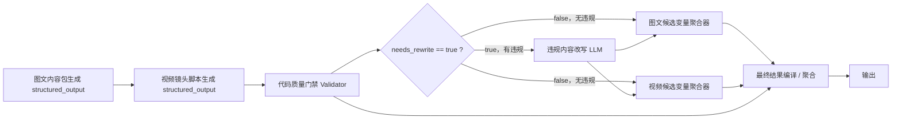

# Dify 质量门禁分支与违规改写节点修改说明

更新时间：2026-05-12

当前状态：

```text
已按本文方案修改本地 YAML：
docs/探索/2026-05-11-用dify来测试链路/内容日历生成图文与视频脚本 POC.yml
```

## 1. 要修改的 YAML

目标文件：

```text
docs/探索/2026-05-11-用dify来测试链路/内容日历生成图文与视频脚本 POC.yml
```

当前链路目标：

```text
内容日历 + 爆款内容 + txt知识库 + 图片素材
-> 图文内容包
-> 视频镜头脚本
-> 代码质量门禁
-> 如有违规则最小改写
-> 最终聚合输出
```

## 2. 目标流程图



核心原则：

1. 不需要“原稿透传节点”。
2. Code Validator 只负责发现风险词和输出分支判断字段。
3. Validator 不输出 `suggestion`，也不输出 `repairInstructions`。
4. 改写规则写在“违规内容改写 LLM”的提示词里。
5. 两条分支互斥：无违规直接用原始 structured output；有违规则用改写 LLM 的 structured output。
6. 变量聚合器只聚合同一语义、同一类型的候选变量，不要把图文和视频混在同一个候选聚合器里。

## 3. 当前已完成的修改

### 3.1 质量评审 Code 节点兼容 structured_output

节点：

```text
quality_reviewer / 质量评审
```

当前 Dify 输入变量已经从 LLM 的 `text` 改为：

```text
article_json = 图文内容包生成 / structured_output Object
video_json = 视频镜头脚本生成 / structured_output Object
image_assets_json = 开始 / image_assets_json String
fallback_knowledge_text = 开始 / fallback_knowledge_text String
```

因此 Code 节点里需要兼容两种输入：

```python
def parse_obj(value):
    if isinstance(value, dict):
        return value
    if isinstance(value, str):
        try:
            return json.loads(clean_json(value))
        except Exception:
            return {}
    return {}

def parse_list(value):
    if isinstance(value, list):
        return value
    if isinstance(value, str):
        try:
            parsed = json.loads(value or "[]")
            return parsed if isinstance(parsed, list) else []
        except Exception:
            return []
    return []
```

### 3.2 质量评审 Code 节点新增分支判断输出

Code 节点输出应包含：

```yaml
outputs:
  needs_rewrite:
    type: string
  risk_terms:
    type: string
  text:
    type: string
```

其中：

```text
needs_rewrite = "true" / "false"
risk_terms = 命中的违禁词，用“、”拼接
text = 完整 qualityReview JSON 字符串
```

示例：

```json
{
  "text": "{\"scores\":{\"compliance\":4},\"pass\":false,\"needsRewrite\":true,\"riskTerms\":[\"租金回报高\",\"低位价格\"]}",
  "needs_rewrite": "true",
  "risk_terms": "租金回报高、低位价格"
}
```

注意：

```text
Validator 不需要输出 suggestion。
Validator 不需要输出 repairInstructions。
```

## 4. 已落地的节点修改

### 4.0 修正 txt 知识库检索 Query

节点：

```text
kb_project_knowledge / txt 知识库检索
```

Dify 知识库检索节点的 query 必须是字符串，不能直接选择整个 `structured_output` 对象。

应改为：

```yaml
query_variable_selector:
  - task_understanding
  - text
```

说明：

```text
2026-05-12 实测发现，DeepSeek + Dify structured_output 偶发会把输入 JSON 当成 structured_output。
所以知识库检索不再依赖 task_understanding.structured_output.copySearchQuery，先使用 task_understanding.text 保证 query 一定是字符串。
后续迁移到 LangGraph.js 时，再用代码解析出的 copySearchQuery。
```

### 4.0.1 不再把 Dify structured_output 当主链路真相源

2026-05-12 回归测试暴露：

```text
1. article_generator.text 里是正确图文 JSON，但 article_generator.structured_output 可能是空模板或图片素材对象。
2. video_script_generator 在个别 case 会被图文 JSON 带偏，输出图文字段而不是视频字段。
3. 因此主链路改成：LLM text -> Code 解析 JSON -> 质量门禁 / 最终聚合。
```

落地策略：

```text
1. quality_reviewer 改为读取 article_generator.text 和 video_script_generator.text。
2. 变量聚合器改为聚合 text 字符串，不再聚合 structured_output object。
3. final_compiler Code 节点负责从 text 中解析 </think> 后面的 JSON。
4. video_script_generator 提示词明确禁止输出 titles、selectedTitle、coverCopy、body、hashtags、cta、imageMatches、copyReadyText 等图文字段。
```

### 4.1 新增 IF/ELSE 节点：是否需要违规改写

建议节点标题：

```text
是否需要违规改写
```

输入判断：

```text
quality_reviewer.needs_rewrite is "true"
```

分支：

```text
true  -> 违规内容改写 LLM
false -> 图文候选变量聚合器 + 视频候选变量聚合器
```

参考 Dify YAML 条件结构：

```yaml
cases:
  - case_id: needs_rewrite
    conditions:
      - comparison_operator: is
        value: 'true'
        variable_selector:
          - quality_reviewer
          - needs_rewrite
    logical_operator: and
```

如果 `needs_rewrite` 为 `"false"`，走默认分支即可。

### 4.2 新增 LLM 节点：违规内容改写

建议节点标题：

```text
违规内容改写 LLM
```

输入变量：

```text
article_json = 图文内容包生成 / structured_output
video_json = 视频镜头脚本生成 / structured_output
quality_review = 质量评审 / text
risk_terms = 质量评审 / risk_terms
```

可选输入：

```text
task_understanding = 任务理解 / text
creative_strategy = 创作策略规划 / text
```

节点目标：

```text
只改 validator 指出的违规字段，让公开成稿不再包含 risk_terms。
```

硬约束：

```text
1. 只修改命中风险词所在的公开成稿字段。
2. 不新增项目事实。
3. 不改变 JSON schema。
4. 不删除 assetId、imageMatches、sceneNo、timeRange 等结构字段。
5. 不重写整体创意，不改写未命中的内容。
6. 改写后不得再出现 risk_terms 中的任何词。
```

建议允许改写的公开字段：

```text
articlePackage.titles
articlePackage.selectedTitle
articlePackage.coverCopy
articlePackage.body
articlePackage.cta
articlePackage.copyReadyText
videoScript.storyOutline
videoScript.scenes[].visualGoal
videoScript.scenes[].voiceover
videoScript.scenes[].subtitle
videoScript.scenes[].shotRequirement
videoScript.scenes[].fallbackVisual
videoScript.shootingTips
```

建议不要改写的字段：

```text
articlePackage.imageMatches[].assetId
articlePackage.imageMatches[].title
videoScript.scenes[].sceneNo
videoScript.scenes[].timeRange
videoScript.scenes[].assetSourceHint
videoScript.scenes[].uploadRequired
trace
saveHints
```

推荐输出结构：

```json
{
  "articlePackage": {},
  "videoScript": {}
}
```

这里不要额外输出 `suggestion`、`repairInstructions`、`repairTrace`，否则会增加后续聚合和 LangGraph.js 迁移成本。

### 4.3 调整变量聚合器

当前本地 YAML 里已有一个示例聚合器：

```text
1778558779165 / 变量聚合器
```

但它现在随手放了：

```text
video_script_generator.structured_output
article_generator.structured_output
```

这个不建议保留为最终结构，因为图文和视频不是同一语义变量。

推荐改成两个变量聚合器：

#### A. 图文候选变量聚合器

建议标题：

```text
图文内容包候选聚合器
```

候选变量：

```text
违规内容改写 LLM / structured_output.articlePackage
图文内容包生成 / structured_output
```

顺序建议：

```text
修复后输出在前，原始输出在后。
```

原因：

```text
如果 true 分支执行，优先取修复后的 articlePackage；
如果 false 分支执行，修复节点不会执行，则取原始 articlePackage。
```

#### B. 视频候选变量聚合器

建议标题：

```text
视频脚本候选聚合器
```

候选变量：

```text
违规内容改写 LLM / structured_output.videoScript
视频镜头脚本生成 / structured_output
```

顺序同样建议：

```text
修复后输出在前，原始输出在后。
```

### 4.4 调整最终结果编译节点

节点：

```text
final_compiler / 最终结果编译
```

现在 prompt 里还在引用：

```text
{{#article_generator.text#}}
{{#video_script_generator.text#}}
```

structured output 改造后，建议改为引用候选聚合器输出：

```text
articlePackage = 图文内容包候选聚合器 / output
videoScript = 视频脚本候选聚合器 / output
qualityReview = 质量评审 / text
```

最终编译规则要强调：

```text
1. articlePackage 直接采用图文候选聚合器输出。
2. videoScript 直接采用视频候选聚合器输出。
3. qualityReview 直接采用质量评审节点 text 解析结果。
4. 不要重写正文、标题、CTA、镜头脚本。
5. 不要自行把 qualityReview.pass 改成 true。
6. 如果质量评审无法解析，qualityReview.pass=false，并写入 trace.degradationNotices。
```

## 5. 最终推荐链路

```text
start
-> task_understanding
-> kb_project_knowledge
-> creative_strategy
-> article_generator
-> video_script_generator
-> quality_reviewer
-> if_else_needs_rewrite
   -> false: 图文内容包候选聚合器 + 视频脚本候选聚合器
   -> true: 违规内容改写 LLM -> 图文内容包候选聚合器 + 视频脚本候选聚合器
-> final_compiler
-> end
```

## 6. 本地静态校验命令

修改 YAML 后先跑：

```bash
python3 - <<'PY'
from pathlib import Path
import yaml

path = Path('docs/探索/2026-05-11-用dify来测试链路/内容日历生成图文与视频脚本 POC.yml')
data = yaml.safe_load(path.read_text())
print('yaml_ok', type(data).__name__)

nodes = data['workflow']['graph']['nodes']
print('nodes:', [node.get('id') for node in nodes])
PY
```

如果改了 Code 节点，继续把 `quality_reviewer` 的 code 提取出来本地执行，至少测两种输入：

```text
1. structured_output dict 输入，无风险词，needs_rewrite=false
2. structured_output dict 输入，有风险词，needs_rewrite=true，risk_terms 非空
```

## 7. Dify 回归测试建议

导入 Dify 后至少跑这些 case：

```text
case01_full_with_compliance_risk.json
case02_no_images.json
case03_weak_knowledge.json
```

重点看：

```text
1. articlePackage 是否仍是完整 JSON。
2. videoScript 是否仍是完整 JSON。
3. 命中风险词时是否进入“违规内容改写 LLM”。
4. 无风险词时是否跳过改写 LLM。
5. 最终输出是否不再出现 risk_terms。
6. final_compiler 是否没有把正文和脚本重新创作一遍。
7. qualityReview.pass 是否如实采用质量评审节点结果。
```

## 8. 后续迁移到 LangGraph.js 的对应关系

Dify 节点可以直接映射为 LangGraph.js 的节点：

```text
task_understanding        -> LLM node
kb_project_knowledge      -> retriever / Supabase vector search node
creative_strategy         -> LLM node with structured output
article_generator         -> LLM node with structured output
video_script_generator    -> LLM node with structured output
quality_reviewer          -> deterministic function node
if_else_needs_rewrite     -> conditional edge
违规内容改写 LLM          -> LLM node with structured output
final_compiler            -> function node or light LLM node
```

`structured_output` 在 LangGraph.js 里可以用 schema 约束实现，例如 Zod schema 或 JSON Schema；这不是 Dify 独有能力，只是 Dify 在 UI 里把它包装成了 structured output 配置。

## 9. 2026-05-12 下午回归后的补丁

线上回归发现两个新问题：

1. 关闭思考模式后，部分 LLM 节点的 `text` 仍会输出 `<think>...</think>`，尤其是“任务理解”节点。
2. 正文和脚本改写后基本安全，但 `riskNotes`、`qualityReview.riskTerms`、`trace.creativeStrategy.mustAvoidClaims`、`mustReviewBeforePublish` 会把风险词原样带回最终 JSON，导致 `no_risk_terms` 检查失败。

本地 YAML 已做以下修正：

```text
1. txt 知识库检索 query_variable_selector
   从 task_understanding.text
   改为 task_understanding.structured_output.copySearchQuery

2. 违规内容改写 LLM system prompt
   明确 riskNotes 可以为空数组
   禁止在 riskNotes 中复述、引用、列举 risk_terms 原词
   禁止“如 XXX / 已过滤风险词：XXX”这类句式

3. 最终结果编译 final_compiler
   新增 strip_think()
   新增 sanitize_public_output()
   最终 JSON 组装完成后统一清洗公开输出：
   - riskNotes 统一置为空数组
   - riskTerms / mustAvoidClaims / mustReviewBeforePublish 统一置为空数组
   - 其他字符串字段如仍残留风险词或 <think>，做确定性替换/清洗
```

离线复演结果：

```text
使用 2026-05-12 14:53 这轮失败的三个 node_outputs 复演 final_compiler：

case01_full_with_compliance_risk: risk_hits=[], think=false
case02_no_images: risk_hits=[], think=false
case03_weak_knowledge: risk_hits=[], think=false
```

注意：本地 YAML 修完后，必须重新导入/发布到 Dify，线上 API 才会生效。

## 10. 2026-05-12 线上回归结果

重新导入/发布后，用 Dify API 跑同一组三个 case：

```text
case01_full_with_compliance_risk
- 结果：通过
- 耗时：428.60s
- 输出文件：results/case01_full_with_compliance_risk_run1_20260512_155354_014340.json
- 节点文件：results/node_outputs/case01_full_with_compliance_risk_run1_20260512_155354_014340_nodes.json

case02_no_images
- 首次全量跑：SSL EOF，未拿到 raw_response，判断为网络/API 偶发断开
- 单独重跑：通过
- 耗时：443.81s
- 输出文件：results/case02_no_images_run1_20260512_161814_955327.json
- 节点文件：results/node_outputs/case02_no_images_run1_20260512_161814_955327_nodes.json

case03_weak_knowledge
- 结果：通过
- 耗时：556.29s
- 输出文件：results/case03_weak_knowledge_run1_20260512_160313_648073.json
- 节点文件：results/node_outputs/case03_weak_knowledge_run1_20260512_160313_648073_nodes.json
```

关键验证结论：

```text
1. 三个最终 JSON 均可解析。
2. 三个最终 JSON 均无 <think> / </think>。
3. 三个最终 JSON 均无风险词命中。
4. 知识库 query 已改为干净检索词，不再透传 task_understanding.text。
5. case02 / case03 的 qualityReview.pass=false 是预期结果：
   - case02 缺图片素材；
   - case03 缺更完整项目事实；
   但测试脚本按降级预期判定通过。
```

主要性能瓶颈：

```text
case01:
- article_generator: 70.199s
- video_script_generator: 133.455s
- content_risk_rewriter: 82.962s

case02:
- article_generator: 53.88s
- video_script_generator: 190.326s
- content_risk_rewriter: 108.901s

case03:
- article_generator: 153.554s
- video_script_generator: 162.452s
- content_risk_rewriter: 118.456s
```

后续建议：

```text
1. 当前质量链路已经跑通，可以进入“质量样本评估”。
2. 性能需要单独优化：前台不应同步等待 7-9 分钟。
3. 后续产品形态更适合做成后台生成任务：
   提交生成 -> 返回任务 ID -> 展示节点进度 -> 完成后进入图文/视频工作台。
4. 若要继续优化 Dify 版，可以优先压缩 video_script_generator 和 content_risk_rewriter 的 prompt 与输出长度。
```
