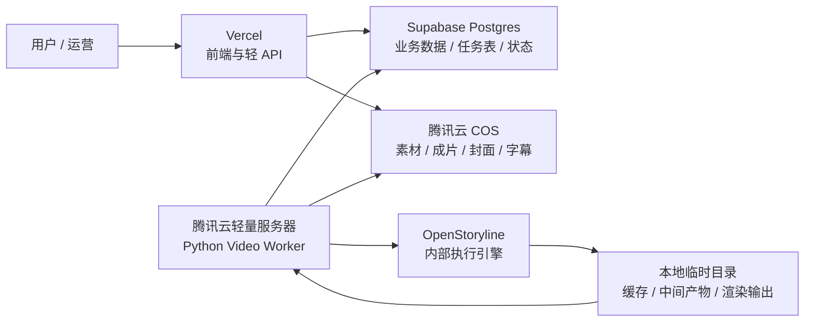
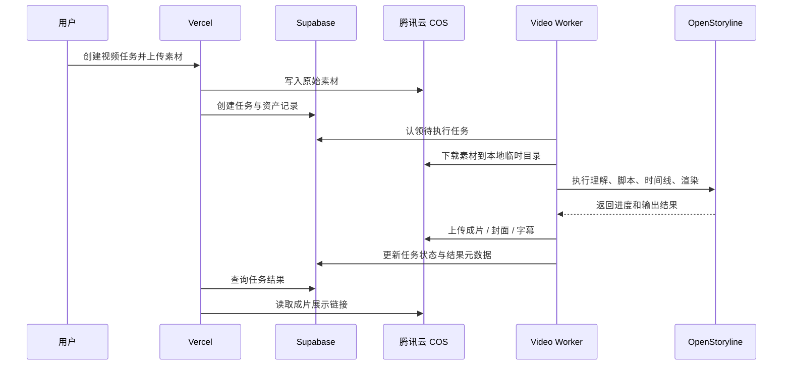

# 2026-04-23 当前阶段技术决策：媒体存储与视频执行架构

## 1. 决策状态

- 状态：`当前暂定 / 生效中`
- 适用阶段：`OpenStoryline PoC` 与视频执行链路首轮接入
- 决策日期：`2026-04-23`

这份文档只回答一个问题：

> 当前阶段，视频素材、成片存储，以及视频执行层，最终按什么技术组合收口？

当前确认版本如下：

```text
Vercel = 前端
Supabase = 数据库、任务表、业务数据
腾讯云 COS = 素材和成片存储
腾讯云轻量服务器 = 视频处理 Worker
```

---

## 2. 一句话结论

当前阶段不再把“媒体大文件存储”默认放在 `Supabase Storage` 或服务器本地。

当前暂定技术决策是：

1. `Vercel` 继续承接产品前端和轻量 API
2. `Supabase` 继续承接 `Postgres`、任务事实源和业务数据
3. `腾讯云 COS` 统一承接原始素材、成片、封面、字幕等媒体文件
4. `腾讯云轻量服务器` 只做视频执行 `Worker`，负责运行 `OpenStoryline + ffmpeg + Python`

---

## 3. 为什么这样收口

### 3.1 为什么不用服务器本地长期存素材

服务器本地磁盘只适合作为：

- 临时下载目录
- 渲染中间产物目录
- 执行缓存目录

不适合作为长期媒体资产真相源，原因包括：

1. 服务器更换、扩容、重建时，迁移成本高
2. 本地磁盘天然不利于前端直连访问和统一分发
3. 素材和成片越来越多后，和执行环境绑死会增加运维负担

### 3.2 为什么当前媒体文件统一放 `腾讯云 COS`

当前已经明确希望：

- 视频成片统一放腾讯云
- 原始素材也统一放腾讯云
- 后续不要把媒体资产散落在服务器本地

所以当前阶段最稳的边界就是：

- `COS` 负责“文件”
- `Supabase` 负责“记录”
- `Worker` 负责“处理”

### 3.3 为什么 `Supabase` 仍然保留

当前并不是放弃 `Supabase`，而是更准确地划职责：

- `Supabase Postgres`：商家、门店、内容草稿、任务、资产元数据、状态日志
- `Supabase` 不再承担当前视频链路里的主媒体文件存储

也就是说，`Supabase` 仍然是业务真相源，只是不是“视频文件本体”的主要落点。

---

## 4. 当前阶段职责拆分



### 4.1 `Vercel`

负责：

- 产品前端
- 创建视频任务
- 展示任务状态
- 展示素材与成片结果
- 提供给前端调用的轻量业务 API

不负责：

- 跑 `OpenStoryline`
- 长时间视频渲染
- 存长期媒体文件

### 4.2 `Supabase`

负责：

- 主业务数据库
- `video_edit_jobs` 等任务表
- 业务对象和关系数据
- 素材 / 成片对应的元数据、URL、状态、日志摘要

不负责：

- 长期保存当前视频链路里的主媒体文件
- 真正执行视频处理

### 4.3 `腾讯云 COS`

负责：

- 原始上传素材
- 中间可保留结果
- 最终成片
- 封面图
- 字幕文件

说明：

- 当前阶段，媒体文件统一归口到 `COS`
- 服务器本地只保留执行期临时文件

### 4.4 `腾讯云轻量服务器`

负责：

- 运行 `Python Video Worker`
- 安装并调用 `OpenStoryline`
- 执行 `ffmpeg`、渲染、上传、回写状态

不负责：

- 承担前端工作台
- 长期持有业务媒体资产

---

## 5. 当前推荐的数据流



---

## 6. 当前阶段的边界约束

为避免后续实现重新走偏，当前先冻结这几个边界：

1. 不把 `OpenStoryline` 原样跑到 `Vercel`
2. 不把媒体大文件长期放在轻量服务器本地
3. 当前视频链路的主文件存储统一落 `腾讯云 COS`
4. `Supabase` 继续作为任务和业务数据真相源
5. 轻量服务器当前只承担视频执行 `Worker`

---

## 7. 这份决策对后续文档的影响

从本决策开始，后续相关文档应默认采用以下表达：

```text
Vercel：前端
Supabase：数据库、任务表、业务数据
腾讯云 COS：素材和成片存储
腾讯云轻量服务器：视频处理 Worker
```

如果其他旧文档仍写成：

- `Supabase Storage` 承担视频素材和成片主存储
- 服务器本地长期保存成片

则以后续更新稿为准，并逐步修正。

---

## 8. 下一步建议

建议后续实现严格沿着这条线推进：

1. 明确 `asset_objects` 如何记录 `COS key / bucket / url`
2. 设计前端上传到 `COS` 的签名或中转策略
3. 让 `Video Worker` 跑通“从 COS 下载素材 -> OpenStoryline 执行 -> 上传回 COS”
4. 再补工作台里的任务入口和结果预览
