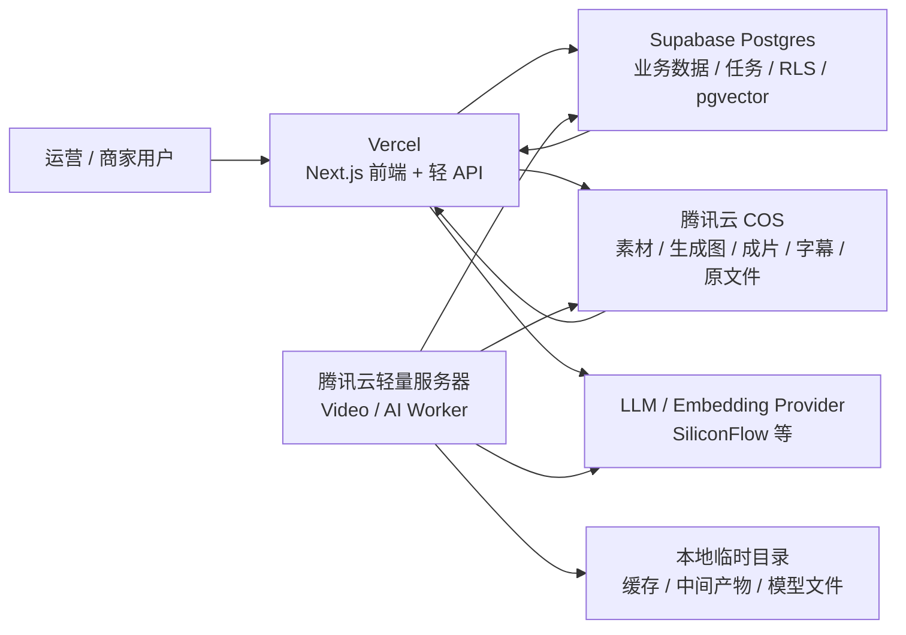

# 2026-04-25 AI 视频 / AI 图文数据与系统架构补充决策

## 1. 决策状态

- 状态：`当前建议 / 待用户验收后冻结`
- 适用范围：AI 图文、AI 视频、素材库、生成结果、任务执行与当前 staging 架构
- 继承基线：
  - `docs/架构规范/V0.1-Supabase-Vercel-Worker-方案评估-初稿.md`
  - `docs/架构规范/2026-04-23-当前阶段技术决策-媒体存储与视频执行架构.md`
  - `docs/progress/2026-04-24-staging-full-deploy-current-target.md`

这份文档补充回答一个问题：

> AI 视频、AI 图文会产生大量数据。到底是 Supabase 就够，还是需要 Supabase + Vercel + 服务器 + 云硬盘 + 另一套云数据库？

## 2. 一句话结论

`Supabase` 可以继续作为主业务数据库和任务事实源，但不建议把它当成“所有 AI 视频 / AI 图文数据的一体化承载层”。

当前最稳的系统架构仍然是：

```text
Vercel = 前端、轻量 API、权限入口
Supabase = Postgres 主库、RLS、任务表、业务数据、AI 文本 / RAG 元数据
腾讯云 COS = 原始素材、AI 生成图片、视频成片、封面、字幕、知识库原文件
腾讯云轻量服务器 = AI 视频 / OpenStoryline / ffmpeg / 后台 Worker 执行
服务器本地盘或后续云硬盘 = 临时缓存、渲染中间产物、模型缓存，不做长期真相源
```

当前阶段不建议再额外引入 `MySQL` 或 `MongoDB`。Postgres 已经覆盖关系数据、JSONB、任务状态、向量检索等核心需求；过早多数据库会增加同步、权限、备份和排障成本。

## 3. 为什么不是“只用 Supabase + Vercel”

### 3.1 Supabase 能支持很多，但不该包办媒体与长任务

已核对官方文档后的事实：

- Supabase Storage 在 Pro 及以上可以把单文件上限设置到 `500 GB`，Free 项目最高 `50 MB`。参考：[Supabase Storage file limits](https://supabase.com/docs/guides/storage/uploads/file-limits)
- Supabase Edge Functions 是 Deno / TypeScript edge runtime，官方也提示重型长任务应迁到后台 worker；托管限制包括 `256 MB` 内存、Free `150s` / 付费 `400s` wall-clock duration、单请求 CPU 时间限制。参考：[Supabase Edge Function limits](https://supabase.com/docs/guides/functions/limits)
- Vercel Functions 也有执行时长上限，当前文档显示默认 `300s`，Pro / Enterprise 最大 `800s`。参考：[Vercel Function duration](https://vercel.com/docs/functions/configuring-functions/duration)

所以结论不是“Supabase 不行”，而是：

1. `Supabase Postgres` 很适合当业务真相源。
2. `Supabase Storage` 技术上能存文件，但当前项目已在腾讯云 COS 跑通，视频大文件继续放 COS 更清晰。
3. `Supabase Edge Functions` 和 `Vercel Functions` 不适合跑 OpenStoryline、ffmpeg、浏览器自动化、长轮询和多阶段重试。
4. AI 视频的主要瓶颈通常不是数据库字段，而是大文件上传下载、渲染耗时、失败重试、磁盘清理和执行资源。

### 3.2 腾讯云 COS 更适合作为媒体资产层

腾讯云 COS 是对象存储，官方定位就是通过 HTTP/HTTPS 存取任意数量的数据，并适合数据分发、数据处理、数据湖等场景。参考：[Tencent Cloud COS product page](https://www.tencentcloud.com/product/cos)

当前 staging 已经真实跑通：

- 浏览器 / API 写入 COS
- `asset_objects` 记录 COS 元数据
- Worker 从 COS 下载素材
- Worker 生成 `final.mp4 / cover.jpg / subtitles.srt`
- Worker 上传回 COS
- Supabase 回写任务结果

这条链路已经验证，因此没有必要把视频文件再迁回 Supabase Storage。

## 4. 当前服务器的定位

用户截图里的 `openstoryline-test-sg` 当前大致是：

- 2 核 CPU
- 4 GB 内存
- 60 GB SSD 系统盘
- Ubuntu Server 24.04 LTS 64bit
- 当前系统盘已用约 `8.4 GB / 60 GB`
- 控制台提示轻量应用服务器不支持系统盘单独扩容，需要升级套餐获得更大容量

这台机器当前适合：

- staging / PoC
- 单并发或低并发视频 worker
- OpenStoryline contract stub 或轻量真实视频处理
- 临时目录、模型缓存、小规模日志

这台机器当前不适合：

- 长期保存素材和成片
- 作为主数据库
- 多商家高并发视频渲染集群
- 无限堆中间产物

如果后续真实视频任务变重，优先顺序应是：

1. 先把本地临时文件清理策略做严。
2. 再把 worker 临时目录迁到独立数据盘或更大套餐。
3. 再按任务量横向加 worker。
4. 如果出现模型推理或视频渲染性能瓶颈，再考虑 GPU / 更高规格计算资源。

不要把“买了服务器”理解为“文件都应该放服务器硬盘”。这台服务器更像厨房，不是仓库；COS 才是仓库。

## 5. 数据分层归属

| 数据类型 | 例子 | 主存储 | 说明 |
|---|---|---|---|
| 商家 / 门店 / 用户 / 邀请码 | `merchant_profiles`、权限、设置 | Supabase Postgres | 强关系、多租户、RLS，继续放 Supabase |
| 内容结构化数据 | 灵感、草稿、图文版本、视频脚本、标题、标签 | Supabase Postgres | 可查询、可筛选、可审计，不放对象存储 |
| AI 任务状态 | `video_edit_jobs`、生成任务、重试次数、进度 | Supabase Postgres | 任务事实源，Worker 轮询和回写 |
| AI prompt / 参数 / 结果摘要 | 模型名、输入摘要、生成结果、失败原因 | Supabase Postgres JSONB | 便于审计和复现，避免写成散文件 |
| RAG 知识库文本与 embedding | `knowledge_documents`、`knowledge_chunks`、向量 | Supabase Postgres + pgvector | 当前已实测 SiliconFlow embedding 和向量检索 |
| 知识库原文件 | PDF、Word、商家资料包 | 腾讯云 COS | DB 只记录文件元数据和解析状态 |
| 原始素材 | 上传图片、门店视频、客户案例视频 | 腾讯云 COS | 文件本体不进数据库 |
| AI 生成图文素材 | 生成图、封面图、海报图 | 腾讯云 COS | `asset_objects` 记录 bucket/key/type/size |
| AI 视频成片 | `final.mp4`、封面、字幕 | 腾讯云 COS | 当前 staging 已按此跑通 |
| 视频处理中间产物 | 抽帧、临时音频、渲染缓存 | Worker 本地盘 / 后续数据盘 | 必须可清理，不作为长期资产 |
| 原始运行日志 | ffmpeg 日志、worker stdout、trace | Worker 日志 / 后续观测系统 | Supabase 只存摘要和关键错误 |
| 密钥与连接串 | COS Secret、LLM key、DB URL | Vercel Env / Worker `.env` / 云密钥管理 | 不进文档、不进数据库、不进代码 |

## 6. 是否需要 MySQL、MongoDB 或额外云数据库

当前不需要。

### 6.1 为什么不加 MySQL

项目当前已经使用 Supabase Postgres。再加 MySQL 不会解决 AI 视频大文件或长任务执行问题，反而会增加：

- 两套 schema
- 两套备份
- 两套权限
- 两套数据同步
- 查询口径不一致

除非未来有明确的外部系统强依赖 MySQL，否则不建议引入。

### 6.2 为什么不加 MongoDB

MongoDB 对高度灵活的文档数据友好，但当前核心对象仍然是商家、门店、素材、草稿、任务、资产、账号这些强关系对象。

Postgres 的 `jsonb` 已经足够承接 AI payload、模型参数、运行摘要等半结构化数据；同时 Postgres 还保留事务、外键、RLS 和向量能力。当前加 MongoDB 的收益不明显。

### 6.3 什么时候才考虑额外云数据库

出现以下情况时再评估，而不是现在预先引入：

1. Supabase Postgres 的数据量、连接数、查询性能或费用成为明确瓶颈。
2. 需要把埋点、日志、事件流做成独立分析仓库。
3. 多 worker 并发调度需要更专业的队列系统，例如 Redis / BullMQ / Celery broker。
4. 有合规或地域要求，必须让业务数据库迁到特定云厂商或私有 VPC。
5. RAG / 向量检索规模明显超过当前 Postgres + pgvector 的舒适区。

## 7. 推荐架构图



## 8. 当前冻结规则

后续实现默认遵守这些边界：

1. 新上传的图片、视频、封面、字幕等媒体文件，默认走 `tencent_cos`。
2. `Supabase` 存业务数据、任务状态、资产元数据，不存视频文件本体。
3. `Vercel` 不跑视频渲染、不跑长轮询 worker、不长期持有大文件。
4. 轻量服务器只做执行环境和临时缓存，不做长期媒体仓库。
5. AI 视频结果必须通过 `asset_objects` 或后续统一资产表回写到 Supabase，不能只落在 COS 里没人知道。
6. Worker 本地目录必须设计清理策略，避免 60GB 系统盘被中间产物吃满。
7. 暂不引入 MySQL / MongoDB；如果未来引入，必须有明确瓶颈证据和迁移收益。

## 9. 下一步建议

### 9.1 近期必须补齐

1. 给 COS 加对象生命周期策略：临时中间文件、失败任务输出、演示数据要有保留期限。
2. 给 Worker 加磁盘水位告警：例如系统盘超过 `70% / 85%` 分级告警。
3. 给视频任务加清理脚本：按 job 清理本地临时目录，失败也要执行。
4. 给 `asset_objects` 明确资产类型扩展：后续可能需要 `generated_image`、`audio`、`transcript`、`thumbnail`。
5. 给生成任务补充成本字段：模型、token、视频时长、生成耗时、文件大小。

### 9.2 中期再评估

1. 是否需要独立队列：当 `video_edit_jobs` 轮询变重或多 worker 并发抢任务时评估。
2. 是否需要更大 worker：当单任务处理时间、CPU、内存或磁盘持续接近上限时评估。
3. 是否需要 CDN：当 COS 预览访问量和带宽费用上来时评估。
4. 是否需要生产级数据库升级：当 Supabase staging 迁到 production 前，单独确认备份、限额、地域和费用。

## 10. 当前结论

当前系统架构不用改成“Supabase + Vercel + 服务器 + 云硬盘 + MySQL / MongoDB 全家桶”。

更准确的表达是：

```text
Supabase 管数据事实
COS 管媒体资产
Vercel 管产品入口
轻量服务器管重任务执行
云硬盘只在 worker 缓存变大时再加
MySQL / MongoDB 暂时不加
```

这条线既能承接 AI 图文，也能承接 AI 视频；后面真正需要扩容时，优先扩对象存储、worker 和队列，而不是先把数据库拆散。
