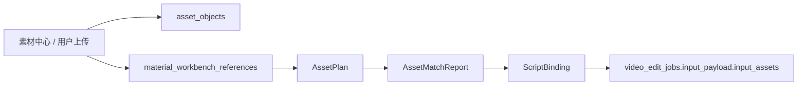

# 2026-04-27 素材层工作文档

## 1. 定位

素材层的职责是：

```text
把用户上传素材、素材中心引用和对标内容，整理成视频作业可消费的素材选择结果。
```

它不负责增长策略，不负责视频渲染，也不负责 worker 本地下载。

当前工程落点：

```text
app/src/contracts/material.ts
app/src/contracts/media.ts
app/src/lib/db/material-library-repository.ts
app/src/lib/db/media-repository.ts
app/src/server/api/material-library-service.ts
```

## 2. 目标对象链路

素材层的完整对象链路为：

```text
AssetPlan
-> AssetMatchReport
-> ScriptBinding
-> input_assets
```

当前 MVP 可以不新增独立表，优先把稳定快照写入：

```text
content_drafts.input_snapshot.materialContext
video_edit_jobs.input_payload.materialContext
video_edit_jobs.input_payload.input_assets
```

## 3. 当前可用素材来源

| 来源 | 当前落点 | 说明 |
| --- | --- | --- |
| 用户上传素材 | `asset_objects` | 图片、视频、封面、字幕等媒体资产 |
| 素材中心条目 | `source_items` 派生的 material item | 上传素材或对标内容的业务卡片 |
| 工作台引用 | `material_workbench_references` | 素材被送入图文或视频工作台后的引用记录 |
| 脚本上下文 | `content_drafts.input_snapshot.materialContext` | 生成脚本时使用的素材快照 |

## 4. 输出合同

### 4.1 `AssetPlan`

定义这条视频需要什么素材。

```json
{
  "assetPlanId": "asset-plan-id",
  "targetPlatform": "douyin",
  "aspectRatio": "9:16",
  "neededShots": [
    {
      "slot": "opening_scene",
      "assetType": "video",
      "purpose": "第一秒建立门店真实感"
    },
    {
      "slot": "proof_scene",
      "assetType": "image",
      "purpose": "展示服务细节或案例证明"
    }
  ]
}
```

### 4.2 `AssetMatchReport`

记录哪些素材被选中，以及为什么。

```json
{
  "assetMatchReportId": "asset-match-report-id",
  "status": "ready",
  "matches": [
    {
      "slot": "opening_scene",
      "assetObjectId": "uuid",
      "materialReferenceId": "uuid",
      "confidence": 0.82,
      "reason": "门店环境视频，适合开头建立真实感"
    }
  ],
  "missingSlots": []
}
```

### 4.3 `ScriptBinding`

记录素材和脚本段落的绑定关系。

```json
{
  "scriptBindingId": "script-binding-id",
  "contentVariantId": "uuid",
  "bindings": [
    {
      "sceneIndex": 1,
      "scriptCue": "门头或空间快速推进",
      "assetObjectId": "uuid",
      "slot": "opening_scene"
    }
  ]
}
```

### 4.4 `input_assets`

传给 worker 的素材必须可下载，字段保持和当前 worker 兼容：

```json
[
  {
    "asset_id": "uuid",
    "asset_type": "video",
    "storage_provider": "tencent_cos",
    "bucket_name": "jj-content-staging-1341668543",
    "storage_key": "draft-inputs/merchant-1/draft-1/demo.mp4",
    "mime_type": "video/mp4",
    "file_size_bytes": 123456,
    "etag": "etag",
    "sort_order": 0
  }
]
```

## 5. 主流程



关键门禁：

1. 依赖素材的视频作业必须有素材确认或明确使用 `script_only_fallback`。
2. worker 只校验素材结构和下载，不判断素材是否适合业务目标。
3. 素材引用被消费后要保留历史，不删除引用。
4. 生成结果保存到「我的内容」，不保存回素材中心。

## 6. `materialContext` 标准形态

```json
{
  "assetPlanId": "asset-plan-id",
  "assetMatchReportId": "asset-match-report-id",
  "scriptBindingId": "script-binding-id",
  "materialIds": ["uuid"],
  "materialReferenceIds": ["uuid"],
  "selectionMode": "user_confirmed",
  "fallbackMode": null
}
```

允许的 `selectionMode`：

| 值 | 含义 |
| --- | --- |
| `user_confirmed` | 用户明确选择或确认 |
| `agent_suggested` | Agent 推荐，仍需用户确认后进入正式作业 |
| `script_only` | 不使用素材，仅按脚本生成占位或后续 AI 视频 |

## 7. 失败处理

| 场景 | 处理 |
| --- | --- |
| 素材引用不存在 | 主应用拒绝创建正式作业 |
| 素材还在 `parsing` | 提示用户等待或改用脚本模式 |
| 素材永久失败 | 不进入正式作业，要求重新选择 |
| COS 元数据缺失 | 主应用拒绝创建依赖素材的作业 |
| worker 下载失败 | worker 写 `failed_retryable` |
| 素材格式永久不支持 | worker 或主应用写 `failed_manual` |

## 8. 不负责范围

素材层不负责：

1. 不生成 `GrowthBrief`。
2. 不改写脚本。
3. 不调用 OpenStoryline 或 FireRed。
4. 不上传 worker 输出的成片。
5. 不决定是否真实发布。

## 9. 验收标准

1. 从素材中心送入视频工作台后，产生 `material_workbench_references`。
2. 生成脚本时，`content_drafts.input_snapshot.materialContext` 保留素材快照。
3. 创建视频作业时，`input_payload.materialContext` 能追溯素材计划和引用。
4. `input_payload.input_assets` 只包含 worker 可下载的 COS 素材。
5. 素材未确认时，不创建依赖素材的正式作业。
6. worker 不承担素材业务匹配职责。

