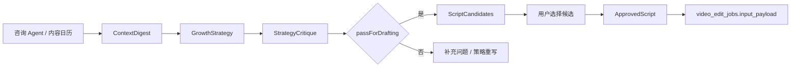

# 2026-04-27 增长 Agent Runtime 与策略分层计划

## 1. 结论

当前增长层不能只停留在 `GrowthBrief -> VideoStrategy -> ScriptDrafts` 的边界说明。

更准确的目标是：

```text
咨询上下文整理
-> 增长策略生成
-> 策略评估
-> 多脚本候选
-> 用户确认
-> video_edit_jobs.input_payload
```

本阶段不做通用 Agent 框架，不开放 Hermes / Claude Code 式通用工具，不新增长期记忆表和复杂 run 表。先把增长判断质量补上，让视频脚本能解释“为什么这样写、服务哪个获客目标、适合哪个用户阶段”。

## 2. 为什么要升级

现有增长层文档已经解决了一个问题：

```text
worker 不负责增长策略。
```

但它还没有解决另一个更核心的问题：

```text
增长层如何产出足够好的内容决策。
```

当前代码里的 `strategySnapshot.videoBrief` 更像轻量脚本提示，字段主要是：

```text
workingTitle
hook
outcome
```

这不足以支撑后续稳定生成高质量获客视频，因为它缺少：

1. 获客目标。
2. 用户决策阶段。
3. 平台打法。
4. 内容假设。
5. 策略评估。
6. 多脚本候选。
7. 语义修订回流规则。

## 3. 能力分层

增长 Agent Runtime 拆成四个受控能力模块。

| 模块 | 职责 | 当前落点 |
| --- | --- | --- |
| `ContextDigest` | 整理商家、咨询、日历、素材上下文 | `content_drafts.input_snapshot.growthContext` |
| `GrowthStrategy` | 生成获客目标、用户阶段、平台策略、内容假设 | `strategySnapshot.videoBrief` 扩展或 `growthContext.strategy` |
| `StrategyCritique` | 评估策略和脚本方向是否可用 | `growthContext.critique` |
| `ScriptCandidates` | 生成 2-3 个脚本候选 | `content_variants` 多个 `video_script` 版本 |

这四层是业务工作流，不是四个自由对话 Agent。每一层都必须有固定输入、固定输出和审计快照。

## 4. `ContextDigest`

### 4.1 定位

`ContextDigest` 负责把散落上下文整理成增长策略可用的稳定输入。

### 4.2 输入

| 输入 | 来源 |
| --- | --- |
| 商家资料 | `merchant_profiles` |
| 咨询摘要 | `consultation_sessions.summary_text`、`strategy_snapshot` |
| 内容日历卡片 | `ContentCalendarItemDto` |
| 用户补充要求 | 视频工作台输入 |
| 素材上下文 | `material_workbench_references`、`materialContext` |
| 知识库片段 | `knowledge_chunks`，按现有 RAG 能力提供 |

### 4.3 输出

```json
{
  "merchantProfile": {
    "name": "静境门店",
    "industry": "本地生活服务",
    "serviceItems": ["项目 A"],
    "defaultCta": ["私信预约体验"],
    "toneStyle": "专业温柔",
    "forbiddenWords": []
  },
  "consultationSummary": {
    "positioning": "面向高意向用户的专业可信门店",
    "targetAudiences": ["首次咨询前犹豫用户"],
    "coreSellingPoints": ["真实环境", "稳定交付"],
    "keyScenes": ["到店前决策"]
  },
  "selectedCalendarItem": {
    "id": "calendar-item-id",
    "contentType": "video",
    "strategyTag": "信任建立",
    "title": "门店信任感短视频"
  },
  "materialContext": {
    "materialIds": ["uuid"],
    "materialReferenceIds": ["uuid"],
    "selectionMode": "user_confirmed"
  },
  "extraRequirement": "用户补充要求"
}
```

## 5. `GrowthStrategy`

### 5.1 定位

`GrowthStrategy` 负责回答：

```text
这条视频为了什么增长目标服务？
它打哪类用户？
用户处在哪个决策阶段？
平台上应该用什么打法？
内容假设是什么？
```

### 5.2 输出

```json
{
  "acquisitionGoal": "预约到店",
  "audienceStage": "consideration",
  "targetAudience": "已经有需求但还在比较门店的用户",
  "platformStrategy": {
    "platform": "douyin",
    "format": "vertical_short_video",
    "primaryMechanic": "3 秒钩子 + 场景证明 + 明确 CTA"
  },
  "contentHypothesis": "如果先呈现真实门店场景和服务细节，用户会更愿意私信咨询。",
  "messageAngle": "场景信任 + 专业证明",
  "ctaStrategy": "先引导私信预约体验，不直接强卖套餐",
  "lockedClaims": ["真实环境", "服务细节", "预约体验"]
}
```

### 5.3 枚举建议

`acquisitionGoal`：

```text
awareness | consultation | appointment | store_visit | repeat_purchase
```

`audienceStage`：

```text
cold | problem_aware | consideration | decision | retention
```

`messageAngle`：

```text
trust_building | objection_handling | proof_case | scene_resonance | offer_conversion
```

第一阶段可以只作为 JSON 字符串约束，不新增 TypeScript enum 或数据库 check。

## 6. `StrategyCritique`

### 6.1 定位

`StrategyCritique` 是增长层的质量闸门。它不负责生成新视频，只负责判断策略和脚本候选是否足够可用。

### 6.2 评估维度

| 维度 | 问题 |
| --- | --- |
| 目标匹配 | 是否服务明确获客目标 |
| 人群匹配 | 是否针对具体用户阶段 |
| 钩子强度 | 前 3 秒是否具体、有场景 |
| 卖点具体度 | 是否避免空泛词 |
| CTA 合理性 | 是否和用户阶段匹配 |
| 平台适配 | 是否符合抖音竖屏短视频 |
| 风险控制 | 是否触碰禁用词、过度承诺或敏感表达 |
| 可制作性 | 是否能被素材和 worker 执行 |

### 6.3 输出

```json
{
  "score": 82,
  "risks": [
    {
      "level": "medium",
      "code": "hook_too_generic",
      "message": "开头钩子还偏泛，需要更具体的场景。"
    }
  ],
  "missingInputs": [],
  "rewriteSuggestions": [
    "把开头从泛泛的痛点改成到店前比较门店的具体场景。",
    "CTA 从立即购买改成私信预约体验。"
  ],
  "passForDrafting": true
}
```

低于 70 分时，不建议直接创建视频作业；应先回到脚本候选或人工补充要求。

## 7. `ScriptCandidates`

### 7.1 定位

`ScriptCandidates` 负责生成 2-3 个可选脚本方向，而不是只生成一条默认脚本。

### 7.2 候选类型

| candidateType | 用途 |
| --- | --- |
| `safe_conversion` | 保守成交版，适合稳妥转化 |
| `strong_hook` | 强钩子版，适合提高停留 |
| `trust_expert` | 专业信任版，适合提高咨询质量 |

### 7.3 输出

```json
{
  "candidateType": "trust_expert",
  "title": "第一次到店前，先看这 3 个细节",
  "hook": "如果你不知道怎么判断一家店靠不靠谱，先看这 3 个细节。",
  "scriptText": "Scene 1 ...",
  "ctaText": "私信预约体验或领取到店咨询建议",
  "whyThisWorks": "先解决用户比较门店时的信任顾虑，再用服务细节承接咨询。",
  "strategyTrace": {
    "acquisitionGoal": "appointment",
    "audienceStage": "consideration",
    "contentHypothesis": "真实环境和服务细节能降低首次咨询门槛。"
  }
}
```

### 7.4 当前落点

第一阶段不新增 `script_candidates` 表。

推荐做法：

1. 每个候选生成一个 `content_variants` 记录。
2. `variant_type = video_script`。
3. `script_text` 存候选脚本正文。
4. `title` 存候选标题。
5. `cta_text` 存候选 CTA。
6. `content_drafts.input_snapshot.growthContext.scriptCandidates` 保留候选摘要和策略追踪。

## 8. 主流程



## 9. 和现有模块的关系

### 9.1 咨询 Agent

现有咨询 Agent 继续负责：

1. 读取商家资料。
2. 检索知识库。
3. 更新 `strategySnapshot`。
4. 生成内容日历和轻量 `videoBrief`。

增长 Agent Runtime 是咨询 Agent 下游的结构化策略层，不要求在第一阶段改造成通用 Agent。

### 9.2 视频脚本生成

当前 `generateVideoScriptForUser()` 已经能创建 `video_script` variant。

后续应升级为：

1. 先组装 `ContextDigest`。
2. 生成 `GrowthStrategy`。
3. 生成 `StrategyCritique`。
4. 生成 2-3 个 `ScriptCandidates`。
5. 写入多个 `content_variants`。

### 9.3 视频工作台

视频工作台后续应支持：

1. 展示多个脚本候选。
2. 展示每个候选的 `whyThisWorks`。
3. 用户选择一个候选并确认。
4. 只有已确认候选可以创建视频作业。

### 9.4 Worker

worker 不做任何增长判断。

worker 只消费：

```text
video_edit_jobs.input_payload.script
video_edit_jobs.input_payload.productionDirective
video_edit_jobs.input_payload.materialContext
video_edit_jobs.input_payload.input_assets
```

## 10. 语义修订回流

语义修订包括：

```text
换目标人群
换内容角度
换卖点
换 CTA
重写钩子
降低焦虑感
增强专业感
```

处理路径：

```text
Revision
-> ContextDigest 更新
-> GrowthStrategy 重写
-> StrategyCritique
-> ScriptCandidates 新版本
-> 用户重新确认
```

语义修订不得直接进入 worker 或 FireRed。

## 11. 不做什么

第一阶段不做：

1. 不新增长期记忆表。
2. 不新增完整 `agent_runs` / `agent_run_events`。
3. 不做动态 `SKILL.md` 加载。
4. 不开放 shell、文件、浏览器、MCP 等通用工具。
5. 不新增独立多 Agent 编排服务。
6. 不让 worker 承担增长评估。
7. 不让 FireRed 改写已确认脚本语义。

这些能力可以进入 V2，但不应阻塞当前主链路。

## 12. 后续实现阶段

### 阶段 1：文档和合同

目标：

1. 固化 `ContextDigest`、`GrowthStrategy`、`StrategyCritique`、`ScriptCandidate`。
2. 明确它们先落到 `input_snapshot.growthContext`。
3. 明确多候选脚本写入 `content_variants`。

当前状态：

```text
本文件完成后即为待实现合同。
```

### 阶段 2：服务端生成升级

目标：

1. 在 `content-generation-service.ts` 中拆出增长上下文构造函数。
2. 生成 2-3 个视频脚本候选。
3. 每个候选写入一个 `content_variants`。
4. `input_snapshot.growthContext` 保存策略和评估结果。

### 阶段 3：视频工作台候选选择

目标：

1. 展示候选列表。
2. 展示候选类型、钩子、理由和风险。
3. 用户选择并确认候选。
4. 作业创建只读取已确认候选。

### 阶段 4：语义修订闭环

目标：

1. 用户提出语义修订时生成新候选。
2. 旧候选和旧 job 保留。
3. 制作修订和语义修订继续分流。

## 13. 验收标准

文档验收：

1. 能解释增长层为什么不是简单脚本生成器。
2. 能区分 `ContextDigest`、`GrowthStrategy`、`StrategyCritique`、`ScriptCandidates`。
3. 明确第一阶段不新增数据库迁移。
4. 明确 worker 不参与增长判断。
5. 明确语义修订回增长层。

后续代码验收：

1. 同一咨询上下文能生成多个 `video_script` variant。
2. 每个候选能追溯 `acquisitionGoal`、`audienceStage`、`contentHypothesis`。
3. `content_drafts.input_snapshot.growthContext` 能解释脚本生成原因。
4. 用户只能把已选中并确认的候选脚本创建为视频作业。
5. 语义修订生成新候选，不覆盖旧脚本。

## 14. 相关文档

- `docs/架构规范/2026-04-27-growth-agent-work-plan.md`
- `docs/架构规范/2026-04-27-video-job-payload-contract.md`
- `docs/架构规范/2026-04-27-preview-revision-work-plan.md`
- `docs/架构规范/2026-04-24-consultation-agent-runtime-rag-spec.md`
- `docs/产品文档/V2.1-内容日历到图文视频工作台协作PRD.md`

