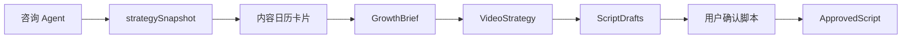

# 2026-04-27 增长层 Agent 工作文档

## 1. 定位

增长层 Agent 的职责是：

```text
决定为什么做这条视频、面向谁、讲什么、用什么转化动作。
```

它不负责视频渲染，不负责素材下载，不负责调用 OpenStoryline 或 FireRed。

当前工程落点优先复用主应用里的咨询 Agent、内容日历和视频脚本生成链路：

```text
app/src/server/api/consultation-service.ts
app/src/server/api/content-generation-service.ts
app/src/contracts/consultation.ts
app/src/contracts/draft.ts
```

## 2. 目标对象链路

增长层的完整对象链路为：

```text
SourceDigest
-> EvidenceMap
-> GrowthBrief
-> HotspotMap
-> ContentThemeSequence
-> VideoStrategy
-> ScriptDrafts
-> ApprovedScript
```

当前 MVP 不要求一次性落完所有对象表。允许先用 `consultation_sessions.strategy_snapshot`、`content_drafts.input_snapshot` 和 `content_variants.script_text` 承载。

## 3. 当前可用输入

| 输入 | 当前来源 | 用途 |
| --- | --- | --- |
| 商家资料 | `merchant_profiles` | 行业、服务项目、CTA、品牌语气 |
| 咨询上下文 | `consultation_sessions`、`consultation_messages` | 用户真实目标、门店情况、约束 |
| 策略快照 | `strategySnapshot` | 定位、卖点、客群、场景、内容日历 |
| 内容日历卡片 | `ContentCalendarItemDto` | 具体选题、内容类型、策略标签 |
| 知识库片段 | `knowledge_chunks` | 方法论、行业 SOP、禁忌 |
| 素材引用 | `material_workbench_references` | 用户指定的参考素材或对标内容 |

## 4. 输出合同

增长层至少要产出这三类结果：

### 4.1 `GrowthBrief`

用于解释这条视频的业务意图。

```json
{
  "source": "consultation_calendar",
  "consultationSessionId": "uuid",
  "calendarItemId": "calendar-item-id",
  "strategyTag": "信任建立",
  "targetAudience": "首次咨询前犹豫的本地生活用户",
  "coreSellingPoints": ["真实环境", "稳定交付", "预约体验"],
  "keyScene": "用户到店前判断商家是否靠谱",
  "cta": "私信领取体验方案或预约到店咨询"
}
```

### 4.2 `VideoStrategy`

用于约束脚本方向和后续制作，不进入 worker 内部改写。

```json
{
  "targetPlatform": "douyin",
  "aspectRatio": "9:16",
  "contentAngle": "场景信任 + 专业解释",
  "hook": "如果你也不知道怎么判断一家店靠不靠谱，这条视频一定要看完。",
  "structure": ["开头钩子", "场景共鸣", "差异证明", "转化动作"],
  "lockedClaims": ["门店真实环境", "服务细节", "预约咨询"]
}
```

### 4.3 `ScriptDrafts` / `ApprovedScript`

当前落点是 `content_variants`：

| 字段 | 要求 |
| --- | --- |
| `variant_type` | 必须为 `video_script` |
| `script_text` | 视频脚本正文 |
| `review_status` | 用户确认前为 `editing`，确认后才允许进入正式作业 |
| `cta_text` | 结尾转化动作 |
| `hashtags` | 平台标签 |

`ApprovedScript` 不是新表的硬要求。MVP 可由 `content_variants.review_status = approved` 或服务端显式确认动作表达。

## 5. 主流程



关键门禁：

1. 没有 `strategySnapshot` 时，可以用人工输入生成脚本，但必须在 `input_snapshot` 中标记来源。
2. 没有用户确认的脚本，不得创建正式视频作业。
3. 增长层不得在 worker 执行中修改已锁定脚本。
4. 语义修订必须回到增长层重新生成策略或脚本草稿。

## 6. 和现有代码的关系

当前 `generateVideoScriptForUser()` 已经能根据咨询会话、策略标签、素材引用生成 `video_script` variant。

后续实现应补强：

1. `content_drafts.input_snapshot` 中稳定写入 `GrowthBrief` 和 `VideoStrategy` 摘要。
2. 视频工作台增加脚本确认动作，将选中的 `video_script` 标记为可进入作业。
3. 创建 `video_edit_jobs` 时，从已确认 variant 读取 `script_text`、`cta_text`、`hashtags` 和 `input_snapshot`。
4. 对语义修订创建新脚本版本，不覆盖旧版本。

## 7. 不负责范围

增长层 Agent 不负责：

1. 不下载 COS 素材。
2. 不判断 worker 是否可重试。
3. 不调用 `/v1/runs`。
4. 不直接调用 FireRed session、chat 或 WebSocket。
5. 不上传 final video、cover、subtitle。
6. 不决定真实发布账号。

## 8. 失败处理

| 场景 | 处理 |
| --- | --- |
| 咨询上下文不足 | 给用户一个关键追问，或允许人工补充要求 |
| 策略快照为空 | 使用人工目标生成脚本，并标记 `source = manual_video_workbench` |
| 脚本文本为空 | 不创建 `content_variants` 或返回可见错误 |
| 用户否定方向 | 新建一版 `ScriptDrafts`，保留旧版本 |
| 语义修订 | 回到 `GrowthBrief` / `VideoStrategy` / `ScriptDrafts`，不进入 worker |

## 9. 验收标准

1. 从内容日历进入视频工作台后，能追踪 `consultationSessionId`、`calendarItemId`、`strategyTag`。
2. 生成视频脚本后，写入 `content_drafts` 和 `content_variants`。
3. 视频脚本正文存在于 `content_variants.script_text`。
4. 作业创建前能明确用户确认的是哪一个脚本版本。
5. 增长层只产出内容决策和脚本，不执行视频。
6. 语义修订不会直接进入 worker 或 FireRed。

