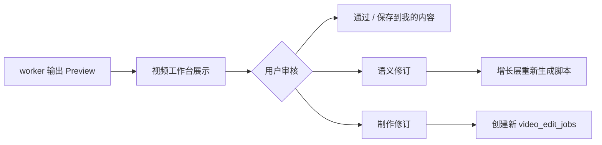

# 2026-04-27 预览审核与修订工作文档

## 1. 定位

预览审核与修订层的职责是：

```text
让用户看见视频产物，判断是否可用，并把修订请求分流到正确层级。
```

它属于主应用视频工作台，不属于 worker。

当前工程入口：

```text
app/src/components/merchant/video-workbench.tsx
app/src/server/api/video-edit-jobs-service.ts
app/src/lib/db/video-edit-job-repository.ts
```

## 2. 审核对象

审核对象来自 worker 回写：

```text
video_edit_jobs.status
video_edit_jobs.result_payload
video_edit_jobs.failure_reason
video_edit_jobs.log_payload
asset_objects
```

成功任务状态必须是：

```text
video_edit_jobs.status = succeeded
```

## 3. Preview 标准内容

视频工作台预览区至少展示：

| 内容 | 来源 |
| --- | --- |
| 成片视频 | `asset_objects.asset_type = video` |
| 封面 | `asset_objects.asset_type = cover` |
| 字幕 | `asset_objects.asset_type = subtitle`，按能力分阶段展示 |
| 当前状态 | `video_edit_jobs.status` |
| 当前阶段 | `video_edit_jobs.current_stage` |
| 失败原因 | `video_edit_jobs.failure_reason` |
| 重试次数 | `video_edit_jobs.retry_count` |

## 4. 修订类型

修订必须分为两类。

### 4.1 语义修订

语义修订会改变内容策略、脚本含义、卖点、客群或 CTA。

例子：

```text
换一个目标人群。
不要强调价格，改成强调专业背书。
开头钩子重新写得更温和。
CTA 改成预约体验，不要私信领取。
```

处理方式：

```text
Revision
-> GrowthBrief / VideoStrategy
-> 新 ScriptDrafts
-> 用户确认
-> 新 video_edit_jobs
```

语义修订不得直接进入 worker。

### 4.2 制作修订

制作修订不改变已确认脚本含义，只改变执行表现。

例子：

```text
字幕大一点。
封面换成第二个镜头。
背景音乐更轻。
第一段镜头节奏快一点。
```

处理方式：

```text
Revision
-> 新 ProductionDirective
-> 新 video_edit_jobs
-> worker
```

制作修订可以复用原脚本，但必须创建新作业，不覆盖旧作业结果。

## 5. Revision 记录建议

MVP 可以先写入 `video_edit_jobs.input_payload.revisionContext`，后续再拆独立表。

建议结构：

```json
{
  "revisionContext": {
    "sourceJobId": "uuid",
    "revisionType": "production",
    "userInstruction": "字幕大一点，封面换成第二个镜头",
    "createdFromPreview": true,
    "previousResultAssetIds": ["uuid"]
  }
}
```

`revisionType` 可选：

| 值 | 含义 | 去向 |
| --- | --- | --- |
| `semantic` | 内容语义修订 | 增长层 |
| `production` | 制作表现修订 | 新视频作业 |

## 6. 主流程



关键门禁：

1. 修订必须追加记录，不覆盖旧 job。
2. 语义修订必须回增长层，不直接进 FireRed。
3. 制作修订必须保留原 `sourceJobId`。
4. 失败任务也要保留脚本、素材引用和错误详情。

## 7. 失败和重试

| 状态 | 页面行为 |
| --- | --- |
| `pending` / `queued` | 显示已进入队列 |
| `preparing` | 显示正在准备素材与脚本 |
| `running` | 显示进度、当前阶段、预计等待 |
| `succeeded` | 展示成片、封面、字幕和修订入口 |
| `failed_retryable` | 展示失败原因和重试按钮 |
| `failed_manual` | 展示失败原因、复制详情、人工处理入口 |
| `cancelled` | 展示已取消，可基于原脚本重新创建 |

重试规则：

1. 只有 `failed_retryable` 可重试。
2. 重试调用 `POST /api/video-edit-jobs/:id/retry`。
3. 重试后状态回到 `pending`。
4. `retry_count` 加 1。
5. 超过 3 次后建议转人工处理。

## 8. 保存位置

视频成功后：

1. `video_edit_jobs.status = succeeded`。
2. `asset_objects` 记录成片、封面、字幕。
3. 成片 owner 推荐为 `owner_type = content_variant`、`owner_id = contentVariantId`。
4. 「我的内容」展示视频任务和成片入口。
5. 素材中心不保存成品，只保留原始素材和对标素材。

## 9. 不负责范围

预览审核层不负责：

1. 不 claim worker 作业。
2. 不下载素材到本地。
3. 不直接调用 OpenStoryline 或 FireRed。
4. 不在前端拼接最终视频文件。
5. 不把失败任务删除。

## 10. 验收标准

1. 任务成功后，视频工作台能展示成片或至少展示可诊断的结果资产状态。
2. `failed_retryable` 展示重试入口。
3. `failed_manual` 不展示无效重试入口。
4. 语义修订进入脚本再生成路径。
5. 制作修订创建新作业并关联 `sourceJobId`。
6. 修订和重试不覆盖历史 job。
