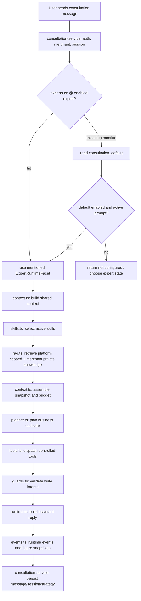

# 咨询 Agent Runtime 模块化改造设计与实现记录

日期：2026-05-03

状态：已完成主要实现闭环。本文最初为设计草案；截至 2026-05-03 11:33，Phase B/C/D/E 关键事项已落地，并通过 long-task gate 硬校验与独立 verifier。后续只保留非阻塞增强项，如 Agent Console 展示配置、token 级 budget、真实 skill usage 聚合。

相关上下文：

- `docs/架构规范/2026-04-24-consultation-agent-runtime-rag-spec.md`
- `docs/progress/2026-05-02-roundtable-multi-agent-implementation.md`
- `docs/progress/2026-05-03-consultation-runtime-reference-audit.md`
- `docs/产品文档/V2.2-咨询Agent控制台与能力资产管理PRD.md`

## 1. 一句话结论

咨询 Agent 后续应收敛为：

```text
同一个 ConsultationRuntime
-> 同一个 SharedContextAssembler
-> 不同 ExpertContainer 只提供 system prompt / skill / RAG scope / tool policy / model config
-> 同一套受控业务工具写入策略资产、内容日历、图文 brief、视频 brief
```

也就是说，多专家不是多个互相独立的聊天 Agent，不是并发 swarm，也不是每个专家各自维护一份上下文。

正确模型是：

```text
共享咨询场域 + 专家能力切面
```

`@专家` 只切换本轮专家容器，不切换商家、会话、历史、策略资产，也不清空上下文。

## 2. 本次变更目标

### 2.1 Target

把当前散落在 `consultation-service.ts` 内的咨询 runtime 拆成可维护的内部模块，让“共享上下文装配器 + 专家容器差异化能力”成为显式架构。

### 2.2 Out of Scope

本轮不做真正并发子 Agent、不重启圆桌主入口、不新增外部通用工具、不改视频 worker、不做账号发布、不默认新增 Supabase migration。

### 2.3 Must Keep

- 商家端 `/dashboard` 主咨询链路保持兼容。
- 旧 roundtable 会话继续 legacy 兼容，不作为新主入口。
- 商家私有 indexed 知识默认仍是共享上下文，不因专家平台知识绑定而丢失。
- Agent prompt / skill / knowledge set / modelConfig 继续以后台配置为准。
- 不把内部 prompt、参考路径、泄露来源字样或未脱敏 debug payload 暴露给商家端。
- `agent_configs.service_status = enabled` 表示商家端可见专家，不表示唯一默认入口。
- `agent_route_bindings.consultation_default` 保持唯一，只负责未 `@专家` 时的默认 Agent。
- `agent_knowledge_set_bindings` 保持 Agent 与 Knowledge Set 多对多，不新增 Knowledge Set 单占限制。

## 3. 验收标准

1. 普通咨询发送消息时，runtime 先解析默认专家或 `@专家`，再基于同一份共享上下文执行本轮。
2. 共享上下文至少包含商家资料、当前策略资产、最近会话、当前用户输入、知识检索种子、工具结果摘要入口。
3. 专家容器只覆盖本轮身份和能力边界，包括 active prompt、绑定 skills、绑定 knowledge sets、modelConfig、enabledTools、retrievalTopK。
4. 回复模型和策略资产编辑器读取同一份 context assembly snapshot，不再各自临时拼一套上下文。
5. 平台知识可按专家绑定 knowledge set 收窄；商家私有 indexed 知识默认共享。
6. Skill 仍采用渐进式披露，但 selection 逻辑从 service 主文件移到独立模块，并保留后续评分/统计扩展点。
7. 工具 planner 初期可以保持确定性顺序，但必须是可替换接口，为后续模型 tool-call planner 做准备。
8. `agent.loop.started / agent.tool.completed / agent.loop.completed` 等事件继续写入，但普通事件 payload 不保存 system prompt preview。
9. 测试覆盖 `@专家` 路由、共享 context injector、专家 prompt/skill/RAG 边界、旧敏感引用不回流。
10. 多个 `enabled` Agent 可同时出现在商家端 `@ 专家` 列表；未 `@` 时只走 `consultation_default` 指向的单一默认 Agent。

## 3.1 Agent Console 配置语义补充

本节用于对齐 `docs/产品文档/V2.2-咨询Agent控制台与能力资产管理PRD.md` 在 2026-05-03 补充的多 Agent 配置语义。

### 3.1.1 上线可见与默认入口分离

```text
agent_configs.service_status = enabled
-> 商家端 @ 专家列表可见
-> 多个 Agent 可以同时 enabled

agent_route_bindings.route_key = consultation_default
-> 未 @ 专家时的默认入口
-> 始终只有一个 active default binding
```

实现约束：

- 不要把 `enabled` 当作“唯一线上 Agent”。
- 不要为了多个可见专家新增多条 route binding。
- 默认 Agent 必须是 `enabled` 且有 active System Prompt。
- 当前默认 Agent 下线前，后台应要求先切换新的默认 Agent。
- 如果历史数据导致 default binding 指向不存在或 disabled Agent，runtime 不应静默运行空 Agent；商家未 `@` 时应走未配置 / 选择专家提示。

### 3.1.2 路由顺序

本轮专家解析顺序固定为：

```text
1. 解析用户消息开头或显式选择里的 @专家。
2. 如果命中 enabled Agent，使用该 Agent 的 ExpertRuntimeFacet。
3. 如果未 @、@ 未命中或前端没有传专家选择，读取 consultation_default。
4. 如果 default 不可用，返回可解释的未配置状态，不进入 LLM。
```

`@专家` 只影响本轮 ExpertRuntimeFacet，不切换会话、不清空历史、不改变商家资料和策略资产。

### 3.1.3 Knowledge Set 多对多

现有 `agent_knowledge_set_bindings` 已能表达多对多：

```text
Agent A -> 基础平台知识集
Agent B -> 基础平台知识集
Agent B -> 房地产方法论知识集
```

实现约束：

- 同一个 Knowledge Set 可以被多个 Agent 复用。
- 同一 Agent 不应重复挂载同一 Knowledge Set。
- Agent 未挂载平台 Knowledge Set 时，不检索平台知识；但商家私有 indexed 知识仍默认共享。
- Knowledge Set disabled 后，即使 binding 仍存在，也不进入平台知识检索范围。

## 4. 当前行为基线

当前相关入口和职责：

- `app/src/server/api/consultation-service.ts`
  - 创建 / 获取 / 删除咨询会话。
  - 解析 `@专家`。
  - 读取默认或指定 `AgentConfig`。
  - 选择 active skills。
  - 检索 knowledge chunks。
  - 固定顺序规划并执行业务工具。
  - 调用策略资产 editor。
  - 调用 LLM 生成最终回复。
  - 写入 session、message、event 和 merchant strategy asset。
- `app/src/lib/db/knowledge-repository.ts`
  - 支持按 `documentIds` 收窄平台知识，同时保留商家私有知识。
- `app/src/lib/db/agent-console-repository.ts`
  - 提供 agent、prompt、skill binding、knowledge set binding、route binding 读取。
- `app/src/contracts/consultation.ts`
  - 商家端 consultation DTO。
- `app/src/contracts/agent-console.ts`
  - Agent Console 资产 DTO，已经包含 `agent_test_runs` 和 `agent_runtime_snapshots` 的 DTO。
- `app/src/server/api/roundtable-consultation-service.ts`
  - 旧圆桌 legacy service，后续不作为新多专家模型主路径。

当前主要问题：

- `consultation-service.ts` 过大，runtime、context、planner、tools、skills、RAG、events 都揉在一起。
- `buildConsultationContextInjection()` 已经出现，但不是独立 ContextAssembler。
- `planConsultationToolCalls()` 仍是固定顺序函数，不是可替换 planner。
- skill 激活是关键词匹配，缺少 score、usage、显式触发记录。
- 策略资产写入前缺少统一 guardrail。
- 运行快照表已存在，但真实咨询 runtime 还没有稳定写 `agent_runtime_snapshots`。

## 5. 目标模块拆分

建议新增目录：

```text
app/src/server/api/consultation-runtime/
```

第一阶段只做内部模块，不新增对外 API。

### 5.1 `types.ts`

集中定义 runtime 内部类型。

建议核心类型：

```ts
type ConsultationRuntimeInput = {
  merchant: MerchantProfileDto;
  session: ConsultationSessionDetailDto;
  rawUserContent: string;
  userMessageId: string;
  platformSettings: PlatformSettingsDto;
};

type ExpertRuntimeFacet = {
  agentId: string | null;
  agentKey: string | null;
  displayName: string | null;
  activePromptVersionId: string | null;
  systemPrompt: string;
  skillCatalog: ConsultationRuntimeSkill[];
  activeSkills: ConsultationRuntimeSkill[];
  knowledgeSetIds: string[];
  platformKnowledgeDocumentIds: string[];
  enabledTools: ConsultationAgentToolKey[];
  model: string;
  temperature: number;
  retrievalTopK: number;
};

type SharedConsultationContext = {
  merchant: MerchantProfileDto;
  strategySnapshot: StrategySnapshotDto;
  recentConversation: ConsultationConversationMessage[];
  userContent: string;
  round: number;
  stage: string;
  sessionSummary: string | null;
};

type ContextAssemblySnapshot = {
  policy: "consultation_context_injector_v2";
  shared: SharedConsultationContext;
  expert: ExpertRuntimeFacet;
  knowledgeMatches: KnowledgeSearchMatchDto[];
  toolResults: ConsultationAgentToolResult[];
  budget: ContextBudgetReport;
};
```

### 5.2 `experts.ts`

负责专家容器解析。

职责：

- 解析开头 `@专家名` / `@agentKey`。
- 只在 `enabled` Agent 范围内解析可见专家。
- 未命中 `@专家` 时读取默认 route binding。
- 读取目标 `AgentConfig`。
- 读取 active prompt。
- 读取 skill bindings。
- 读取 knowledge set bindings，并展开平台 `knowledgeDocumentIds`。
- 解析 `modelConfig` 覆盖项。
- 返回 `ExpertRuntimeFacet` 和 `mentionRouting`。

边界：

- 这里只负责“专家是谁、带什么能力”。
- 不读取商家资料，不生成策略资产，不执行工具。
- 这里不能把多个 `enabled` Agent 当成多个并发执行者；最终每轮只返回一个 ExpertRuntimeFacet。

### 5.3 `context.ts`

负责共享上下文装配。

职责：

- 从 merchant、session、当前 user message 生成 `SharedConsultationContext`。
- 统一决定最近消息窗口。
- 接入后续 `consultation_session_summaries` 时，只改这里。
- 生成 `ContextAssemblySnapshot`。
- 统一输出给 assistant reply 和 strategy asset editor 使用的 prompt blocks。

上下文分桶建议：

```text
mandatory:
  merchant profile
  strategy snapshot
  current user message
  target expert identity

bounded:
  recent conversation
  knowledge matches
  active skill bodies
  tool result summaries

future:
  session summary
  merchant long-term memories
```

第一阶段可以只做字符级预算，后续再接 token accounting。

### 5.4 `rag.ts`

负责知识检索。

职责：

- 构造知识检索 query。
- 调用 embedding。
- 调用 `searchKnowledgeChunks()`。
- 按专家平台知识范围收窄。
- 保留商家私有 indexed 知识。
- 返回 matches 和 retrieval report。

推荐规则：

```text
platform knowledge:
  如果专家绑定 knowledge sets，则只检索绑定文档。
  如果未绑定，则不检索平台知识，并在 runtime report 中记录 platform scope empty。

merchant private knowledge:
  默认总是允许当前 merchant 的 indexed 文档进入。
  除非后续显式增加 expert.modelConfig.disableMerchantPrivateKnowledge。
```

### 5.5 `skills.ts`

负责 skill 渐进披露和激活。

第一阶段：

- 保留当前关键词/描述匹配。
- 输出 `candidateSkills` 和 `activeSkills`。
- 记录 trigger reason。

后续扩展：

- usage count。
- explicit invocation。
- description matching score。
- per-agent skill ranking。
- skill body budget。

### 5.6 `tools.ts`

负责受控业务工具目录和 dispatch。

职责：

- 定义业务工具 catalog。
- 每个工具声明：
  - key
  - label
  - purpose
  - read/write 类型
  - args schema
  - result schema
  - 是否可并发
  - 是否允许写策略资产
- 执行 `read_merchant_profile / retrieve_knowledge_base / read_history / update_strategy_snapshot / update_content_calendar / generate_article_brief / generate_video_brief`。

第一阶段可以先把现有函数平移出来，不改变行为。

### 5.7 `planner.ts`

负责规划工具调用。

第一阶段：

```text
DeterministicConsultationPlanner
```

继续沿用当前顺序：

```text
read_merchant_profile
retrieve_knowledge_base
read_history
update_strategy_snapshot
update_content_calendar
generate_article_brief
generate_video_brief
```

但接口设计成可替换：

```ts
type ConsultationPlanner = {
  plan(input: PlannerInput): Promise<ConsultationAgentToolCall[]>;
};
```

第二阶段再增加：

```text
ModelToolCallPlanner
```

流程：

```text
model emits tool call JSON
-> schema validate
-> dispatch
-> observation append
-> model decides next tool or final
-> max tool turns / budget guard
```

### 5.8 `guards.ts`

负责写入前 guardrail。

第一阶段重点守住 `update_strategy_snapshot`：

- 如果模型没有调用 editor tool，不写策略资产。
- 如果 schema 校验失败并重试后仍失败，不写策略资产。
- 如果 `changedFields` 为空，允许同步但不声称“已更新”。
- 如果用户只是闲聊、追问、没有明确业务修改意图，拒绝低置信写入。
- 如果列表字段异常膨胀、出现聊天口语、Markdown、编辑说明，拒写或清洗。

未来可扩展：

- 医疗/效果/收益承诺风险。
- 禁用词。
- 商家事实来源校验。
- tool result 写入权限。

### 5.9 `events.ts`

负责 runtime 事件和快照。

职责：

- 统一记录 `agent.loop.started`。
- 统一记录 `agent.tool.completed`。
- 统一记录 `knowledge.retrieved`。
- 统一记录 `llm.response.completed / fallback`。
- 统一记录 `agent.loop.completed`。
- 后续接入 `agent_runtime_snapshots`。

重要边界：

- 商家可见摘要和后台 debug payload 分离。
- 普通事件不保存完整 system prompt。
- 普通事件不保存本地参考路径、泄露来源字样。

### 5.10 `runtime.ts`

唯一编排入口。

建议导出：

```ts
runConsultationRuntime(input: ConsultationRuntimeInput): Promise<ConsultationRuntimeResult>
```

内部顺序：

```text
1. resolve expert facet
2. build shared context
3. select active skills
4. retrieve knowledge
5. assemble context snapshot
6. planner plans tools
7. dispatch tools and update working state
8. run guards before business writes
9. build assistant reply
10. return result for consultation-service persistence
```

`consultation-service.ts` 后续只保留：

- user auth / merchant ownership
- session CRUD
- create user message
- call runtime
- persist assistant message / session / merchant strategy asset
- return DTO

## 6. 目标运行流程



## 7. 上下文装配顺序

建议 prompt blocks 顺序：

```text
1. Global runtime safety contract
2. Expert container prompt
3. Shared merchant/session context
4. Current strategy asset
5. Candidate skill summaries
6. Active skill bodies
7. Knowledge matches
8. Tool results / observations
9. Current user message
10. Output instructions
```

策略资产 editor 和最终回复模型必须读取同一份 snapshot，只是输出约束不同：

- editor：只能调用 `update_strategy_asset_editor`，产出完整策略资产文档。
- assistant reply：只输出给商家的自然语言回复。

## 8. 改造阶段

### Phase A：文档和边界确认

产出本文档，确认：

- 共享上下文装配器是唯一上下文入口。
- 专家容器只提供能力切面。
- 商家私有知识默认共享。
- 第一阶段 planner 继续 deterministic。

### Phase B：机械拆分，不改行为

新增：

```text
app/src/server/api/consultation-runtime/types.ts
app/src/server/api/consultation-runtime/experts.ts
app/src/server/api/consultation-runtime/context.ts
app/src/server/api/consultation-runtime/skills.ts
app/src/server/api/consultation-runtime/rag.ts
app/src/server/api/consultation-runtime/tools.ts
app/src/server/api/consultation-runtime/planner.ts
app/src/server/api/consultation-runtime/guards.ts
app/src/server/api/consultation-runtime/events.ts
app/src/server/api/consultation-runtime/runtime.ts
```

原则：

- 先搬函数，保持测试通过。
- 保持 API DTO 不变。
- 保持前端行为不变。
- 保持 roundtable legacy 不动。

### Phase C：接入 runtime snapshot

使用已有 `agent_runtime_snapshots` 表和 DTO。

真实咨询成功后记录：

- sessionId
- messageId
- agentId
- promptVersionId
- candidateSkillIds
- actualSkillIds
- knowledgeSetIds
- knowledgeMatchIds
- memoryMatchIds，第一版可为空
- toolCallSummary
- model

快照写入失败不阻断商家看到回复，但要写内部事件或日志。

### Phase D：增加 guardrails

先做策略资产写入 guard：

- 低置信拒写。
- 闲聊拒写。
- schema 失败拒写。
- changedFields 异常拒写。

### Phase E：升级 planner 和 context budget

再做：

- model tool-call planner。
- observation loop。
- context budget report。
- session summary。
- skill ranking。

## 9. 文件影响范围

第一阶段预计修改：

- `app/src/server/api/consultation-service.ts`
  - 缩小职责，调用 runtime。
- `app/src/server/api/consultation-service.test.ts`
  - 从源代码断言逐步补充模块边界断言。
- `app/src/server/api/consultation-runtime/**`
  - 新增内部 runtime 模块。

可能修改：

- `app/src/lib/db/agent-console-repository.ts`
  - Phase C 增加 runtime snapshot 写入 repository。
- `app/src/contracts/agent-console.ts`
  - 如果现有 DTO 不够用，再补轻量字段。
- `docs/progress/*`
  - 记录执行结果。
- `docs/handoff/*`
  - 如果改造未一次完成，必须补 handoff。

第一阶段不修改：

- 商家端 UI。
- Roundtable legacy UI/API。
- Supabase schema。
- video worker。

## 10. 风险与回滚

### 10.1 风险

- 机械拆分时容易改变现有工具执行顺序。
- 专家 RAG scope 如果处理不当，可能误伤商家私有知识。
- 上下文 snapshot 如果设计过重，可能导致 prompt 变长和 LLM 成本升高。
- runtime events 如果不分层，可能再次把内部 prompt 或 debug 信息写入普通事件。
- 源码级测试现在偏字符串断言，后续模块化后需要逐步转成行为测试。

### 10.2 回滚

Phase B 只做代码结构拆分，不新增 migration，回滚方式是 revert 对应 diff。

Phase C 只写已有快照表，不改变主链路数据合同；如果快照写入异常，可临时关闭 snapshot writer，不影响咨询主回复。

Phase D guardrail 如果误伤，可通过 feature flag 或 runtime setting 临时回到只 schema 校验。

## 11. 待确认问题

建议默认采用以下答案：

1. 商家私有知识是否所有专家共享？
   - 已确认：共享。它是商家事实层，不是专家方法论层。
2. 未命中 `@专家` 时怎么办？
   - 已确认：保留默认 Agent，记录 `mention_unresolved`，前端可提示可用专家。
3. 第一阶段是否直接上模型 planner？
   - 建议：不直接上。先模块化，保持 deterministic planner；下一步再替换 planner。
4. 是否现在就新增 Supabase migration？
   - 已确认：不因多 Agent 可见和知识集复用新增 migration。先复用 `agent_configs.service_status`、`agent_route_bindings.consultation_default`、`agent_knowledge_set_bindings` 和已有 `agent_runtime_snapshots`；只有字段不足时再设计 migration。
5. 是否删除 roundtable legacy？
   - 建议：不删。等普通 `@专家` 模型稳定后再清理。

## 12. 最小实施顺序

```text
1. 新增 consultation-runtime/types.ts
2. 抽 experts.ts，保留现有 @ 专家行为
3. 抽 context.ts，形成 SharedConsultationContext 和 ContextAssemblySnapshot
4. 抽 skills.ts / rag.ts / tools.ts
5. 抽 planner.ts，先保留 DeterministicConsultationPlanner
6. 抽 runtime.ts，consultation-service.ts 调用它
7. 跑 consultation-service.test.ts、typecheck、lint
8. 补 progress / handoff
```

## 13. 判断标准

改造完成后，后续新增一个专家时不应该改咨询主流程代码。

理想状态：

```text
新增专家 = 后台创建 AgentConfig
         + 发布 prompt
         + 绑定 skills
         + 绑定 knowledge sets
         + 配置 model/tool policy
```

代码只负责读取配置和执行统一 runtime。
