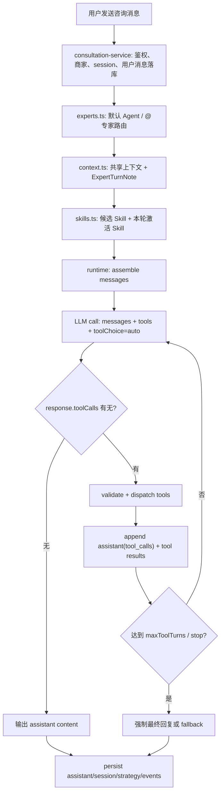

# 咨询 Agent 原生 Tool Calling Loop 改造设计

日期：2026-05-06

## 1. 背景

当前咨询 Agent 已经具备：

- 默认 Agent 与 `@专家` 路由。
- `agent.md` / `soul.md` 注入。
- 候选 Skill 与本轮激活 Skill。
- Agent 绑定知识库检索。
- 共享同一个 consultation session 上下文。
- 右侧策略资产、内容日历、图文 brief、视频 brief 等受控业务工具。
- `agent.loop.started / agent.tool.completed / agent.loop.completed` 等事件。

但当前工具执行仍是 `bounded_business_tool_loop_v1`：

```text
runtime
  -> planner.ts 单独调用模型输出 JSON 决策
  -> deterministic fallback 强制补齐 ready tool
  -> dispatch business tool
  -> build assistant reply
```

这个设计让系统可控，但也带来两个问题：

1. 每个工具前可能多一次 planner LLM 调用。
2. `update_strategy_snapshot` 很容易在依赖满足后被走到，继而触发内部 `update_strategy_asset_editor`，导致轻问答也慢。

本改造目标是把外层 planner 从“单独 JSON 决策器”升级为“主模型原生 tool calling loop”，让模型在同一次咨询推理里自主决定是否调用受控业务工具。

## 2. 关键澄清

“把工具交给模型”不是把一段工具 JSON 当普通文本塞进 system prompt。

正确形态是通过 LLM API 的结构化字段发送：

```ts
createChatCompletion({
  messages,
  tools: consultationTools,
  toolChoice: "auto",
});
```

其中：

- `messages` 是普通对话上下文。
- `tools` 是结构化工具 schema，包含工具名、描述、参数 JSON Schema。
- `toolChoice: "auto"` 表示模型可以自己决定本轮是否调用工具。

OpenAI-compatible provider 会返回：

```json
{
  "tool_calls": [
    {
      "id": "call_xxx",
      "type": "function",
      "function": {
        "name": "retrieve_knowledge_base",
        "arguments": "{\"query\":\"...\",\"topK\":3}"
      }
    }
  ]
}
```

Anthropic/Claude 的形态是 `tool_use` content block，本质相同：模型返回结构化工具调用，不是正文里的 JSON。

Runtime 只信任结构化 `tool_calls`，不从自然语言正文里正则解析工具 JSON。

## 3. 目标原则

1. 只开放咨询业务工具，不开放 Shell、文件系统、浏览器、任意 MCP。
2. 模型可以选择不调用工具，直接回答商家。
3. 工具调用必须经过 schema 校验、权限校验、业务 guardrail。
4. 工具结果必须以 `tool` message 回灌给模型，而不是只在后端 state 里静默更新。
5. 固定 deterministic planner 保留为兜底，不作为主路径。
6. `update_strategy_snapshot` 只在模型明确选择时执行，且内部 editor 仍需 guard。
7. 所有调用路径继续写事件和 runtime snapshot，便于后台调试。

## 4. 目标运行流程



和当前 `bounded_business_tool_loop_v1` 的差异：

```text
当前：
planner LLM -> JSON decision -> runtime dispatch -> final reply LLM

目标：
main LLM -> native tool_calls -> runtime dispatch -> tool results -> main LLM continue/final
```

## 5. Message 结构

每轮模型调用前，runtime 组装：

```text
system:
  - consultationAgent.systemPrompt
  - soul.md
  - expert container prompt
  - candidate skill catalog
  - active skill bodies
  - business tool policy
  - context injection policy
  - tool-use rules

user:
  - current merchant/session payload
  - latest user message
  - strategySnapshot / strategyMarkdown
  - sharedConsultationState
  - recentExpertTurnNotes
  - knowledge summaries already observed
```

如果模型返回工具调用，runtime 必须追加两类消息：

```ts
messages.push({
  role: "assistant",
  content: response.content || null,
  toolCalls: response.toolCalls,
});

messages.push({
  role: "tool",
  toolCallId: toolCall.id,
  content: JSON.stringify(toolResult),
});
```

之后下一轮模型才能看到工具执行结果，并决定继续调用工具还是给出最终回复。

注意：`app/src/server/api/ai-runtime.ts` 当前会把 `messages` 转成 OpenAI-compatible 格式，并支持 `assistant.toolCalls` 和 `role: "tool"`。但它现在会 `messages.slice(0, 20)`，后续改造时需要改成“保留系统消息 + 最近若干轮 + 成对 tool_call/tool_result”，避免截断工具调用配对。

## 6. Tool Registry 设计

新增或改造一个 registry，而不是让 runtime 到处写 `if (toolName === ...)`。

建议结构：

```ts
type ConsultationRuntimeTool = {
  name: ConsultationAgentToolKey;
  description: string;
  parameters: Record<string, unknown>;
  writeScope: "none" | "knowledge_matches" | "strategy_asset" | "content_task";
  isEnabled(state: ConsultationAgentLoopState): boolean;
  validate(args: unknown): ParsedArgs;
  execute(input: {
    state: ConsultationAgentLoopState;
    args: ParsedArgs;
    toolCallId: string;
  }): Promise<ConsultationAgentToolResult>;
};
```

由 registry 生成 API tools：

```ts
const tools: AiRuntimeTool[] = registry
  .filter((tool) => tool.isEnabled(state))
  .map((tool) => ({
    type: "function",
    function: {
      name: tool.name,
      description: tool.description,
      parameters: tool.parameters,
    },
  }));
```

Runtime 执行时：

```text
toolCall.function.name
  -> registry 查找
  -> JSON.parse(arguments)
  -> zod/schema validate
  -> tool.execute()
  -> applyToolResultToState()
  -> emit agent.tool.completed
  -> append role=tool message
```

## 7. 第一版开放工具

第一版只开放当前已有受控业务工具：

```text
read_merchant_profile
retrieve_knowledge_base
read_history
search_benchmark_materials
update_strategy_snapshot
update_content_calendar
generate_article_brief
generate_video_brief
```

但需要改变默认行为：

- `read_merchant_profile` 可以保留自动注入，也可以作为低成本工具开放给模型。
- `retrieve_knowledge_base` 由模型在需要方法论、案例、商家资料时调用。
- `read_history` 只在用户引用“刚才/上次/前面”或 session 摘要不足时调用。
- `search_benchmark_materials` 只在用户提供链接、关键词、明确说找对标/竞品/爆款时调用。
- `update_strategy_snapshot` 只在有明确资产写入意图时调用。
- 内容日历和 brief 工具只在策略资产足够明确或用户要求进入创作时调用。

## 8. `update_strategy_snapshot` 的处理

`update_strategy_snapshot` 仍是外层业务工具。

内部可以继续使用现有 `update_strategy_asset_editor` function tool，但触发条件必须从“依赖满足后 planner 走到”改成“主模型明确调用外层工具”。

目标链路：

```text
main model calls update_strategy_snapshot
  -> runtime validates outer args
  -> resolveStrategyAssetEditorPatch()
  -> forced update_strategy_asset_editor
  -> guardStrategyAssetEditorPatch()
  -> allowed ? apply strategySnapshot : skipped
  -> tool result returned to main model
```

这样轻问答、流程追问、寒暄不会默认触发资产 editor。

## 9. Loop 终止条件

Runtime 继续使用有界循环：

- `maxToolTurns`：建议第一版 4，最大不超过 6。
- `maxToolCallsPerTurn`：建议第一版 2。
- `maxStrategyAssetWrites`：每个用户消息最多 1 次。
- `maxBenchmarkSearches`：每个用户消息最多 1 次。
- 如果模型连续两轮只调用 skipped 工具，停止并要求最终回复。
- 如果模型没有 `toolCalls`，直接以 `content` 作为最终回复。
- 如果模型只有工具调用、没有最终回复，工具执行后再补一轮 `toolChoice: "none"` 强制生成自然语言回复。

## 10. 降级策略

必须保留 fallback：

1. Provider 不支持 tool calling：
   - 回退到当前 deterministic planner。
2. `tool_calls` 结构为空且正文无内容：
   - 回退到现有 `buildAssistantReply()`。
3. 工具 arguments 非法：
   - 返回 tool error message 给模型重试一次。
   - 再失败则跳过该工具，写事件。
4. 主模型连续异常：
   - 回退到当前 deterministic planner + fallback reply。
5. `update_strategy_snapshot` guard 拒写：
   - 不落库策略资产。
   - 工具结果告诉主模型“本轮未写入”，最终回复不得声称已更新。

## 11. 事件与快照

保留现有事件，并增加区分字段：

```text
agent.loop.started
  runtimeDesign: native_tool_calling_loop_v1
  plannerMode: native_tool_calling

agent.tool.requested
  source: model_tool_calls
  toolName
  rawArgumentsPreview

agent.tool.completed
  status
  summary
  guardrail

agent.loop.completed
  terminalReason:
    - assistant_final
    - max_tool_turns
    - fallback_deterministic
    - fallback_error
```

`agent_runtime_snapshots.toolCallSummary` 建议记录：

- `runtimeDesign`
- `toolCallingProvider`
- `toolCallTrace`
- `completedTools`
- `skippedTools`
- `fallbackReason`
- `strategyWriteCount`
- `knowledgeMatchIds`
- `activeSkillIds`

普通事件仍不得保存完整 system prompt 或完整 `soul.md` 正文。

## 12. 前端关系

这次 planner 改造和“用户消息落库后立即返回、后台跑 loop、前端显示思考中”是两件事，但可以互相配合。

推荐顺序：

1. 先把接口改成异步消息返回，降低用户等待体感。
2. 再把 runtime 改成 native tool calling loop，降低真实执行耗时。
3. 前端继续轮询或 SSE 更新 assistant 消息与工具卡片。

如果只做 native tool calling，不做异步返回，复杂工具仍可能让接口等待较久。

## 13. 迁移步骤

### Phase 0：文档确认

产出本文档，确认：

- 工具通过 API `tools` 字段给模型，不走正文 JSON。
- Runtime 只识别结构化 `tool_calls`。
- 外层 planner 改造先 behind flag。
- deterministic planner 保留兜底。

### Phase 1：抽 Tool Registry

- 把 `dispatchConsultationTool()` 的工具逻辑收敛到 registry。
- 每个工具定义参数 schema。
- 保持当前 runtime 行为不变。
- 测试目标：现有 consultation-service test 通过。

### Phase 2：新增 NativeToolCallingConsultationLoop

- 新增 `runNativeToolCallingConsultationRuntime()`。
- 复用现有 `ConsultationAgentLoopState`。
- 复用现有 event builder，但标记新 runtimeDesign。
- 暂不删除 `planner.ts`。

### Phase 3：灰度开关

后台增加或复用 Agent modelConfig：

```json
{
  "plannerMode": "deterministic" | "model_json_planner" | "native_tool_calling"
}
```

第一版只在 staging 或指定 Agent 开启。

### Phase 4：策略资产写入门控

- `update_strategy_snapshot` 每轮最多一次。
- 低信息/闲聊/流程追问不写资产。
- guard 拒写时最终回复必须承认“先不写入”。

### Phase 5：替换主路径

当 staging 验证通过：

- 默认咨询 Agent 使用 native tool calling。
- `model_json_planner` 只保留为 fallback。
- deterministic planner 只作为无 tool calling provider 的兜底。

## 14. 验收标准

功能验收：

- 用户普通追问时，Agent 可以不调用 `update_strategy_snapshot`。
- 用户明确要求“写进右侧策略资产”时，Agent 调用 `update_strategy_snapshot`。
- 用户要求找对标时，Agent 调用 `search_benchmark_materials`。
- 工具调用结果能进入下一轮模型回复。
- 工具卡片、事件、runtime snapshot 仍正确记录。

性能验收：

- 轻问答不再触发 planner LLM + asset editor 双模型调用。
- 一般咨询首轮可以在一次主模型调用内决定是否直接回复。
- 复杂工具链最多受 `maxToolTurns` 限制。

安全验收：

- 未启用工具不会出现在 `tools` 列表里。
- 模型发明工具名时不执行。
- arguments 校验失败不执行。
- 策略资产 guard 拒写时不落库。
- fallback 不影响用户收到回复。

## 15. 待确认问题

1. 第一版 `read_merchant_profile` 是否继续自动执行，还是也交给模型 tool call？
2. `retrieve_knowledge_base` 是否在每轮默认先检索一小次，还是完全由模型决定？
3. Native tool loop 的 `maxToolTurns` 默认是 4 还是沿用 Agent `maxRounds`？
4. 是否先只对一个测试 Agent 开启 `native_tool_calling`？
5. 异步消息返回分支是否先合入，再做 runtime 改造？

## 16. 结论

咨询 Agent 可以改成类似 Claude Code 的原生工具循环，但需要保持业务边界：

```text
模型自主选择工具
  +
runtime 严格校验和执行
  +
业务 guardrail 控制写入
  +
deterministic fallback 保底
```

这个改造的核心收益不是“让模型自由发挥”，而是让模型在受控工具集合内决定是否需要行动，从而避免每轮固定走 planner 和策略资产 editor。
