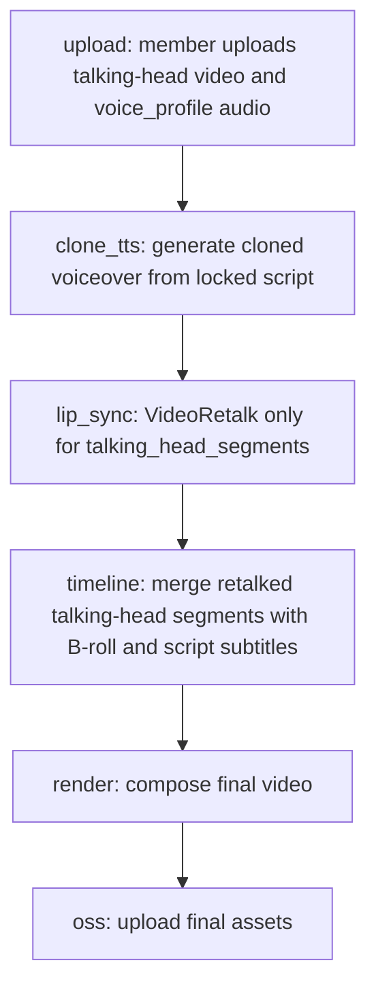

# 真人口播口型替换与精准字幕架构方案

日期：2026-05-20  
分支：`codex/lip-sync-script-alignment-no-asr`  
状态：新功能测试方案，待本地验证、Gitee 分支验证、服务器 release 组验证后再决定是否合并。

## 背景

当前真人口播视频若继续用原视频 ASR 作为字幕源，会出现“脚本已经锁定、克隆音频已生成，但字幕识别自原视频人声”的不匹配。新分支的测试目标是把真人口播主链路改成：

1. 上传并确认 `voice_profile`。
2. 基于锁定脚本生成克隆音频。
3. 只对真人口播片段使用克隆音频和真人口播视频做口型替换。
4. 字幕文字来自锁定脚本，时间戳按克隆音频/脚本对齐生成。
5. 再进入 timeline、render、OSS 输出。

结论：新功能默认字幕源为 `script_audio_alignment`，不使用 ASR。`asr_original_audio` 只保留为显式回退能力，不能从代码中删除。

## 当前克隆音频格式结论

当前 FireRed `generate_voiceover` 节点为每段 voiceover 建立的最终产物路径是 `.wav`，例如 `voiceover_0001_<ts>.wav`。Pixelle/RunningHub 适配过程中可能临时下载或转换 `.mp3`，但进入 worker voiceover artifact 的主产物按 `.wav` 路径记录。

因此对 VideoRetalk 适配来说，当前克隆音频默认可落在模型支持范围内，但必须在进入 `lip_sync` 前做合同校验，不能只相信 provider 返回成功。

## VideoRetalk 输入合同

短期托管方案先接入阿里云百炼 VideoRetalk。官方输入约束需要进入 worker 合同和发布验收：

音频：

- 支持 `wav`、`mp3`、`aac`。
- 文件不超过 30MB。
- 时长必须满足 `2s < duration < 120s`。
- 音频必须包含清晰、响亮的人声，去除环境噪音、背景音乐等干扰。

视频：

- 支持 `mp4`、`avi`、`mov`。
- 文件不超过 300MB。
- 时长必须满足 `2s < duration < 120s`。
- 帧率 15-60fps。
- 编码 H.264/H.265。
- 宽高各边 640-2048 像素。
- 内容需要清晰、近景、正脸人物；避免侧脸、多人脸、嘴部遮挡、脸部过小、强运动模糊。

当前代码已能静态校验格式、文件大小、音频时长；若视频 metadata 存在，也校验视频时长、分辨率、fps、codec。正脸清晰、嘴部可见、多人脸、遮挡等视觉质量不能靠静态 metadata 判断，必须作为后续 VideoRetalk 适配器前置探测和供应商错误码归因的探索项。

VideoRetalk API 接入点按百炼/DashScope 官方异步调用方式实现：

- submit endpoint：`/services/aigc/image2video/video-synthesis/`
- `model`：`videoretalk`
- `input.video_url`：供应商可访问的视频 URL，本地文件路径不算合法输入。
- `input.audio_url`：供应商可访问的音频 URL，本地文件路径不算合法输入。
- 可选 `input.ref_image_url`：用于指定参考人脸图。
- 可选 `parameters.video_extension`：是否启用视频扩展。
- 可选 `parameters.query_face_threshold`：参考图匹配阈值，默认按官方值 170。
- `X-DashScope-Async: enable`：异步任务提交；轮询 `/tasks/{task_id}`，成功后下载结果视频。

当前分支的真实限制：临时上传到供应商可访问 URL 的 plumbing 还没有闭环。若 `lip_sync` 只拿到本地 `source_path` / `voiceover_path`，而没有 `video_url` / `audio_url` 或后续 OSS 临时签名 URL，必须 fail closed，失败阶段记为 `lip_sync`，不能跳过后伪造成渲染成功。

## 口型替换范围

VideoRetalk 只处理真人口播部分，合同范围为 `talking_head_segments`。

- 输入：被标记为 `talking_head` 的真人口播片段，以及对应的克隆音频片段。
- 输出：口型替换后的真人口播片段，回填到 timeline。
- 不处理：B-roll、项目素材、转场、封面、整条已合成视频。
- 不允许：把整条成片或所有素材统一送入 VideoRetalk。非真人口播素材仍走原 timeline/render。

如果一个任务同时包含真人口播和项目素材，流程必须是“只替换 talking_head 段，再和其他素材按精准时间戳拼回 timeline”。

## 当前实现落点

当前分支已经补入真正的 `lip_sync` 执行点，不再只是架构说明：

- FireRed 新增 `LipSyncNode`：位于 `workers/video-worker/openstoryline/firered/src/open_storyline/nodes/core_nodes/lip_sync.py`。
- `LipSyncNode` 在 `plan_timeline` 后执行，只筛选 `talking_head_segments`。
- 节点按 `group_id` 找到对应克隆 voiceover，要求音频存在、格式/大小/时长符合 VideoRetalk 合同。
- 节点将真人口播片段切成供应商允许的 segment 后调用 VideoRetalk，并产出 `lip_sync.segments`。
- 节点返回新的 `lip_sync.plan_timeline`，其中只有 talking-head segment 的 `source_path` 被替换成 retalked 视频；B-roll 和项目素材保持不变。
- `render_video` 优先读取 `lip_sync.plan_timeline`，并在元数据中记录 `lip_sync_segments_consumed`。
- `node_interceptors` 在 `production_config.lip_sync.enabled=true` 时要求 render 前必须存在 `lip_sync.plan_timeline`，否则失败在 `lip_sync/render input` 合同，不进入“假成功”。
- OpenStoryline app 通过 `Settings.from_env -> service_config.lip_sync -> FireRed ClientContext.lip_sync_config -> ToolInterceptor.inject_lip_sync_config` 注入供应商配置，和现有 TTS/ASR 模型配置链路保持一致。
- worker processor 增加 `lip_sync` progress module 和失败阶段映射；`videoretalk/lip_sync/retalk` 事件归入 `lip_sync`，并校验 retalked timeline 是否真的被 render 输入消费。

ASR 保留为显式回退：`script_audio_alignment` 不触发 ASR；只有 `asr_original_audio` 才允许进入 ASR 依赖和 ASR provider 校验。

## 新链路状态机

字幕规则：

- `script_audio_alignment`：新真人口播主路径。字幕文字来自锁定脚本，按克隆音频/脚本对齐生成精准时间戳。
- `script`：普通脚本字幕路径，适合非真人口播或默认系统配音。
- `asr_original_audio`：显式回退路径。只有用户或配置明确指定时才使用原视频 ASR，不作为新功能默认路径。

默认配音规则：

- 没有成功上传并使用 `voice_profile` 时，只能算普通 TTS 验证。
- 只有 `voice_profile` 上传成功、clone TTS 产出可测量克隆音频，并进入 lip sync，才算音色克隆链路通过。

## 失败日志合同

任何阶段失败都不得标记 `succeeded`。失败必须记录：

- `video_edit_job_id`
- `daily_task_id`
- `member_user_id`
- `final_asset_id` / object key，如已有
- `FireRed run id`
- 失败日志摘要
- 失败阶段：`upload`、`asr`、`clone_tts`、`lip_sync`、`timeline`、`render`、`oss`

若已有中间产物，只能记录为 partial artifact，不能当成最终成片。

## 模型对比与建议

| 模型/服务 | 类型 | 优点 | 风险 | 建议 |
| --- | --- | --- | --- | --- |
| 阿里云百炼 VideoRetalk | 托管 API | 接入快、国内环境和 OSS 链路更顺，适合当前分支快速验证 | 对输入质量要求明确，清晰正脸和干净人声不达标会失败；供应商错误码需要适配 | 短期首选 |
| OpenTalker VideoReTalking | 开源自建 | 与“保留原视频身份并重配口型”目标接近，可做自建兜底 | 部署重、显存和依赖成本高，工程稳定性需要实测 | 中期评测 |
| Wav2Lip | 开源自建 | 成熟、速度快、社区案例多，适合低成本基线 | 画质与身份保持通常弱于新模型 | 兜底/基线 |
| MuseTalk | 开源自建 | 目标是实时/高质量音频驱动口型，适合后续自建方案 | 需要评估中文口播、长视频切片、显存和批处理稳定性 | 重点备选 |
| LatentSync | 开源自建 | 新一代扩散式口型同步，质量潜力高 | 推理成本和工程稳定性需验证 | 质量优先备选 |
| SadTalker | 开源自建 | 擅长单图/头像驱动说话 | 不适合当前“保留真人视频原动作和场景”的主目标 | 非主路径 |

推荐：

1. 当前分支先验证 VideoRetalk，先把链路、日志、字幕源和失败归因跑通。
2. 同步建立自建模型评测表，重点看 MuseTalk、LatentSync、VideoReTalking、Wav2Lip。
3. 若 VideoRetalk 因输入质量频繁失败，优先补“上传前/适配器前视频质量检测”，不是回退到 ASR。

## 待探索项

必须在探索记录中继续跟踪：

- VideoRetalk 适配器前的人脸质量探测：单人脸、正脸角度、嘴部无遮挡、脸部占比、清晰度、光照、运动模糊。
- 供应商错误码映射：VideoRetalk 返回的人脸/音频/格式/时长错误必须归因到 `lip_sync`，不能混成 `render` 或 `timeline`。优先覆盖 `InvalidURL.*`、`InvalidFile.*`、`InvalidFile.FaceNotMatch` 等 URL、文件、参考脸匹配错误。
- 克隆音频清洁度探测：是否有人声过小、BGM、环境噪音、多说话人。当前只能检查格式、大小、时长，不能证明“清晰响亮人声”已通过。
- 分段策略：超过 120 秒的视频或音频需要先切段，切段后再 lip sync，最后按 timeline 拼接。
- 片段范围验证：VideoRetalk 只能拿 `talking_head_segments`，需要防止整条视频、B-roll、项目素材误入 lip sync。
- 自建模型评测：统一测试同一组真人口播视频和同一段克隆音频，记录质量、耗时、显存、失败率、可诊断性。

## 禁止事项

- 不打印任何 secret。
- 不改 DNS / ICP / RDS 公网 / OSS 公共权限。
- 不恢复 Supabase / COS / Vercel 老配置。
- 不把 worker output prefix 改回 smoke 临时路径。
- 不把成员端主路径改回 `/dashboard/video`。
- 不新建 `merchant_media_*` 表。
- 不让成员端 Dify 主路径重新调用 `video-workbench-agent`。
- 不做服务器热更新。

## 测试与发布

本地分支验证：

- `git status --short --branch`
- 文档检查与合同测试。
- 至少一条真实 `voice_profile` 上传成功。
- 一条成员端任务跑通 `upload -> clone_tts -> lip_sync -> timeline -> render -> oss`。
- 失败样例能真实落日志并定位阶段。

发布顺序：

1. 本地验证通过后提交 commit。
2. 推送 `codex/lip-sync-script-alignment-no-asr` 到 Gitee。
3. release 组从 Gitee 分支/commit 发布到服务器。
4. 服务器 release 验证通过后，再合并回 `孟_5.13`。

## 参考来源

- [阿里云百炼 VideoRetalk 文档](https://help.aliyun.com/zh/model-studio/videos/videoretalk-quick-start)
- [OpenTalker VideoReTalking](https://github.com/OpenTalker/video-retalking)
- [Wav2Lip](https://github.com/Rudrabha/Wav2Lip)
- [MuseTalk](https://github.com/TMElyralab/MuseTalk)
- [LatentSync](https://github.com/bytedance/LatentSync)
- [SadTalker](https://github.com/OpenTalker/SadTalker)
