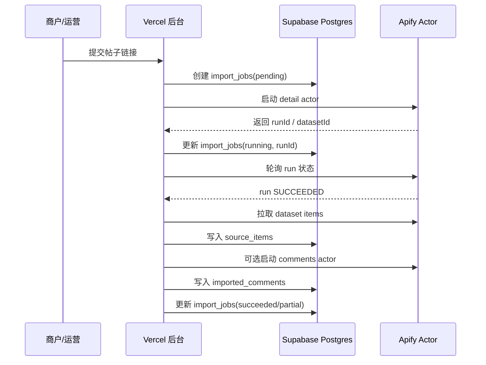
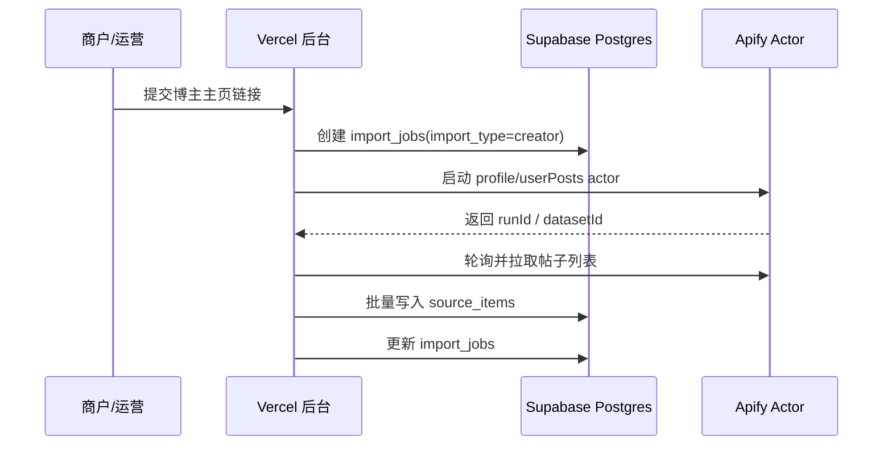

# V0.1 Apify 导入接入方案草案

## 1. 当前定位

基于 `2026-04-19` 两轮实测，`Apify` 已经可以作为 `V0.1-A` 的 API-first PoC 候选。

本方案的目标不是马上宣布它是长期唯一供应商，而是先回答：

> 如果第一版先接 Apify，后台、数据库、任务流应该怎么设计？

当前优先级仍然是：

- 抓内容
- 改写内容
- 发布后置

---

## 2. 当前结论

### 2.1 可以先不租 VPS

如果 `V0.1-A` 先走 Apify：

- 不需要我们自己跑浏览器集群
- 不需要我们自己维护代理池
- 不需要一开始租 Worker VPS

当前架构可以先收成：

- `Vercel`：管理后台 + 服务端 API
- `Supabase`：认证、数据库、存储
- `Apify`：小红书 / 抖音导入任务执行

### 2.2 仍然需要“导入任务编排”

即使不用自建 Worker，也不能把 Apify 当成一个简单同步函数直接塞进前端。

我们仍然需要在系统里做：

- 创建导入任务
- 调用 Apify actor
- 记录 runId / datasetId
- 轮询或接收 webhook
- 清洗返回字段
- 写入 `source_items`
- 写入 `imported_comments`
- 记录失败原因和成本

这些可以先放在 `Vercel server-side API` 里做。

---

## 3. 推荐 actor 矩阵

## 3.1 小红书

| 能力 | 推荐 actor | 输入模式 | 当前状态 |
|---|---|---|---|
| `detail` | `huggable_quote/xiaohongshu-all-in-one-scraper` | `mode = postDetail` | 已实测可用 |
| `profile` | `huggable_quote/xiaohongshu-all-in-one-scraper` | `mode = profile` | 已实测可用 |
| `userPosts` | `easyapi/rednote-xiaohongshu-user-posts-scraper` | `profileUrls` | 已实测可用 |
| `comments` | `easyapi/all-in-one-rednote-xiaohongshu-scraper` | `mode = comment` | 已实测可用，但需继续压测 |

关键约束：

- 小红书 `detail / comments` 尽量传完整自然链接
- 不要只传裸 `note_id` 链接
- 尽量保留：
  - `xsec_token`
  - `xsec_source`
  - `channel_type`

## 3.2 抖音

| 能力 | 推荐 actor | 输入模式 | 当前状态 |
|---|---|---|---|
| `detail` | `easyapi/douyin-video-downloader` | `links` | 已实测可用 |
| `comments` | `natanielsantos/douyin-comments-scraper` | `postUrls` | 已实测可用 |

---

## 4. 后台导入流程

## 4.1 单条帖子导入



第一版建议：

- `detail` 和 `comments` 分开跑
- 即使评论失败，也不要让整条导入失败
- 评论失败时任务状态可以记为 `partial`

---

## 4.2 博主主页导入



第一版建议：

- 先限制每个主页最多导入 `20` 条
- 不做无限翻页
- 不做定时监控

---

## 5. 和当前数据表的对应关系

当前不强制新增表，先复用：

- `import_jobs`
- `source_items`
- `imported_comments`

参考：

- [V0.1-Postgres-Schema-草案.md](/Users/wy/Desktop/静境/静境4.0/小红书抖音矩阵获客平台/docs/架构规范/V0.1-Postgres-Schema-草案.md)

## 5.1 `import_jobs`

建议写入：

- `platform`
- `import_type`
- `input_payload`
- `status`
- `total_items`
- `success_items`
- `error_summary`
- `log_payload`

`log_payload` 里建议保存：

```json
{
  "provider": "apify",
  "actorId": "huggable_quote/xiaohongshu-all-in-one-scraper",
  "runId": "...",
  "datasetId": "...",
  "usageTotalUsd": 0.0002,
  "rawStatus": "SUCCEEDED"
}
```

## 5.2 `source_items`

小红书 `detail` 推荐映射：

| Apify 字段 | 本系统字段 |
|---|---|
| `id` | `external_item_id` |
| `postUrl` | `source_url` |
| `user.userId` | `creator_id` |
| `user.nickname` | `creator_name` |
| `title` | `title` |
| `description` | `body_text` |
| `content` | `script_text` 或留空 |
| `likes/comments/collects/shares` | `engagement_snapshot` |
| 原始 item | `trace_payload` |

抖音 `detail` 推荐映射：

| Apify 字段 | 本系统字段 |
|---|---|
| `result.id` | `external_item_id` |
| `url` | `source_url` |
| `result.author` | `creator_name` |
| `result.title` | `title` 或 `body_text` |
| 原始 item | `trace_payload` |

## 5.3 `imported_comments`

小红书 `comment` 推荐映射：

| Apify 字段 | 本系统字段 |
|---|---|
| `comment.id` | `external_comment_id` |
| `comment.note_id` | 用于关联 `source_item` |
| `comment.sub_comments[].id` | 回复的 `external_comment_id` |
| `comment.id` | 回复的 `parent_external_comment_id` |
| `comment.user_info.nickname` | `author_name` |
| `comment.content` | `content` |
| `comment.like_count` | `like_count` |
| `comment.sub_comment_count` | `reply_count` |
| `comment.create_time` | `published_at` |

注意：

- 主评论和子评论建议都落到 `imported_comments`
- 子评论通过 `parent_external_comment_id` 关联主评论

---

## 6. V0.1-A 的接口草案

## 6.1 创建导入任务

```http
POST /api/import-jobs
```

请求体：

```json
{
  "platform": "xiaohongshu",
  "importType": "detail",
  "url": "https://www.xiaohongshu.com/explore/...",
  "options": {
    "includeComments": true,
    "maxComments": 30
  }
}
```

返回：

```json
{
  "jobId": "...",
  "status": "pending"
}
```

## 6.2 触发导入任务

```http
POST /api/import-jobs/{jobId}/run
```

第一版可以：

- 创建后立即 run
- 或由后台按钮触发 run

## 6.3 查询导入状态

```http
GET /api/import-jobs/{jobId}
```

返回：

```json
{
  "jobId": "...",
  "status": "succeeded",
  "sourceItemIds": ["..."],
  "errorSummary": null
}
```

---

## 7. 并发与成本控制

第二轮测试已经遇到过：

- 低额度/免费计划下的 actor 内存并发限制

所以第一版必须做简单限流：

- 同一商户同一时间最多 `1` 个导入任务 running
- 系统全局先最多 `1-2` 个 Apify run 并发
- 评论任务默认最多 `30` 条
- 博主主页默认最多 `20` 条帖子

这不是为了技术优雅，而是为了：

- 防止试用金被快速烧完
- 防止 actor 并发被 Apify 拒绝
- 防止用户连续点击造成重复导入

---

## 8. URL 输入策略

小红书是当前最需要注意的。

第一版建议：

- 用户粘贴什么，我们就先原样存入 `input_payload`
- 如果 URL 里有 `xsec_token`，优先原样传给 Apify
- 如果用户只传裸链接，也允许尝试，但要在结果质量不足时提示：
  - “请从小红书网页端重新复制完整链接后再试”

暂时不建议第一版就做：

- 自动补全 `xsec_token`
- 自建浏览器打开链接再转完整链接
- 从用户浏览器取 cookie

这些都可以后置。

---

## 9. 错误处理

常见错误类型：

| 类型 | 示例 | 处理 |
|---|---|---|
| 输入不合法 | actor 要求 `maxItems >= 30` | 前端/服务端预校验 |
| actor 字段不兼容 | `postURLs` vs `postUrls` | provider adapter 固化字段 |
| run 成功但空结果 | dataset `0` 条 | 标记 `partial/failed_manual` |
| 并发内存限制 | `actor-memory-limit-exceeded` | 限流 + 排队 |
| 字段不完整 | 有 id 无正文 | 标记为低质量导入 |

---

## 10. 安全与凭据

`Apify token` 必须：

- 只放在服务端环境变量
- 不进入前端 bundle
- 不写入日志
- 不写进代码仓库

建议环境变量名：

```bash
APIFY_TOKEN=...
```

如果后续要支持多个供应商，可以统一成：

```bash
IMPORT_PROVIDER=apify
APIFY_TOKEN=...
BRIGHTDATA_TOKEN=...
```

---

## 11. 当前不做

`V0.1-A` 先不做：

- 自建 Worker
- 自建浏览器集群
- 自动定时监控博主
- 全量历史采集
- 平台 cookie 托管
- 多供应商自动切换

---

## 12. 当前建议

当前建议直接进入下一步：

1. 先按 `Apify provider adapter` 设计代码结构
2. 只接最小 4 类能力：
   - 小红书 `detail`
   - 小红书 `creator/userPosts`
   - 小红书 `comments`
   - 抖音 `detail/comments`
3. 后台页面先做“手动提交链接导入”
4. 跑通后再做“进入改写工作台”

---

## 13. 一句话结论

`V0.1-A` 可以先按：

> `Vercel + Supabase + Apify`

推进导入链路 PoC。

但正式商业稳定性仍需继续用更多样本验证，尤其是：

- 小红书评论成功率
- 小红书完整链接获取方式
- 评论任务成本上限
- actor 后续维护稳定性
