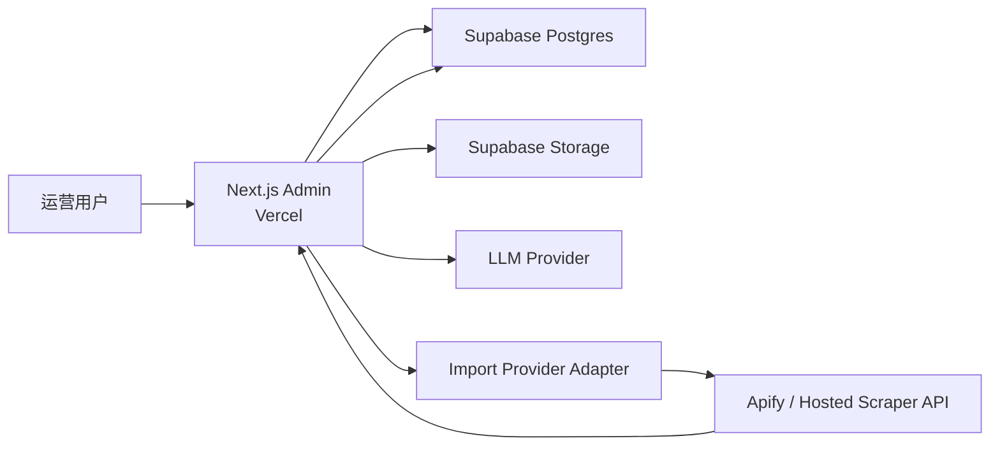

# 小红书抖音矩阵获客平台 V0.1 Vercel + Supabase + 导入执行层方案评估

## 1. 先说结论

如果问题是：

> `V0.1` 能不能直接用 `Supabase + Vercel` 做？

我的结论是：

- **可以作为主干**
- 但导入执行层不能完全当普通 CRUD 处理
- `V0.1-A` 当前优先选择托管抓取 API
- 自建 `Worker / VPS` 先作为备选方案，而不是首选
- 发布任务是否在 `V0.1` 首阶段接入，可以后置

一句话版本：

```text
V0.1-A 推荐方案 = Vercel 管理后台 + Supabase 数据与存储 + Apify 托管导入 API
```

当前更准确的阶段表达是：

- `V0.1-A`：先打通导入 + 改写闭环
- `V0.1-B`：再补发布执行闭环

补充：

- `2026-04-19` 已用真实 Apify token 完成两轮样本实测
- 小红书 / 抖音都已有可跑通路径
- 详见：
  - [V0.1-Apify-导入接入方案草案.md](/Users/wy/Desktop/静境/静境4.0/小红书抖音矩阵获客平台/docs/架构规范/V0.1-Apify-导入接入方案草案.md)

---

## 2. 为什么先在这个阶段评估

前面的页面信息架构和数据表草案已经把 `V0.1` 的真实负载暴露出来了。

当前系统其实有 3 类完全不同的工作：

1. `后台页面与普通 CRUD`
2. `AI 改写与内容编辑`
3. `导入任务与发布任务`

其中只有第一类最适合纯 `Vercel + Supabase`。

第三类不能简单当普通页面请求处理。

但结合托管 API 实测结果，`V0.1-A` 不一定需要我们一开始就租 VPS。更轻的做法是：

- 由 `Vercel server-side API` 负责任务编排
- 由 `Apify` 负责抓取执行
- 由 `Supabase` 负责状态和结果落库

结合最新版本目标，当前更合理的优先级是：

1. `导入任务`
2. `AI 改写与内容编辑`
3. `发布任务`

也就是说，第一实现切口不再默认是发布，而是先把“抓内容 -> 写内容”做扎实。

---

## 3. 结合当前页面结构看工作负载

| 页面 / 能力 | 主要负载 | 是否适合 Vercel | 是否适合 Supabase |
|---|---|---|---|
| `导入页` | 发起任务、查询状态 | 适合做轻入口 | 适合存任务记录 |
| `内容中心` | 列表查询、详情查看、筛选 | 很适合 | 很适合 |
| `商家画像页` | 表单 CRUD | 很适合 | 很适合 |
| `改写工作台` | 查询、LLM 调用、保存草稿 | 适合做同步交互层 | 适合存草稿与版本 |
| `账号管理页` | 账号状态查看、登录发起 | 适合做控制台 | 可存账号元数据，但不宜存明文凭据 |
| `发布任务页` | 查询任务、看日志、重试 | 适合做控制台 | 适合存任务和日志摘要 |
| `导入执行` | 托管 API 调用、轮询、清洗、落库 | 适合做编排，不适合自跑爬虫 | 适合存任务和结果 |
| `发布执行` | 登录态检查、浏览器自动化、重试 | 不适合直接跑 | 只适合存状态 |

---

## 4. 三层职责怎么拆最顺



### 4.1 `Vercel`

负责：

- 管理后台页面
- 轻量 CRUD API
- 改写工作台的同步请求
- 发起导入 / 发布任务
- 展示任务与日志

不负责：

- 长时间导入任务
- 浏览器自动化发布
- 持续轮询重试

### 4.2 `Supabase`

负责：

- PostgreSQL 主库
- 对象存储
- 账号、草稿、任务、评论、媒体引用等核心数据
- 如有需要，可承接内部登录认证

这里说的“内部登录”特指：

- 你自己团队进入这个**管理后台**时的登录

不指：

- 面向第三方商家的正式用户系统
- 多租户 SaaS 的注册登录体系

不过长期方向现在已经明确：

- 整个产品的用户体系最终会走**多租户 SaaS**
- `V0.1` 为了控流和降低风险，可以先采用**邀请码注册**
- 也就是用户只有拿到邀请码，才能完成注册并进入系统

不负责：

- 真正执行导入
- 真正执行平台自动化发布

### 4.3 `Worker`

当前这里的 `Worker` 需要拆成两种理解：

1. `V0.1-A` 的导入编排层
2. 后续自建 VPS / Python Worker

如果走 `Apify`，第一阶段不需要我们自己租服务器跑真正的抓取 Worker。

`V0.1-A` 里先由 `Vercel server-side API` 承担：

- 创建 `ImportJob`
- 调用 Apify actor
- 轮询 run 状态
- 拉取 dataset
- 清洗字段
- 写入 `source_items / imported_comments`

后续如果 Apify 不稳、太贵或覆盖不足，再补自建 Worker。

### 4.4 备选的自建 `Worker`

负责：

- 第一阶段优先处理 `ImportJob`
- 后续阶段再处理 `PublishJob`
- 调用 `MediaCrawler` 类导入能力
- 如进入发布阶段，再调用 `social-auto-upload` 类发布能力
- 负责失败重试、状态回写、日志留痕

补充说明：

- `Worker` 不是第二套后台页面
- 它本质上是后台外的任务执行器
- 主要作用是承接不适合直接跑在 `Vercel` 上的长任务

### 4.5 `V0.1-A` 的导入执行层到底依赖哪些功能

当前第一阶段真正依赖导入执行层的主要是：

- `detail` 导入
- `creator` 导入
- 评论抓取
- 导入失败重试
- 批量导入任务执行

当前第一阶段**不必须**依赖 `Worker` 的功能：

- 邀请码注册
- 商户资料编辑
- 内容列表查看
- AI 改写生成
- 草稿编辑与保存

也就是说，如果只是“管理后台 + 改写工作台”，理论上可以先不租额外服务器。

如果要做真实的“抓内容”，当前其实有两条路：

1. 直接采购**托管式抓取 API / Hosted Scraper**
2. 自己租 VPS 跑 `Worker`

`V0.1-A` 当前已实测 `Apify`，更推荐先走第 1 条。

---

## 5. 为什么不能只用 Supabase + Vercel

### 5.1 导入任务天然是长任务

无论是：

- `detail`
- `creator`
- `search`

本质都不是一次瞬时 CRUD。

它们可能涉及：

- 网络请求不稳定
- 分页抓取
- 评论补抓
- 平台风控或限速

这不适合只依赖 `Vercel` 的短生命周期请求。

### 5.2 发布任务比导入任务更重

发布执行层通常会碰到：

- cookie / session 状态失效
- 平台页面结构变化
- 上传耗时
- 定时任务
- 发布失败重试

尤其如果底层真接 `social-auto-upload` 这类能力，往往会更依赖：

- Python 环境
- 浏览器自动化环境
- 更稳定的常驻进程或可控容器

这更说明如果后面进入发布阶段，需要独立 Worker。

### 5.3 `Supabase Edge Functions` 不是这里的最佳执行层

即使 `Supabase` 有函数能力，这里依然不建议把它当主任务执行层。

原因是：

- 运行时不匹配当前更偏 Python 的发布与导入生态
- 长任务、浏览器自动化、重试控制都不理想
- 会把任务编排和数据库耦得过紧

---

## 6. 这套方案最适合当前版本的地方

### 6.1 对管理后台很友好

`Vercel + Next.js` 非常适合当前这类后台：

- 页面少而明确
- 列表、详情、表单多
- 前端交互复杂度适中
- 未来如果要加内容日历、批量排期，也容易延展

### 6.2 对当前数据模型很友好

当前数据表草案里最核心的对象：

- `MerchantProfile`
- `StoreProfile`
- `AudienceProfile`
- `ImportJob`
- `SourceItem`
- `ImportedComment`
- `ContentDraft`
- `ContentVariant`
- `PublishingAccount`
- `PublishJob`

都非常适合先放在 `Supabase Postgres`。

而且 `Supabase Storage` 也能自然承接：

- 来源图片 / 视频
- 生成后的封面或附件
- 发布日志文件

### 6.3 对 `V0.1` 内部版足够轻

当前版本还是内部自用，不需要一开始就引入太多基础设施。

所以比起：

- 一上来拆成多微服务
- 一上来补 Kafka / Redis / 独立对象存储 / 自建 Auth

更合适的路径是：

- 先让 `Supabase` 承接数据库与存储
- 让 `Vercel` 承接管理台
- 第一阶段先把“导入任务”剥给 Worker
- 发布任务等进入第二阶段再接入 Worker

---

## 7. 当前推荐的最小任务编排方式

`V0.1` 不一定要马上上 Redis 队列。

更现实的方式是：

1. 前台在数据库里写入 `ImportJob`
2. Worker 通过轮询或事件触发领取任务
3. Worker 执行后把状态和日志回写数据库

如果后面补发布，再把 `PublishJob` 接入同一套机制。

也就是说，第一版可以先用“数据库任务表”当简化队列。

### 为什么这样更合适

- 当前任务量不大
- 内部版更看重先跑通
- 降低部署复杂度
- 让任务状态天然可查询、可回放

### 什么时候再补 Redis

只有当出现下面这些信号，再考虑引入：

- 导入任务或发布任务明显堆积
- 需要更精细的重试策略
- 并发账号数明显上升
- 任务领取竞争开始复杂

---

## 8. 对 AI 改写链路的建议

`改写工作台` 的 AI 调用可以先不走 Worker。

`V0.1` 推荐：

- 单次生成、多版本生成这类同步交互，先走 `Vercel` 服务端
- 生成结果直接写回 `ContentVariant`

只有当后续出现下面这些情况，再把 AI 生成也移进 Worker：

- 一次生成要跑很多版本
- 需要离线批量生成
- 单次生成明显超过页面可接受等待时间

---

## 9. 账号与凭据存储建议

这是当前方案里最需要注意的风险点之一。

### 建议做法

- 业务表 `PublishingAccount` 里只存 `credential_ref`
- 明文 cookie / session 不直接暴露给前台
- Worker 侧通过受限方式读取实际凭据

### 当前不建议

- 不建议把明文 cookie 直接放前端可读数据库字段
- 不建议把账号凭据和普通商家资料混在一起

如果 `V0.1` 只是内部自用，最低也应做到：

- 数据库存引用
- 实际明文只在 Worker 或受限 secret storage 中可读

---

## 10. 推荐的 V0.1 落地顺序

### 第一步

先搭：

- `Vercel` 管理后台壳
- `Supabase` 数据库与存储
- `MerchantProfile / SourceItem / ContentDraft / ContentVariant` 核心表
- 预留 `PublishingAccount / PublishJob` 表，但不要求首阶段打通

### 第二步

补：

- `导入页`
- `内容中心`
- `改写工作台`
- `商家画像` 最小表单

目标：

- 先跑通“抓内容 -> 看评论 -> 结合商家画像改写 -> 保存草稿”

### 第三步

补独立 Worker，优先打通：

- `ImportJob`
- `detail` 导入
- `creator` 导入
- 评论抓取

### 第四步

如果导入与改写链路验证有效，再接入：

- `PublishJob`
- 账号状态检查
- 小红书 / 抖音最小发布

---

## 11. 当前最推荐的技术组合

如果要给一个最务实的 `V0.1` 方案，我推荐：

| 层 | 建议方案 |
|---|---|
| 管理后台 | `Next.js` on `Vercel` |
| 主数据库 | `Supabase Postgres` |
| 对象存储 | `Supabase Storage` |
| 后台认证 | 管理后台内部登录可先用 `Supabase Auth` 或最小登录方案 |
| 首阶段注册策略 | 邀请码注册，默认不开放匿名公开注册 |
| AI 调用层 | `Next.js` 服务端 |
| 任务执行层 | 独立 `Python Worker` |
| 导入参考能力 | 内部化封装 `MediaCrawler` 风格能力 |
| 发布执行层 | 内部封装 `social-auto-upload` |

### 11.1 `V0.1-A` 首选：先采购托管抓取 API

如果现在的目标是尽快验证：

- 单条链接导入
- 创作者主页导入
- 评论抓取

那更推荐优先尝试：

- 托管式抓取 API
- 或托管式 Scraper 平台

这样做的好处是：

- 你不用先租 VPS
- 不用自己维护代理池
- 不用自己维护浏览器集群
- 不用自己处理高并发抓取基础设施

这时你自己的系统只需要：

- 从 `Vercel` 发起 API 请求
- 等待任务完成或接 webhook
- 把结果写入 `Supabase`

### 11.2 如果托管 API 不够，再租服务器

如果后面发现：

- 平台覆盖不够
- 评论抓取不完整
- 主页抓取稳定性不够
- 成本失控

再切到自建 `Worker` 路线会更稳。

这时建议：

- 额外租 **1 台轻量 Linux 服务器**
- 这台机器只跑 `Python Worker`
- `Vercel + Supabase` 方案本身不用改

推荐起步配置：

- `2 vCPU`
- `4 GB RAM`
- `50 GB SSD`
- `Ubuntu 22.04`

如果你预期很快会接：

- 浏览器自动化抓取
- 并发导入
- 后续发布自动化

那可以一步到位上：

- `4 vCPU`
- `8 GB RAM`

### 11.3 当前最务实的部署建议

对于现在这个项目，我更推荐按下面顺序走：

#### 方案 A：先不上 VPS

- `Vercel` 跑管理后台
- `Supabase` 跑数据库、认证、存储
- 托管 Scraper API 负责抓取

#### 方案 B：再补 VPS

- `Vercel` 跑管理后台
- `Supabase` 跑数据库、认证、存储
- `1 台 VPS` 跑 `Worker`

什么时候从 A 切到 B：

- 托管 API 不能稳定覆盖你的目标平台
- 评论和主页抓取质量不够
- 成本高于自建
- 你需要更强的任务控制权

也就是说，不需要再单独搞一整套传统后端服务器集群。

而且在 `V0.1-A`，甚至可能先连这台机器都不需要。

---

## 12. 本轮评估的关键收敛结论

这轮最关键的判断有 5 个：

1. `Vercel` 适合管理后台和轻 API，但不适合承接导入与发布重任务
2. `Supabase` 很适合承接当前版本的数据库和对象存储
3. 当前阶段 `Worker` 至少要承接导入任务，发布任务可以后置
4. “内部登录”指管理后台登录，不是面向商家的正式用户体系
5. 长期用户体系按多租户 SaaS 设计，但 `V0.1` 注册先用邀请码收口
6. `V0.1` 可以先用数据库任务表替代独立消息队列

所以更准确的说法不是：

- “`Supabase + Vercel` 是否适合当前版本”

而是：

- “**`Supabase + Vercel + Worker` 是否适合当前版本**”

我的答案是：

- **适合，而且是当前阶段很务实的一套组合**
